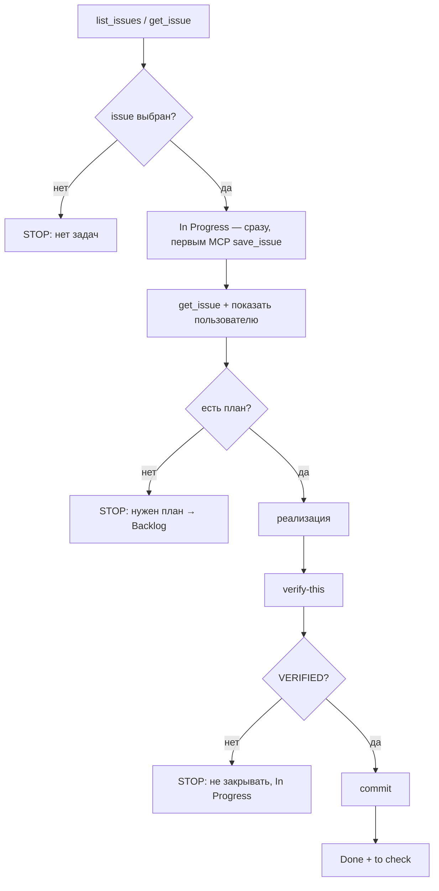

# Solve Issue (recipe-scaler-native)

End-to-end: Linear backlog → **In Progress (сразу)** → plan gate → implement → verify → commit → Done + `to check`.

**Claim rule:** как только issue **выбран** (id известен) — **первым Linear-действием над карточкой** вызови `save_issue` со state `In Progress`. Делать это **до** plan gate, чтения `specs/`, grep, build и правок кода. Исключение: при `$ARGUMENTS` с конкретным id допустим `get_issue` только для проверки существования/фильтров (шаг 1); полный контекст issue — шаг 3, **после** In Progress.

## User input

```text
$ARGUMENTS
```

- Пусто — взять **одну** подходящую задачу автоматически (см. выбор).
- `MIK-169` / URL issue — конкретная задача.

## Константы Linear

| Поле | Значение |
|------|----------|
| Project | `Recipe Scaler` (slug URL: `recipe-scaler-298e6590576a`) |
| Label | `Native` (дочерний label группы **Platform**; в UI — «Platform → Native») |
| Backlog state | `Backlog` (в UI — «Беклог») |
| Done state | `Done` |
| Review label | `to check` |
| Team | `Mike Ozornin` |

MCP: server `plugin-linear-linear`. Перед вызовом прочитай schema дескриптора tool.

## Workflow



### 1. Найти задачу

```text
list_issues:
  project: "Recipe Scaler"
  label: "Native"
  state: "Backlog"
  limit: 50
  orderBy: updatedAt
```

Фильтр после ответа:

- **Исключить** issues с label `to check` (уже сданы на ревью).
- Если `$ARGUMENTS` — матч по id (`MIK-169`) или slug из URL.
- Иначе выбрать **одну**: наименьший `priority.value` (1 = Urgent … 4 = Low), при равенстве — самую свежую `updatedAt`.

Если `$ARGUMENTS` — конкретный id/URL: `get_issue` для проверки существования и фильтров (Native, не `to check`); при несоответствии — STOP без смены state.

### 2. In Progress — сразу после выбора

**Обязательно до любых других шагов** (plan gate, чтение `specs/`, grep, build, правки):

```text
save_issue:
  id: <MIK-xxx>
  state: "In Progress"
```

- Не откладывать In Progress «пока проверю план» или «пока прочитаю issue».
- Если `save_issue` упал — STOP, сообщи ошибку; не продолжай работу «втихую».
- После успешного claim — кратко сообщи пользователю: «Взял MIK-xxx в работу (In Progress)».

### 3. Контекст issue

```text
get_issue:
  id: <MIK-xxx>
```

Показать пользователю: id, title, priority, url, текущий state (`In Progress`).

### 4. Gate — план обязателен

План **есть**, если выполняется **хотя бы одно**:

| Источник | Критерий |
|----------|----------|
| Spec Kit | Файл `specs/<feature>/plan.md` существует в репо **и** упомянут в issue (description / links / documents) |
| Linear document | `get_issue` → `documents[]` с plan/tasks в названии или теле |
| Issue body | Секция `## Plan` / `## План` с нумерованными или bulleted шагами реализации |
| Review finding | Секция `## Recommendation` с **конкретными** действиями (файлы, API, тесты) — достаточно для мелких review-задач |

План **нет**, если только описание проблемы без шагов.

**Если плана нет — STOP.** Сообщи issue id и что нужно: `/speckit-plan`, добавить `## Plan` в Linear, или ссылку на `specs/.../plan.md`. **Верни state в `Backlog`** (issue уже In Progress после шага 2):

```text
save_issue:
  id: <MIK-xxx>
  state: "Backlog"
```

**Claim для verify** сформулируй из плана до первой правки кода.

### 5. Реализация

Порядок чтения:

1. План (spec `plan.md` + `tasks.md` если есть) — description/labels/gitBranchName уже из шага 3.
2. `AGENTS.md`, `docs/AGENT-WORKFLOW.md`, релевантные docs из таблицы AGENTS.

Правила:

- **Spec Kit**: если есть `tasks.md` — выполняй через `/speckit-implement` (последовательно, без остановок).
- **Review fix**: минимальный diff по Recommendation; не расширять scope.
- **i18n**: только `Localizable.xcstrings`, без fallback-строк.
- **UI по Figma**: `layout.md` + `layout-audit.json` до view; `audit-ui-layout.sh` в loop.
- **Сборка**: после Swift-правок — `xcodebuild build` (см. AGENT-WORKFLOW).
- **Ветка**: мелкий fix → `master`; крупная spec → `gitBranchName` из issue или `specs/<NNN-feature>/`.

Во время реализации — skill `.agents/skills/fix-until-green/SKILL.md` для build/test loop.

### 6. Verify (`/verify-this`)

Прочитай `~/.agents/skills/verify-this/SKILL.md` и выполни полностью:

1. Claim из плана (falsifiable: condition + metric + threshold).
2. Baseline — до правок или merge-base, если баг.
3. Treatment — та же команда/тест после правок.
4. Вердикт: `VERIFIED` | `NOT VERIFIED` | `INCONCLUSIVE`.

Минимальные поверхности для native:

| Тип | Проверка |
|-----|----------|
| Любая правка Swift | `xcodebuild -scheme RecipeScalerNative -destination 'platform=iOS Simulator,id=<UDID>' build` exit 0 |
| Тесты в плане | `xcodebuild test … -only-testing:…` exit 0 |
| UI | accessibility snapshot / NDJSON (`pull-app-logs.sh`) |
| Spec verify | `scripts/verify-<feature>.sh` если есть |

**Только `VERIFIED` → шаг 7.** При `NOT VERIFIED` / `INCONCLUSIVE` — STOP, issue **остаётся In Progress**; **не** коммитить «на авось».

### 7. Commit

Skill **явно разрешает** commit (override общего «не коммить без ask»).

1. Параллельно: `git status`, `git diff`, `git log -1`.
2. Staging только файлы по задаче; без secrets.
3. Message — HEREDOC, стиль репо, **без** упоминания AI:

```bash
git commit -m "$(cat <<'EOF'
fix(sync): …

Closes MIK-169
EOF
)"
```

4. `git status` после commit.

### 8. Закрыть issue + `to check`

```text
save_issue:
  id: <MIK-xxx>
  state: "Done"
  labels: [<все текущие labels issue>, "to check"]
```

Label `to check` = работа агента готова, нужен human review (как MIK-130).

Краткий комментарий (опционально, `save_comment`):

- claim + VERIFIED evidence (команда, exit code)
- commit hash (`git rev-parse --short HEAD`)

## Stop conditions (не закрывать issue)

- Нет подходящих issues в Backlog
- Не удалось перевести в In Progress (`save_issue` error)
- Нет плана → вернуть в Backlog
- Verify ≠ VERIFIED
- Build красный
- Задача blocked by другой issue (упомянут контракт/API-only — перенести в Backlog, описать blocker)
- Нужен paid Apple capability / физический iPhone без XCTest-покрытия → INCONCLUSIVE, не Done

## Пример

```text
/solve-issue
```

→ MIK-169 → **In Progress** → Recommendation = plan → правка LocalizationConsistencyTests → build + test → VERIFIED → commit `test(i18n): …` → Done + `to check`.

```text
/solve-issue MIK-163
```

→ **In Progress** → конкретная high-priority security fix по Recommendation.

## Связанные skills

| Skill | Когда |
|-------|--------|
| `fix-until-green` | build/test loop при реализации |
| `verify-this` | финальное доказательство перед commit |
| `speckit-implement` | есть `specs/.../tasks.md` |
| `speckit-plan` | плана нет — предложить пользователю |
| `debug` | root cause неясен до правок |
