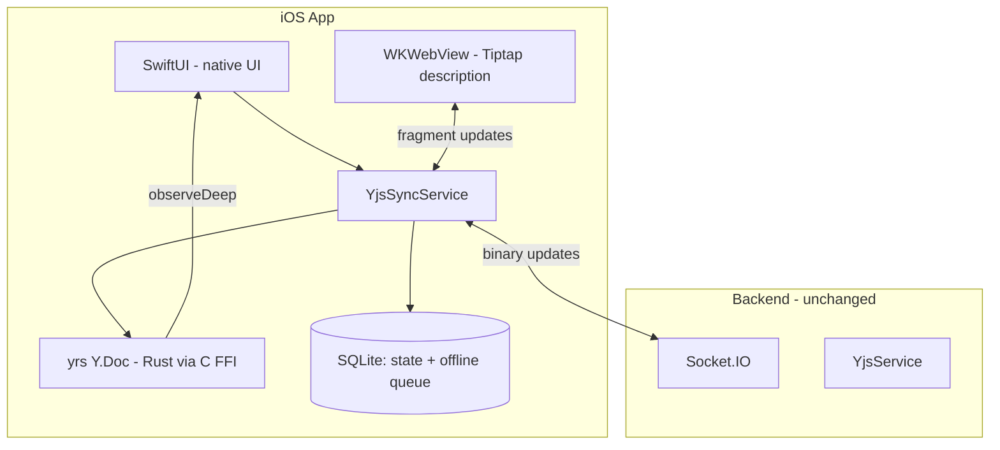

# Recipe Scaler Native iOS

Native iOS app for Recipe Scaler with CRDT-based offline-first sync.

## Requirements

- Apple Developer Program ($99/yr) — **not required** for local/simulator dev; see [docs/PAID-APPLE-DEVELOPER-REQUIRED.md](docs/PAID-APPLE-DEVELOPER-REQUIRED.md) for TestFlight, App Store, App Groups on device, extensions.
- Xcode 16.0+
- iOS 17.0+
- Swift 5.9+
- Rust toolchain (for yrs XCFramework)

## Architecture Overview

**CRDT-first**: each device holds a `Y.Doc` (via yrs Rust engine). Binary updates sync through the existing Socket.IO backend. No backend changes needed.



- **yrs** (Rust) — CRDT engine, binary-compatible with Yjs 13.6.30 on server
- **SwiftUI** — all UI except rich text description
- **WKWebView + Tiptap** — description editing only (custom nodes: TimerNode, IngredientNode)
- **Socket.IO** — same events as web client (`sync_request`, `load_document`, `recipe_updated`, etc.)

Detailed architecture: [docs/ARCHITECTURE.md](docs/ARCHITECTURE.md)

## Phases

| Phase | Scope | Status |
|-------|-------|--------|
| Phase 1 | Read-only MVP (REST + WS notifications) | Done |
| Phase 2 | yrs integration + YjsSyncService + native read | Next |
| Phase 3 | Native editing (ingredients, servings, name) | Done |
| Phase 4 | Description editing via WKWebView + Tiptap | Planned |
| Phase 5 | Offline queue + tombstones + shopping list | Planned |
| Phase 6 | Polish: push, widgets, Siri, PDF | Planned |

## Y.Doc Schema

Three document types per user, identical structure to web client:

- **Collection**: `Y.Array('recipes')` (recipe index, optional `folderIds` per entry) + `Y.Array('folders')` (user collections). See `specs/026-recipe-collections/` and [NATIVE_APP_COLLECTIONS.md](../recipe-scaler-web/llm/NATIVE_APP_COLLECTIONS.md).
- **Recipe**: `Y.Map('recipe')` (name, servings, scaleFactor, ingredients, nutrition, version...) + `Y.XmlFragment('description')` for v3
- **Shopping list**: `Y.Map('shopping')` → items + meta

Full schema: [docs/YJS-SCHEMA.md](docs/YJS-SCHEMA.md)

## Dependencies (SPM)

```swift
// Required
- SwiftData (built into iOS 17+)
- socket.io-client-swift     // WebSocket
- KeychainAccess              // Secure storage
- BIP39                       // Seed phrase generation
- yrs XCFramework             // CRDT engine (custom build)

// WKWebView bundle (not SPM, bundled in app)
- yjs, @tiptap/core + extensions // Rich text description editor
```

## Xcode Project

Project is maintained manually in Xcode (no XcodeGen). See [SETUP.md](SETUP.md) for build instructions including Rust XCFramework compilation.

## Governance

Project principles and quality gates: [.specify/memory/constitution.md](.specify/memory/constitution.md)

## Documentation

- [docs/ARCHITECTURE.md](docs/ARCHITECTURE.md) — target architecture, data flow, sync protocol
- [docs/YJS-SCHEMA.md](docs/YJS-SCHEMA.md) — exact Y.Doc structure, keys, types
- [docs/ADD_SPM_PACKAGES.md](docs/ADD_SPM_PACKAGES.md) — SPM dependency setup
- [SETUP.md](SETUP.md) — build and run instructions
- [RecipeScalerNative/PROJECT_STATUS.md](RecipeScalerNative/PROJECT_STATUS.md) — current status

## License

Compatible with the main Recipe Scaler project license.
