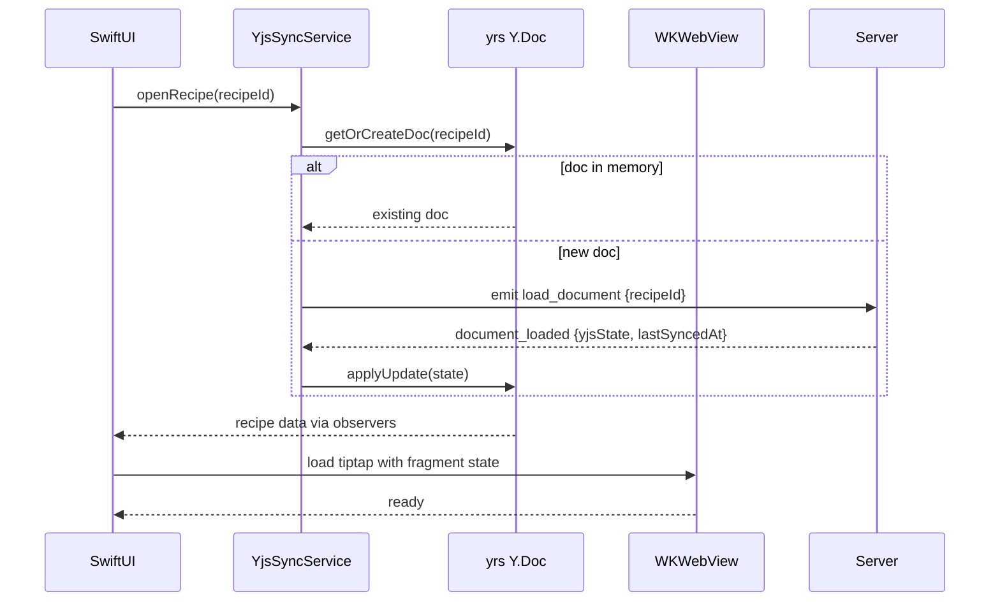
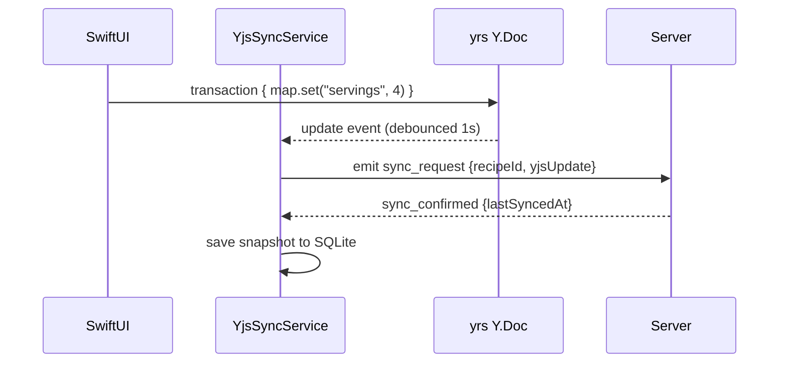
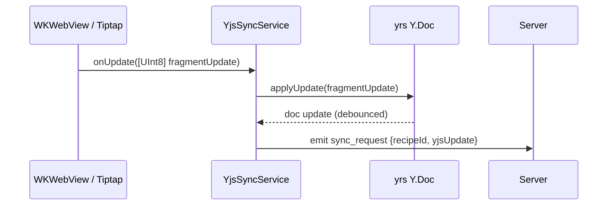
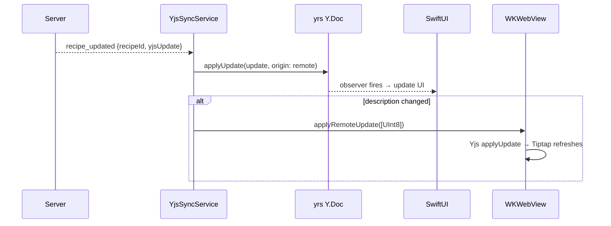
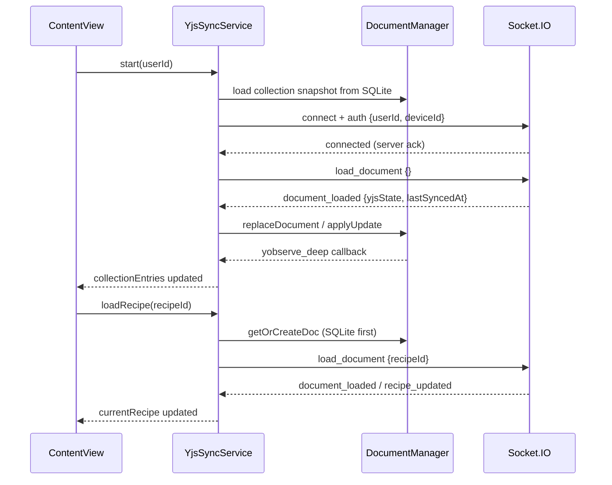

# Architecture — Recipe Scaler Native iOS

## Target Architecture

**CRDT-first, offline-capable iOS app** with real-time sync via existing backend.
No backend changes required.

Core stack: **yrs (Rust)** for CRDT, **SwiftUI** for UI, **WKWebView** for rich text editing.

```mermaid
flowchart TB
  subgraph ios [iOS App]
    UI[SwiftUI: recipe list, ingredients, servings, timers]
    YSS[YjsSyncService - Swift]
    YRS[yrs Y.Doc - Rust via C FFI]
    STORE[(SQLite: Y state snapshots + offline queue)]
    WV[WKWebView: Tiptap description editor]
    YJS_WV[Yjs in WKWebView: XmlFragment only]
  end

  subgraph server [Existing Backend - no changes]
    SIO[Socket.IO server]
    YJS_S[YjsService Node.js]
    DB[(Postgres Y state)]
  end

  UI --> YSS
  YSS --> YRS
  YSS --> STORE
  YRS -->|observeDeep| UI
  YSS <-->|binary updates via sync_request| SIO
  SIO --> YJS_S --> DB
  WV <-->|[UInt8] updates| YSS
  WV --> YJS_WV
  REST[REST: auth, images, public links] -.-> YSS
```

## Layers

### 1. CRDT Engine — yrs (Rust) via C FFI

[yrs](https://github.com/y-crdt/y-crdt) is a Rust port of Yjs with binary protocol compatibility.
Used through its C FFI (`yffi`), compiled as XCFramework.

**Why yrs, not yswift:**
- yrs: 2k+ stars, active development, used by multiple language bindings
- yswift: 89 stars, WIP, last release April 2024, no active maintenance

**Why yrs, not JavaScriptCore:**
- Native memory management, no JS GC overhead
- Single process, no JS context lifecycle
- Better integration with Swift Concurrency
- Same binary protocol as Yjs 13.6.30 on server

**C API surface needed (from yffi):**

| Function | Purpose |
|----------|---------|
| `ydoc_new` / `ydoc_destroy` | Document lifecycle |
| `ydoc_get_map` / `ydoc_get_array` | Access shared types |
| `yxmlfragment` | Access XmlFragment for description |
| `ymap_set` / `ymap_get` / `yarray_insert` | Mutations |
| `ydoc_apply_update` / `ydoc_encode_state` | Sync |
| `yobserve_deep` | Reactivity |
| `ymerge_updates` | Merge debounced updates |

### 2. Rich Text Editor — WKWebView + Tiptap

Description editing uses WKWebView because:
- Tiptap + custom nodes (TimerNode, IngredientNode, HeadingWithHash) are JavaScript/ProseMirror
- Rewriting them natively is impractical
- WKWebView handles only the description block, not the whole screen

```mermaid
flowchart LR
  subgraph swift [Swift / yrs]
    YRS[Y.Doc - full recipe]
    YSS[YjsSyncService]
  end

  subgraph webview [WKWebView - description only]
    TIPTAP[Tiptap Editor]
    YJS[Yjs - XmlFragment binding]
  end

  YRS -->|encodeStateAsUpdate → [UInt8]| YJS
  YJS -->|user edits → [UInt8] update| YRS
  YRS -->|remote update → applyUpdate| YJS
```

**Communication:** `[UInt8]` updates between yrs and WKWebView via `evaluateJavaScript` / `window.webkit.messageHandlers`.

**WKWebView bundle contents:**
- `yjs` (npm package)
- `@tiptap/core` + StarterKit, Highlight, Link extensions
- Custom nodes: TimerNode, IngredientNode, HeadingWithHash
- `@tiptap/extension-collaboration` — binds Tiptap to Y.Doc XmlFragment
- Bridge module (~100 lines): init, applyUpdate, getHTML

### 3. Sync Service — YjsSyncService

Swift service that mirrors `yjs-client.ts` from the web app.

**Responsibilities:**
- Manage Y.Doc instances (collection, recipes, shopping list)
- Debounce local updates (1s, same as web)
- Send `sync_request` with binary updates via Socket.IO
- Apply remote updates from `recipe_updated`, `collection_updated`, `shopping_list_updated`
- Offline queue: store updates when disconnected, drain on reconnect
- Load documents via `load_document` / `load_documents`
- Track `lastSyncedAt` for each document

**Document keys (same as web):**
- `{userId}:collection` — recipe metadata, tombstones, order
- `{userId}:recipe:{recipeId}` — recipe body
- Shopping list via `documentKind: 'shoppingList'`

### 4. Local Storage

SQLite (via SwiftData or GRDB) stores:
- **Y state snapshots**: `recipeId → (yjsState: Data, lastSyncedAt: String)`
- **Offline operation queue**: `[UInt8]` updates pending sync
- **Device metadata**: `deviceId`, auth tokens

SwiftData models for UI caching (derived from Y.Doc via observers):
- Recipe list items (id, name, color, imageUrl, updatedAt, isPinned)
- Used for fast list rendering without parsing full Y.Doc

### 5. UI — SwiftUI

All UI is native SwiftUI except the description editor.

**Native screens:**
- Recipe list (with search, sorting)
- Recipe detail (name, servings, ingredients, timers)
- Recipe editing (all fields except description)
- Shopping list
- Settings / auth

**WKWebView embedded in:**
- Recipe detail/edit screen — description block only

## Data Flow

### Opening a recipe



### Editing ingredients (native)



### Editing description (WebView)



### Remote update from another device



## Error Handling

Server `sync_error` events are mainly business-rule violations:
- **Ownership validation failed**: show error, don't retry
- **Recipe is deleted (tombstone)**: remove from local list
- **Empty/invalid update**: rebuild snapshot or reload document

CRDT handles concurrent edits automatically — no manual conflict resolution needed.

## Phase 2 iOS Implementation (current)

Swift modules under `RecipeScalerNative/Services/`:

| Module | Role |
|--------|------|
| `Yrs/` | C FFI wrappers (`YrsDocument`, `YrsMap`, `YrsArray`, `YrsObserver`) |
| `YjsSync/YjsSyncService` | `@MainActor` orchestrator, `@Published` UI state |
| `YjsSync/DocumentManager` | Per-doc lifecycle, parse → `CollectionEntry` / `RecipeData`, SQLite snapshots |
| `YjsSync/SyncEventHandler` | Socket.IO callbacks → apply updates |
| `Storage/YDocStore` | GRDB `ydoc_snapshots` table |

### Socket.IO read flow (Phase 2)



Reconnection: `reconnectAttempt` → `reconnecting`, then `reconnect` → re-`auth` and reload collection + active recipe.

## Comparison with Web Client

| Aspect | Web (yjs-client.ts) | iOS (YjsSyncService) |
|--------|---------------------|----------------------|
| CRDT engine | Yjs (JS) | yrs (Rust via C FFI) |
| Transport | Socket.IO | Socket.IO (same events) |
| Update format | Uint8Array / Array | [UInt8] / Data |
| Debounce | 1s, mergeUpdates | 1s, ymerge_updates |
| Offline queue | IndexedDB (Dexie) | SQLite |
| Description editor | Tiptap (DOM) | Tiptap (WKWebView) |
| Schema | Y.Map/Y.Array/XmlFragment | Same structure via yrs C API |
| lastSyncedAt | IndexedDB per doc | SQLite per doc |
