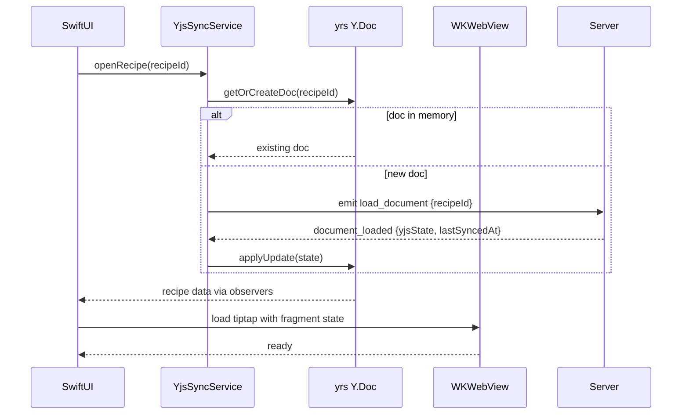
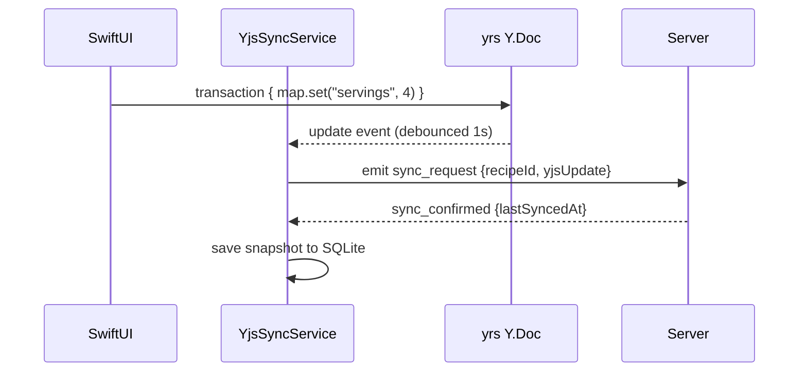
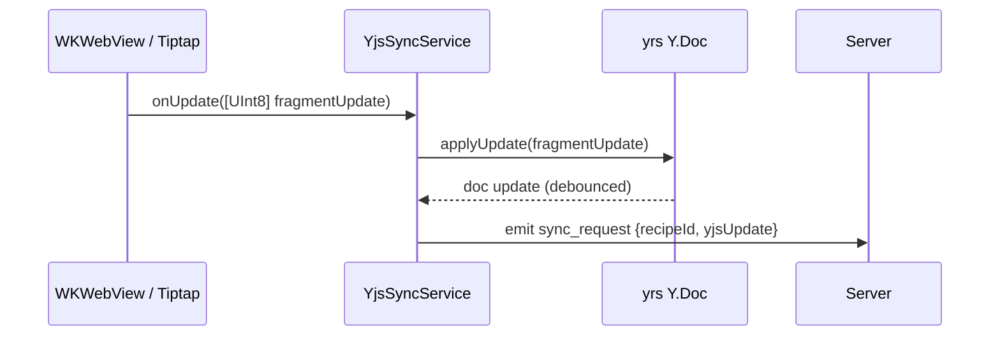
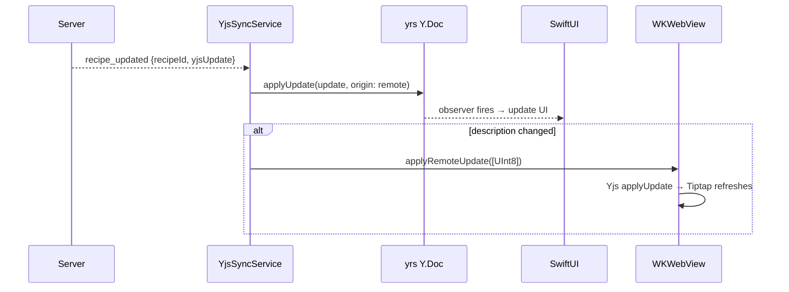
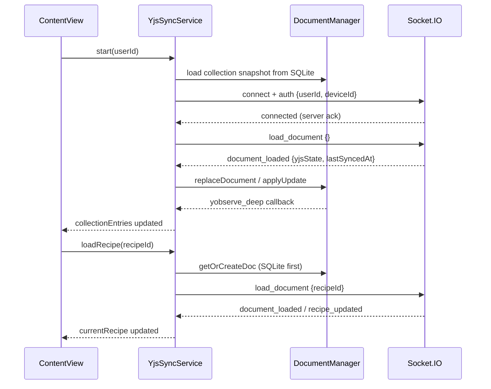

# Architecture — Recipe Scaler Native iOS

## Target Architecture

**CRDT-first, offline-capable iOS app** with real-time sync via existing backend.
No backend changes required.

Core stack: **yrs (Rust)** for CRDT, **SwiftUI** for UI, **WKWebView** for rich text editing.

```mermaid
flowchart TB
  subgraph ios [iOS App]
    UI[SwiftUI: recipe list, ingredients, servings, timers]
    YSS[YjsSyncService - Swift]
    YRS[yrs Y.Doc - Rust via C FFI]
    STORE[(SQLite: Y state snapshots + offline queue)]
    WV[WKWebView: Tiptap description editor]
    YJS_WV[Yjs in WKWebView: XmlFragment only]
  end

  subgraph server [Existing Backend - no changes]
    SIO[Socket.IO server]
    YJS_S[YjsService Node.js]
    DB[(Postgres Y state)]
  end

  UI --> YSS
  YSS --> YRS
  YSS --> STORE
  YRS -->|observeDeep| UI
  YSS <-->|binary updates via sync_request| SIO
  SIO --> YJS_S --> DB
  WV <-->|[UInt8] updates| YSS
  WV --> YJS_WV
  REST[REST: auth, images, public links] -.-> YSS
```

## Layers

### 1. CRDT Engine — yrs (Rust) via C FFI

[yrs](https://github.com/y-crdt/y-crdt) is a Rust port of Yjs with binary protocol compatibility.
Used through its C FFI (`yffi`), compiled as XCFramework.

**Why yrs, not yswift:**
- yrs: 2k+ stars, active development, used by multiple language bindings
- yswift: 89 stars, WIP, last release April 2024, no active maintenance

**Why yrs, not JavaScriptCore:**
- Native memory management, no JS GC overhead
- Single process, no JS context lifecycle
- Better integration with Swift Concurrency
- Same binary protocol as Yjs 13.6.30 on server

**C API surface needed (from yffi):**

| Function | Purpose |
|----------|---------|
| `ydoc_new` / `ydoc_destroy` | Document lifecycle |
| `ydoc_get_map` / `ydoc_get_array` | Access shared types |
| `yxmlfragment` | Access XmlFragment for description |
| `ymap_set` / `ymap_get` / `yarray_insert` | Mutations |
| `ydoc_apply_update` / `ydoc_encode_state` | Sync |
| `yobserve_deep` | Reactivity |
| `ymerge_updates` | Merge debounced updates |

### 2. Rich Text Editor — WKWebView + Tiptap

Description editing uses WKWebView because:
- Tiptap + custom nodes (TimerNode, IngredientNode, HeadingWithHash) are JavaScript/ProseMirror
- Rewriting them natively is impractical
- WKWebView handles only the description block, not the whole screen

```mermaid
flowchart LR
  subgraph swift [Swift / yrs]
    YRS[Y.Doc - full recipe]
    YSS[YjsSyncService]
  end

  subgraph webview [WKWebView - description only]
    TIPTAP[Tiptap Editor]
    YJS[Yjs - XmlFragment binding]
  end

  YRS -->|encodeStateAsUpdate → [UInt8]| YJS
  YJS -->|user edits → [UInt8] update| YRS
  YRS -->|remote update → applyUpdate| YJS
```

**Communication:** `[UInt8]` updates between yrs and WKWebView via `evaluateJavaScript` / `window.webkit.messageHandlers`.

**WKWebView bundle contents:**
- `yjs` (npm package)
- `@tiptap/core` + StarterKit, Highlight, Link extensions
- Custom nodes: TimerNode, IngredientNode, HeadingWithHash
- `@tiptap/extension-collaboration` — binds Tiptap to Y.Doc XmlFragment
- Bridge module (~100 lines): init, applyUpdate, getHTML

### 3. Sync Service — YjsSyncService

Swift service that mirrors `yjs-client.ts` from the web app.

**Responsibilities:**
- Manage Y.Doc instances (collection, recipes, shopping list)
- Debounce local updates (1s, same as web)
- Send `sync_request` with binary updates via Socket.IO
- Apply remote updates from `recipe_updated`, `collection_updated`, `shopping_list_updated`
- Offline queue: store updates when disconnected, drain on reconnect
- Load documents via `load_document` / `load_documents`
- Track `lastSyncedAt` for each document

**Document keys (same as web):**
- `{userId}:collection` — recipe metadata, tombstones, order
- `{userId}:recipe:{recipeId}` — recipe body
- Shopping list via `documentKind: 'shoppingList'`

### 4. Local Storage

SQLite (via GRDB) stores:
- **Y state snapshots**: `recipeId → (yjsState: Data, lastSyncedAt: String)`
- **Offline operation queue**: `[UInt8]` updates pending sync
- **Device metadata**: `deviceId`, auth tokens

SwiftData is used only for `RecipeTimer` (active timers, read/written by `TimerManager`). The earlier Phase 1 `Recipe` / `Ingredient` / `ApiCacheEntry` `@Model` classes were removed in spec 034 (#26) — they were never read in production (`@Query` count: 0) and the list/detail UI is driven entirely by Y.Doc observers. See `specs/034-architecture-dedup-truth/`.

### 5. UI — SwiftUI

All UI is native SwiftUI except the description editor.

**Native screens:**
- Recipe list (with search, sorting)
- Recipe detail (name, servings, ingredients, timers)
- Recipe editing (all fields except description)
- Shopping list
- Settings / auth

**WKWebView embedded in:**
- Recipe detail/edit screen — description block only

## Data Flow

### Opening a recipe



### Editing ingredients (native)



### Editing description (WebView)



### Remote update from another device



## Error Handling

Server `sync_error` Socket.IO events are typed via `SyncErrorCode`
(`RecipeScalerNative/Services/YjsSync/SyncErrorCode.swift`). `SyncErrorCode.from(code:legacyMessage:fallback:)`
resolves the future `code` dot-key, falling back to legacy English substring matching
for un-migrated servers. `YjsSyncService.handleSyncError` routes by enum case:

- `sync.error.ownership` — show error, don't retry
- `sync.error.recipe-deleted` (tombstone) — remove from local list, clear offline queue
- `sync.error.empty-update` / `sync.error.invalid-update` — reload document
- `sync.error.generic` — sleep 5s, then reload document

Full catalog (dot-key ↔ legacy English ↔ client action): [`specs/031-error-i18n/sync-error-codes.md`](../specs/031-error-i18n/sync-error-codes.md).

CRDT handles concurrent edits automatically — no manual conflict resolution needed.

## HTTP API фасады (facades)

Все HTTP API endpoint-хелперы (фасады) живут в `RecipeScalerCore/Networking/Endpoints/`.
Каждый файл — один `public enum` со статическими методами, по одному на endpoint.

### Формат

```swift
// RecipeScalerCore/Networking/Endpoints/ExampleAPI.swift
import Foundation

public enum ExampleAPI {
    public static func fetchSomething(id: String) async throws -> SomeDTO {
        let response: APIResponse<SomeDTO> = try await APIClient.shared.requestJSON(
            path: "/api/example/\(id)"
        )
        return try unwrapResponse(response, fallbackCode: .apiErrorServerGeneric)
    }
}
```

**Правила:**

- **`public enum`, не `@MainActor`.** Фасады в Core — stateless и non-isolated; их можно вызывать из main app, Share/Action extensions и AppIntents без привязки к главному актору. `APIClient.shared` сам по себе `nonisolated` и потокобезопасен (доступ к `authToken`/`userId` через `OSAllocatedUnfairLock`).
- **Только `APIClient.shared`.** Никаких `buildRequest(...)` + ручной работы с `URLSession` в фасадах. Вся сериализация, аутентификация и разбор HTTP-статусов — внутри `APIClient`.
- **DTO в том же файле** (если не используются в других модулях). DTO — `public struct: Decodable, Sendable`, с `CodingKeys` для snake_case → camelCase.

### Централизованная развёртка ответа: `unwrapResponse()`

Каждый фасад использует общую утилиту для развёртки `APIResponse<T>` → `T`:

```swift
// RecipeScalerCore/Networking/Endpoints/unwrapResponse.swift
public func unwrapResponse<T>(
    _ response: APIResponse<T>,
    fallbackCode: ServerErrorCode
) throws -> T {
    guard response.success, let data = response.data else {
        let code = ServerErrorCode.from(
            serverValue: response.error,
            fallback: fallbackCode
        )
        throw APIError.serverError(code: code)
    }
    return data
}
```

**Не инлайнить** развёртку в каждом методе — дублирование `guard response.success, let data` ведёт к расхождению логики обработки ошибок между фасадами.

### Локализация ошибок — в Native, не в Core

`APIError` определён в Core (`RecipeScalerCore/Networking/APIClient.swift`) и реализует `LocalizedError` — но только для dot-key идентификаторов. `errorDescription` возвращает строки вида `"api.error.http-4xx"`, `"discover.fetch-failed"` и т.д. Сама **локализация** (разрешение dot-key в пользовательский текст через `Bundle.currentLocalizedString`) принадлежит Native-слою:

```
RecipeScalerNative/Utils/APIError+Localization.swift
```

Расширение `APIError` с методом `userFacingMessage()` — единственная точка, где Core-ошибки превращаются в читаемый текст. Core **не** импортирует SwiftUI- или Bundle-зависимости для UI-текста.

### Коды ошибок сервера: `ServerErrorCode`

`RecipeScalerCore/Networking/ServerErrorCode.swift` — типизированный каталог dot-ключей, которые сервер может вернуть в поле `APIResponse.error`. Throw-site строит экземпляр через `ServerErrorCode.from(serverValue:fallback:)` — неизвестные или legacy-строки коллапсируют в fallback, гарантируя, что до view-слоя доходят только валидные dot-ключи.

### Текущее состояние и миграция

По состоянию на июнь 2026:

- `RecipeScalerCore/Import/RecipeImportAPI.swift` — **уже в Core**, без `@MainActor`, использует приватный `unwrap()` (образец для будущего `unwrapResponse()`).
- `RecipeScalerNative/Services/*API.swift` (DiscoverAPI, AccountAPI, AssistantAPI и др.) — **пока в Native** по пути файлов, но уже без `@MainActor` и с `APIClient.unwrapResponse()`. Мигрируют в `RecipeScalerCore/Networking/Endpoints/` по мере рефакторинга (перенос файлов, `public` DTO).

## Phase 2 iOS Implementation (done)

Swift modules under `RecipeScalerNative/Services/`:

| Module | Role |
|--------|------|
| `Yrs/` | C FFI wrappers (`YrsDocument`, `YrsMap`, `YrsArray`, `YrsObserver`) |
| `YjsSync/YjsSyncService` | `@MainActor` orchestrator, `@Published` UI state |
| `YjsSync/DocumentManager` | Per-doc lifecycle, parse → `CollectionEntry` / `RecipeData`, SQLite snapshots |
| `YjsSync/SyncEventHandler` | Socket.IO callbacks → apply updates |
| `Storage/YDocStore` | GRDB `ydoc_snapshots` table |

### Socket.IO read flow (Phase 2)



Reconnection: `reconnectAttempt` → `reconnecting`, then `reconnect` → re-`auth` and reload collection + active recipe.

## Phase 3 iOS Implementation (done)

Native **write path** for v3 recipes only (`RecipeEditPolicy`). v1/v2 remain read-only with `RecipeLegacyBanner`.

| Module | Role |
|--------|------|
| `Yrs/YrsInput` + map/array writes | Local mutations inside `withWriteTransaction` |
| `YjsSync/UpdateDebouncer` | ~1 s idle, merge `Data` before `sync_request` |
| `YjsSync/OfflineWriteQueue` | GRDB `offline_sync_queue`; enqueue when offline; `drainOfflineQueue` after `auth` |
| `YjsSync/WriteSyncState` | UI chip in `RecipeEditToolbar` |
| `ViewModels/RecipeEditViewModel` | Draft fields → `YjsSyncService` on Done |
| `Views/YDocRecipeDetailView` | Edit mode: name, servings, color, ingredients sheet, nutrition |

**Not written on iOS (Phase 3):** `description` (XmlFragment), collection mutations, `scaleFactor` in Y.Doc (slider stays local UI only).

**Sync:** `sync_request` / `sync_confirmed`; `sync_error` → localized alert; tombstone → pop detail + purge queue for `recipeId`. Offline queue cleared on `setUserId` when account changes.

Spec: [`specs/002-native-editing/`](../specs/002-native-editing/).

## Phase 4 — Inline description editor (006 / 018 / 019)

Phase 4 closed: native **inline** description editor via WKWebView + real
**Tiptap** ProseMirror instance bound to `Y.XmlFragment('description')`.

| Module | Role |
|--------|------|
| `Resources/DescriptionEditor/yjs.bundle.js` | Tiptap bundle: `StarterKit`, `Link`, `Highlight`, `TimerNode`, `IngredientNode`, `Collaboration` |
| `Resources/DescriptionEditor/description-editor-bridge.js` | Swift ↔ JS bridge v2: `init`, `applyUpdate`, `update`, `command`, `contentHeight`, `selectionState`, `nodeClick`, `loaded`, `ready` |
| `Views/DescriptionEditorBridge.swift` | WKWebView controller, Swift-side `command(name:args:)`, `requestHTML`, `selectionState` parsing |
| `Views/DescriptionEditorWebView.swift` | WKWebView wrapper (App Group / Yjs share) |
| `Views/DescriptionFormattingBar.swift` | Native sticky bar: H1 / bold / highlight / lists / timer / ingredient / **LLM Sparkles** |
| `Views/RecipeDescriptionEditorBlock.swift` | Embedded block in `YDocRecipeDetailView` (no sheet); parent scroll handles overflow |
| `Services/RecipeLLMParseAPI.swift` | `POST /api/v1/recipes/{id}/parse` with `apply: true`; server side patch via `recipe_updated` |
| `Views/DescriptionMarkupFlow.swift` | Timer / ingredient picker sheets; calls `markAsTimer` / `markAsIngredient` |

**Specs:** [`006`](../specs/006-description-editor/spec.md) ✅ Superseded by 019;
[`018`](../specs/018-description-editor-richtext/spec.md) 🟢 nodes + autolink
(ручной UI setLink убран из scope 2026-06-15);
[`019`](../specs/019-recipe-description-inline-edit/spec.md)
🟢 fully implemented.

**Legacy:** `DescriptionEditorView.swift` (sheet path) — **deleted from target
and repository** (019 T021, 2026-06-15).

## Comparison with Web Client

| Aspect | Web (yjs-client.ts) | iOS (YjsSyncService) |
|--------|---------------------|----------------------|
| CRDT engine | Yjs (JS) | yrs (Rust via C FFI) |
| Transport | Socket.IO | Socket.IO (same events) |
| Update format | Uint8Array / Array | [UInt8] / Data |
| Debounce | 1s, mergeUpdates | 1s, ymerge_updates |
| Offline queue | IndexedDB (Dexie) | SQLite |
| Description editor | Tiptap (DOM) | Tiptap (WKWebView) |
| Schema | Y.Map/Y.Array/XmlFragment | Same structure via yrs C API |
| lastSyncedAt | IndexedDB per doc | SQLite per doc |

## Composition Root / Dependency Injection

The app uses an explicit composition root — `RecipeScalerNative/App/AppContainer.swift` —
instead of a web of `.shared` singletons reaching into each other.

```mermaid
flowchart TB
  subgraph main [App.init — @main]
    APP[RecipeScalerNativeApp]
    APP -->|creates @State| AC[AppContainer @MainActor @Observable]
  end

  subgraph container [AppContainer — single source of truth]
    AC --> YSS[YjsSyncService]
    AC --> REM[RemindersSyncService]
    AC --> SP[SpotlightIndexer]
    AC --> AUTH[AuthService]
    AC --> TIM[TimerManager]
    AC --> DLR[DeepLinkRouter]
    AC --> ARC[AssistantRecipeContext]
  end

  subgraph ui [SwiftUI]
    CV[ContentView]
    CV -->|@Environment AppContainer.self| AC
    AC -->|@Environment| YSS
  end

  AC -->|configures| OSF[OS facades: SharedAuthStore, AppGroup, TimerSnapshotStore, APIClient.shared]
```

**Key points:**

- All app-level services are constructed once in `AppContainer.init` in dependency order.
- `RecipeScalerNativeApp.init` creates the container and provides it to SwiftUI
  via `.appEnvironment(container)` (see `AppEnvironment.swift`).
- SwiftUI views read services via `@Environment(YjsSyncService.self)` etc. — per-property
  observation through the `@Observable` macro.
- AppIntents and non-SwiftUI callers use the process-wide `AppContainer.shared` handle
  (set during `init`).
- `.shared` static properties on services still exist as **shims**: they forward to
  `AppContainer.shared.<service>` when the container is constructed, falling back to a
  lazily-instantiated `Standalone` for previews/tests/early-launch paths.
- **OS facades remain singletons** (`SharedAuthStore`, `AppGroup`, `TimerSnapshotStore`,
  `APIClient.shared`): they back cross-process IPC with extensions and must remain
  process-global.
- The cyclic callback `TimerSyncService.sendTimerEvent ↔ YjsSyncService.emitTimerEvent`
  is wired by `TimerEventBridge` (owned by `AppContainer`) using weak references on both sides.

## Observation framework

All app-level state-holder classes use the Swift `@Observable` macro (no `ObservableObject`).
This enables per-property SwiftUI observation — only views that actually read a changed
property re-render, instead of every view bound to the object.

| Class | Notes |
|-------|-------|
| `YjsSyncService` | Migrated from `ObservableObject` (15 `@Published`). |
| `RemindersSyncService` | Migrated from `ObservableObject` (2 `@Published`). |
| `SpotlightIndexer` | Vestigial `ObservableObject` removed. |
| `DescriptionEditorBridge` | Migrated from `ObservableObject` (6 `@Published`). |
| `DescriptionEditorChromeState` | Migrated; reads focus/ready from the bound `bridge`. |
| `AuthService`, `TimerManager`, `DeepLinkRouter`, `AssistantRecipeContext` | Already on `@Observable`. |
| `APIClient` | Vestigial `ObservableObject` removed; not `@Observable` (it's a stateless network facade). |

