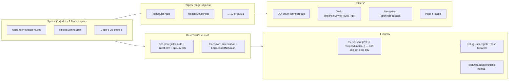

# E2E UI-тесты (нативные iOS)

**Spec coverage:** [`specs/E2E-COVERAGE.md`](../specs/E2E-COVERAGE.md)
**Архитектурный выбор:** parity с web Playwright-тестами, адаптация под ограничения iOS XCTest UI Testing.

## TL;DR

```bash
# Полный прогон (требует booted iPhone 16 simulator)
xcodebuild test \
  -scheme RecipeScalerNative \
  -destination 'platform=iOS Simulator,name=iPhone 16' \
  -only-testing:RecipeScalerNativeUITests

# Один spec
xcodebuild test \
  -scheme RecipeScalerNative \
  -destination 'platform=iOS Simulator,name=iPhone 16' \
  -only-testing:RecipeScalerNativeUITests/AppShellNavigationSpec
```

## Архитектура



## Стратегия изоляции

**Web parity:** Playwright `auth.ts` (`register-auto` per test) → на native то же:

- **Per-test fresh anonymous user** via `POST /api/auth/register-auto`.
- Credentials injected into the app via launch env (`E2E_OVERRIDE_USER_ID` / `E2E_OVERRIDE_DEVICE_TOKEN`); `AppContainer.bootstrap` + `ContentView` honour these on simulator.
- No wipe needed — each test starts with an empty user.

If register-auto fails, the test **skips** (not fails).

## Seeding

**Web parity:** `recipe-api.ts`, `timer-api.ts`. `SeedClient` mirrors the contract, but against **prod** some endpoints currently fail:

- `createRecipe` → prod often returns **500** for fresh users (web E2E hits `localhost:3001`). Specs wrap calls in `seedOrSkip` → XCTSkip (or XCTFail on loopback — see below).
- `addShoppingItems` → prod **404** on `/api/shopping-list/items` (same soft-skip).
- Collections are **yjs-managed**, not REST — create via UI (`CollectionMutationsSpec`).
- `startTimer` → POST `/api/v1/timers/sync` (works on prod in TimersSyncSpec).

### `seedOrSkip` behavior

`BaseTestCase.seedOrSkip` is **environment-aware**:

- **Loopback backend** (`127.0.0.1` / `localhost`): seed failure is a hard `XCTFail`. Local E2E assumes the backend is healthy — masking failures here would hide real regressions.
- **Prod backend**: seed failure becomes `XCTSkip` with a clear message, since prod `/api/recipes` currently 500s for fresh users.

This prevents a 100%-green run from masking 0%-actually-verified feature coverage.

## Селекторы

| Web | Native | Комментарий |
|-----|--------|-------------|
| `data-testid="recipe_list"` | `accessibilityIdentifier = "recipe_list"` | Эквивалент по стабильности |
| `data-testid="recipe_row_{{id}}"` | `accessibilityIdentifier = "recipe_row_{{id}}"` | ID-параметризация работает идентично |
| CSS-селекторы | `NSPredicate(format: "identifier BEGINSWITH %@", ...)` | Для «первый row» используется predicate |

**Каталог:** [`RecipeScalerNative/AccessibilityIdentifiers.swift`](../RecipeScalerNative/AccessibilityIdentifiers.swift) — источник правды.
**Mirror в UI-тестах:** [`RecipeScalerNativeUITests/Helpers/Selectors.swift`](../RecipeScalerNativeUITests/Helpers/Selectors.swift) — `enum UIA` дублирует значения (UI test bundle не может `@testable import` app-target из-за транзитивной C-модульной зависимости GRDB).

## Wait-strategy

Вместо web-моста `window.__yjsSynced` — `waitForExistence` с таймаутами, откалиброванными под handshake:

| Timeout | Когда использовать |
|---------|-------------------|
| `Wait.element` (10 с) | Элемент появляется после tap/navigation |
| `Wait.firstPaint` (45 с) | Первый рендер после launch (collection hydrate + socket auth ack) |
| `Wait.syncRoundTrip` (30 с) | После REST-seed → app должно отразить данные |

## Crash-detection

`tearDown` вызывает `Logs.assertNoCrash(in:)`, который читает NDJSON-лог приложения и fail'ает тест при нахождении crash-сигнатуры (`FatalError`, `EXC_BAD_ACCESS`, `SIGABRT`, `SIGSEGV`).

Лог читается из:
- `/tmp/recipe-scaler-debug-session.ndjson` (если выкачан через `scripts/pull-app-logs.sh`)
- `~/Library/Application Support/debug-session.ndjson` (sandbox приложения)

**Важно:** тест-раннер не может напрямую инvoke'нуть `xcrun simctl get_app_container` изнутри процесса (Process недоступен в iOS test bundle), поэтому crash-detection из `tearDown` — best-effort. Authoritative gate — `scripts/verify-ui-smoke.sh` из host-shell.

## Launch arguments

- `-SkipSplash=1` — пропустить splash-анимацию (ускоряет тесты)
- `-OpenTab=<tab>` — открывает указанную вкладку (recipes/shopping/discover/profile/import)
- **НЕ ИСПОЛЬЗУЕМ `ui-testing`** — этот аргумент отключает `AppContainer.bootstrap` (sync/socket/push не стартуют), и приложение не подключается к продакшену

Аутентификация: симуляторный DEBUG-build использует `DebugSimulatorAutoLogin` (`userId` + `device_token`) → приложение автоматически логинится под `cfcd839f-…` против `recipe-scaler.ru` с Bearer (spec 041). Override токена: `DEBUG_DEVICE_TOKEN`. Отключить: `-DisableDebugAutoLogin=1`.

## Добавление нового spec'а

1. Создай `Specs/<Name>Spec.swift`:
   ```swift
   final class MyNewFeatureSpec: BaseTestCase {
       override func extraLaunchArguments() -> [String] {
           ["-OpenTab=recipes"]
       }

       func test_US1_something() async throws {
           // seed
           let recipe = try await seedClient.createRecipe(name: TestData.recipeName("My"))
           // act + assert
           let list = recipeListPage.awaitReady()
           XCTAssertTrue(list.recipeRow(id: recipe.id).waitForExistence(timeout: Wait.syncRoundTrip))
       }
   }
   ```

2. Зарегистрируй файл в `scripts/add-ui-test-sources.py` (добавь строку в `NEW_FILES`).

3. Запусти `python3 scripts/add-ui-test-sources.py`.

4. Прогон: `xcodebuild build-for-testing ... && xcodebuild test-without-building -only-testing:RecipeScalerNativeUITests/MyNewFeatureSpec`.

5. Обнови `specs/E2E-COVERAGE.md` — добавь строку в таблицу «Покрытие по фазам».

## Известные ограничения

- **Расширения (030/044/039):** widget/Live Activity/watchOS — отдельные test-target'ы, недоступны из XCTest UI host-приложения.
- **Системные диалоги (023):** permission-prompt'ы нельзя надёжно закрыть из XCUITest.
- **Share sheet (012/025):** системный share-sheet нельзя надёжно закрыть, поэтому assertion'ы — только на reachability entry-point'ов, без полного flow.
- **LLM-зависимости (010/021):** UI-flow assertions без assertion'а на конкретный ответ LLM (флакает).
- **Multi-context realtime (014):** настоящий two-context collaboration требует два `XCUIApplication()` instance; в текущей реализации — one-way (server → app).

## Troubleshooting

### `Tests in the target "RecipeScalerNativeUITests" can't be run`

Проверь, что `RecipeScalerNativeUITests` зарегистрирован как `PBXNativeTarget` в `project.pbxproj`:

```bash
grep UITESTTARGET RecipeScalerNative.xcodeproj/project.pbxproj
```

Если пусто — перегенерируй через `python3 scripts/add-ui-test-target.py && python3 scripts/add-ui-test-sources.py`.

### `error: cannot find 'X' in scope` в UI-тестах

UI test bundle не видит internal-типы app-target. Все accessibility-id строковые литералы должны быть в `Helpers/Selectors.swift` (`enum UIA`), а не импортированы через `@testable`.

### Тесты зависают на splash

Проверь, что `app.launchArguments` не содержит `ui-testing`. Этот аргумент отключает sync, и приложение никогда не подключится к продакшену.

### ResetClient падает с 401

Не удалось `register-auto` (сеть / rate-limit). Проверь доступность `https://recipe-scaler.ru/api/auth/register-auto`.
