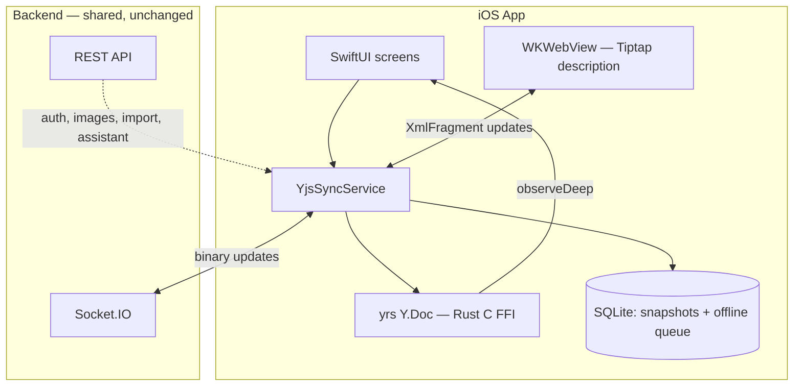
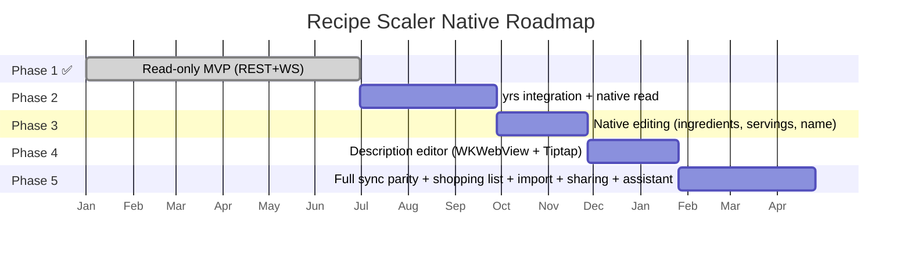

# Recipe Scaler Native iOS — Product Requirements Document

**Version**: 1.0.0  
**Date**: 2026-06-01  
**Status**: Draft  
**Source**: Web client analysis at `/recipe-scaler-web`  
**Server**: Shared with web, no backend changes

---

## 1. Overview

Native iOS client for **Recipe Scaler** — a CRDT-based recipe management app with
real-time sync, offline-first architecture, and full parity with the existing web/PWA
client. The iOS app shares the same backend (Socket.IO + REST), auth system (BIP39 seed
phrase), and Y.Doc data model (yrs binary-compatible with Yjs 13.6.30).

### Target Users

- Existing Recipe Scaler web users who want a native mobile experience
- New users discovering the app via App Store
- Users who cook offline (travel, weak connectivity)

### Platform

- iOS 17.0+, iPhone only (iPad later)
- SwiftUI, native except Tiptap description editor (WKWebView)
- Portrait orientation primary

---

## 2. Architecture Principles



| Principle | Rule |
|-----------|------|
| CRDT-first | All synced data flows through yrs `Y.Doc`; SQLite stores snapshots + queue |
| Web parity | Binary-compatible with Yjs 13.6.30; same Socket.IO events and schema |
| Offline-first | App remains fully functional offline; CRDT merge on reconnect |
| Native UI | SwiftUI for all screens; WKWebView only for Tiptap description block |
| Shared backend | Zero backend changes; iOS is another client like the web app |

---

## 3. Roadmap



---

## 4. User Stories

### US1 — Recipe Collection (P1) 🎯 MVP

**As a** user, **I want to** see all my recipes in a scrollable list with search, sort,
and pin, **so that** I can quickly find any recipe.

**Acceptance Criteria**:

1. **Given** I open the app and I'm authenticated, **When** the collection loads,
   **Then** I see all non-deleted recipes from my Y.Doc collection, sorted by
   `updatedAt` descending, with pinned recipes at the top.
2. **Given** the recipe list is shown, **When** I type a search query, **Then** recipes
   filter in real-time by name (case-insensitive, diacritics normalized, tokenized AND).
3. **Given** the recipe list is shown, **When** I pull to refresh, **Then** the app
   reconnects and syncs latest collection state.
4. **Given** I'm offline, **When** I open the app, **Then** I see locally cached recipes
   from SQLite snapshots.

---

### US2 — Recipe Detail & Scaling (P1)

**As a** user, **I want to** view a recipe with all its details and scale ingredient
amounts, **so that** I can cook with the right proportions.

**Acceptance Criteria**:

1. **Given** I tap a recipe in the list, **When** the recipe detail opens, **Then** I see
   name, servings, color, image, ingredients (with amounts), and description (read-only
   initially, editable in Phase 3–4).
2. **Given** the recipe detail is shown, **When** I adjust the servings slider or number,
   **Then** all ingredient amounts scale proportionally based on `scaleFactor =
   targetServings / baseServings`.
3. **Given** a scaled recipe, **When** I navigate back and return, **Then** the scale
   factor is preserved (in-memory for session, not persisted to Yjs per web convention).

---

### US3 — Native Recipe Editing (P2)

**As a** user, **I want to** edit recipe name, servings, ingredients, color, image, and
nutrition, **so that** I can maintain my recipes on mobile.

**Acceptance Criteria**:

1. **Given** I'm viewing a recipe, **When** I tap "Edit", **Then** I can modify name,
   servings, color, and image.
2. **Given** I'm editing a recipe, **When** I add/remove/reorder ingredients or change
   their amounts, **Then** changes are written to the `Y.Map('recipe')` via yrs
   transactions and debounced-synced (1s) to the server.
3. **Given** I edit a recipe offline, **When** I come back online, **Then** queued
   updates are drained and merged via CRDT — no data loss.
4. **Given** another device edits the same recipe, **When** a `recipe_updated` event
   arrives, **Then** my UI updates reactively via yrs observers.

---

### US4 — Rich Text Description Editing (P3)

**As a** user, **I want to** edit the recipe description with rich text, **so that** I
can write cooking steps with formatting, timers, and ingredient references.

**Acceptance Criteria**:

1. **Given** I'm editing a recipe, **When** I tap the description area, **Then** a
   WKWebView Tiptap editor opens with the current `Y.XmlFragment('description')` content.
2. **Given** the Tiptap editor is active, **When** I format text (bold, italic,
   headings, lists, highlight, links), **Then** formatting is applied and synced via
   Yjs XmlFragment updates.
3. **Given** the Tiptap editor is active, **When** I insert a timer node or ingredient
   node, **Then** it renders with the appropriate custom node UI.
4. **Given** a remote user edits the description, **When** the update arrives, **Then**
   the Tiptap editor updates in real-time via `yrs → WKWebView` bridge.

---

### US5 — Shopping List (P3)

**As a** user, **I want to** manage a shopping list synced across devices, **so that** I
can add ingredients from recipes and check them off while shopping.

**Acceptance Criteria**:

1. **Given** I'm viewing a recipe, **When** I tap "Add to shopping list", **Then** all
   (or selected) ingredients appear in the shopping list, tagged with the recipe name.
2. **Given** the shopping list is shown, **When** I mark items as purchased, **Then**
   they move to a "Purchased" section and the state syncs via Y.Doc.
3. **Given** the shopping list is shown, **When** I sort by recipe or alphabetically,
   **Then** items reorganize accordingly.
4. **Given** I'm offline, **When** I add/remove/check items, **Then** changes queue and
   sync on reconnect.

---

### US6 — Recipe Import (P3)

**As a** user, **I want to** import recipes from text, URL, or photos, **so that** I can
quickly add recipes from any source.

**Acceptance Criteria**:

1. **Given** I tap "Import", **When** I paste recipe text, **Then** the app sends it to
   the server's LLM parser and returns a structured recipe ready to save.
2. **Given** I tap "Import from URL", **When** I enter a recipe URL, **Then** the server
   extracts and parses the recipe.
3. **Given** I tap "Import from photos", **When** I select 1–N photos, **Then** the
   server performs OCR + LLM extraction and returns a structured recipe.
4. **Given** I import an export file (.json or .zip), **Then** the app parses it
   (v1.0–v1.3 format) and adds recipes to the collection.

---

### US7 — Authentication & Multi-Device (P1)

**As a** user, **I want to** log in with my seed phrase from the web app or create a new
account, **so that** my data syncs across all devices.

**Acceptance Criteria**:

1. **Given** I'm a new user, **When** I open the app, **Then** I'm auto-registered with
   a BIP39 seed phrase stored in Keychain.
2. **Given** I have an existing account on web, **When** I enter my 12-word seed phrase
   or scan a QR code, **Then** all my data syncs to the iOS device.
3. **Given** I'm logged in, **When** I view Account settings, **Then** I can see my seed
   phrase (with biometric unlock), display name, and avatar.
4. **Given** I'm logged in, **When** I choose "Log out", **Then** local data is cleared
   and the app resets to the onboarding flow.

---

### US8 — Timers (P1) — Already in Phase 1

**As a** user, **I want to** start cooking timers from recipe descriptions, **so that**
I get notified when a step is done even when the app is in the background.

*Note: Phase 1 already implements timers with background execution and local
notifications. Phase 5 enhances with cross-device sync.*

**Acceptance Criteria** (enhanced for Phase 5):

1. **Given** a timer is running, **When** the app is backgrounded, **Then** a local
   notification fires when the timer completes.
2. **Given** I start a timer on iOS, **When** I check the web app, **Then** the timer
   state is synced via WebSocket (Phase 5).
3. **Given** multiple timers are active, **Then** I can see them in a floating timer
   panel or notification.

---

### US9 — Discovery & Public Profiles (P4)

**As a** user, **I want to** browse curated recipe collections and discover other cooks,
**so that** I can find inspiration and clone recipes.

**Acceptance Criteria**:

1. **Given** I tap "Discover", **Then** I see curated collections and featured chef
   profiles.
2. **Given** I view a discovery recipe, **When** I tap "Clone", **Then** it's added to
   my collection.
3. **Given** I visit a public profile (`/@username`), **Then** I see their shared
   recipes with search, and can copy them.
4. **Given** I enable "Public profile" in settings, **Then** my recipes are shareable
   via a public URL.

---

### US10 — Sharing (P4)

**As a** user, **I want to** share individual recipes and my shopping list, **so that**
others can view them without an account.

**Acceptance Criteria**:

1. **Given** I'm viewing a recipe, **When** I tap "Share", **Then** I can copy a public
   link or share via system share sheet.
2. **Given** I toggle per-recipe public visibility, **Then** the recipe is
   accessible/hidden at its public URL.
3. **Given** I share my shopping list, **Then** recipients see a read-only version at
   a public URL.

---

### US11 — AI Assistant (P4)

**As a** user, **I want to** chat with an AI cooking assistant that can answer questions
about my recipes, suggest modifications, and perform actions, **so that** I get cooking
help in context.

**Acceptance Criteria**:

1. **Given** I open the assistant, **When** I type a message, **Then** I get a streaming
   response from the server-side LLM.
2. **Given** I attach a recipe to the conversation, **Then** the assistant has recipe
   context for its answers.
3. **Given** the assistant suggests an action (e.g., scale recipe, add to shopping
   list), **When** I confirm, **Then** the action is executed.
4. **Given** I record a voice message, **Then** it's transcribed and sent as text.

---

### US12 — Account & Settings (P2)

**As a** user, **I want to** manage my profile, preferences, and data, **so that** the
app feels personalized.

**Acceptance Criteria**:

1. **Given** I open Settings, **Then** I can configure: display name, avatar, language
   (en/ru), theme (system/light/dark), nutrition display toggle.
2. **Given** I open Settings, **Then** I can export all recipes (v1.3 format with
   images as .zip) and import from export files.
3. **Given** I enable public profile, **Then** I can set my username, share mode (all /
   one-by-one), and toggle recipe downloads.
4. **Given** I open Settings, **Then** I can connect/disconnect Telegram (via
   connection code).

---

### US13 — PDF Cookbook Export (P4)

**As a** user, **I want to** generate and share a PDF cookbook of my recipes or a public
   profile's recipes, **so that** I can print or share a formatted cookbook.

**Acceptance Criteria**:

1. **Given** I'm on my account page, **When** I tap "Export PDF", **Then** a cookbook
   PDF is generated with cover page, table of contents, and formatted recipe pages.
2. **Given** I'm viewing a public profile, **When** the owner allows downloads,
   **Then** I can download their cookbook as PDF.

---

### US14 — Offline Resilience (P2)

**As a** user, **I want to** use the app fully offline, **so that** I can cook without
internet.

**Acceptance Criteria**:

1. **Given** I'm offline, **When** I open the app, **Then** all previously loaded
   recipes, the collection, and shopping list are available from SQLite cache.
2. **Given** I'm offline, **When** I edit data, **Then** changes are stored in the
   offline queue and synced when connectivity returns.
3. **Given** I come back online, **When** the offline queue drains, **Then** CRDT merge
   resolves any concurrent edits without user intervention.

---

### US15 — Notifications (P4)

**As a** user, **I want to** receive push notifications for timer completions and sync
events, **so that** I don't miss anything.

**Acceptance Criteria**:

1. **Given** a timer completes, **When** the app is backgrounded, **Then** a push
   notification fires with "Open" and "Close" actions.
2. **Given** I enable push notifications, **When** a remote edit occurs on a recipe I
   have open, **Then** the UI updates in real-time (no notification needed — live sync).

---

## 5. Feature Matrix: Web vs iOS

| Feature | Web | iOS Phase | Notes |
|---------|-----|-----------|-------|
| Recipe collection list | ✅ | P2 (yrs) | Same Y.Doc schema |
| Recipe detail + scaling | ✅ | P2–3 | Scaling in Phase 1 already |
| Recipe editing (native fields) | ✅ | P3 | Y.Map mutations |
| Description editor (Tiptap) | ✅ | P4 | WKWebView bridge |
| Shopping list | ✅ | P5 | Y.Map('shopping') |
| Recipe import (text/URL/photo) | ✅ | P5 | Server-side LLM parsing |
| Recipe export (JSON/ZIP) | ✅ | P5 | v1.3 format |
| Seed phrase auth | ✅ | P1 ✅ | Already done |
| QR code auth | ✅ | P2 | Scanner + generator |
| Timers (local) | ✅ | P1 ✅ | Already done |
| Timers (sync) | ✅ | P5 | WebSocket timer events |
| Public profiles | ✅ | P5 | REST endpoints |
| Recipe sharing | ✅ | P5 | Public links |
| Shopping list sharing | ✅ | P5 | Public links |
| Discovery | ✅ | P5 | REST endpoints |
| AI assistant (chat) | ✅ | P5 | Streaming NDJSON |
| AI assistant (voice) | ✅ | P5 | Audio recording + transcription |
| Telegram integration | ✅ | P5 | Connection code flow |
| PDF cookbook export | ✅ | P5 | Native PDF generation |
| Nutrition (view) | ✅ | P3 | Read from Y.Map |
| Nutrition (edit/calculate) | ✅ | P5 | LLM or manual |
| Push notifications | ✅ | P5 | APNs (not Web Push) |
| OAuth (client) | ✅ | — | Not in scope |
| PWA install | ✅ | — | N/A (native app) |
| Dark/light/system theme | ✅ | P3 | iOS system preference |
| i18n (en/ru) | ✅ | P1 ✅ | Already done |
| Offline-first | ✅ | P2 | SQLite + CRDT |

---

## 6. Data Model (Y.Doc Schema)

Three document types per user, binary-compatible with web client.

### Collection Document

Key: `{userId}:collection`

```
Y.Array('recipes')
  └── Y.Map (per recipe entry)
        ├── id: string
        ├── name: string
        ├── color: string
        ├── imageUrl: string?
        ├── updatedAt: string (ISO 8601)
        ├── deleted: boolean (tombstone)
        └── isPinned: boolean
```

### Recipe Document

Key: `{userId}:recipe:{recipeId}`

```
Y.Map('recipe')
  ├── name: string
  ├── servings: number
  ├── scaleFactor: number
  ├── color: string
  ├── ingredients: Y.Array<Y.Map> (v2/v3) or string JSON (v1)
  ├── nutrition: Y.Map or string JSON
  ├── version: 'v1' | 'v2' | 'v3'
  ├── isPublic: boolean
  ├── hasSteps: boolean
  ├── createdAt: string
  ├── updatedAt: string
  ├── imageUrl: string?
  ├── imageAspectRatio: number?
  ├── originalRecipeLink: string?
  └── originalRecipe: string?

Y.XmlFragment('description')   ← v3, top-level
```

### Shopping List Document

Key: `{userId}:shoppingList` (via `documentKind`)

```
Y.Map('shopping')
  ├── items: Y.Array<Y.Map>
  │     └── Y.Map: id, label, recipeId, ingredientId,
  │              recipeName, purchased, purchasedAt, createdAt
  └── meta: Y.Map
        ├── sortMode: 'recipe' | 'alphabet'
        └── schemaVersion: number
```

Full schema reference: [docs/YJS-SCHEMA.md](YJS-SCHEMA.md)

---

## 7. API Surface (Shared Backend)

### Socket.IO Events (Sync)

| Event | Direction | Payload |
|-------|-----------|---------|
| `auth` | → server | `{userId, deviceId}` |
| `load_document` | → server | `{recipeId}` |
| `load_documents` | → server | `{recipeIds: string[]}` |
| `document_loaded` | ← server | `{recipeId, yjsState: number[], lastSyncedAt}` |
| `sync_request` | → server | `{recipeId, yjsUpdate: number[], lastSyncedAt?, documentKind?}` |
| `sync_confirmed` | ← server | `{recipeId, lastSyncedAt, documentKind?}` |
| `sync_error` | ← server | `{error: string, recipeId?}` |
| `recipe_updated` | ← broadcast | `{recipeId, yjsUpdate: number[]}` |
| `collection_updated` | ← broadcast | `{yjsUpdate: number[]}` |
| `shopping_list_updated` | ← broadcast | `{yjsUpdate: number[]}` |

### REST Endpoints (Used by iOS)

| Area | Endpoints |
|------|-----------|
| **Auth** | `POST /api/auth/register-auto`, `POST /api/auth/login-with-seed` |
| **Images** | `POST /api/recipes/:id/image`, `POST /api/recipes/:id/image-from-url`, `DELETE /api/recipes/:id/image` |
| **Import** | `POST /api/v2/recipes/:id/parse`, `POST /api/recipes/import/image` |
| **Assistant** | `GET/POST /api/assistant/threads`, `POST .../respond-stream`, `POST .../transcribe` |
| **Discovery** | `GET /api/discover/collections`, `GET .../recipes/:id`, `POST .../clone` |
| **Public** | `GET /api/users/public/@:username`, `GET .../recipes`, `PUT /api/users/public-profile` |
| **Users** | `POST/DELETE /api/users/avatar`, `PATCH /api/users/name`, `PUT /api/users/username` |
| **Shopping** | `GET /api/v1/shopping-list/settings`, `PUT /api/v1/shopping-list/share` |
| **Settings** | `GET /api/settings` |
| **Telegram** | `POST /api/telegram/connect`, `POST .../disconnect`, `GET .../status` |
| **Push** | Register APNs token with server (endpoint TBD) |

---

## 8. Non-Functional Requirements

### Performance

- Recipe list loads from SQLite cache < 200ms on cold start
- Y.Doc observer → SwiftUI update < 100ms
- Search filtering < 50ms for 500+ recipes
- WKWebView Tiptap editor ready < 500ms after opening

### Offline

- Full read access to all cached recipes, collection, and shopping list
- Write access with automatic queue drain on reconnect
- No "you are offline" blocking modal — offline is a first-class state

### Storage

- SQLite database size target: < 50MB for 200 recipes with images cached
- Y state snapshots compacted on schedule (weekly or size threshold)

### Accessibility

- VoiceOver support for all native screens
- Dynamic Type support
- Minimum touch target 44pt

### Localization

- English and Russian at launch
- All user-facing strings in i18n resource files, no hardcoded text

### Security

- Seed phrase stored in iOS Keychain (kSecAttrAccessibleWhenUnlockedThisDeviceOnly)
- Biometric (Face ID / Touch ID) required to reveal seed phrase
- No seed phrase in logs, screenshots, or pasteboard (except explicit copy)
- TLS for all network communication

---

## 9. Technical Risks

| Risk | Impact | Mitigation |
|------|--------|-----------|
| yrs XmlFragment API gaps | Can't render v3 descriptions natively | WKWebView handles all XmlFragment; yrs only stores/replicates binary state |
| XCFramework build complexity | Slow CI, arch issues | Pre-built XCFramework in repo; automated build script |
| Tiptap bundle size | Large WKWebView payload | Tree-shake extensions; lazy-load description editor |
| Socket.IO binary updates | Must match web exactly (Array<number>) | Integration tests against real server with web client as oracle |
| Offline queue edge cases | Data loss on crash | SQLite WAL mode; queue items removed only after server confirmation |

---

## 10. Out of Scope

- **iPad adaptation** — iPhone only initially
- **OAuth server/client** — not needed for iOS
- **Apple Watch / Wearables**
- **Siri Shortcuts** — deferred to Phase 6
- **Home Screen Widgets** — deferred to Phase 6
- **App Store submission** — deferred until core features are stable

---

## 11. Success Metrics

| Metric | Target |
|--------|--------|
| Cold start to recipe list | < 2 seconds |
| Offline availability | 100% of cached data readable |
| Sync latency (local edit → server → other device) | < 3 seconds on Wi-Fi |
| Crash-free rate | > 99.5% |
| Feature parity with web (phases 2–5 scope) | > 90% of user-facing features |
