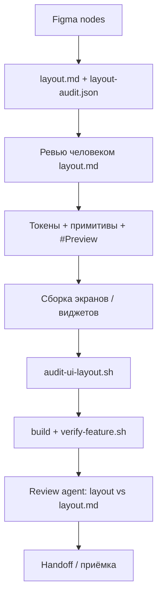

# UI по макетам (Figma) — процесс для агентов

Когда фича опирается на **Figma** (или другой pixel-perfect макет), одних node-id и скриншотов недостаточно: агент должен зафиксировать **версточную модель** до кода и проверять её автоматически.

Урок из [030-timer-widget](../specs/030-timer-widget/): ошибки были в дереве layout (89pt bar ≠ 137pt text), SwiftUI/WidgetKit-ограничения и отсутствии edge-case в приёмке — не в отсутствии макета.

---

## Когда обязательно

Любая задача, где в spec/plan есть:

- ссылки на Figma frames / node-id;
- новые экраны, виджеты, Live Activity, extension UI;
- «как на макете» / web parity с фиксированными размерами.

**Не обязательно** для чисто логических правок без изменения layout.

---

## Артефакты в `specs/<feature>/`

| Файл | Кто пишет | Назначение |
|------|-----------|------------|
| [layout.md](../specs/_template/layout.md) | Агент (черновик) → **ты ревьюишь** | Дерево вёрстки, токены, матрица состояний, SwiftUI-заметки |
| `layout-audit.json` | Агент вместе с layout.md | Машиночитаемые проверки для `scripts/audit-ui-layout.sh` |
| `layout-acceptance.json` | Человек после ревью `layout.md` | Human acceptance (hash + reviewer + verifiedAt). Шаблон: `specs/_template/layout-acceptance.json` |
| `plan.md` | Ссылка на оба файла | Порядок: layout **до** tasks на view |

Шаблоны: [specs/_template/layout.md](../specs/_template/layout.md), [specs/_template/layout-audit.json](../specs/_template/layout-audit.json), [specs/_template/layout-acceptance.json](../specs/_template/layout-acceptance.json).

Вердикты `audit-ui-layout` (см. [agents/VERIFICATION.md](./agents/VERIFICATION.md)):

- `STATIC PASS` — machine checks зелёные; human acceptance ещё pending
- `VERIFIED` — static + matching `layout-acceptance.json` (`reviewerType=human`)
- `FAILED` — static fail, или `LAYOUT_AUDIT_STRICT=1` / `--strict` при pending acceptance

**Нельзя** трактовать `STATIC PASS` как «макет принят человеком».

---

## Содержание `layout.md` (чеклист)

1. **Figma** — file key, node-id по состояниям (light/dark/mono).
2. **Canvas** — размер контейнера, padding, gap (в pt).
3. **Токены** — один файл констант (`*Layout.swift` / design tokens); запрет магических чисел в view.
4. **Дерево (DOM)** — для каждого state: размеры блоков, overlay vs stack, что **не** наследует ширину соседа.
5. **Примитивы** — список shared components до сборки экранов (`WidgetTimerRing`, `WidgetTimerLinearRow`, …).
6. **Матрица приёмки** — states × темы × edge cases (длинный текст, exceeded, empty).
7. **Falsifiable claims** — измеримые формулировки («2 таймера: wrap на 137pt, без `…`, одинаково в обоих рядах»).
8. **Platform constraints** — что нельзя (WidgetKit: `UIViewRepresentable`; wrap: `fixedSize` + `frame`; …).
9. **Stub data** — worst-case строки для preview/seed.

---

## Порядок реализации



1. **`layout.md` + `layout-audit.json`** — до tasks на SwiftUI view.
2. **Ты проверяешь `layout.md`** — дерево, размеры, claims; правки в markdown, не в чате.
3. **Примитивы и Canvas previews** на stub data — до wiring.
4. **`bash scripts/audit-ui-layout.sh specs/<feature>`** — в agent loop после layout-правок.
5. **Субагент-ревью** (layout-reviewer): код ↔ `layout.md`, не «на глаз по скриншоту».

Верификация UI: simulator screenshot (vision models) или accessibility server — по [AGENTS.md](../AGENTS.md).

---

## Agent loop (UI-фичи)

Дополнение к [AGENT-WORKFLOW.md](./AGENT-WORKFLOW.md) и `fix-until-green`:

| Шаг | Действие |
|-----|----------|
| L0 | `xcodebuild … build` |
| L0.5 | `bash scripts/audit-ui-layout.sh specs/<feature>` |
| L1 | `scripts/verify-<feature>.sh` если есть |
| L2 | Субагент: layout-reviewer (код vs `layout.md`) |
| L3 | Accessibility / seed scenario на worst-case data |

**Запрещено** считать UI-фичу готовой без зелёного `audit-ui-layout.sh`, если есть `layout-audit.json`.

---

## Добавление новой фичи

```bash
cp specs/_template/layout.md specs/NNN-feature/layout.md
cp specs/_template/layout-audit.json specs/NNN-feature/layout-audit.json
# заполнить, согласовать layout.md с ревьюером
bash scripts/audit-ui-layout.sh specs/NNN-feature
```

В `plan.md`:

```markdown
**Layout**: [layout.md](./layout.md) · аудит: `bash scripts/audit-ui-layout.sh specs/NNN-feature`
```

Эталон: [specs/030-timer-widget/layout.md](../specs/030-timer-widget/layout.md).
