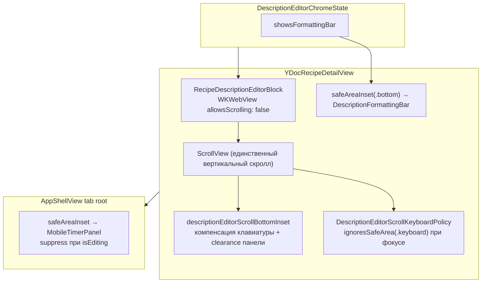

# UI и UX

Web reference: `../recipe-scaler-web/recipe-scaler`.

**Макеты (Figma):** перед версткой — [UI-LAYOUT-FROM-FIGMA.md](./UI-LAYOUT-FROM-FIGMA.md) (`layout.md`, `layout-audit.json`, `scripts/audit-ui-layout.sh`).

---

## Типографика

Все текстовые стили определены в `AppTypography.swift` и `AppFonts.swift`. **Не хардкодь** шрифты и размеры в view-файлах — используй константы и extension-ы.

### Шрифты (AppFonts)

| Роль | Имя | Когда использовать |
|---|---|---|
| `sans` | Martian Grotesk Nr Lt | Body, footnote, subheadline — основной текст |
| `sansMedium` | Martian Grotesk Nr Md | Headline, title3, semibold-варианты |
| `display` | Martian Grotesk Std xBd | Заголовки (title2, large title) |
| `mono` | Martian Grotesk Nr Lt | Числа, код (`/connect`) |

### Размеры и стили (AppTypography)

| Стиль | Размер | Шрифт | lineSpacing | Использование |
|---|---|---|---|---|
| `body` | 16 pt | sans | 4 pt | Основной текст списков, строк рецептов, ингредиентов |
| `footnote` | 13 pt | sans | 2 pt | Подписи, badge-и, secondary-текст |
| `subheadline` | 15 pt | sans | — | Редко; prefer body |
| `headline` | 16 pt | sansMedium | — | Жирный body |
| `title3` | 20 pt | sansMedium | — | Подзаголовки |
| `title2` | 22 pt | display | — | Заголовки экранов |
| `compact` | 14 pt | sans | — | Секционные заголовки в списке |
| empty state icon | 48 pt | SF Symbol | — | `AppEmptyState.icon` / `ContentUnavailableView` |

### Text extensions (SwiftUI)

Используй вместо ручного `.font(...)` + `.lineSpacing(...)`:

```swift
Text("some key").appBody()       // 16 pt + lineSpacing 4
Text("some key").appFootnote()   // 13 pt + lineSpacing 2
```

**Почему:** гарантирует единый интерлиньяж везде. Если нужно добавить lineSpacing для нового стиля — добавь константу в `AppTypography` + `Text` extension.

**Ограничение:** `.appBody()` / `.appFootnote()` возвращают `some View`, а не `Text`. После них нельзя вызывать Text-specific модификаторы (`.textCase`, `.tracking`). Для таких случаев используй `.font(AppTypography.footnote)` напрямую (например, `AppSectionHeader`).

### View extension для List/Form

```swift
.appListBodyTypography()   // font(AppTypography.body) на весь List
.appBodyFieldTypography()  // body 16 pt + lineSpacing 4 для TextField
```

Применяй к корневому view списка, чтобы все некастомные Text внутри наследовали body.

### Секционные заголовки

```swift
AppSectionHeader("key")       // footnote, .secondary, uppercase, tracking 0.8
AppSectionHeaderSpacer()      // невидимый placeholder для отступа
```

Кастомный `listSectionSpacing(30)` на Account пробовали и отклонили — см. [account-list-section-spacing.md](account-list-section-spacing.md). На профиле остаётся `.listSectionSpacing(12)`.

### UIKit chrome (AppChromeAppearance)

Глобально настраивает шрифты для NavigationBar, BarButtonItems, TabBar, UITextField, UISegmentedControl через `appearance()`. Вызывается один раз при старте приложения.

#### Системные кнопки navbar (back/edit/share/done)

На iOS 26+ системный chrome в нативных приложениях Apple (Calendar, Mail, Notes) рисует navbar-кнопки **нейтрально** (`UIColor.label`), без акцентного цвета. На iOS < 26 те же кнопки — акцентного цвета (по умолчанию синего).

Чтобы следовать этому поведению без размазывания `#available` по view-файлам, единая точка правды — два хелпера в `AppChromeAppearance` (`AppTypography.swift`):

```swift
AppChromeAppearance.systemActionUIColor   // UIColor? — nil на iOS 26+, accent на < 26
AppChromeAppearance.systemActionColor     // Color   — .label на iOS 26+, accent на < 26
```

- **Не используй** `Color.accentColor` напрямую для navbar/toolbar-кнопок (back, edit, share, done, cancel) — вместо этого `AppChromeAppearance.systemActionColor`.
- **Брендовые элементы** (`.borderedProminent` primary actions) остаются на `Color.accentColor` — это не системный chrome.
- **Assistant FAB** — на iOS 26+ `.buttonStyle(.glassProminent)` (accent-tinted Liquid Glass, см. `AssistantFabStyle.swift`); на iOS < 26 сплошной `Color.accentColor` с тенью.
- **Transient toast** (`TransientStatusBanner`) — на iOS 26+ `.glassEffect(.regular.tint(.green), in: .capsule)` (centered pill); на iOS < 26 flat green bar с тенью.
- **Sheet chrome** — все `.sheet` в приложении **непрозрачные** через `AppSheetChrome` (`RecipeScalerNative/Utils/AppSheetChrome.swift`): `.appOpaqueSheetPresentation()` для grouped utility-sheet (шаринг, sync, коллекции, markup), `.appOpaqueSheetPresentationPlain()` для full-bleed (Assistant, Import, seed phrase, Safari), `.appOpaqueGroupedListSurface()` / `.appOpaqueListSurface()` для List/Form внутри. Намеренный Liquid Glass остаётся только у FAB и toast (см. выше).
- **Никаких других `#available(iOS 26.0, *)`** для цвета кнопок в коде быть не должно — только в `AppChromeAppearance`.

### Keyboard toolbar

Кастомная панель над клавиатурой — `ToolbarItemGroup(placement: .keyboard)`. Стили кнопок — `AppToolbarStyle` + `.appToolbarIconButton()` / `.appToolbarTextButton()`.

### Auto-growing multiline fields

Для короткого пользовательского текста, который должен переноситься и расти по высоте без внутренней прокрутки, используй нативный `TextField` с `axis: .vertical`, открытым диапазоном строк и `.fixedSize(horizontal: false, vertical: true)`. Фиксированный `TextEditor` для такого сценария не подходит: при ограниченной высоте он начинает прокручиваться внутри себя.

#### Отступы между кнопками

SwiftUI не добавляет зазор между соседними icon-кнопками в одной группе. Между **соседними кнопками слева** (например, `chevron.up` и `chevron.down`) — **8 pt**:

```swift
ToolbarItemGroup(placement: .keyboard) {
    Button { focusPrevious() } label: {
        AppToolbarStyle.icon("chevron.up")
    }
    .appToolbarIconButton()
    .disabled(!canFocusPrevious)

    Color.clear.frame(width: 8)

    Button { focusNext() } label: {
        AppToolbarStyle.icon("chevron.down")
    }
    .appToolbarIconButton()
    .disabled(!canFocusNext)

    Spacer()

    Button(String(localized: "edit.done")) { focusedField = nil }
        .appToolbarTextButton()
}
```

**Правила:**

1. **8 pt** — стандартный горизонтальный зазор между соседними icon-кнопками в левой группе; реализуй через `Color.clear.frame(width: 8)`, не через `padding` на самих кнопках.
2. **Левая группа / правая кнопка** — между ними `Spacer()` (как в примере выше).
3. **Одна текстовая кнопка справа** (Done, Add, Create) — `Spacer()` слева, без дополнительных отступов.
4. Новые keyboard toolbar с несколькими icon-кнопками подряд — тот же паттерн: `Color.clear.frame(width: 8)` между каждой парой соседних.

Эталон: `YDocIngredientsSection`, `EditIngredientNutritionSheet`.

### Правила типографики

1. **Text view** → используй `.appBody()` / `.appFootnote()` вместо ручного `.font()` + `.lineSpacing()`.
2. **Не-Text view** (SF Symbols, HStack, ZStack) → используй `.font(AppTypography.xxx)` напрямую.
3. **TextField** → `.font(AppTypography.body)`; если нужна та же высота строки, что у `.appBody()` (поля названия ингредиента), — `.appBodyFieldTypography()`.
4. **Toggle label** → передавай `Text(...)` с `.appBody()` вместо строкового ключа.
5. **Новый стиль с lineSpacing** → добавь константу в `AppTypography` + `Text` extension, обнови `RecipeRowLayoutMetrics` если нужно.
6. Не создавай fallback вроде `t('key') || 'Default'` — см. [I18N.md](I18N.md).
7. **Keyboard toolbar** — см. раздел выше; между соседними icon-кнопками слева всегда 8 pt.
8. **ContentUnavailableView** — см. подраздел ниже; не полагайся на наследование от `.appListBodyTypography()`.

### ContentUnavailableView

`ContentUnavailableView` **не наследует** Martian от `.appListBodyTypography()` на родителе — рисует системный SF Pro. Явно задавай типографику в каждом слоте:

- **Title:** `AppEmptyState.label(key, symbol:)` — Martian title + **48 pt** icon (`AppTypography.emptyStateIconSize`, weight `.light` по умолчанию).
- **Hero illustration:** `AppEmptyStateIllustration(asset:)` — raster art **192 pt** (`AppTypography.emptyStateIllustrationSize`, assets @3x 576 px; sync: `node scripts/sync-empty-state-illustrations.mjs`). Над текстом в `VStack`; image `accessibilityHidden(true)`.
- **Description:** всегда `Text(...).appBody()` (или `.font(AppTypography.body)`).
- **Кастомная иконка** (цвет папки и т.п.): `AppEmptyState.icon("folder").foregroundStyle(color)` в `Label { … } icon: { … }`.
- **Не использовать** convenience-инициализатор `ContentUnavailableView("title", systemImage:)` — SF-текст и нет единого размера иконки.
- **`ContentUnavailableView.search`** — не использовать; для поиска без результатов — `AppEmptyState.label("recipe.list.search-empty.title", symbol: "magnifyingglass")` (без description).
- При необходимости перебить системный стиль label-слота — `.font(AppTypography.body)` на весь `ContentUnavailableView`.

Эталоны: `RecipeListView`, `CollectionFolderView`, `DiscoverRootView`.

```swift
ContentUnavailableView {
    VStack(spacing: 12) {
        AppEmptyStateIllustration(asset: .recipeNotebookEmpty)
        Text("recipe.list.empty.title")
            .appBody()
    }
} description: {
    Text("recipe.list.empty.description")
        .appBody()
}
.font(AppTypography.body)
```

---

## Стандартные компоненты iOS

Если запрос **противоречит поведению или гайдлайнам стандартных компонентов iOS** (Human Interface Guidelines, системным компонентам iOS) — **сначала уточни у пользователя**, что он действительно хочет именно это, а не обходной путь.

Примеры, когда нужно спросить:

- ручное переключение outline / `.fill` в `tabItem` вместо штатного tint активной вкладки;
- кастомный UIKit поверх SwiftUI там, где системный компонент уже решает задачу;
- поведение, которое ломает ожидаемые жесты, accessibility или внешний вид платформы.

Предложи **стандартный вариант** (кратко, почему так принято на iOS) и **альтернативу** (кастом / полная переделка), если пользователь настаивает — делай по его выбору.

## Web parity

- UX/UI parity with the **mobile web** layout (same hierarchy and behavior; pixel-perfect match not required).
- Match web behavior for shared UI: masked `userId`, ingredient rows without unit labels, component-level nutrition editing, recipe ellipsis menu order, ingredient qty column right-aligned to main value with compact drag handle and swipe-from-right delete only; description formatting toolbar active states must mirror Tiptap `selectionState` (e.g. H1 must not imply bold). **Layout и keyboard/inset-поведение панели на iOS** — см. [Recipe detail — inline description editor](#recipe-detail--inline-description-editor-019).

## Экраны и паттерны

### Account / public profile

iOS Settings patterns (toggles, `NavigationLink` submenus, label–value rows); no explicit Save button; avatar as centered circle with Set photo below; descriptive copy uses `.appBody()` line-height.

### Shopping list

Header matches Recipes: large title with sort segment in the collapsible search slot (`UISearchController` / `UISearchBar` pattern — SwiftUI has no separate API for a custom block under large title).

### Collections

Folder rename uses inline **Cancel / Done** toolbar, auto-focus with select-all, hides back button and ellipsis while editing; folder color picker is a preset grid in the rename toolbar (web parity, iOS-adapted).

### Discover + assistant

- **Discover** — horizontal cards (photo right, 16:9 previews, count badge, no username, list-level padding only).
- **Assistant** — no Close on swipe-dismissible sheets, keyboard Done, history left / new chat right, always-visible timestamps/copy, `.appFootnote()` text, attach picker sort matches All Recipes flat list.

### Recipe detail — inline description editor (019)

Редактирование описания на экране рецепта — **WKWebView + Tiptap** внутри родительского `ScrollView`. Панель форматирования — **нативный SwiftUI chrome**, не часть WebView. Спека: [specs/019-recipe-description-inline-edit](../specs/019-recipe-description-inline-edit/spec.md).

#### Схема слоёв



#### Ключевые файлы

| Файл | Роль |
|---|---|
| `YDocRecipeDetailView.swift` | ScrollView, keyboard compensation, `safeAreaInset` панели, suppression таймера |
| `RecipeDescriptionEditorBlock.swift` | Inline WebView, высота = `bridge.contentHeight`, bind chrome |
| `DescriptionEditorChromeState.swift` | `showsFormattingBar`, `blurEditor()`, suppress |
| `DescriptionFormattingBar.swift` | Кнопки форматирования + Done, layout metrics |
| `DescriptionEditorWebView.swift` | Inline: **без** UIKit `inputAccessoryView`; fullscreen — с accessory |
| `AppShellView.swift` | Панель таймеров на tab root; `suppressPanelSafeAreaInset` в edit |
| `MobileTimerPanel.swift` | `.mobileTimerPanelBottomPadding(suppress:)` для ScrollView на деталке |

#### Когда показывается панель

`DescriptionEditorChromeState.showsFormattingBar` == `true` только если **все** условия:

1. `bridge.phase == .ready` (Tiptap загружен)
2. `bridge.isFocused` (курсор в описании)
3. `!suppressFormattingBar`

Suppression задаётся в `syncDescriptionChromeSuppression()` (`YDocRecipeDetailView`):

- открыт sheet разметки таймера / ингредиента;
- контекстное меню timer/ingredient node;
- фокус в полях ингредиентов или названия рецепта (панель скрывается, редактор blur).

**Не меняй** логику `showsFormattingBar` на «просто isEditing» — панель должна быть только при активном фокусе в описании.

#### Размещение панели: только `safeAreaInset`

Панель рендерится в `.safeAreaInset(edge: .bottom)` на `YDocRecipeDetailView`, **не** в `ToolbarItemGroup(placement: .keyboard)`.

**Почему:** keyboard toolbar не показывал панель (SwiftUI + WKWebView); UITest `testDescriptionKeyboardDoneHidesFormattingBar` ищет `description_formatting_bar` как `otherElements` в иерархии экрана.

**Done для inline:** кнопка «Готово» на `DescriptionFormattingBar` (`onDone → descriptionChrome.blurEditor()`). У inline WebView (`presentation == .inline`) **нет** UIKit `customInputAccessoryView` — иначе дублируется Done и ломается layout.

#### Скролл: один ScrollView, WebView не скроллится

| Режим | Поведение |
|---|---|
| Inline (деталка) | `allowsScrolling: false`; высота WebView = полная высота контента Tiptap; скроллит **родительский** `ScrollView` |
| Fullscreen sheet | WebView может иметь свой scroll + UIKit keyboard accessory |

**Запрещено** для inline: включать `allowsScrolling: true` и/или ограничивать высоту WebView фиксированным viewport — WebView начнёт скроллиться отдельно от экрана (regression).

#### Keyboard + bottom inset (критично, легко сломать)

Три связанных механизма на `ScrollView` контента деталки:

1. **`DescriptionEditorScrollKeyboardPolicy`** — при `isEditing && descriptionChrome.isFocused` включает `.ignoresSafeArea(.keyboard, edges: .bottom)`. Модifier должен оставаться **стабильным** (не оборачивать ScrollView в `if/else` с разной иерархией — иначе пересоздаётся WebView и мигает chrome).

2. **`descriptionEditorKeyboardCompensation`** — отрицательный padding ≈ `-keyboardOverlapHeight` из `keyboardWillChangeFrame`, чтобы **отменить двойной** keyboard safe area inset (иначе огромный зазор между текстом и панелью).

3. **`descriptionEditorScrollBottomInset`** — сумма compensation + `DescriptionFormattingBarLayoutMetrics.scrollClearanceHeight` (52 pt), когда `showsFormattingBar`. Без clearance низ документа **перекрывается** панелью.

```swift
// YDocRecipeDetailView — не разносить по разным местам без причины
.padding(.bottom, descriptionEditorScrollBottomInset)
.modifier(DescriptionEditorScrollKeyboardPolicy(
    ignoresKeyboardSafeArea: isEditing && descriptionChrome.isFocused
))
```

Если меняешь высоту панели — обнови **`scrollClearanceHeight`** в `DescriptionFormattingBarLayoutMetrics` (52 pt ≈ vertical padding 8+8 + ~36 pt controls).

#### Панель таймеров vs режим редактирования

На tab root (`AppShellView.tabRoot`) панель таймеров в `safeAreaInset(.bottom)`.

На деталке рецепта параллельно:

- `timerManager.setSuppressPanelSafeAreaInset(isEditing)` — скрывает tab-root inset в edit;
- `.mobileTimerPanelBottomPadding(suppress: isEditing)` — **не** добавляет padding под таймер в ScrollView при edit (иначе двойной bottom inset).

В **view mode** деталка использует `.mobileTimerPanelBottomPadding()` без suppress — контент не уходит под панель таймеров.

#### Вёрстка `DescriptionFormattingBar`

- Горизонтальный `ScrollView` с кнопками форматирования + опциональный блок Done справа.
- Разделители: `Rectangle` 1×28 pt, `.padding(.horizontal, 4)`.
- **Done:** divider `.padding(.leading, 4)` + кнопка `.padding(.leading, 4)` + `.padding(.trailing, 12)` — **4 pt между линией и текстом «Готово»**.
- Стили кнопок: `AppToolbarStyle` / `.appToolbarTextButton()`; active state зеркалит Tiptap `selectionState` (см. Web parity).
- Accessibility: `description_formatting_bar`, `description_editor_keyboard_done` (`AccessibilityIdentifiers`).

#### Чеклист перед изменениями

- [ ] Панель по-прежнему в `safeAreaInset`, не в keyboard toolbar?
- [ ] Inline WebView: `allowsScrolling: false`, полная `contentHeight`?
- [ ] `descriptionEditorScrollBottomInset` учитывает высоту панели при `showsFormattingBar`?
- [ ] Keyboard compensation не убран (нет двойного gap)?
- [ ] `DescriptionEditorScrollKeyboardPolicy` не toggles через смену ветки `if/else` на ScrollView?
- [ ] UITest `testDescriptionKeyboardDoneHidesFormattingBar` проходит?
- [ ] Verify: `bash scripts/verify-description-editor.sh [recipe-uuid]`

#### Типичные регрессии (не повторять)

| Изменение | Симптом |
|---|---|
| Панель в `.keyboard` toolbar | Панель не видна |
| `if focused { ScrollView… } else { ScrollView… }` для keyboard policy | Мигание / teardown WebView, пропадание панели |
| Internal scroll WebView в inline | Два независимых скролла |
| Убрать `scrollClearanceHeight` | Низ описания под панелью |
| Убрать keyboard compensation | Огромный зазор при фокусе |
| Таймер на деталке без suppress в edit | Конфликт bottom inset с панелью форматирования |
| UIKit Done accessory в inline | Дубли Done, лишний chrome |

