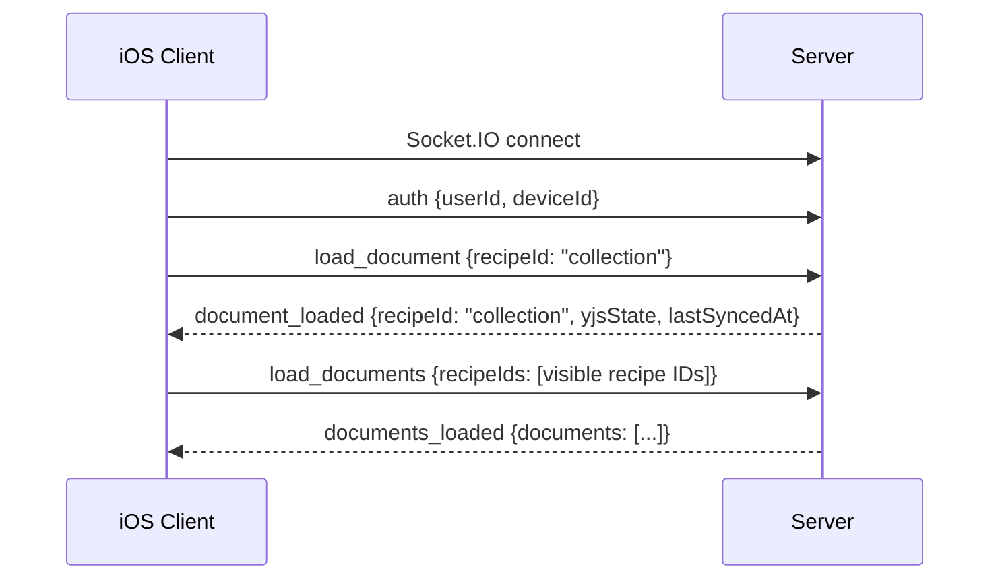
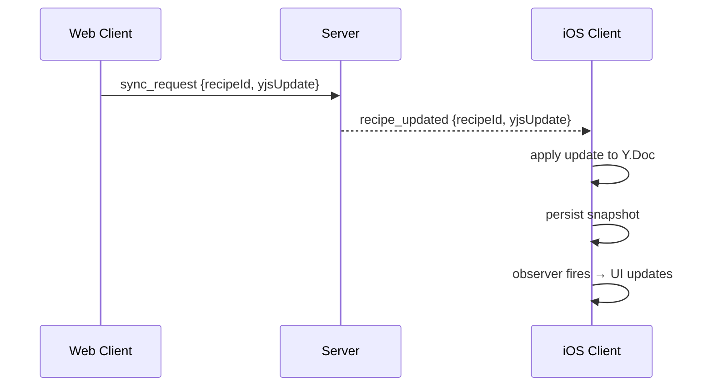

# Socket.IO Sync Protocol Contract

**Date**: 2026-06-01
**Reference**: [docs/ARCHITECTURE.md](../../../docs/ARCHITECTURE.md), [docs/YJS-SCHEMA.md](../../../docs/YJS-SCHEMA.md)

## Scope

Socket.IO события, используемые в Phase 2 (read-only). Формат payload должен точно соответствовать веб-клиенту (`yjs-client.ts`).

## Connection Lifecycle

### Auth

**Event**: `auth`
**Direction**: Client → Server
**When**: Immediately after Socket.IO connection established

```json
{
  "userId": "string — user's unique ID from seed auth",
  "deviceId": "string — persistent device UUID"
}
```

**Server Response**: Implicit (no dedicated auth response). Server may emit `sync_error` if auth fails.

### Reconnection Behavior

- Socket.IO client configured with: `reconnects: true`, `reconnectAttempts: -1` (infinite), `reconnectWait: 1000ms`
- On reconnect: re-emit `auth`, then reload stale documents (those with `lastSyncedAt` older than reconnect time)

## Document Loading

### Load Single Document

**Event**: `load_document`
**Direction**: Client → Server

```json
{
  "recipeId": "string — recipe UUID (not full doc key)"
}
```

**Note**: For collection document, use recipeId = `"collection"` (matching web client behavior).

### Load Multiple Documents

**Event**: `load_documents`
**Direction**: Client → Server

```json
{
  "recipeIds": ["uuid1", "uuid2", "uuid3"]
}
```

### Document Loaded (Single)

**Event**: `document_loaded`
**Direction**: Server → Client

```json
{
  "recipeId": "string",
  "yjsState": [1, 2, 3, ...],   // Array<number> — binary Y.Doc state
  "lastSyncedAt": "2026-06-01T12:00:00.000Z"  // ISO 8601
}
```

**Client Action**:
1. Create/retrieve Y.Doc for `{userId}:recipe:{recipeId}`
2. Apply `yjsState` via `ytransaction_apply`
3. Persist snapshot to SQLite with `lastSyncedAt`
4. Fire observers → update UI

### Documents Loaded (Batch)

**Event**: `documents_loaded`
**Direction**: Server → Client

```json
{
  "documents": [
    {
      "recipeId": "uuid1",
      "yjsState": [1, 2, 3, ...],
      "lastSyncedAt": "...",
      "imageUrl": "optional image URL"
    },
    ...
  ]
}
```

**Client Action**: Same as `document_loaded`, for each entry.

## Real-Time Updates

### Recipe Updated (Broadcast)

**Event**: `recipe_updated`
**Direction**: Server → Client (broadcast to all connected clients of the user)

```json
{
  "recipeId": "string",
  "yjsUpdate": [1, 2, 3, ...],  // Array<number> — incremental binary update
  "origin": "optional — client ID that made the change"
}
```

**Client Action**:
1. Find Y.Doc for `{userId}:recipe:{recipeId}`
2. If doc exists: apply `yjsUpdate` via `ytransaction_apply`
3. If doc doesn't exist: ignore (not loaded yet)
4. Observers fire → UI updates reactively
5. Persist updated snapshot to SQLite

### Collection Updated (Broadcast)

**Event**: `collection_updated`
**Direction**: Server → Client (broadcast)

```json
{
  "yjsUpdate": [1, 2, 3, ...],  // Array<number> — incremental binary update
  "origin": "optional"
}
```

**Client Action**:
1. Find collection Y.Doc (`{userId}:collection`)
2. Apply `yjsUpdate` via `ytransaction_apply`
3. Re-read `Y.Array('recipes')` → update recipe list
4. Observers fire → UI updates
5. Persist updated snapshot to SQLite

### Shopping List Updated (Broadcast)

**Event**: `shopping_list_updated`
**Direction**: Server → Client (broadcast)

**Phase 2**: **IGNORE**. Shopping list is Phase 5 scope. Event is received but not processed.

## Sync Confirmation

### Sync Request (Client → Server)

**Event**: `sync_request`
**Direction**: Client → Server

```json
{
  "recipeId": "string",
  "yjsUpdate": [1, 2, 3, ...],  // Array<number> — binary update to send
  "lastSyncedAt": "optional ISO 8601",
  "documentKind": "optional — 'shoppingList' for shopping list"
}
```

**Phase 2**: **NOT EMITTED**. This is for write operations (Phase 3). Read-only phase only receives updates.

### Sync Confirmed (Server → Client)

**Event**: `sync_confirmed`
**Direction**: Server → Client

```json
{
  "recipeId": "string",
  "lastSyncedAt": "2026-06-01T12:00:00.000Z",
  "documentKind": "optional"
}
```

**Phase 2**: **RECEIVED BUT NO ACTION**. No writes = no sync_requests = no confirmations expected. Handle gracefully if received.

## Error Handling

### Sync Error

**Event**: `sync_error`
**Direction**: Server → Client

```json
{
  "code": "sync.error.ownership",
  "error": "string — legacy English message (back-compat, logs only)",
  "recipeId": "optional string — related recipe"
}
```

**Known error scenarios and client actions**:

Полный каталог dot-key кодов, legacy English-паттернов и клиентских действий поддерживается в едином контракте: [`specs/031-error-i18n/sync-error-codes.md`](../../031-error-i18n/sync-error-codes.md) (JSON-схема — `sync-error-codes.schema.json`). iOS-сторона парсит payload через `SyncErrorCode.from(code:legacyMessage:fallback:)` и роутит по enum — substring-matching оставлен только для back-compat с серверами без поля `code`.

## Binary Update Format

- **Wire format**: `Array<number>` (JSON array of integers 0-255)
- **yrs format**: `Data` / `[UInt8]` (Swift)
- **Conversion**: `Array.from(uint8Array)` before sending, `Array(data)` after receiving

```swift
// Receiving
let updateArray = payload["yjsUpdate"] as! [Int]
let updateData = Data(updateArray.map { UInt8($0) })

// Sending (Phase 3)
let dataArray = Array(updateData)
socket.emit("sync_request", ["recipeId": recipeId, "yjsUpdate": dataArray])
```

## Event Sequence Diagrams

### Initial Load



### Real-Time Update Flow


