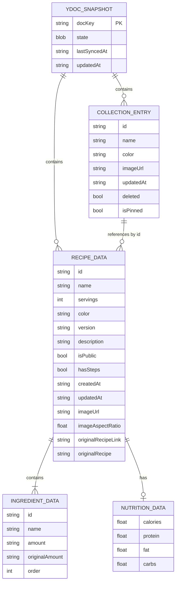

# Data Model: Интеграция yrs и нативное чтение

**Date**: 2026-06-01
**Phase**: Phase 1 — Design

## Entity Relationship



## Persistence Entities

### YDocSnapshot (SQLite / GRDB)

Корневая сущность хранения. Каждый Y.Doc (collection, recipe) имеет один снимок.

| Field | Type | Description |
|-------|------|-------------|
| `docKey` | `TEXT (PK)` | `{userId}:collection` или `{userId}:recipe:{recipeId}` |
| `state` | `BLOB NOT NULL` | Бинарное состояние Y.Doc (результат `encodeStateAsUpdate`) |
| `lastSyncedAt` | `TEXT?` | Временная метка последней успешной синхронизации с сервера (ISO 8601) |
| `updatedAt` | `TEXT NOT NULL` | Время последнего обновления локального снимка (ISO 8601) |

**Validation rules**:
- `docKey` не пустой, соответствует формату `{userId}:collection` или `{userId}:recipe:{uuid}`
- `state` не пустой blob
- При загрузке: если `state` повреждён (yrs не может применить), удаляем snapshot и запрашиваем с сервера

**State transitions**:
```
(empty) → [load from server] → persisted
persisted → [server update applied] → updated
persisted → [corruption detected] → deleted → [re-fetch from server]
```

## Domain Models (In-Memory, derived from Y.Doc)

### CollectionEntry

Данные одного рецепта из коллекции. Читается из `Y.Array('recipes')` → `Y.Map`.

| Field | Type | Y.Doc Source | Description |
|-------|------|-------------|-------------|
| `id` | `String` | `map["id"]` | UUID рецепта |
| `name` | `String` | `map["name"]` | Название |
| `color` | `String` | `map["color"]` | Hex цвет (напр. `#3b82f6`) |
| `imageUrl` | `String?` | `map["imageUrl"]` | URL изображения |
| `updatedAt` | `String` | `map["updatedAt"]` | ISO 8601 |
| `deleted` | `Bool` | `map["deleted"]` | Tombstone: true = удалён |
| `isPinned` | `Bool` | `map["isPinned"]` | Закреплён вверху списка |

**Validation**:
- `id` — непустой UUID
- `deleted == true` → не отображать в списке
- Сортировка: `isPinned` рецепты первыми, затем по `updatedAt` (desc)

### RecipeData

Полные данные рецепта. Читается из `Y.Map('recipe')` в документе рецепта.

| Field | Type | Y.Doc Source | Version |
|-------|------|-------------|---------|
| `id` | `String` | derived from docKey | all |
| `name` | `String` | `map["name"]` | all |
| `servings` | `Int` | `map["servings"]` | all |
| `scaleFactor` | `Double` | `map["scaleFactor"]` (UI-only, not persisted) | all |
| `color` | `String` | `map["color"]` | all |
| `description` | `String?` | `map["description"]` (v1/v2) | v1/v2 |
| `ingredients` | `[IngredientData]` | `map["ingredients"]` | v1 (JSON) / v2/v3 (Y.Array) |
| `nutrition` | `NutritionData?` | `map["nutrition"]` | v1 (JSON) / v2/v3 (Y.Map) |
| `version` | `String` | `map["version"]` | all |
| `isPublic` | `Bool` | `map["isPublic"]` | all |
| `hasSteps` | `Bool` | `map["hasSteps"]` | all |
| `createdAt` | `String` | `map["createdAt"]` | all |
| `updatedAt` | `String` | `map["updatedAt"]` | all |
| `imageUrl` | `String?` | `map["imageUrl"]` | all |
| `imageAspectRatio` | `Double?` | `map["imageAspectRatio"]` | all |
| `originalRecipeLink` | `String?` | `map["originalRecipeLink"]` | all |
| `originalRecipe` | `String?` | `map["originalRecipe"]` | all |

**Version detection**:
- `version == "v3"` → v3
- `version == "v2"` → v2
- `version` absent or `"v1"` → v1

### IngredientData

Один ингредиент. Читается из `Y.Map` внутри `Y.Array('ingredients')` (v2/v3) или парсится из JSON-строки (v1).

| Field | Type | Y.Doc Source | Description |
|-------|------|-------------|-------------|
| `id` | `String` | `map["id"]` | UUID ингредиента |
| `name` | `String` | `map["name"]` | Название |
| `amount` | `String` | `map["amount"]` | Текущее количество с единицей (напр. "200g") |
| `originalAmount` | `String` | `map["originalAmount"]` | Исходное количество (до масштабирования) |
| `order` | `Int` | `map["order"]` | Порядковый номер (1-based) |

**Scaling formula**:
```
scaledAmount = originalAmount * (targetServings / baseServings)
```

**Validation**:
- `order` auto-corrected на основе позиции в Y.Array
- v1 JSON может не содержать `originalAmount` — в этом случае `amount` используется как исходное

### NutritionData

Данные о питательности. Читается из `Y.Map` (v2/v3) или парсится из JSON-строки (v1).

| Field | Type | Y.Doc Source | Description |
|-------|------|-------------|-------------|
| `calories` | `Double?` | `map["calories"]` | Калории |
| `protein` | `Double?` | `map["protein"]` | Белки |
| `fat` | `Double?` | `map["fat"]` | Жиры |
| `carbs` | `Double?` | `map["carbs"]` | Углеводы |

**Note**: Nutrition Y.Map может содержать произвольные string→number пары. Только стандартные поля выше типизированы, остальные доступны как dictionary.

## Existing Models (Unchanged)

### Recipe (SwiftData) — UI Cache

Остаётся из Phase 1. Используется как UI cache layer. Данные заполняются из Y.Doc через observers. Поля в основном совпадают с RecipeData.

**Key difference**: Recipe SwiftData model имеет дополнительные поля для image caching (local paths, etags), которые не связаны с Y.Doc.

### Ingredient (SwiftData) — UI Cache

Остаётся из Phase 1. Заполняется из IngredientData.

## Model Mapping

```mermaid
graph LR
    YDOC[Y.Doc<br>binary state] -->|yrs read| YRS[YrsMap/YrsArray]
    YRS -->|parse| DOMAIN[Domain Models<br>CollectionEntry<br>RecipeData<br>IngredientData]
    DOMAIN -->|update| SWIFTDATA[SwiftData Models<br>Recipe<br>Ingredient]
    SWIFTDATA -->|@Query| UI[SwiftUI Views]
```

**Flow**:
1. Y.Doc state загружен → yrs читает Y.Map/Y.Array
2. Domain models создаются из Y.Doc values
3. SwiftData models обновляются для UI rendering
4. `@Query` в SwiftUI автоматически обновляет views
