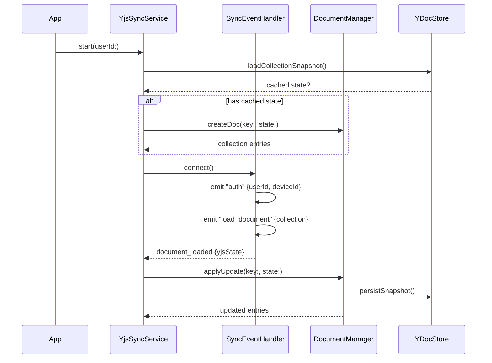
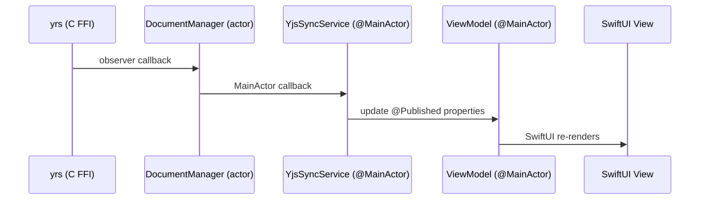

# Research: Интеграция yrs и нативное чтение

**Date**: 2026-06-01
**Phase**: Phase 0 — Research & Technical Decisions

## R1: yrs XCFramework Build Strategy

### Decision
Собирать `yffi` crate из [y-crdt](https://github.com/y-crdt/y-crdt) как статическую библиотеку для 3 iOS-таргетов, объединять через `xcodebuild -create-xcframework`.

### Rationale
- Прямой C FFI — минимальный оверхед, полный контроль над memory management
- yswift (UniFFI) — 89 stars, WIP, последний релиз апрель 2024, нет активной поддержки
- XCFramework — стандартный механизм Apple для distribution binary frameworks с поддержкой multi-architecture

### Build Pipeline

```
y-crdt/yffi (Rust crate)
  → cargo build --target <triple> --release
  → libyrs.a (static lib per architecture)
  → xcodebuild -create-xcframework
  → YrsXCFramework.xcframework
```

**Таргеты**:
| Triple | Arch | Platform |
|--------|------|----------|
| `aarch64-apple-ios` | arm64 | iOS device |
| `aarch64-apple-ios-sim` | arm64 | Simulator (Apple Silicon) |
| `x86_64-apple-ios` | x86_64 | Simulator (Intel) |

**Simulator fat library**: `lipo -create` для arm64-sim + x86_64 → universal simulator slice.

### Header & Module Map
- `libyrs.h` — копируется из `y-crdt/tests-ffi/include/`
- `module.modulemap` — создаётся вручную для Swift import

```modulemap
module YrsC {
    header "libyrs.h"
    export *
}
```

### Build Script
`scripts/build-yrs-xcframework.sh` — автоматизация всей сборки. Использует `cargo lipo` или ручные `cargo build` + `lipo` + `xcodebuild -create-xcframework`.

### Alternatives Considered
- **yswift/UniFFI**: добавляет зависимость от Mozilla UniFFI, генерирует лишний код, проект неактивен
- **JavaScriptCore + Yjs**: JS runtime overhead, сложное управление жизненным циклом, нет shared memory
- **cargo-xcframework plugin**: работает, но добавляет зависимость; проще ручной скрипт

---

## R2: GRDB vs SwiftData for Y.Doc Snapshots

### Decision
Использовать GRDB для хранения Y.Doc снимков. SwiftData остаётся для UI-моделей (Recipe, Ingredient).

### Rationale
- GRDB даёт прямой контроль над SQL-схемой, миграциями и бинарными данными (`Data` / `Blob`)
- SwiftData — ORM поверх Core Data, неудобен для хранения сырых бинарных Y.Doc state (нет custom migrations, ограниченный контроль над типами столбцов)
- Конституция явно упоминает "SQLite (GRDB or SwiftData)" — оба допустимы, GRDB лучше для бинарных снимков
- SwiftData уже используется для Recipe/Ingredient моделей — не убираем, используем параллельно

### Schema

```sql
CREATE TABLE ydoc_snapshots (
    doc_key TEXT PRIMARY KEY,        -- '{userId}:collection' or '{userId}:recipe:{recipeId}'
    state BLOB NOT NULL,             -- binary Y.Doc state (encodeStateAsUpdate)
    last_synced_at TEXT,             -- ISO 8601 timestamp from server
    updated_at TEXT NOT NULL         -- local timestamp of last snapshot write
);
```

### Alternatives Considered
- **SwiftData for everything**: нет гибкости для бинарных данных, миграции ограничены
- **File system**: нет транзакционности, сложнее manage cleanup
- **Core Data directly**: больше boilerplate чем GRDB, нет raw SQL convenience

---

## R3: Swift Wrapper Architecture for yrs C API

### Decision
Thin Swift wrapper layer с тремя уровнями: raw C bridging, value types, convenience extensions.

### Architecture

```
YrsC (module import)          — Raw C functions from libyrs.h
  ↓
YrsDocument, YrsMap, YrsArray — Wrapper classes with memory management
  ↓
YrsValue                      — YOutput → Swift type conversion
  ↓
CollectionEntry, RecipeData   — Domain models (in Models/YDoc/)
```

### Key Design Decisions

1. **Memory management**: `defer { youtput_destroy(output) }` для всех YOutput. `defer { ystring_destroy(str) }` для всех строк.
2. **Transaction scope**: `withReadTransaction` closure-based API — гарантирует commit/cleanup.
3. **Thread safety**: Y.Doc — not thread-safe. Все операции через actor или serial queue.
4. **Error handling**: `YrsError` enum для C API failures (null pointers, invalid state).

### Pattern

```swift
actor YrsDocument {
    private let doc: UnsafeMutablePointer<YDoc>

    func withReadTransaction<T>(_ block: (YTransaction) throws -> T) throws -> T {
        let txn = ydoc_read_transaction(doc)
        defer { ytransaction_commit(txn) }
        return try block(txn)
    }

    func applyUpdate(_ data: Data) throws { ... }
    func encodeStateAsUpdate() -> Data { ... }
}
```

### Alternatives Considered
- **No wrapper, direct C calls**: высокий риск memory leaks, нет type safety
- **Thick ORM-like wrapper**: over-engineering для read-only фазы
- **Class-based (non-actor)**: требует ручной synchronisation; actor обеспечивает safety

---

## R4: YjsSyncService Architecture

### Decision
YjsSyncService — `@MainActor ObservableObject`, заменяет WebSocketService. Управляет DocumentManager (Y.Doc lifecycle), SyncEventHandler (Socket.IO), YDocStore (SQLite).

### Architecture

```mermaid
graph TD
    YSS[YjsSyncService<br>@MainActor ObservableObject]
    DM[DocumentManager<br>actor]
    SEH[SyncEventHandler<br>Socket.IO events]
    STORE[YDocStore<br>GRDB SQLite]
    UI[SwiftUI Views]

    UI -->|subscribe @Published| YSS
    YSS -->|create/destroy docs| DM
    YSS -->|emit events| SEH
    SEH -->|receive updates| DM
    DM -->|persist snapshots| STORE
    DM -->|load snapshots| STORE
    SEH -->|Socket.IO| SERVER[Backend]
```

### Responsibilities

1. **DocumentManager** (actor):
   - Создание/уничтожение Y.Doc instances
   - Применение binary updates
   - Регистрация observers → вызов callbacks
   - Persist/restore через YDocStore

2. **SyncEventHandler**:
   - Socket.IO connection lifecycle
   - `load_document` → apply state to Y.Doc
   - `collection_updated` / `recipe_updated` → apply remote updates
   - `sync_error` → error handling

3. **YDocStore** (GRDB):
   - CRUD для ydoc_snapshots
   - Database migration
   - Thread-safe через GRDB's DatabaseQueue

### Connection Flow



### Document Loading Strategy

- **Collection**: загружается при старте, observer следит за изменениями
- **Recipe**: загружается при навигации (lazy), observer для real-time
- **Cache eviction**: при memory pressure — уничтожать Y.Doc instances, данные в SQLite

### Alternatives Considered
- **Extend WebSocketService**: слишком много ответственностей, смешивание REST- и Y.Doc-логики
- **Separate service per document type**: дублирование, сложнее coordinate
- **No actor for DocumentManager**: риск data races при конкурентных updates

---

## R5: SwiftUI Reactive Updates from Y.Doc

### Decision
Использовать `@Published` свойства в ViewModel, обновляемые через yrs observer callbacks, диспатченные на MainActor.

### Pattern



### Implementation

1. DocumentManager регистрирует observer через `yobserve_deep`
2. Observer callback отправляет async message на MainActor
3. YjsSyncService обновляет domain models (CollectionEntry, RecipeData)
4. ViewModel подписан на изменения через Combine или callback
5. `@Published` триггерит SwiftUI re-render

### Why Not Direct Binding
- yrs observers — C function pointers, не Swift closures
- Нужен прыжок через FFI boundary → actor → MainActor
- Domain models отделяют UI от CRDT internals

### Alternatives Considered
- **Combine pipelines**: over-engineering для данного масштаба
- **SwiftUI @Observable macro**: требует iOS 17 Observation framework — совместимо, но ViewModel уже `ObservableObject`
- **Polling вместо observers**: не даёт real-time, wasteful

---

## R6: Recipe Version Compatibility (v1/v2/v3)

### Decision
Реализовать version-aware reader с auto-detection. Поддержка всех трёх форматов для чтения.

### Detection Logic

```swift
func detectVersion(recipeMap: YrsMap, txn: YTransaction) -> RecipeVersion {
    if let version = recipeMap.getString("version", txn: txn) {
        switch version {
        case "v3": return .v3
        case "v2": return .v2
        default: return .v1
        }
    }
    // No version key → v1
    return .v1
}
```

### Reading Strategy Per Field

| Field | v1 | v2 | v3 |
|-------|----|----|-----|
| `ingredients` | JSON string → parse | Y.Array<Y.Map> | Y.Array<Y.Map> |
| `description` | String (plain text) | Y.Text → string | XmlFragment (skip in Phase 2) |
| `nutrition` | JSON string → parse | Y.Map or JSON | Y.Map or JSON |
| `version` | absent or "v1" | "v2" | "v3" |

### Ingredients Parsing

```swift
func readIngredients(from map: YrsMap, txn: YTransaction) throws -> [IngredientData] {
    let output = map.get("ingredients", txn: txn)

    if output.tag == Y_ARRAY {
        // v2/v3: Y.Array of Y.Map
        return try readYArrayIngredients(output, txn: txn)
    } else if output.tag == Y_JSON_STR {
        // v1: JSON string
        let json = output.stringValue
        return try parseJSONIngredients(json)
    }
    return []
}
```

### v3 Description Handling
- v3 description в `Y.XmlFragment('description')` (top-level, НЕ внутри recipeMap)
- В Phase 2 **не рендерится** — используется fallback: если `hasSteps == true`, показываем placeholder
- v1/v2 description (string/Y.Text) рендерится как plain text

### Alternatives Considered
- **Support only v3**: не реалистично, у пользователей есть v1/v2 рецепты
- **Migrate v1→v3 on read**: нарушает конституцию (Phase III — "let web client handle migration")
- **Separate reader per version**: дублирование, проще unified с branching

---

## R7: GRDB Database Setup & Migrations

### Decision
Одна таблица `ydoc_snapshots` с GRDB migrator. Database pool для concurrent reads.

### Setup

```swift
class YDocStore {
    private let dbQueue: DatabaseQueue

    init() throws {
        let dbURL = FileManager.default
            .urls(for: .applicationSupportDirectory, in: .userDomainMask)[0]
            .appendingPathComponent("ydoc_snapshots.sqlite")

        var config = Configuration()
        config.prepareDatabase { db in
            // WAL mode for concurrent reads
            try db.execute(sql: "PRAGMA journal_mode=WAL")
        }

        self.dbQueue = try DatabaseQueue(path: dbURL.path, configuration: config)

        var migrator = DatabaseMigrator()
        migrator.registerMigration("v1") { db in
            try db.create(table: "ydoc_snapshots") { t in
                t.column("docKey", .text).primaryKey()
                t.column("state", .blob).notNull()
                t.column("lastSyncedAt", .text)
                t.column("updatedAt", .text).notNull()
            }
        }

        try migrator.migrate(dbQueue)
    }
}
```

### Alternatives Considered
- **File-per-document**: нет atomicity, сложнее cleanup
- **SwiftData**: нет blob column support, нет custom PRAGMAs
- **Raw SQLite (no GRDB)**: больше boilerplate, нет type safety

---

## R8: Migration Path from REST to Y.Doc

### Decision
Постепенная миграция: YjsSyncService запускается параллельно с REST, UI переключается на Y.Doc источник данных по готовности.

### Migration Steps

1. **Startup**:
   - Загрузка из SQLite snapshot (если есть) → immediate display
   - Параллельно: REST fetch для backward compatibility
   - Параллельно: Socket.IO connect + load_document для Y.Doc state

2. **Data source switch**:
   - ViewModel проверяет: есть ли Y.Doc данные?
   - Если Y.Doc loaded → использовать Y.Doc данные
   - Если Y.Doc ещё загружается → показать SwiftData/REST кеш

3. **REST deprecation**:
   - `RecipeListViewModel.loadRecipes()` → переключается на чтение из YjsSyncService
   - `RecipeDetailView` → читает из Y.Doc вместо REST full recipe fetch
   - REST API (`APIClient`) остаётся для изображений

### SwiftData Model Coexistence
- Recipe/Ingredient SwiftData models → UI cache, заполняются из Y.Doc observers
- При обновлении Y.Doc → обновляем SwiftData models
- При отсутствии Y.Doc → SwiftData models заполнены из REST (Phase 1 fallback)

### Alternatives Considered
- **Big bang switch**: рискованно, нет fallback
- **Feature flag**: over-engineering для двух data sources
- **Remove SwiftData immediately**: потеряем offline access при первом запуске после обновления

---

## Summary of All Decisions

| # | Topic | Decision |
|---|-------|----------|
| R1 | yrs XCFramework | Build yffi as static lib → XCFramework with custom build script |
| R2 | SQLite library | GRDB for Y.Doc snapshots; SwiftData remains for UI models |
| R3 | Swift wrapper | Thin actor-based wrapper: YrsDocument → YrsMap/YrsArray → YrsValue |
| R4 | Sync service | YjsSyncService (MainActor) + DocumentManager (actor) + SyncEventHandler + YDocStore |
| R5 | Reactivity | yrs observers → actor callback → MainActor → @Published → SwiftUI |
| R6 | Version compat | Unified version-aware reader with auto-detection (v1/v2/v3) |
| R7 | DB schema | Single ydoc_snapshots table with GRDB migrator, WAL mode |
| R8 | Migration | Gradual: SQLite cache → Y.Doc loaded → UI switches data source |
