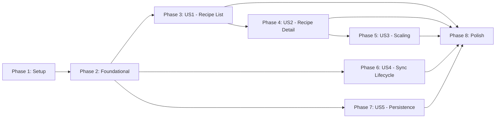

# T034Tasks: Интеграция yrs и нативное чтение

**Input**: Design documents from `/specs/001-yrs-native-read/`

**Prerequisites**: plan.md, spec.md, research.md, data-model.md, contracts/

**Tests**: Not explicitly requested — test tasks omitted.

**Constitution**: i18n strings, docs/ updates included. See `.specify/memory/constitution.md`.

**Organization**: Tasks grouped by user story for independent implementation and testing.

## Format: `[ID] [P?] [Story] Description`

- **[P]**: Can run in parallel (different files, no dependencies)
- **[Story]**: Which user story this task belongs to (US1-US5)
- File paths relative to repository root

---

## Phase 1: Setup (Shared Infrastructure)

**Purpose**: Build yrs XCFramework, add GRDB dependency, create project structure

- [x] T001 Create build script `scripts/build-yrs-xcframework.sh` that compiles yffi crate for aarch64-apple-ios, aarch64-apple-ios-sim, x86_64-apple-ios and produces `Frameworks/YrsXCFramework.xcframework` with `libyrs.h` header and `module.modulemap`
- [x] T002 Run build script, verify `Frameworks/YrsXCFramework.xcframework` exists with all three architecture slices
- [x] T003 Add `YrsXCFramework.xcframework` to Xcode project with "Embed & Sign" in `RecipeScalerNative.xcodeproj/project.pbxproj`
- [x] T004 Add GRDB SPM dependency (url: `https://github.com/groue/GRDB.swift`, from: `7.0.0`) to `Package.swift` and verify it resolves
- [x] T005 [P] Create directory structure: `RecipeScalerNative/Services/Yrs/`, `RecipeScalerNative/Services/YjsSync/`, `RecipeScalerNative/Services/Storage/`, `RecipeScalerNative/Models/YDoc/`, `RecipeScalerNative/Bridging/`
- [x] T006 [P] Copy `libyrs.h` from y-crdt `tests-ffi/include/` to `RecipeScalerNative/Bridging/libyrs.h` and create `RecipeScalerNative/Bridging/module.modulemap` with `module YrsC { header "libyrs.h" export * }`
- [x] T007 Verify project compiles with yrs XCFramework and GRDB — run `xcodebuild build` for simulator target

**Checkpoint**: XCFramework builds, GRDB resolves, project compiles with empty new directories

---

## Phase 2: Foundational (Blocking Prerequisites)

**Purpose**: Core yrs wrapper, SQLite storage, domain models, document lifecycle management

**⚠️ CRITICAL**: No user story work can begin until this phase is complete

### yrs Swift Wrapper

- [x] T008 [P] Create `RecipeScalerNative/Services/Yrs/YrsError.swift` — error enum with cases: nullPointer, invalidState, applyFailed, transactionError
- [x] T009 [P] Create `RecipeScalerNative/Services/Yrs/YrsValue.swift` — `YrsValue` struct wrapping `YOutput`, with computed properties: `stringValue`, `boolValue`, `doubleValue`, `intValue`, `tag` (exposing Y_ARRAY, Y_MAP, Y_JSON_STR constants). Include `youtput_destroy` in deinit
- [x] T010 Create `RecipeScalerNative/Services/Yrs/YrsDocument.swift` — `actor YrsDocument` wrapping `UnsafeMutablePointer<YDoc>`: `init()`, `deinit` (ydoc_destroy), `withReadTransaction<T>` closure-based API, `applyUpdate(_ data: Data) throws`, `encodeStateAsUpdate() -> Data`. All memory-managed with defer patterns per contracts/yffi-api.md
- [x] T010a Create `RecipeScalerNative/Services/Yrs/YrsObserver.swift` — RAII wrapper over `yobserve_`* from libyrs: `YrsObserverToken` class with `deinit` calling the unsubscribe fn, captured user `Unmanaged`/closure pointer. Used by DocumentManager to subscribe to Y.Array('recipes') and Y.Map('recipe') changes for FR-011 reactive SwiftUI updates
- [x] T011 [P] Create `RecipeScalerNative/Services/Yrs/YrsMap.swift` — extension on YrsDocument or standalone `YrsMap` struct: `get(key:txn:) -> YrsValue?`, `string(key:txn:) -> String?`, `int(key:txn:) -> Int?`, `double(key:txn:) -> Double?`, `bool(key:txn:) -> Bool?`, `length(txn:) -> UInt32`, `iterate(txn:) -> [YrsMapEntry]`
- [x] T012 [P] Create `RecipeScalerNative/Services/Yrs/YrsArray.swift` — `YrsArray` struct: `length() -> UInt32`, `get(index:txn:) -> YrsValue?`, `iterate(txn:) -> [YrsValue]`
- [x] T013 [P] Create `RecipeScalerNative/Services/Yrs/YrsText.swift` — `YrsText` struct: `string(txn:) -> String?`

### SQLite Storage

- [x] T014 Create `RecipeScalerNative/Services/Storage/Database.swift` — GRDB `DatabaseQueue` setup at `ApplicationSupport/ydoc_snapshots.sqlite`, WAL mode, migration v1 creating `ydoc_snapshots` table (docKey TEXT PK, state BLOB NOT NULL, lastSyncedAt TEXT, updatedAt TEXT NOT NULL)
- [x] T015 Create `RecipeScalerNative/Services/Storage/YDocStore.swift` — `actor YDocStore` with CRUD: `loadSnapshot(docKey:) -> YDocSnapshot?`, `saveSnapshot(docKey:state:lastSyncedAt:)`, `deleteSnapshot(docKey:)`, `allSnapshotKeys() -> [String]`

### Domain Models

- [x] T016 [P] Create `RecipeScalerNative/Models/YDoc/CollectionEntry.swift` — struct with fields: id, name, color, imageUrl, updatedAt, deleted, isPinned
- [x] T017 [P] Create `RecipeScalerNative/Models/YDoc/IngredientData.swift` — struct with fields: id, name, amount, originalAmount, order
- [x] T018 [P] Create `RecipeScalerNative/Models/YDoc/NutritionData.swift` — struct with fields: calories, protein, fat, carbs (all Double?)
- [x] T019 [P] Create `RecipeScalerNative/Models/YDoc/RecipeData.swift` — struct with fields: id, name, servings, color, version, description, ingredients ([IngredientData]), nutrition (NutritionData?), isPublic, hasSteps, createdAt, updatedAt, imageUrl, imageAspectRatio, originalRecipeLink, originalRecipe

### Document Manager

- [x] T020 Create `RecipeScalerNative/Services/YjsSync/DocumentManager.swift` — `actor DocumentManager` managing `[String: YrsDocument]` dictionary: `createDoc(key:) -> YrsDocument`, `getDoc(key:) -> YrsDocument?`, `applyUpdate(key:state:) throws`, `readCollectionEntries() -> [CollectionEntry]`, `readRecipeData(recipeId:) -> RecipeData?`. Uses YrsMap/YrsArray wrappers to parse Y.Doc into domain models per data-model.md
- [x] T020a Create observer-subscription flow in `DocumentManager.swift` — for each loaded Y.Doc, register a `YrsObserver` (from T010a) on `Y.Array('recipes')` (collection) and on `Y.Map('recipe')` (per recipe). On callback, re-parse the affected doc and call a `MainActor` publish closure supplied by YjsSyncService. YjsSyncService then updates its `@Published collectionEntries` / `@Published currentRecipe`. This is the FR-011 reactive path: no `@Query`, no manual reload
- [x] T021 [P] Create `RecipeScalerNative/Services/YjsSync/ConnectionState.swift` — enum: disconnected, connecting, connected, reconnecting, error(String). `@MainActor @Published` observable

**Checkpoint**: Foundation ready — yrs wrapper reads Y.Doc values, SQLite stores snapshots, domain models defined, DocumentManager parses collection and recipe documents

---

## Phase 3: User Story 1 — Просмотр списка рецептов из Y.Doc (Priority: P1) 🎯 MVP

**Goal**: Recipe list reads from Y.Doc collection document instead of REST API

**Independent Test**: Login → view recipe list → same recipes as web client, real-time updates from other devices

### Implementation for User Story 1

- [x] T022 [US1] Create `RecipeScalerNative/Services/YjsSync/SyncEventHandler.swift` — handles Socket.IO events: `auth` (emit userId+deviceId on connect), `load_document` (emit for collection), `document_loaded` (parse yjsState → apply to DocumentManager), `collection_updated` (parse yjsUpdate → apply to DocumentManager), `sync_error` (log and handle per contracts/sync-protocol.md). Binary conversion: `[Int] → Data` via `Data(array.map { UInt8($0) })`
- [x] T023 [US1] Create `RecipeScalerNative/Services/YjsSync/YjsSyncService.swift` — `@MainActor ObservableObject` replacing WebSocketService: `@Published collectionEntries: [CollectionEntry]`, `@Published connectionState: ConnectionState`. Coordinates DocumentManager, SyncEventHandler, YDocStore. On `start(userId:)`: load SQLite snapshot → create Y.Doc → connect Socket.IO → emit load_document for collection → update collectionEntries. Wire up SyncEventHandler callbacks to update DocumentManager and refresh collectionEntries
- [x] T024 [US1] Rewrite `RecipeScalerNative/ViewModels/RecipeListViewModel.swift` — remove REST-based `loadRecipes()`, replace with subscription to YjsSyncService.collectionEntries. Map CollectionEntry to Recipe SwiftData model for image caching. Keep search functionality using local data. Remove `apiClient.fetchRecipesCached()` calls
- [x] T025 [US1] Update `RecipeScalerNative/Views/RecipeListView.swift` — bind to new ViewModel data source. Remove SwiftData `@Query` for recipes if redundant. Ensure list shows name, color, image, pinned status from CollectionEntry
- [x] T026 [US1] Update `RecipeScalerNative/RecipeScalerNativeApp.swift` — initialize YjsSyncService after auth, pass to views via environment object. Remove WebSocketService.shared singleton pattern if replaced

**Checkpoint**: App launches, connects to Socket.IO, loads collection Y.Doc, displays recipe list from CRDT data. Real-time collection updates work.

---

## Phase 4: User Story 2 — Просмотр деталей рецепта из Y.Doc (Priority: P2)

**Goal**: Recipe detail reads from Y.Doc recipe document with v1/v2/v3 version compatibility

**Independent Test**: Tap any recipe → detail shows correct name, servings, ingredients, nutrition matching web client

### Implementation for User Story 2

- [x] T027 [US2] Add version-aware recipe reading to `RecipeScalerNative/Services/YjsSync/DocumentManager.swift` — `readRecipeData(recipeId:)` method: detect version from `map["version"]`, parse ingredients (v1: JSON string parse, v2/v3: Y.Array of Y.Map), parse nutrition (JSON or Y.Map), parse description (v1: string, v2: Y.Text, v3: skip XmlFragment). Per research R6 and data-model.md
- [x] T028 [US2] Add recipe document loading to `RecipeScalerNative/Services/YjsSync/YjsSyncService.swift` — `loadRecipe(recipeId:)` method: check DocumentManager for existing doc, else load from SQLite, emit `load_document` for recipe, handle `document_loaded` for recipes. Add `@Published currentRecipe: RecipeData?`
- [x] T029 [US2] Add `recipe_updated` handler to `RecipeScalerNative/Services/YjsSync/SyncEventHandler.swift` — parse `recipeId` + `yjsUpdate`, apply to DocumentManager, trigger YjsSyncService to refresh currentRecipe
- [x] T030 [US2] Update `RecipeScalerNative/Views/RecipeDetailView.swift` — bind to YjsSyncService.currentRecipe for name, servings, color, ingredients list, nutrition display. Remove REST full recipe fetch dependency. Load recipe via `loadRecipe(recipeId:)` on appear
- [x] T031 [US2] Wire event-to-applyUpdate flow in `DocumentManager.swift` — when `document_loaded` or `recipe_updated` events arrive in SyncEventHandler, route them through `DocumentManager.applyUpdate(...)`. Do NOT add a separate persistence path here — T040 owns all snapshot writes to keep the persistence surface single-sourced
- [ ] T031a [US2] Manual parity verification (SC-002) — open 3 sample recipes in iOS simulator and the web client (one v1, one v2, one v3), confirm name/servings/ingredients/nutrition match field-for-field. Capture screenshot evidence and record in Phase 4 checkpoint before declaring US2 done

**Checkpoint**: Tapping a recipe shows full detail from Y.Doc with ingredients, nutrition, all metadata. v1/v2/v3 recipes all render correctly. Real-time recipe updates work.

---

## Phase 5: User Story 3 — Масштабирование рецепта через Y.Doc (Priority: P3)

**Goal**: Ingredient scaling works with Y.Doc data using originalAmount field

**Independent Test**: Open recipe → adjust serving slider → ingredient amounts scale proportionally → reset slider → amounts return to original

### Implementation for User Story 3

- [x] T032 [US3] Add scaling logic to `RecipeScalerNative/ViewModels/RecipeListViewModel.swift` or new `RecipeDetailViewModel` — compute scaled amounts from IngredientData.originalAmount using formula: `scaledAmount = originalAmount * (targetServings / baseServings)`. Handle v1 recipes where originalAmount may be missing (use amount as base)
- [x] T033 [US3] Update `RecipeScalerNative/Views/RecipeDetailView.swift` — wire serving slider to scaling computation. Display scaled amounts in ingredient list. scaleFactor is UI-local state (not persisted in Y.Doc per constitution). Ensure slider resets to base servings correctly

**Checkpoint**: Serving slider scales all ingredient amounts correctly for v1/v2/v3 recipes. Reset returns to original values.

---

## Phase 6: User Story 4 — Жизненный цикл подключения синхронизации (Priority: P4)

**Goal**: Reliable Socket.IO connection with auto-reconnect, auth, offline indicator

**Independent Test**: Login → go airplane mode → see offline indicator → back online → auto-reconnect within 5 sec

### Implementation for User Story 4

- [x] T034 [US4] Enhance `RecipeScalerNative/Services/YjsSync/SyncEventHandler.swift` — add reconnection handling: on Socket.IO `.reconnect` event, re-emit `auth` with userId+deviceId, reload stale documents (those with lastSyncedAt older than disconnect time). Configure Socket.IO client with reconnects: true, reconnectAttempts: -1, reconnectWait: 1000ms per contracts/sync-protocol.md
- [x] T035 [US4] Enhance `RecipeScalerNative/Services/YjsSync/ConnectionState.swift` — add transitions: connected → disconnected (on .disconnect), disconnected → reconnecting (on .reconnectAttempt), reconnecting → connected (on .connect). Publish state changes to YjsSyncService
- [x] T036 [US4] Add sync error handling to `RecipeScalerNative/Services/YjsSync/SyncEventHandler.swift` — handle `sync_error` per contracts/sync-protocol.md: "Ownership validation failed" → show error, "Recipe is deleted" → remove from list, "Empty/Invalid update" → reload document, other → retry once after 5s
- [x] T037 [US4] Add offline/online indicator to `RecipeScalerNative/Views/RecipeListView.swift` — bind to YjsSyncService.connectionState, show system icon (wifi/wifi.slash) with localized status text. Add i18n keys for connection states to `RecipeScalerNative/Resources/Localizable.xcstrings`

**Checkpoint**: App shows connection state, auto-reconnects after network loss, handles sync errors gracefully, shows offline indicator.

---

## Phase 7: User Story 5 — Локальное сохранение состояния Y.Doc (Priority: P5)

**Goal**: App loads instantly from SQLite on restart, even offline

**Independent Test**: Load recipes → force-quit → reopen in airplane mode → all recipes visible instantly

### Implementation for User Story 5

- [x] T038 [US5] Add startup from SQLite to `RecipeScalerNative/Services/YjsSync/YjsSyncService.swift` — in `start(userId:)`: first load collection snapshot from YDocStore, create Y.Doc from snapshot, parse and publish CollectionEntries immediately before Socket.IO connection. Then connect and sync in background
- [x] T039 [US5] Add recipe detail SQLite restore to `RecipeScalerNative/Services/YjsSync/YjsSyncService.swift` — in `loadRecipe(recipeId:)`: check SQLite for existing snapshot before requesting from server. If found, parse and display immediately, then sync for updates in background
- [x] T040 [US5] Ensure snapshot persistence on every update in `RecipeScalerNative/Services/YjsSync/DocumentManager.swift` — after every `applyUpdate`, call YDocStore.saveSnapshot with current state and lastSyncedAt. Handle corruption: if ytransaction_apply fails, delete snapshot from SQLite and request full reload from server

**Checkpoint**: Force-quit and reopen shows recipes instantly from SQLite. Works fully offline with cached data. Most recent sync state is always persisted.

---

## Phase 8: Polish & Cross-Cutting Concerns

**Purpose**: Cleanup, i18n, docs, removal of deprecated code

- [x] T041 [P] Add all new user-facing strings to `RecipeScalerNative/Resources/Localizable.xcstrings` — sync error messages (ownership failed, recipe deleted, sync error), connection status labels (connecting, connected, offline, reconnecting), recipe loading indicator. Both ru and en locales
- [x] T042 [P] Remove `RecipeScalerNative/Services/WebSocketService.swift` — all functionality replaced by YjsSyncService + SyncEventHandler
- [x] T043 [P] Remove REST recipe fetch from `RecipeScalerNative/Services/APIClient.swift` — remove `fetchRecipesCached()` and `fetchRecipeFullCached()` methods, keep image and auth endpoints. Remove `RecipeDTO` and related response types
- [x] T044 [P] Clean up `RecipeScalerNative/Models/ApiCacheEntry.swift` — remove REST-specific caching fields (etag, lastModified) that are no longer needed for recipe fetching. Keep if still used for image caching
- [x] T045 Update `docs/SETUP.md` — add yrs XCFramework build instructions (prerequisites, running build script, adding to Xcode). Add GRDB dependency note. Update build steps to reflect Phase 2 setup
- [x] T046 Update `RecipeScalerNative/PROJECT_STATUS.md` — mark Phase 2 scope items as done after verification
- [x] T047 Verify all i18n strings use resource files — grep for hardcoded user-facing strings in new files, ensure none exist
- [x] T048 [P] Update `docs/ARCHITECTURE.md` — add YjsSyncService to the sync architecture diagram, document Socket.IO event flow (auth → load_document → document_loaded → collection_updated/recipe_updated → sync_error), reference the new YrsDocument/YrsMap/YrsArray wrappers and the observer-driven reactivity path
- [x] T049 [P] Update `docs/YJS-SCHEMA.md` — append a "Native (Swift) field mapping" section listing `CollectionEntry`, `RecipeData`, `IngredientData`, `NutritionData` with their wire-format field names, so schema parity between web and native is auditable from a single source

---

## Dependencies & Execution Order

### Phase Dependencies




- **Setup (Phase 1)**: No dependencies — start immediately
- **Foundational (Phase 2)**: Depends on Setup — BLOCKS all user stories
- **US1 (Phase 3)**: Depends on Foundational — core sync + collection reading
- **US2 (Phase 4)**: Depends on US1 — needs collection loaded to navigate to recipe
- **US3 (Phase 5)**: Depends on US2 — needs ingredients from recipe detail
- **US4 (Phase 6)**: Depends on Foundational — can run in parallel with US1-US3
- **US5 (Phase 7)**: Depends on Foundational — can run in parallel with US1-US3
- **Polish (Phase 8)**: After all desired stories complete

### User Story Dependencies

- **US1 (P1)**: After Foundational. No story dependencies — MVP deliverable
- **US2 (P2)**: After US1 (user must navigate from list to detail)
- **US3 (P3)**: After US2 (scaling uses ingredient data from detail)
- **US4 (P4)**: After Foundational. Independent of US1-US3 stories
- **US5 (P5)**: After Foundational. Independent of US1-US3 stories

### Parallel Opportunities

- Within Phase 1: T005, T006 (directories + headers) can run in parallel
- Within Phase 2: T008-T009 (error + value), T011-T013 (map/array/text), T016-T019 (domain models) — all parallelizable groups. T010a (observer wrapper) is sequential after T010; T020a (observer subscription) is sequential after T010a
- Phase 6 (US4) and Phase 7 (US5) can run in parallel with each other
- Phase 8 polish tasks T041-T044 and T048-T049 can all run in parallel

---

## Parallel Example: Foundational Phase

```
# Launch these groups in parallel within Phase 2:

# Group 1 (independent files):
Task: "Create YrsError.swift"
Task: "Create YrsValue.swift"

# Group 2 (independent files, after T010 YrsDocument):
Task: "Create YrsMap.swift"
Task: "Create YrsArray.swift"
Task: "Create YrsText.swift"

# Group 3 (independent files):
Task: "Create CollectionEntry.swift"
Task: "Create IngredientData.swift"
Task: "Create NutritionData.swift"
Task: "Create RecipeData.swift"

# Group 4 (independent):
Task: "Create ConnectionState.swift"
```

---

## Implementation Strategy

### MVP First (User Story 1 Only)

1. Complete Phase 1: Setup (yrs XCFramework, GRDB)
2. Complete Phase 2: Foundational (yrs wrapper, storage, models, DocumentManager)
3. Complete Phase 3: User Story 1 (recipe list from Y.Doc)
4. **STOP and VALIDATE**: Login, view recipe list, verify matches web client
5. Ship MVP — recipe list reads from CRDT

### Incremental Delivery

1. Setup + Foundational → Core infrastructure ready
2. US1 → Recipe list from Y.Doc → **MVP**
3. US2 → Recipe detail from Y.Doc → Full reading experience
4. US3 → Scaling works with Y.Doc → Core feature restored
5. US4 → Reliable sync connection → Production-quality connectivity
6. US5 → Local persistence → Offline-first experience
7. Polish → Clean codebase, docs updated

---

## Notes

- Current Phase 1 code (WebSocketService, RecipeListViewModel) can be refactored freely
- SwiftData Recipe/Ingredient models kept as UI cache layer
- REST API client kept for images and auth only
- All user-facing strings via i18n resource files (ru/en)
- scaleFactor is UI-local state, never persisted in Y.Doc
- v3 description (XmlFragment) not rendered in this phase

