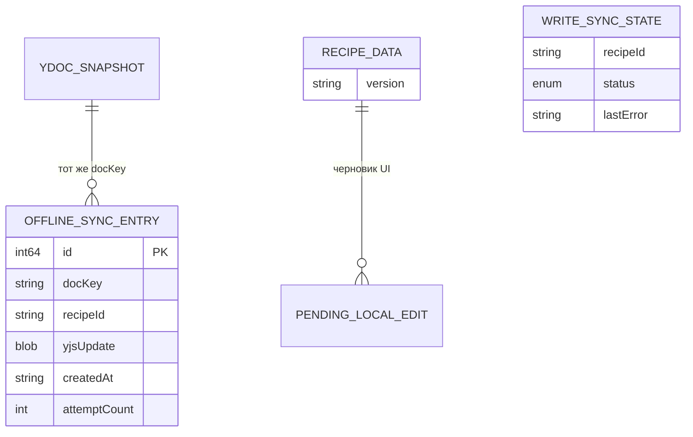
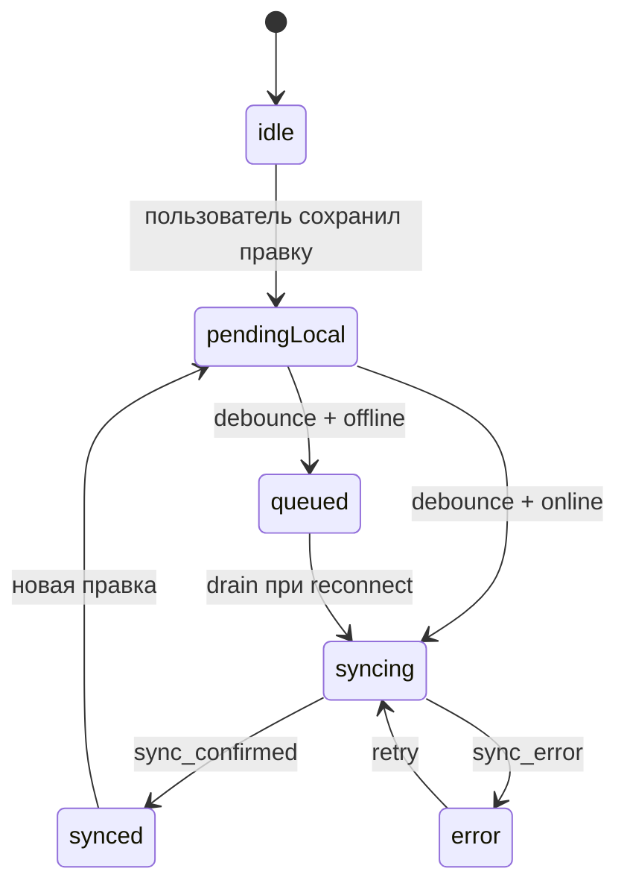

# Модель данных: нативное редактирование (Phase 3)

**Дата**: 2026-06-01

## Расширение модели Phase 2

Сущности Phase 2 (`CollectionEntry`, `RecipeData`, `IngredientData`, `NutritionData`, `YDocSnapshot`) для чтения без изменений. Phase 3 добавляет типы **стороны записи** (runtime и persistence).

## Связи сущностей



## Новые / расширенные сущности

### `OfflineSyncEntry` (SQLite: `offline_sync_queue`)

| Поле | Тип | Примечания |
|------|-----|------------|
| `id` | INTEGER PK AUTOINCREMENT | |
| `docKey` | TEXT NOT NULL | `{userId}:recipe:{recipeId}` |
| `recipeId` | TEXT NOT NULL | для payload emit |
| `yjsUpdate` | BLOB NOT NULL | бинарный апдейт на отправку |
| `createdAt` | TEXT ISO8601 NOT NULL | |
| `attemptCount` | INTEGER DEFAULT 0 | учёт повторов |

**Индексы**: `(docKey, createdAt)` для упорядоченного drain.

### `WriteSyncState` (in-memory, `@MainActor`)

| Значение | Смысл |
|----------|--------|
| `idle` | нет отложенных локальных изменений |
| `pendingLocal` | yrs обновлён, идёт таймер debounce |
| `syncing` | `sync_request` отправлен, ждём `sync_confirmed` |
| `synced` | подтверждено сервером |
| `error(String)` | `sync_error` или сбой транспорта |

Ключ — `recipeId` в `YjsSyncService`.

### `RecipeEditDraft` (ViewModel, эфемерный)

Изменяемая копия полей `RecipeData` в режиме edit. Не персистится до `RecipeEditViewModel.commit()`.

| Поле | Источник |
|------|----------|
| name, servings, color | `Y.Map('recipe')` |
| ingredients | `Y.Array('ingredients')` |
| nutrition | `Y.Map` под ключом nutrition |

### `RecipeEditPolicy`

```swift
enum RecipeEditPolicy {
    static func canEdit(version: String?) -> Bool
    // true только при version == "v3"
}
```

## Цели записи в Y.Doc (только v3)

| Цель | Операция | API yrs |
|------|----------|---------|
| `recipe.name` | set string | `ymap_insert` |
| `recipe.servings` | set int | `ymap_insert` |
| `recipe.color` | set string | `ymap_insert` |
| `recipe.ingredients[]` | insert/update/remove map | `yarray_insert_range`, `yarray_remove_range`, вложенный `ymap_insert` |
| `recipe.nutrition.*` | set double | вложенные insert в map |

**Не пишем в Phase 3**: `description` (XmlFragment), `version` (read-only), `Y.Array('recipes')` коллекции, `scaleFactor` (только UI).

## Переходы состояния (sync записи)



## Правила валидации

- `servings >= 1` перед yrs write
- ингредиент: `name` не пустой; `order` — положительное целое
- отклонять все записи при `version != v3`
- `recipeId` должен совпадать с `activeRecipeId` в sync service