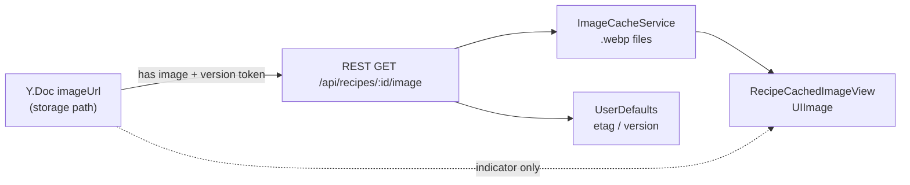

# Модель данных: офлайн-кэш изображений

**Дата**: 2026-06-02

## Слои



## Y.Doc (без изменений схемы)

| Поле | Тип | Смысл для изображений |
|------|-----|------------------------|
| `imageUrl` | `String?` | Признак «есть картинка» + путь в storage; **не** `src` для UI |
| `imageAspectRatio` | `Double?` | Только детальный экран (не кэш) |

Источники: `CollectionEntry.imageUrl`, `RecipeData.imageUrl` (после merge с collection — см. `RecipeCollectionMerge`).

## Файловый кэш

| Вариант | Имя файла | Назначение |
|---------|-----------|------------|
| `preview` | `{recipeId}_preview.webp` | Строка списка 44×44 |
| `full` | `{recipeId}_full.webp` | Шапка детального экрана |

Корень: `Library/Caches/RecipeImages/` (через `FileManager.cachesDirectory`).

## Метаданные HTTP (UserDefaults)

| Ключ | Пример | Назначение |
|------|--------|------------|
| `recipeImage.{id}.preview.version` | `abc123` | Токен из `imageUrl`; несовпадение → refetch |
| `recipeImage.{id}.preview.etag` | `"W/..."` | `If-None-Match` |
| `recipeImage.{id}.preview.lastModified` | RFC date | `If-Modified-Since` |
| `recipeImage.{id}.full.*` | то же | Полноразмерное изображение |

При `imageUrl == nil` или `""` — все ключи и оба файла для `recipeId` удаляются.

## Версионирование

```text
imageUrl: "userId/recipe-uuid/full/abc123.webp"
token:    "abc123"   // последний сегмент, без расширения
```

Query `v=abc123` на REST — cache-busting (паритет с web `getRecipeImageUrl`).

## SwiftData `Recipe` (legacy)

Поля `imageLocalPath`, `imagePreviewLocalPath`, `imageEtag` остаются для старого `RecipeDetailView` (SwiftData path).  
Поток Y.Doc **не** пишет в SwiftData; использует `RecipeImageService` + файлы.

## Уведомления

| Имя | `userInfo` |
|-----|------------|
| `recipeImageDidCache` | `recipeId: String`, `variant: "preview" \| "full"` |