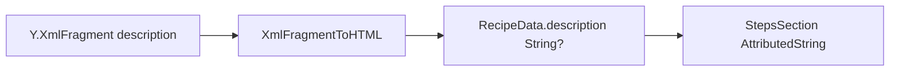

# Модель данных: просмотр описания

**Дата**: 2026-06-02

## Поток данных

## Y.Doc (без изменений схемы)

| Поле | v1 | v2 | v3 |
|------|----|----|-----|
| Описание | `recipeMap.description` string | `Y.Text` в map | top-level `XmlFragment('description')` |
| `hasSteps` | map | map | map — индикатор «есть контент» |

## `RecipeData.description`

- Тип: `String?` — **HTML** для `StepsSection` (как v2).
- v3: заполняется при `readRecipeData`, не `nil` если fragment непустой и конвертация успешна.

## Зависимости при конвертации v3

Для ноды `ingredient` нужен контекст `[IngredientData]` из того же recipe map (уже читается до description).

## Будущая фаза 005

Редактирование: отдельная спека, вероятно WKWebView + Tiptap + write в XmlFragment; `RecipeData.description` остаётся read-only cache для preview или убирается в пользу live WebView.