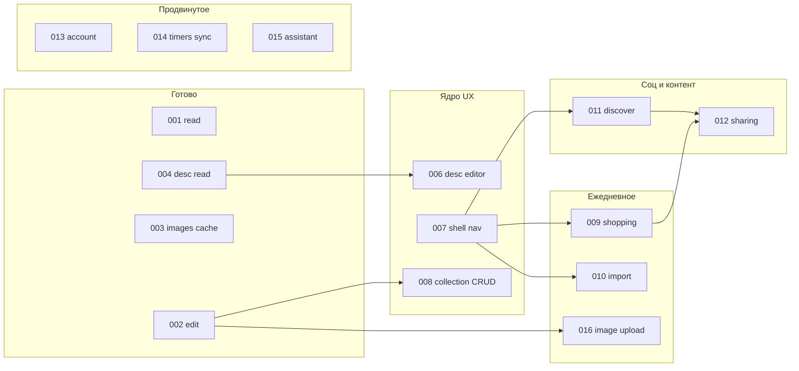

# Дорожная карта: паритет iOS с мобильным вебом

**Дата**: 2026-06-02  
**Статус**: Draft (только спеки, без реализации)  
**Источники**:
- Продукт: [`recipe-scaler-web/llm/PRD.md`](../../../recipe-scaler-web/llm/PRD.md)
- Нативный PRD: [`docs/PRD.md`](../../docs/PRD.md)
- Мобильный UI-эталон: [`recipe-scaler-web/recipe-scaler`](../../../recipe-scaler-web/recipe-scaler) — `BottomNav`, stacked layout (`!isWide`)

## Цель

Довести **нативное iOS-приложение** до **максимально возможного паритета** с **мобильной веб-версией** (5 вкладок нижней навигации, те же пользовательские потоки), без изменений бэкенда. Веб остаётся эталоном поведения и схемы Y.Doc.

## Уже сделано (не переписывать)

| ID | Фича | Статус |
|----|------|--------|
| 001 | yrs + чтение коллекции/рецепта, офлайн-снимки | ✅ |
| 002 | Редактирование v3 (поля, ингредиенты, nutrition), офлайн-очередь | ✅ |
| 003 | Офлайн-кэш изображений (REST → диск) | ✅ |
| 004 | Просмотр описания v3 (XmlFragment → HTML, без WKWebView) | ✅ |
| 014 | Синк таймеров + mobile panel | ✅ |
| — | Auth BIP39, таймеры локальные, i18n ru/en, масштаб порций UI-local | ✅ Phase 1 |

## Этапы (после 004)

Зависимости: стрелка = «желательно раньше», не блокер жёстко, кроме отмеченных **BLOCK**.

### Этап A — «Готовить по рецепту» (P0)

| Spec | Название | Зачем | Оценка |
|------|----------|-------|--------|
| [006-description-editor](../006-description-editor/spec.md) | Редактор описания (Tiptap / WKWebView) | Единственный большой пробел на деталке рецепта | L |
| [007-app-shell-navigation](../007-app-shell-navigation/spec.md) | Оболочка: 5 вкладок как `bottom-nav.tsx` | Без неё нет Discover / Shopping / Profile / Import | M |
| [008-collection-mutations](../008-collection-mutations/spec.md) | Pin, удаление, создание рецепта в коллекции | Список «Мои рецепты» как на вебе | M |

**BLOCK**: 007 перед полноценным UX вкладок Shopping/Discover/Account.

### Этап B — «Покупки и пополнение» (P1)

| Spec | Название | Зачем |
|------|----------|-------|
| [009-shopping-list](../009-shopping-list/spec.md) | Список покупок Y.Doc + UI | Вкладка Shopping, add-from-recipe |
| [010-recipe-import](../010-recipe-import/spec.md) | Импорт URL / текст / фото | Центральная вкладка Import |
| [016-recipe-image-upload](../016-recipe-image-upload/spec.md) | Загрузка/удаление фото рецепта | REST + инвалидация кэша 003 |

### Этап C — «Открыть мир рецептов» (P2)

| Spec | Название | Зачем |
|------|----------|-------|
| [011-discover-public](../011-discover-public/spec.md) | Discover + публичные профили + clone | Вкладка Discover, копирование чужих рецептов |
| [012-sharing](../012-sharing/spec.md) | Шаринг рецепта и списка покупок | `is_public`, публичные URL, share sheet |

### Этап D — «Аккаунт и умные функции» (P3)

| Spec | Название | Зачем |
|------|----------|-------|
| [013-account-settings](../013-account-settings/spec.md) | Профиль, настройки, Telegram, export/import файлов | Вкладка Profile |
| [014-timers-sync](../014-timers-sync/spec.md) | Синк таймеров + mobile panel | ✅ Done |
| [023-push-notifications](../023-push-notifications/spec.md) | APNs + push для таймеров (schedule/cancel, reminder PRD) | После 014 |
| [015-assistant](../015-assistant/spec.md) | AI-ассистент (stream, voice, widgets) | Отдельный launcher на мобильном вебе |

## Матрица: мобильный веб vs iOS (2026-06-02)

Легенда: ✅ есть · 🔄 в работе · ❌ нет · ➖ вне scope нативного PRD

| Область PRD | Мобильный веб (эталон) | iOS сейчас | Spec |
|-------------|------------------------|------------|------|
| **Навигация** 5 вкладок | `bottom-nav.tsx` | Только список рецептов | 007 |
| Список: поиск, секции pin | `recipe-list.tsx` | ✅ чтение, ❌ pin/delete/create | 008 |
| Список: swipe pin/delete | `swipeable-row` | ❌ | 008 |
| Деталь: масштаб порций | `servings-control` + local scale | ✅ UI-local | — |
| Деталь: редактирование v3 | `recipe-detail` edit | ✅ | 002 |
| Деталь: описание read | Tiptap render | 🔄 004 | 004 |
| Деталь: описание edit | Tiptap + XmlFragment | ❌ | 006 |
| Деталь: таймеры в тексте | timer nodes | read-only в 004; запуск локальных таймеров — уточнить в 006/014 | 006, 014 |
| Деталь: add to shopping | swipe + batch | ❌ | 009 |
| Изображения: просмотр офлайн | proxy + cache | ✅ 003 | — |
| Изображения: upload/delete | REST multipart | ❌ | 016 |
| Список покупок | `shopping-list-page` | ❌ | 009 |
| Импорт URL/текст/фото | `ImportRecipeSheet` | ❌ | 010 |
| Discover / curated | `/discover` | ❌ | 011 |
| Публичный профиль `/@user` | `public-profile` routes | ❌ | 011 |
| Clone / Copy to my recipes | API clone | ❌ | 011 |
| Share recipe / shopping | share popover + API | ❌ | 012 |
| Assistant chat + voice | `assistant-sheet` | ❌ | 015 |
| Account: имя, аватар, язык | `/account` | частично auth | 013 |
| Telegram connect | PRD § Telegram | ❌ | 013 |
| Export JSON/ZIP, PDF | account + public | ❌ PDF в Phase 6 PRD | 013 (export), PDF позже |
| Таймеры локальные | + mobile `TimerPanel` | ✅ Phase 1 | — |
| Таймеры sync | ARCHITECTURE + PRD | ✅ 014 | — |
| Таймеры push (фон) | PRD reminder + completion | локально UN только | 023 |
| Auth seed + QR | web + native | seed ✅, QR частично | 013 |
| OAuth | web | ➖ out of scope | — |
| PWA install | web | ➖ N/A | — |

## Принципы паритета

1. **Поведение = PRD + мобильный веб**, не десктоп-only UX (split pane, hover-only).
2. **Данные = Y.Doc** для коллекции, рецепта, shopping; **REST** для auth, images, import, assistant, discover metadata.
3. **`scaleFactor` не в Y.Doc** — только UI-local + `servings` в документе (как PRD).
4. **v1/v2 на iOS только чтение** — миграция в v3 только в вебе (002).
5. **Офлайн-first** на каждом этапе: чтение из SQLite, запись в очередь, без блокирующих модалок «нет сети».
6. **i18n ru/en** для всех новых строк.

## Вне scope этой дорожной карты

- iPad layout, Watch, Widgets, Siri (см. `docs/PRD.md` Phase 6)
- OAuth, изменения бэкенда
- PDF cookbook (отдельная фича после 011/013)
- Полная замена Tiptap нативным редактором (только если 006 research выберет альтернативу)

## Критерий «паритет достигнут» (продуктовый)

- Пользователь с одним аккаунтом может **не открывать веб** для типичного дня: список → деталь → масштаб → правка → описание → в магазин → импорт → discover clone.
- Для каждой строки матрицы со статусом ❌ есть закрывающая spec + ручной quickstart iOS ↔ web.
- **≥ 90%** пунктов матрицы «Область PRD» = ✅ (исключая ➖).

## Следующий шаг для реализации

После офлайн-ревью спек: закрыть **004** (quickstart), затем **007 + 008** (оболочка и коллекция), параллельно планировать **006** (самый рискованный — WKWebView/Tiptap).