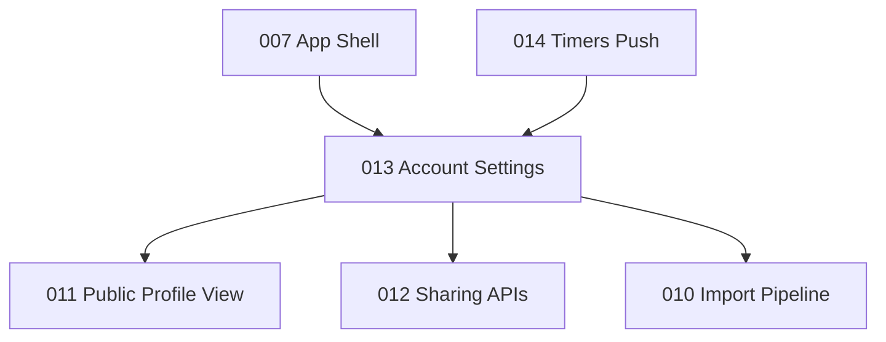

# План реализации: аккаунт и настройки (вкладка Profile)

**Ветка**: `013-account-settings` | **Дата**: 2026-06-02 | **Спека**: [spec.md](./spec.md) | **Статус**: Draft

**Вход**: спецификация `/specs/013-account-settings/spec.md`

**Эталон (мобильный веб)**: [`recipe-scaler-web/recipe-scaler/src/pages/seed-auth.tsx`](../../../recipe-scaler-web/recipe-scaler/src/pages/seed-auth.tsx) — маршрут `/account`, блок `md:hidden` (accordion). Desktop master-detail с `ResizableSplitter` **не** переносим.

## Кратко

Вкладка Profile на мобильном вебе — это не отдельная «страница профиля», а **настройки аккаунта** с пятью раскрывающимися секциями: Account, Public recipes, Telegram, Preferences, Data management + футер (release notes, About, версия).

На iOS сейчас: `AccountView` в `AppShellView` — частичный скелет (имя, аватар, theme/nutrition локально, seed без биометрии, logout без очистки Yjs/SQLite). Дублирующий `ProfileView` не используется.

Цель: **паритет содержимого** мобильного `/account`, с переводом UI-паттернов веба в идиоматичный SwiftUI (`List`/`Form`), без копирования Radix/shadcn и desktop-layout.

## Текущее состояние

| Слой | Веб (`SeedAuthPage`) | iOS сейчас |
|------|----------------------|------------|
| Точка входа | `/account`, Tab «Profile» | `AccountView` в `AppShellView` |
| Заглушка | — | `ProfileView` не подключён |
| API | profile + sharing-settings + telegram + export | `AccountAPI`: name, avatar; `SharingAPI` — только shopping list |
| Logout | IndexedDB, SW, realtime teardown, `POST /api/auth/logout` | Keychain + UserDefaults; **без** SQLite/Yjs/sync |

## Информационная архитектура (мобильный веб)

Секции accordion (состояние раскрытия в `localStorage` — на iOS опционально `@AppStorage`):

1. **Account** — только при авторизованном `userId`
2. **Public recipes** — публичный профиль и шаринг
3. **Telegram**
4. **Preferences** — таймеры (push), язык, тема, nutrition; кнопка v2→v3 **только на вебе**
5. **Data management** — export/import файлов + legacy migration

Футер: release notes, About, версия приложения (+ SW version на вебе — на iOS не нужно).

## Маппинг паттернов: веб → iOS

| Веб-паттерн | iOS-эквивалент | Заметки |
|-------------|----------------|---------|
| `Accordion` + `AccordionItem` | `List` + `Section` + `DisclosureGroup` **или** `NavigationLink` на подэкраны | Parity по **содержимому**; HIG предпочитает grouped settings list |
| `settings-form-row` (label слева, control справа) | `LabeledContent` / строка `Form` | На узком экране допустим vertical layout |
| Radix `Select` (~320px) | `Picker` в `Form` | Share mode, theme, language, nutrition |
| Radix `Switch` | `Toggle` | Public profile, allow downloads, timer push |
| Collapse «Login on another device» | `DisclosureGroup` или кнопка → `sheet` | Seed phrase + QR |
| Collapse «Change account» | `sheet` / push: `TextEditor` + scan | `QRScannerView` уже есть |
| `QRCodeDisplay` | QR через `CoreImage` + `Image` | Показ seed для входа на другом устройстве |
| `QRScanner` modal | `.fullScreenCover` + `QRScannerView` | Автологин при 12 словах — как на вебе |
| `Avatar` (hash) + `AvatarUpload` | `AsyncImage` + `PhotosPicker` | REST WebP; fallback — generated avatar по userId |
| `NameEditor` / `UsernameEditor` (inline edit) | `TextField` + debounce **или** экран Edit | Username: sanitize + `POST /username/check` |
| `toast` / `sonner` | `.alert` / banner / `statusMessage` | Ошибки API, offline |
| Offline `Alert` | Banner / `Section` вверху списка | Блокирует public profile controls |
| Hidden `<input type="file">` | `.fileImporter` / `UIDocumentPicker` | `.json`, `.zip` |
| `Link` → `/public/@/username` | `NavigationLink` / Safari / in-app public (011) | Зависит от spec 011 |
| Desktop nav + `ResizableSplitter` | **Не переносить** | Вне mobile parity |
| `localStorage` | `UserDefaults` + Keychain | Seed только Keychain |
| `window.location.reload` | Re-auth + `YjsSyncService` lifecycle | Нативный reconnect вместо reload |
| Logout: IndexedDB + caches + SW | GRDB snapshots, offline queue, stop Socket.IO | `POST /api/auth/logout` + device_id |
| `ThemeProvider` | `@AppStorage("appTheme")` + `preferredColorScheme` на **корне** app | Сейчас theme только внутри `AccountView` |
| `useNutritionSetting` (server + cache) | Тот же API + локальный cache | iOS пишет только в `UserDefaults` |
| `TimerNotificationToggle` (Web Push) | `UNUserNotificationCenter` + APNs | Spec **014-timers-sync** |
| v2→v3 migration button | **Вне scope iOS** | v3 migration — только веб (AGENTS.md) |

## Зависимости между spec



- **007** — вкладка Profile в tab bar (есть).
- **011** — ссылка «Your public recipes», просмотр своего публичного профиля in-app.
- **010** — import file pipeline для Data management.
- **014** — timer notifications в Preferences (можно stub → системные Settings до готовности push).

## API (сверка с сервером)

Используемые на вебе endpoints (`server/src/routes/users.ts`):

| Операция | Метод / путь |
|----------|----------------|
| Профиль | `GET /api/users/profile` |
| Display name | `PATCH /api/users/name` |
| Avatar | `POST` / `DELETE /api/users/avatar` |
| Username | `PUT /api/users/username`, `POST /api/users/username/check` |
| Sharing (unified) | `GET` / `PATCH /api/users/sharing-settings` |
| Logout device | `POST /api/auth/logout` |

Telegram — по `telegram-api.ts` (отдельный `TelegramAPI.swift`).

Export/import — client-side v1.0–v1.3 как на вебе (`exporters/v1.3`, `importers/*`), источник данных — локальные Y.Doc.

## Рекомендуемая структура кода iOS

```
RecipeScalerNative/Views/Account/
  AccountRootView.swift           # бывший AccountView
  AccountHeaderSection.swift      # userId, avatar, logout
  AccountSecuritySection.swift    # seed, QR, change account
  PublicProfileSection.swift
  AccountPreferencesSection.swift
  AccountDataSection.swift
  TelegramConnectionView.swift
  SeedPhraseSheet.swift           # LocalAuthentication + QR
RecipeScalerNative/Services/
  AccountAPI.swift                # расширить: profile fetch
  SharingSettingsAPI.swift        # sharing-settings, username
  TelegramAPI.swift
RecipeScalerNative/ViewModels/
  AccountSettingsViewModel.swift
```

Удалить или слить неиспользуемый `ProfileView.swift`.

## Фазы реализации

### Фаза 0 — Каркас экрана

- Единая точка входа: `AccountRootView` с секциями 1:1 с мобильным accordion.
- `AccountSettingsViewModel`: `GET profile` + `GET sharing-settings` на `onAppear`, offline flag, errors.
- Offline banner вверху (как `account.offline-alert`).
- Футер: Release notes sheet, About (`NavigationLink`), `CFBundleShortVersionString`.
- i18n: ключи `account.*`, `telegram.*`, `settings.preferences.*` → `Localizable.xcstrings`.
- Accessibility: расширить `AccessibilityIdentifiers` для секций account.

**Паттерн:** один scrollable `List`, не desktop master-detail.

### Фаза 1 — Account (P1): US1, US3, US8

| Функция веб | iOS | API / сервисы |
|-------------|-----|----------------|
| Avatar + masked userId + logout | Header: avatar URL / generated, `UserIdFormatter`, logout | Расширенный `AuthService.logout` |
| «Login on another device» | Sheet: seed (mono) + QR | Keychain; **LocalAuthentication** перед показом (FR-ACC-001) |
| «Change account» | Sheet: `TextEditor` + `QRScannerView` + Login | Существующий login + migrate Yjs |
| Copy seed | Кнопка Copy → pasteboard | Только по явному действию (FR-ACC-002) |

**Logout (критично, SC-002):** остановить `YjsSyncService`, очистить GRDB snapshots / offline queue, `POST /api/auth/logout` с `device_id`, сброс navigation tabs, Keychain.

### Фаза 2 — Public recipes (P2): US2

Только при online (как веб).

| Контрол | iOS | API |
|---------|-----|-----|
| Public profile toggle | `Toggle` + rollback при ошибке | `PATCH sharing-settings` `{ publicProfileEnabled }` |
| Share mode | `Picker`: all / with_images_and_steps / one_by_one | `PATCH` `{ shareMode }` |
| Name + avatar | `TextField` + `PhotosPicker` | `PATCH name`, `POST/DELETE avatar` |
| Username | Edit + async validation | `PUT username`, `POST username/check` |
| Allow recipe downloads | `Toggle` | `PATCH` `{ allowRecipeDownloads }` |
| «Your public recipes» | Link | `PublicURLBuilder` / Discover public (011) |

Обработать `USERNAME_GENERATION_FAILED` при включении toggle (как `PublicProfileToggle` на вебе).

Вынести sharing user settings из `SharingAPI` в `SharingSettingsAPI`.

### Фаза 3 — Preferences (P2): US4, US5

| Веб | iOS | Хранение |
|-----|-----|----------|
| `LanguageSwitcher` | `Picker` ru/en (без pseudo в prod) | Per-app language / `UserDefaults` |
| `ThemeSwitcher` | `Picker` system/light/dark | `@AppStorage` на root `ContentView` / `AppShellView` |
| `NutritionToggle` | `Picker` или `Toggle` — **сверить UX** с веб-select | Server sync как `useNutritionSetting` |
| `TimerNotificationToggle` | Stub или полная реализация в **014** | APNs ≠ Web Push |

**Не переносить:** кнопка «New editor (v3)» / `migrateAllRecipesToV3`.

### Фаза 4 — Telegram (P3): US7

Порт `TelegramConnection`:

- Connect → код + инструкции + Copy
- Poll статуса каждые ~3 с пока не connected
- Connected + disconnect

`TelegramAPI.swift` по веб-сервису.

### Фаза 5 — Data management (P2): US6

| Веб | iOS |
|-----|-----|
| Export v1.3 | Сбор из локальных Y.Doc; `ShareLink` / Files |
| Import v1.0–v1.3 | `fileImporter`; pipeline **010-recipe-import** |
| Legacy migration button | Только если есть v1 data на устройстве |
| Import guide | `Link` на GitHub (ru/en по locale) |

Progress на кнопках; многострочные ошибки в отдельной `Section` (как `importError` на вебе).

## Матрица паритета (мобильный веб)

| Секция | iOS сейчас | Цель |
|--------|------------|------|
| Account: userId, logout, seed+QR, change account | Частично | ✅ |
| Public: toggle, share mode, name, avatar, username, downloads, link | ❌ | ✅ |
| Telegram | ❌ | ✅ |
| Preferences: language, theme, nutrition (server) | Частично | ✅ |
| Preferences: timer push | ❌ | 014 / stub |
| Preferences: v3 migration | N/A | — |
| Data: export/import | ❌ | ✅ |
| Footer: release notes, about, version | ❌ | ✅ |
| Offline banner | ❌ | ✅ |

## Риски

| Риск | Митигация |
|------|-----------|
| Logout не очищает SQLite/Yjs | Фаза 1 — обязательный teardown sync + DB |
| Nutrition только local | Подключить server API из `use-nutrition-setting.ts` |
| Theme не на root | `@AppStorage` + `preferredColorScheme` на app shell |
| Seed без биометрии | `LAContext` в `SeedPhraseSheet` |
| Export без доступа к Y.Doc | Общий `RecipeExportService` поверх `DocumentManager` |
| Username validation drift | Порт правил из `username-editor.tsx` |

## Критерии приёмки (из spec)

- **SC-001**: смена avatar на iOS видна на веб account ≤ 10 с.
- **SC-002**: после logout другой seed не видит старые snapshots.

## Связанные артефакты

- [spec.md](./spec.md) — user stories и FR
- `contracts/account-api.md` — создать при Phase 1
- `quickstart.md` — сценарии проверки
- Roadmap: [005-mobile-web-parity-roadmap](../005-mobile-web-parity-roadmap/spec.md) — строка Account

## Порядок работ (практический)

1. ViewModel + fetch profile/sharing-settings + offline banner  
2. Account security (biometrics, QR, change account) + полный logout  
3. Public profile + `SharingSettingsAPI`  
4. Preferences (persist theme/language, server nutrition)  
5. Export/import (после 010)  
6. Telegram  
7. UI-тесты / accessibility identifiers