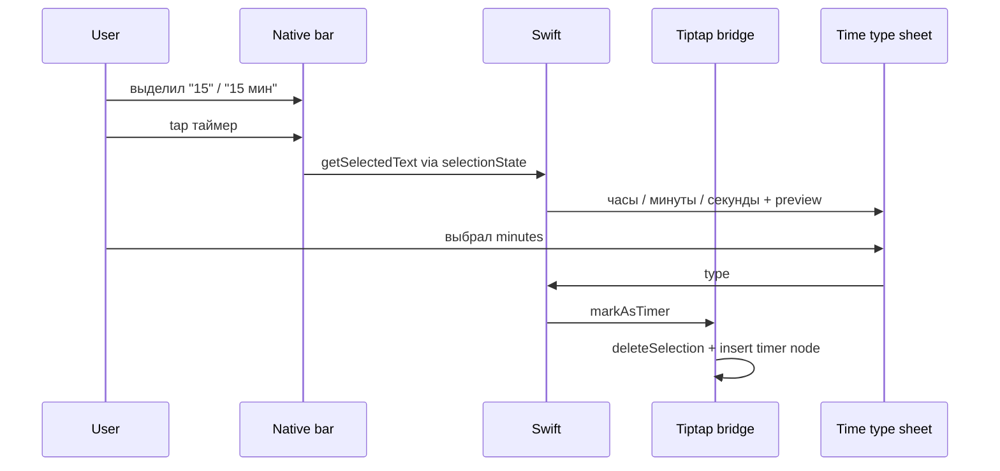
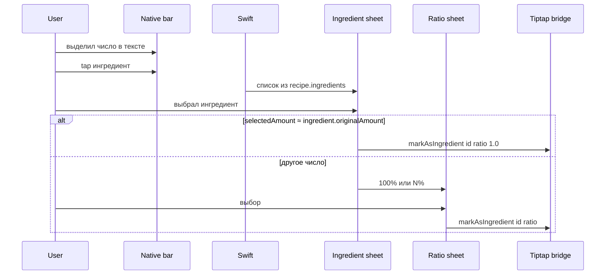

# Паритет разметки описания (v3) — эталон веб + iOS

**Нормативный код веба** (источник истины для логики):

| Область | Файлы |
|---------|--------|
| Кнопки панели | `recipe-scaler-web/recipe-scaler/src/components/tiptap-menu-bar.tsx` |
| Tiptap + вставка нод | `recipe-scaler-web/recipe-scaler/src/components/tiptap-recipe-editor.tsx` (`markAsTimer`, `markAsIngredient`) |
| Схема нод | `…/tiptap-extensions/timer-node.tsx`, `ingredient-node.tsx` |
| Оркестрация v3 | `…/components/recipe/steps-section.tsx` (`handleTimerButtonClick`, `handleIngredientButtonClick`, dropdown callbacks) |
| Списки UI | `…/components/ui/ingredient-dropdown.tsx`, `time-type-dropdown.tsx` |
| Клики по нодам | `…/pages/recipe-detail.tsx` (`handleDescriptionClick`) |
| LLM | `recipe-detail.tsx` → `runParseWithLLM`, `POST /api/v1/recipes/{id}/parse` |

**iOS не копирует Radix Popover.** Те же **правила данных и шаги**, UI — нативные sheet / confirmationDialog / menu.

---

## Панель инструментов (паритет `TiptapMenuBar`)

Порядок и смысл кнопок как на вебе:

| # | Действие | Tiptap / условие | iOS sticky |
|---|----------|------------------|------------|
| 1 | Заголовок H1 | `toggleHeading({ level: 1 })` | `toggleHeading1` |
| 2 | Жирное | `toggleBold()` | `toggleBold` |
| 3 | Выделить фон | `toggleHighlight()` | `toggleHighlight` |
| 4 | Список с цифрами | `toggleOrderedList()` | `toggleOrderedList` |
| 5 | Список с маркерами | `toggleBulletList()` | `toggleBulletList` |
| — | разделитель | — | визуальный separator |
| 6 | Разметить как таймер | см. § Таймер | `beginMarkTimer` → native flow |
| 7 | Разметить как ингредиент | см. § Ингредиент | `beginMarkIngredient` → native flow |
| — | разделитель | — | |
| 8 | Автораспознавание (LLM) | `onParseRecipe` + AlertDialog | Sparkles → native alert |

**На вебе в этой панели нет** отдельных кнопок «курсив» и «ссылка» (ссылки — отдельный scope 018, extension Link в Tiptap). iOS в первой волне повторяет **именно этот набор**; ссылку добавляем по 018, не выдумывая место на панели без веб-референса.

`selectionState.hasSelection` с веба: кнопки **таймер** disabled без выделения; **ингредиент** на v3 открывает picker и **без** выделения (но `markAsIngredient` в Tiptap всё равно требует непустое selection — см. ниже).

---

## Предусловие: выделение в Tiptap

Перед разметкой таймера/ингредиента JS обязан иметь **непустое** выделение в ProseMirror (`from !== to`).

- **Таймер:** как на вебе — кнопка неактивна без selection (`hasSelection`).
- **Ингредиент (v3):** веб открывает dropdown даже с пустым `selectedText`, но `markAsIngredient` **не вставит** ноду без selection. **iOS:** при tap «ингредиент» без выделения — показать подсказку (ключ i18n, аналог `editor.mark-as-ingredient-disabled`) **или** не открывать picker; паритет с фактическим поведением Tiptap — **требовать выделение** для завершения разметки (рекомендуется: disabled на кнопке как у таймера для единообразия UX, уточнить при QA с вебом).

Текст выделения: `editor.state.doc.textBetween(from, to)` — как `getSelectedText()` в `tiptap-recipe-editor.tsx`.

---

## Таймер — пошаговый flow (v3)

### Парсинг числа из выделения

Как `steps-section.tsx` (v3 branch) + `time-type-dropdown.tsx`:

1. `trim` выделения.
2. Сначала `parseNumber(wholeSelection)`; если `> 0` — это `value`.
3. Иначе regex `[\d]+(?:[.,]\d+)?` на выделении, `parseNumber` первого match.
4. Если не число или `<= 0` — **отмена**, нода не создаётся.

### `duration` (секунды)

| `type` | `duration` |
|--------|------------|
| `hours` | `value * 3600` |
| `minutes` | `value * 60` |
| `seconds` | `value` |

### Атрибуты ноды `timer` (XmlFragment / HTML)

Tiptap type `timer`, span class `timer-reference`, `contenteditable: false`.

| Атрибут | Значение |
|---------|----------|
| `data-timer-id` | `timer-${Date.now()}` (веб; iOS тот же формат) |
| `data-duration` | `duration` в секундах, строка |
| `data-type` | `hours` \| `minutes` \| `seconds` |
| `data-value` | числовое значение единиц, строка |
| `data-name` | на вебе при toolbar-flow часто `''`; допустимо имя рецепта для legacy v1/v2 |

**Текстовое содержимое ноды:** выделенный текст сохраняется внутри span (как `markAsTimer` — `content: selectedText`).

Команда моста: `markAsTimer` с полями `type`, `value`, `duration`, `timerId`, `name?` — реализация = `tiptap-recipe-editor.tsx` `markAsTimer`.

### После вставки (просмотр / edit)

Tap по `.timer-reference` — паритет `handleDescriptionClick`: popover/sheet **запуск таймера**, переименование, unlink (см. `TimerDropdown` на вебе). Локальный запуск — `TimerManager` (018 / FR-DESC-EDIT-005).

---

## Ингредиент — пошаговый flow (v3)

### Список ингредиентов (как `IngredientDropdown`)

Показывать только:

- не `isSeparator`;
- `originalAmount` не `null`/`undefined` и **≠ 0**.

Сортировка: ингредиенты, у которых `originalAmount` совпадает с выделенным текстом (строка или float), **выше**.

Отображение строки: `name` + `originalAmount` + `unit` (как в dropdown).

### Выбор и `ratio`

Пусть `selectedAmount = parseFloat(selectedText)` (если не число — 0).

- Если `|selectedAmount - ingredient.originalAmount| < 0.01` → сразу `onSelect(ingredientId, 1.0)`.
- Иначе второй экран:
  - **100%** — `ratio = 1.0`, подпись с полным `originalAmount`;
  - **N%** — `ratio = selectedAmount / ingredient.originalAmount`, `ratioPercent = round(ratio * 100)` (как в dropdown), подпись с `selectedAmount`.

Ключи i18n: `ingredients.mark-as-100`, `ingredients.mark-as-percent`, `common.back`.

### Вызов Tiptap

`markAsIngredient(ingredientId, originalAmount, ratio)`:

- `originalAmount` из **строки рецепта** `ingredient.originalAmount`, не из выделения;
- в attrs: `data-ingredient-id`, `data-original-amount` (строка), `data-ratio` (строка или null);
- нода **atom**, без дочернего текста (как веб v3).

Отображение qty в read-view — `IngredientComponent` + `scaleFactor` (уже 004).

### Tap по ноде в **edit**

Паритет веба: `handleDescriptionClick` + `UnlinkDropdown` — отвязать, сменить ratio. iOS: нативный sheet (не в первой волне P0 — зафиксировать в Phase 4 plan).

---

## Автораспознавание (LLM)

Паритет `runParseWithLLM` + кнопка Sparkles в menu bar.

| Шаг | Поведение |
|-----|-----------|
| Offline | Alert только «позже» (`llm.extract-description-offline`), без запроса |
| Online | Confirm (`llm.extract-description`) → «Поехали» / Cancel |
| Тело запроса | `POST /api/v1/recipes/{recipeId}/parse`, headers `X-User-ID`, JSON `{ stepsText, apply: true }` |
| `stepsText` v3 | HTML из Tiptap: `editor.getHTML()` (не plain text) |
| Успех | `yjsState` → ждём WS sync **или** `stepsAnnotatedHtml` → для v3 `updateXmlFragment` на вебе; iOS: `applyUpdate` / reload doc из `YjsSyncService` |
| Ошибка | сообщение пользователю, `isParsing` false |
| UI | кнопка disabled + progress пока parsing; диалог не закрывать до конца (как `tiptap-menu-bar`) |

Только **v3 editable** на iOS; v1/v2 read-only — кнопки нет.

---

## Что не дублировать в спеке

- Точная вёрстка dropdown — не нужна; нужны **шаги, фильтры, формулы, attrs**.
- ProseMirror XML byte-for-byte — проверка round-trip (018 SC-004), не ручное описание дерева.

## Связь с мостом

Команды `markAsTimer` / `markAsIngredient` — в [description-editor-bridge-v2.md](./description-editor-bridge-v2.md).

Дополнительно для native flows:

| Swift → JS | Назначение |
|------------|------------|
| `getSelectedText` | запрос текста выделения (ответ `selectedText` в JS→Swift) — если не кэшируем в `selectionState` |

Опционально JS→Swift при tap «начать разметку»: `selectedText` в `selectionState` обновлять на каждом `selectionUpdate`.