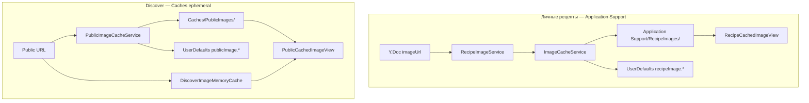

# Модель данных: public vs personal image cache

**Дата**: 2026-06-15 (постфактум)

## Два независимых контура



## Файловый кеш: публичный

| Поле | Значение |
|------|----------|
| Корень | `Library/Caches/PublicImages/` |
| Имя файла | `{sha256(url.absoluteString)}.webp` |
| Ключ hash | SHA256 от полного `url.absoluteString` (включая query) |

Примеры URL → разные файлы:

- `…/api/discover/recipes/{id}/image` — curated grid/hero
- `…/api/recipes/{id}/image` — public profile grid/hero
- `…/api/users/{username}/avatar?preview=true&v=…` — аватар

## Метаданные HTTP: публичный (UserDefaults)

| Ключ | Пример | Назначение |
|------|--------|------------|
| `publicImage.{hash}.etag` | `"abc"` | `If-None-Match` |
| `publicImage.{hash}.lastModified` | RFC date | `If-Modified-Since` |

При LRU-eviction файла — соответствующие ключи удаляются.

## Файловый кеш: личный (изменение spec 003)

| Вариант | Имя файла | Назначение |
|---------|-----------|------------|
| `preview` | `{recipeId}_preview.webp` | Список 44×44 |
| `full` | `{recipeId}_full.webp` | Hero деталки |

Корень: `Library/Application Support/RecipeImages/`.

### Migration

| Поле | Значение |
|------|----------|
| Legacy path | `Library/Caches/RecipeImages/` |
| Flag | `recipeImage.diskCache.migratedToApplicationSupport` (Bool) |
| Trigger | первый вызов `RecipeImageDiskCache.fileURL` / `existingFileURL` |
| Action | `moveItem` всех `.webp`; удаление пустой legacy-папки |

Метаданные `recipeImage.{id}.{variant}.*` **не** мигрируют — ключи те же.

## In-memory слои

| Кеш | Ключ | Лимит | Назначение |
|-----|------|-------|------------|
| `DiscoverImageMemoryCache` | `URL` | 120 items / 64 MB | scroll restore в Discover grid |
| `RecipeImageDisplayCache` | path + variant | 80 / 48 MB | decode личных `.webp` (без изменений) |

## Навигация Discover

```swift
enum DiscoverRecipeImageSource: Hashable, Sendable {
    case curatedDiscover   // GET /api/discover/recipes/:id/image
    case publicRecipe      // GET /api/recipes/:id/image (full)
}

enum DiscoverRoute: Hashable {
    case collection(String)
    case recipe(
        id: String,
        allowDownloads: Bool = true,
        imageSource: DiscoverRecipeImageSource = .curatedDiscover
    )
    case profile(String)
}
```

| Источник navigation | `imageSource` |
|---------------------|---------------|
| `DiscoverCollectionView` | `.curatedDiscover` (default) |
| `DiscoverPublicProfileView` | `.publicRecipe` |

## Eviction (public only)

- Порог: 150 MB суммарно в `PublicImages/`
- Алгоритм: сортировка по `contentModificationDate` ASC, удаление старейших до порога
- iOS может дополнительно очистить всю `Caches/` — ожидаемое поведение

## Запреты (инварианты)

1. Публичный URL **никогда** не пишется в `RecipeImages/`
2. `RecipeImageService.ensureCached` **не** вызывается из Discover UI
3. Личные `.webp` **не** пишутся в `PublicImages/`
