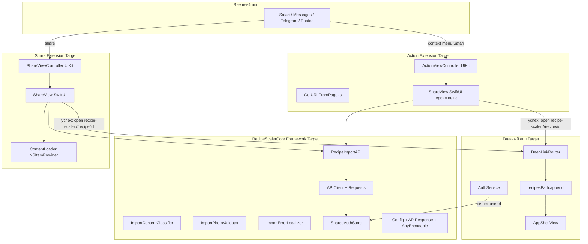

# План реализации: Share Extension, Action Extension, Deep Link

**Ветка**: `025-share-extension` | **Дата**: 2026-06-06 | **Спека**: [spec.md](./spec.md) | **Статус**: Draft — реализация не начата

**Вход**: спецификация `/specs/025-share-extension/spec.md`

## Кратко

Добавляется **внешний импорт рецептов** через системный Share Sheet из любого iOS-аппа (Safari, Messages, Telegram, Photos) + Action Extension для контекстного меню Safari. Главный апп открывается на новом рецепте через URL scheme `recipe-scaler://recipe/{id}`.

Архитектурно появляется общий **`RecipeScalerCore` framework** (Cocoa Touch Framework), который использует `RecipeImportAPI` и main app, и extension'ы. Auth credentials (только `userId`, без токенов) шарятся через **App Group `UserDefaults`** (`group.ru.recipescaler.RecipeScalerNative`).

Ключевые изменения:

- 3 новых Xcode target'а: `RecipeScalerCore` (framework), `ShareExtension` (app-extension), `ActionExtension` (app-extension).
- `APIClient` и `RecipeImportAPI` лишаются `@MainActor`, получают `nonisolated` + `os.OSUnfairLock` для потокобезопасного хранения auth state.
- Deep link router в main app: `.onOpenURL` + `UserDefaults.standard` pending id (покрывает холодный и тёплый старт).
- App Group entitlement на 3 target'ах.

## Технический контекст

**Язык / версия**: Swift 5.9+ (iOS 17+), Xcode 16.0+.

**Существующие зависимости** (без изменений):
- `RecipeImportAPI.swift` (spec 010) — `POST /api/recipes/import/{url,text,image}`.
- `APIClient`, `APIClient+Requests` — `URLSession`, JSON, multipart.
- `ImportContentClassifier` — regex-классификация URL-only / mixed / text-only.
- `ImportPhotoValidator` — валидация ≤8 фото, ≤25 MB, типы JPEG/PNG/WebP/HEIC.
- `ImportErrorLocalizer` — маппинг серверных ошибок в `import.*` ключи.

**Новые артефакты**:

- `RecipeScalerCore/` — новый framework target с переносом APIClient/RecipeImportAPI/Utils/Config.
- `ShareExtension/` — новый app-extension target с `ShareViewController` (UIKit) + `ShareView` (SwiftUI).
- `ActionExtension/` — новый app-extension target с `ActionViewController` + `GetURLFromPage.js`.
- `RecipeScalerNative/Routing/DeepLinkRouter.swift` — парсинг `recipe-scaler://recipe/{id}`.

**Auth flow**:

- `AuthService` главного аппа пишет `userId` в `SharedAuthStore.userId` (App Group `UserDefaults`).
- `APIClient.shared.configure(userId:)` на старте читает из `SharedAuthStore` (fallback на старый `UserDefaults.standard` для совместимости).
- Extension вызывает `APIClient.shared.configure(userId: SharedAuthStore.userId)` перед запросом.

**Тестирование**: XCTest для `DeepLinkRouter`, ручной smoke (Safari/Messages/Telegram/Photos) на симуляторе. Реальные device / TestFlight — для проверки provisioning profile.

**Платформа**: iOS 17.0+, Xcode 16.0+, Bundle ID prefix `ru.recipescaler.RecipeScalerNative`.

**Цели по производительности**: открытие extension ≤ 500 мс, импорт через extension ≤ время того же запроса из main app sheet (5–30 с в зависимости от источника).

**Ограничения**:

- Extension имеет лимит памяти ~16 MB (Action) / 120 MB (Share). Image upload до 25 MB каждое × 8 штук — близко к лимиту Share. При необходимости фото проходят через `Data` без загрузки всех в память одновременно.
- `extensionContext.open(URL)` — единственный способ переключиться в main app. Universal Links или push не подходят.
- App Group provisioning — вручную на Apple Developer Portal.

## Проверка конституции

*GATE: пройти до Phase 0. Перепроверить после Phase 1.*

Ссылка: проектные правила в `AGENTS.md`

| Gate | Статус | Примечания |
|------|--------|------------|
| Паритет с вебом | ✅ PASS | На вебе share не реализован; это iOS-only фича |
| Offline-first | ✅ PASS | Extension требует сети (как и main app sheet) — серверный парсинг. Offline на extension не имеет смысла |
| Нативный UI | ✅ PASS | SwiftUI ShareView, системный share sheet, нативные Action Extension |
| i18n | ✅ PASS | Новые ключи в `Shared.xcstrings`, существующие `import.*` переиспользуются |
| Документация | ✅ PASS | Spec 025, quickstart, contracts (опционально) |

## Архитектура



## Фаза 0 — Setup (вручную через Xcode UI)

**Цель**: создать target'ы и entitlements.

См. `quickstart.md` для пошагового чек-листа. Кратко:

1. Создать App Group `group.ru.recipescaler.RecipeScalerNative` на Apple Developer Portal.
2. В Xcode: File → New → Target → Cocoa Touch Framework → `RecipeScalerCore`. iOS 17, Language Swift, Include Tests: No.
3. В Xcode: File → New → Target → Share Extension → `ShareExtension`. Bundle ID `ru.recipescaler.RecipeScalerNative.Share`, language Swift, "Include UI Test" No.
4. В Xcode: File → New → Target → Action Extension → `ActionExtension`. Bundle ID `ru.recipescaler.RecipeScalerNative.Action`, language Swift, "Include UI Test" No. Action type: "Presents user interface".
5. На main app target → Signing & Capabilities → + App Groups → выбрать `group.ru.recipescaler.RecipeScalerNative`.
6. То же на ShareExtension и ActionExtension target.
7. На main app target → General → Frameworks, Libraries, and Embedded Content → добавить `RecipeScalerCore.framework` → Embed & Sign.
8. На ShareExtension и ActionExtension → General → Frameworks → добавить `RecipeScalerCore.framework` → Do Not Embed (extension embed нельзя; main app уже embed'ит).
9. На main app target → Build Phases → Embed App Extensions → должны появиться оба extension'а.
10. В scheme RecipeScalerNative → Build → должны быть выбраны все 4 target'а (app + framework + 2 extension).

**Контрольная точка**: пустой проект собирается; Share Extension появляется в Share Sheet (пока без UI).

## Фаза 1 — Framework extraction (RecipeScalerCore)

**Цель**: выделить network/import слой в shared framework.

### Перенос файлов

В `RecipeScalerCore/` создать структуру:

```
RecipeScalerCore/
├── RecipeScalerCore.swift          # module entry (пустой)
├── Networking/
│   ├── APIClient.swift             # из Services/APIClient.swift
│   └── APIClient+Requests.swift    # из Services/APIClient+Requests.swift
├── Import/
│   ├── RecipeImportAPI.swift       # из Services/RecipeImportAPI.swift
│   ├── ImportContentClassifier.swift # из Utils/
│   ├── ImportPhotoValidator.swift  # из Utils/
│   └── ImportErrorLocalizer.swift  # из Utils/
├── Auth/
│   └── SharedAuthStore.swift       # новый
├── Config/
│   └── Config.swift                # из RecipeScalerNative/Config.swift
└── Resources/
    └── Shared.xcstrings            # i18n (см. Phase 3)
```

### Изменения в APIClient

- Убрать `@MainActor` с класса.
- `configure(authToken:)`, `configure(userId:)` → `nonisolated`.
- Хранить `authToken`, `userId` под `os.OSUnfairLock` для потокобезопасности.
- `buildRequest`, `recipeImageURL`, `recipeImageDownloadRequest` → `nonisolated`.
- `performRequest` → `nonisolated`.
- `shared` статическая инициализация: `nonisolated(unsafe)` или `nonisolated` под iOS 17.

### Изменения в RecipeImportAPI

- Убрать `@MainActor enum`.
- Методы `importURLs`, `importText`, `importImages` → `async throws` без актора.

### Изменения в ImportErrorLocalizer

- Добавить параметр `bundle: Bundle` (default `Bundle.main`).
- Все `Bundle.currentLocalizedString(key)` заменить на `bundle.localizedString(forKey: key, value: nil, table: nil)`.

### Main app изменения

- Везде где импортится `Foundation` и нужны `APIClient` / `RecipeImportAPI` / `Config` → добавить `import RecipeScalerCore`.
- Убрать target membership `RecipeScalerNative` у перенесённых файлов (Compile Sources), оставить файлы в `RecipeScalerCore/`.

### Совместимость

- `APIClient.shared` по-прежнему singleton.
- На старте в `ContentView.init` добавить `APIClient.shared.configure(userId: SharedAuthStore.userId ?? authService.userId)` (покрывает переходный период).

**Контрольная точка**: `xcodebuild build` зелёный; main app работает как раньше.

## Фаза 2 — SharedAuthStore + AuthService миграция

**Цель**: расшарить userId между main app и extension'ами.

### Реализация SharedAuthStore

```swift
public enum SharedAuthStore {
    public static let appGroupID = "group.ru.recipescaler.RecipeScalerNative"
    public static let userIdKey = "shared.userId"

    public static var userId: String? {
        get { UserDefaults(suiteName: appGroupID)?.string(forKey: userIdKey) }
        set { UserDefaults(suiteName: appGroupID)?.set(newValue, forKey: userIdKey) }
    }

    public static func clear() {
        UserDefaults(suiteName: appGroupID)?.removeObject(forKey: userIdKey)
    }
}
```

### AuthService миграция

В `AuthService.swift`:

- После успешного логина: `SharedAuthStore.userId = userId`.
- После логаута: `SharedAuthStore.clear()`.
- На старте: `userId = SharedAuthStore.userId ?? readFromUserDefaults()` (обратная совместимость).

**Контрольная точка**: `UserDefaults(suiteName: "group.ru.recipescaler.RecipeScalerNative")?.string(forKey: "shared.userId")` возвращает тот же `userId`, что `authService.userId` в main app.

## Фаза 3 — i18n для framework

**Цель**: локализованные строки доступны и в main app, и в extension'ах.

### RecipeScalerCore/Resources/Shared.xcstrings

Новые ключи (см. spec FR-SE-010):

- `share-extension.title`
- `share-extension.button-import`
- `share-extension.button-open`
- `share-extension.button-retry`
- `share-extension.button-cancel`
- `share-extension.importing`
- `share-extension.success`
- `share-extension.success-multiple`
- `share-extension.error-no-content`
- `share-extension.error-not-signed-in`
- `share-extension.error-network`

Плюс дублирование существующих `import.*` ключей (выборочно: те, что использует `ImportErrorLocalizer`):

- `import.error`, `import.error-captcha`, `import.error-static`, `import.error-invalid-response`
- `import.error-photo-corrupt`, `import.error-photo-invalid-type`, `import.error-photo-too-large`, `import.error-photos-empty`, `import.error-too-many-photos`
- `import.error-too-many-recipes`, `import.error-file-binary`, `import.error-file-decode`, `import.error-file-empty`
- `import.validation.invalid-servings`, `import.validation.recipe-import-failed`
- `import.offline-unavailable`

### ImportErrorLocalizer использует Bundle.module

Когда вызывается из extension — `bundle = Bundle.module` (из framework).
Когда из main app — `bundle = Bundle.main` (из main bundle, где `Localizable.xcstrings`).

### Тест согласованности

В `RecipeScalerNativeTests/LocalizationConsistencyTests.swift` добавить проверку:

- Все ключи `share-extension.*` присутствуют в `Shared.xcstrings` (en + ru).
- Все `import.*` ключи (из `Shared.xcstrings`) также присутствуют (как минимум) в main `Localizable.xcstrings`.

**Контрольная точка**: тесты локализации зелёные.

## Фаза 4 — Share Extension

**Цель**: реализовать UI и контент extraction.

### ShareViewController.swift (UIKit host)

- Наследник `UIViewController`.
- В `viewDidLoad`: создать SwiftUI `ShareView` через `UIHostingController`.
- Переопределить `isContentValid` → `true` (проверка в SwiftUI).
- Переопределить `didSelectPost` → не используется (submit из SwiftUI).
- Переопределить `didSelectCancel` → `extensionContext.cancelRequest(withError: ...)`.
- `presentationStyle` → `.default` (не fullscreen).

### ShareView.swift (SwiftUI)

State machine:

- `.preview(content: ContentKind)` — preview + кнопка «Импорт».
- `.loading` — `ProgressView` + текст «Импортируем...».
- `.success(result: ImportRecipesResultDTO)` — текст + кнопка «Открыть рецепт».
- `.error(message: String)` — текст + «Повторить» / «Отмена».

`ContentKind` enum:

```swift
enum ContentKind {
    case url(URL)
    case text(String)
    case images([Data])
    case mixed(urls: [URL], text: String)
    case empty
}
```

Логика submit:

```swift
func submit() async {
    guard let userId = SharedAuthStore.userId else {
        state = .error(message: "share-extension.error-not-signed-in")
        return
    }
    APIClient.shared.configure(userId: userId)
    do {
        let dto: ImportRecipesResultDTO
        switch content {
        case .url(let url): dto = try await RecipeImportAPI.importURLs([url.absoluteString])
        case .text(let text): /* classify → importURLs или importText */
        case .images(let datas): /* ImportPhotoItem[] → importImages */
        case .mixed(let urls, _): dto = try await RecipeImportAPI.importURLs(urls.map { $0.absoluteString })
        case .empty: /* error */
        }
        state = .success(result: dto)
    } catch {
        state = .error(message: ImportErrorLocalizer.localize(error, bundle: .module))
    }
}
```

Кнопка «Открыть рецепт»:

```swift
Button("share-extension.button-open") {
    if let id = result.primaryRecipeId ?? result.recipeIds.first {
        let url = URL(string: "recipe-scaler://recipe/\(id)")!
        extensionContext.open(url) { _ in
            extensionContext.completeRequest(returningItems: nil, completionHandler: nil)
        }
    } else {
        extensionContext.completeRequest(returningItems: nil, completionHandler: nil)
    }
}
```

### Content extraction из NSExtensionContext

```swift
func loadContent(from context: NSExtensionContext) async -> ContentKind {
    var urls: [URL] = []
    var texts: [String] = []
    var images: [Data] = []

    for item in context.inputItems.compactMap({ $0 as? NSExtensionItem }) {
        for attachment in item.attachments ?? [] {
            if attachment.hasItemConformingToTypeIdentifier("public.url") {
                if let url = await loadURL(from: attachment) { urls.append(url) }
            }
            if attachment.hasItemConformingToTypeIdentifier("public.text") {
                if let text = await loadText(from: attachment) { texts.append(text) }
            }
            if attachment.hasItemConformingToTypeIdentifier("public.image") {
                if let data = await loadImageData(from: attachment) { images.append(data) }
            }
        }
    }

    // Приоритет: URL > Images > Text
    if !urls.isEmpty {
        return texts.isEmpty ? .url(urls[0]) : .mixed(urls: urls, text: texts.joined(separator: "\n"))
    }
    if !images.isEmpty { return .images(images) }
    if !texts.isEmpty {
        let combined = texts.joined(separator: "\n")
        let cls = ImportContentClassifier.classify(combined)
        if cls.isUrlOnly { return .url(URL(string: cls.urls[0])!) }
        return .text(combined)
    }
    return .empty
}
```

`loadURL` / `loadText` / `loadImageData` — обёртки вокруг `NSItemProvider.loadItem(forTypeIdentifier:completionHandler:)` через `withCheckedContinuation`.

### Info.plist

См. spec FR-SE-003.

### Entitlements

`ShareExtension.entitlements`:

```xml
<?xml version="1.0" encoding="UTF-8"?>
<!DOCTYPE plist PUBLIC "-//Apple//DTD PLIST 1.0//EN" "http://www.apple.com/DTDs/PropertyList-1.0.dtd">
<plist version="1.0">
<dict>
    <key>com.apple.security.application-groups</key>
    <array>
        <string>group.ru.recipescaler.RecipeScalerNative</string>
    </array>
</dict>
</plist>
```

**Контрольная точка**: Share Extension появляется в Share Sheet; URL → success → «Открыть рецепт» открывает main app (Deep Link Phase 5).

## Фаза 5 — Deep Link (main app)

**Цель**: main app ловит `recipe-scaler://recipe/{id}` и открывает рецепт.

### Info.plist

Добавить `CFBundleURLTypes` (см. spec FR-SE-007).

### DeepLinkRouter.swift

`RecipeScalerNative/Routing/DeepLinkRouter.swift`:

```swift
import Foundation

enum DeepLinkRouter {
    static let pendingRecipeIdKey = "routing.pendingRecipeId"

    static func handle(_ url: URL) {
        guard url.scheme == "recipe-scaler" else { return }
        guard url.host == "recipe" else { return }
        guard let id = url.pathComponents.dropFirst().first, !id.isEmpty else { return }
        guard let recipeId = UUID(uuidString: id)?.uuidString.lowercased() else { return }
        UserDefaults.standard.set(recipeId, forKey: pendingRecipeIdKey)
        NotificationCenter.default.post(name: .openRecipeRequested, object: nil)
    }

    static func consumePendingRecipeId() -> String? {
        let id = UserDefaults.standard.string(forKey: pendingRecipeIdKey)
        if id != nil {
            UserDefaults.standard.removeObject(forKey: pendingRecipeIdKey)
        }
        return id
    }
}

extension Notification.Name {
    static let openRecipeRequested = Notification.Name("openRecipeRequested")
}
```

### RecipeScalerNativeApp.swift

```swift
var body: some Scene {
    WindowGroup {
        ContentView()
            .onOpenURL { url in
                DeepLinkRouter.handle(url)
            }
    }
    .modelContainer(sharedModelContainer)
}
```

### AppShellView.swift

В `body`:

```swift
.onAppear {
    if let id = DeepLinkRouter.consumePendingRecipeId() {
        selectedTab = .recipes
        recipesPath.append(id)
    }
}
.onReceive(NotificationCenter.default.publisher(for: .openRecipeRequested)) { _ in
    if let id = DeepLinkRouter.consumePendingRecipeId() {
        selectedTab = .recipes
        recipesPath.append(id)
    }
}
```

### Sync на холодном старте

`YDocRecipeDetailView` уже показывает skeleton при отсутствии Y.Doc. После открытия рецепта по deep link:

1. `syncService.handleEnteredForeground()` (вызывается из `ContentView.onChange(of: scenePhase)`) подключается к серверу.
2. `YjsSyncService.start(userId:)` загружает коллекцию → рецепт появляется в `recipesPath`.
3. `YDocRecipeDetailView` получает doc → skeleton исчезает.

**Контрольная точка**: `recipe-scaler://recipe/test-id` из Notes/Safari открывает main app на рецепте (тестовый id; реальный — после интеграции с extension).

## Фаза 6 — Action Extension

**Цель**: контекстное меню Safari.

### GetURLFromPage.js

```javascript
var GetURLFromPage = function() {};

GetURLFromPage.prototype = {
    run: function(arguments) {
        arguments.completionFunction({ "currentUrl": document.URL });
    },
    finalize: function(arguments) {
        // no-op
    }
};

var ExtensionPreprocessingJS = new GetURLFromPage;
```

### ActionViewController.swift

- Наследник `UIViewController`.
- В `viewDidLoad`: проверить `NSExtensionJavaScriptPreprocessingResultsKey` → `currentUrl` из `context.inputItems`.
- Если URL есть — хостить SwiftUI `ShareView(content: .url(currentUrl))`.
- Если URL нет — экран ошибки.

### Info.plist

См. spec FR-SE-006.

### Entitlements

Аналогично ShareExtension.

**Контрольная точка**: в Safari long-press на странице → «Импорт в Recipe Scaler» в контекстном меню → Action Extension открывается с URL активной вкладки.

## Фаза 7 — Верификация

### Сборка

```bash
rtk xcodebuild -scheme RecipeScalerNative \
    -destination 'platform=iOS Simulator,id=<UDID>' \
    build
```

UDID — из `xcrun simctl list devices available | rg 'iPhone 17'`.

### Unit-тесты

`RecipeScalerNativeTests/DeepLinkRouterTests.swift`:

- `test_handleValidRecipeURL_storesPendingId` — `recipe-scaler://recipe/abc-123` пишет pending id.
- `test_uppercaseUUID_isAcceptedAndNormalized` — uppercase UUID в URL нормализуется в lowercase.
- `test_handleWrongScheme_ignored` — `https://recipe/abc` игнорируется.
- `test_handleWrongHost_ignored` — `recipe-scaler://other/abc` игнорируется.
- `test_handleEmptyId_ignored` — `recipe-scaler://recipe/` игнорируется.
- `test_consumePendingRecipeId_clearsStorage` — после consume возвращает nil.

### Локализация

`LocalizationConsistencyTests.swift` — расширить список ключей (см. FR-SE-010).

### Ручной smoke (симулятор)

См. `quickstart.md` § "Ручной smoke".

### Verification script

`scripts/verify-share-extension.sh` — собирает + запускает `DeepLinkRouterTests` + проверяет, что все 4 target'а присутствуют в pbxproj (через `rg`).

## Риски / Trade-offs

- **App Group provisioning** — вручную на Apple Developer Portal. На симуляторе работает без профиля (UserDefaults suiteName свободный).
- **`@MainActor` → `nonisolated`** — `APIClient` становится полностью nonisolated; требует `os.OSUnfairLock` вокруг мутаций `authToken`/`userId`. `RecipeImportAPI` — stateless enum, актор не нужен.
- **Memory limits** — Share Extension ~120 MB, Action Extension ~16 MB. Для 8 фото × 25 MB = 200 MB в памяти одновременно — риск OOM. Решение: стримить фото по одному через `withCheckedThrowingContinuation` + autoreleasepool, не держать `[Data]` в памяти.
- **Холодный старт по deep link** — `recipe-scaler://recipe/{id}` открывает main app; Y.Doc может быть не готов. `YDocRecipeDetailView` уже показывает skeleton — этого достаточно для MVP.
- **JavaScript preprocessing для Action Extension** — работает только в Safari. В Messages/Telegram/share sheet — только Share Extension.
- **Bundle ID prefix** — `ru.recipescaler.RecipeScalerNative` уже используется; extension'ы — `.Share` и `.Action`. App Group — `group.ru.recipescaler.RecipeScalerNative`.
- **iOS 17 minimum** — `Mutex` доступен, `os.OSUnfairLock` тоже; предпочтительнее `Mutex` (Swift Concurrency native).

## Out of scope

- File `.json/.zip` импорт через share extension → spec 020.
- Universal Links — требует серверных `apple-app-site-association`.
- Push notifications после импорта.
- `AppIntent` / Siri Shortcuts.
- Share Extension settings panel (пользователь не может настроить, какие типы принимать — фиксировано в Info.plist).
