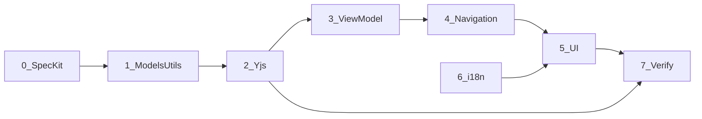

# План: коллекции рецептов (026)

Зеркало рабочего плана Cursor: `.cursor/plans/native_collections_parity_59a77fdc.plan.md`  
Интеграционный гайд: [NATIVE_APP_COLLECTIONS.md](../../recipe-scaler-web/llm/NATIVE_APP_COLLECTIONS.md)

## Статус шагов

| Шаг | Содержание | Статус |
|-----|------------|--------|
| 0 | Spec Kit + YJS-SCHEMA + README + verify script (скелет) | ✅ |
| 1 | Swift модели и утилиты (порт shared) | ✅ |
| 2 | DocumentManager / YjsSyncService folders + folderIds | ✅ |
| 3 | ViewModel + UserDefaults view mode | ✅ |
| 4 | RecipesRoute, навигация, новые views | ✅ |
| 5 | UI parity §8 (toggle, sheets, swipe, detail menu) | 🟡 US9 pin side |
| 6 | i18n `collections.*` | ✅ |
| 7 | Тесты + verify-recipe-collections.sh (полный) | ✅ |

## Зависимости между шагами

## Реализация по шагам (кратко)

Визуальные референсы (веб): `recipe-scaler-web/llm/assets/native-collections/` — полная таблица в [quickstart.md](quickstart.md); assign из детали: `10-recipe-header-collections.png`, `11-recipe-assign-from-header.png`.

См. полный текст в Cursor plan §1–7. Критический claim верификации:

После sync с веб-аккаунтом с папками iOS показывает те же папки/счётчики; create/assign на iOS виден на вебе; pin/delete не удаляет `folderIds`.