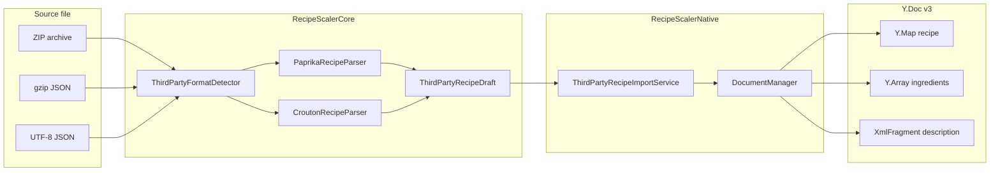
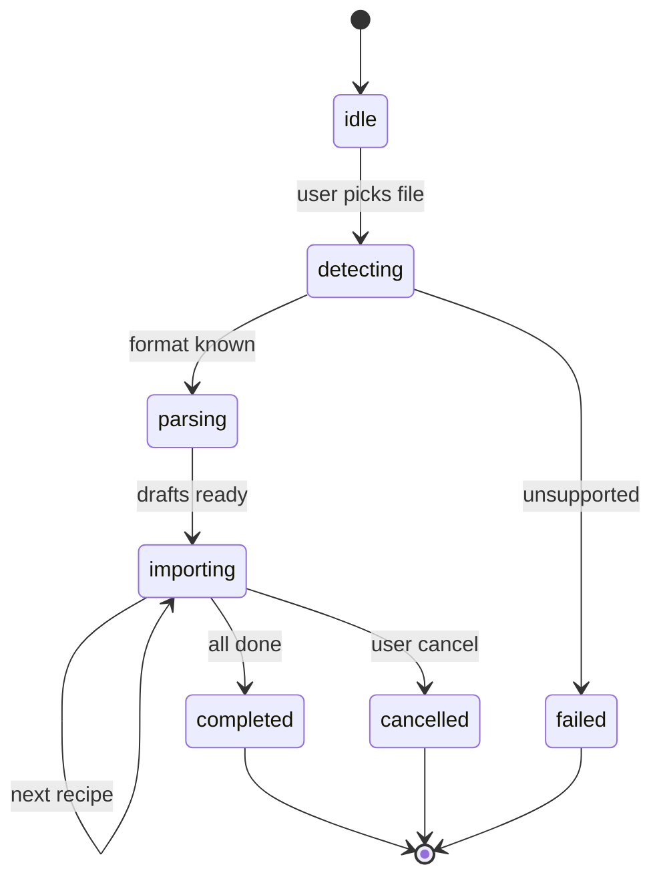

# Модель данных: импорт Paprika / Crouton

**Feature**: `027-paprika-crouton-import`  
**Дата**: 2026-06-15

## Обзор

Импорт проходит три слоя: **файл источника** → **draft (normalized)** → **Y.Doc v3**. Draft — эфемерный; персистится только RS CRDT.



## Сущности парсинга (RecipeScalerCore)

### `ThirdPartyFormat`

```swift
enum ThirdPartyFormat: String, Sendable {
    case paprikaArchive   // .paprikarecipes
    case paprikaSingle    // .paprikarecipe
    case croutonArchive   // zip of .crumb
    case croutonSingle    // .crumb
    case unsupported
}
```

### `IngredientDraft`

| Поле | Тип | Правила |
|------|-----|---------|
| `name` | String | Non-empty после trim; иначе skip row |
| `amount` | String | Числовое количество; может быть `""` |
| `unit` | String | Единица измерения; может быть `""` |
| `order` | Int | 1-based |

### `DescriptionBlock`

| Case | Поля | XmlFragment target |
|------|------|-------------------|
| `paragraph(String)` | text | `paragraph` → text |
| `heading(Int, String)` | level 3 only v1, text | `heading` attrs level |
| `orderedListItem(String)` | text | `orderedList` → `listItem` → `paragraph` |

Writer группирует consecutive `orderedListItem` в один `orderedList`.

### `ThirdPartyRecipeDraft`

| Поле | Тип | Обязательность |
|------|-----|----------------|
| `name` | String | да (fallback i18n key) |
| `servings` | Int | да, ≥1 |
| `ingredients` | [IngredientDraft] | может быть пустым |
| `descriptionBlocks` | [DescriptionBlock] | может быть пустым |
| `originalRecipe` | String? | |
| `originalRecipeLink` | String? | |
| `imageData` | Data? | decoded bytes, ≤25 MB |
| `categoryLabels` | [String] | P3 only, ignored in MVP write |
| `sourceFileName` | String | для error report |
| `sourceFormat` | ThirdPartyFormat | audit |

### `ThirdPartyImportResult`

| Поле | Тип |
|------|-----|
| `importedRecipeIds` | [String] |
| `failed` | [ThirdPartyImportFailure] |
| `photosSkippedOffline` | Int |
| `photosFailed` | Int |

### `ThirdPartyImportFailure`

| Поле | Тип |
|------|-----|
| `fileName` | String |
| `reason` | ThirdPartyImportError |

### `ThirdPartyImportError`

```swift
enum ThirdPartyImportError: Error {
    case unsupportedFormat
    case emptyArchive
    case recipeLimitExceeded(limit: Int)
    case corruptEntry(fileName: String)
    case invalidJSON(fileName: String)
    case gzipFailed(fileName: String)
}
```

## Paprika JSON (source)

См. [contracts/third-party-recipe-formats.md](./contracts/third-party-recipe-formats.md) §1.

Минимально валидный рецепт: ключ `name` присутствует (Mealie фильтрует `"name" in r`).

## Crouton JSON (source)

См. contract §2. Детекция: `uuid: String` AND `ingredients: Array`.

## Маппинг draft → Y.Doc v3

### `Y.Map('recipe')`

| Y key | Источник draft | Тип |
|-------|----------------|-----|
| `id` | new UUID (lowercase) | string |
| `name` | `draft.name` | string |
| `version` | `"v3"` | string |
| `servings` | `draft.servings` | double |
| `color` | default new recipe color | string |
| `createdAt` / `updatedAt` | import timestamp ISO8601 | string |
| `isPublic` | `false` | bool |
| `hasSteps` | `!descriptionBlocks.isEmpty` | bool |
| `originalRecipe` | optional | string |
| `originalRecipeLink` | optional | string |
| `ingredients` | Y.Array | see below |

### Ingredient Y.Map (v3)

| Key | Value |
|-----|-------|
| `id` | UUID (lowercase) |
| `name` | draft.name |
| `amount` | draft.amount (numeric) |
| `originalAmount` | same as amount |
| `unit` | draft.unit |
| `order` | draft.order |

Reuse `DocumentManager.writeIngredient` / `appendIngredient` patterns.

### `Y.XmlFragment('description')`

Built by `DescriptionXmlFragmentWriter` in single write transaction per recipe.

**State transition** (import job):



## Валидация

| Rule | Where |
|------|-------|
| Max 500 recipes per archive | Before import loop |
| Max image 25 MB | After base64 decode |
| Servings clamp ≥1 | Parser |
| Skip `__MACOSX/*`, hidden files | Archive enumerator |
| Mixed `.paprikarecipe` + `.crumb` in one ZIP | Error `unsupportedFormat` |

## Связь с существующими моделями

- `IngredientData` — target type for `DocumentManager.addIngredient` (convert from `IngredientDraft`).
- `ImportRecipesResult` (010 UI) — wrap `ThirdPartyImportResult.recipeIds` for navigation callback.
- `RecipeData` — read path unchanged; import creates new docs.

## P3 extension (026)

When folders available:

- `categoryLabels` → resolve or create folder by name → append to recipe collection entry `folderIds` via `DocumentManager.setRecipeFolderIds` (026 API).

No schema change to third-party formats.
