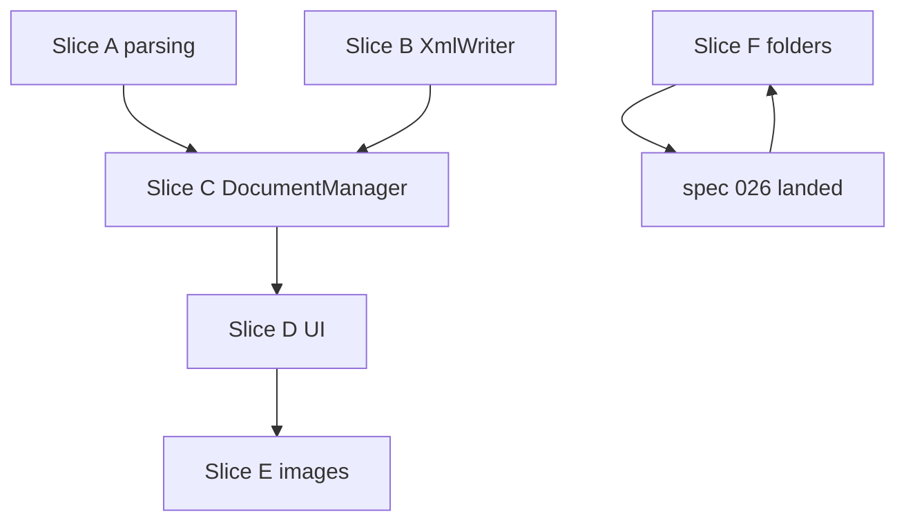

# План реализации: импорт Paprika / Crouton

**Ветка**: `027-paprika-crouton-import` | **Дата**: 2026-06-15 | **Спека**: [spec.md](./spec.md)

**Вход**: спецификация `/specs/027-paprika-crouton-import/spec.md`

## Кратко

Детерминированный **локальный** импорт архивов Paprika (`.paprikarecipes` / `.paprikarecipe`) и Crouton (ZIP / `.crumb`) в **v3 Y.Doc** без LLM и без изменений бэкенда. Парсеры и draft-модель — **`RecipeScalerCore`**; оркестрация записи и UI — **`RecipeScalerNative`**. Описание пишется в `Y.XmlFragment('description')` через новый **`DescriptionXmlFragmentWriter`** (yrs FFI, Prosemirror nodes). Фото — **`RecipeImageUploadAPI`** (016) при online.

## Технический контекст

**Язык / версия**: Swift 5.9+, iOS 17.0+, Xcode 16.0+

**Основные зависимости**:
- Существующие: `YrsC`, `DocumentManager`, `RecipeImageUploadAPI`, `ImportRecipeSheet`
- **Новая**: [ZIPFoundation](https://github.com/weichsel/ZIPFoundation) (SPM) — чтение ZIP archives
- **gzip**: `Compression` / `libcompression` helper (без SPM)

**Хранение**: Y.Doc v3 через yrs; SQLite snapshots + offline queue (без новых таблиц)

**Тестирование**: XCTest — парсеры, detector, ingredient split, XmlFragment writer; integration — `applyImportedRecipe` + `RecipeReader`

**Платформа**: iOS 17+ (Import tab, fileImporter)

**Тип проекта**: mobile-app (native iOS), shared core для будущего Share Extension (025)

**Цели по производительности**: ≤2 мин на 50 рецептов (SC-001); UI progress каждый рецепт; не блокировать main thread на decode base64 >25 MB — skip

**Ограничения**:
- Max 500 recipes / import
- No backend / Socket.IO changes
- No LLM
- Web import UI — follow-up (FR-027-008)
- Categories → folders — P3 после 026

**Масштаб**: до 500 recipes × ~50 ingredients × 1 image; один active import job

## Проверка конституции

*GATE: Phase 0 ✅ | Post-design Phase 1 ✅*

| Gate | Статус | Примечания |
|------|--------|------------|
| CRDT-first | ✅ PASS | Все поля рецепта через yrs; REST только image bytes |
| Web parity | ⚠️ JUSTIFIED | Y.Doc schema идентична веб v3; **UI import на вебе** — отложен (см. Complexity Tracking) |
| Offline-first | ✅ PASS | Text import offline; images skip + queue sync |
| Native UI | ✅ PASS | SwiftUI `ImportRecipeSheet`; без WKWebView для batch |
| Phased delivery | ✅ PASS | P1 Paprika+Crouton core; P2 photos; P3 folders |
| i18n | ✅ PASS | Новые ключи `import.third-party-*`, `import.tab-file` |
| Docs | ✅ PASS | Spec artifacts + `quickstart.md`; ARCHITECTURE — при merge implement |

## Complexity Tracking

| Violation | Why Needed | Simpler Alternative Rejected Because |
|-----------|------------|-------------------------------------|
| Web UI parity deferred (II) | Offline-first + no backend; native — primary migration path from Paprika/Crouton iOS apps | Block feature until web TS port — задержка ценности для iOS users |
| ZIPFoundation SPM | Foundation не enumerates ZIP entries | Manual unzip — support burden |
| New DocumentManager API | Batch import needs atomic recipe create + ingredients + description | N× separate public APIs — slow sync, partial failure states |

## Структура проекта

### Документация (фича)

```text
specs/027-paprika-crouton-import/
├── plan.md              # этот файл
├── research.md          # Phase 0
├── data-model.md        # Phase 1
├── quickstart.md
├── contracts/
│   ├── third-party-recipe-formats.md
│   └── third-party-import-service.md
└── tasks.md             # /speckit-tasks (следующий шаг)
```

### Исходники (целевая структура)

```text
RecipeScalerCore/
└── Import/
    └── ThirdParty/
        ├── ThirdPartyFormat.swift
        ├── ThirdPartyRecipeDraft.swift
        ├── ThirdPartyFormatDetector.swift
        ├── PaprikaRecipeParser.swift
        ├── PaprikaIngredientSplitter.swift
        ├── CroutonRecipeParser.swift
        ├── Gunzip.swift
        └── DescriptionXmlFragmentWriter.swift

RecipeScalerNative/
├── Services/
│   └── ThirdPartyRecipeImportService.swift
└── Views/
    └── ImportRecipeSheet.swift          # + ImportMode.file

RecipeScalerNativeTests/
├── PaprikaRecipeParserTests.swift
├── CroutonRecipeParserTests.swift
├── ThirdPartyFormatDetectorTests.swift
├── DescriptionXmlFragmentWriterTests.swift
└── Fixtures/ThirdPartyImport/
```

**Structure Decision**: Парсинг в **RecipeScalerCore** для reuse в Share Extension (025); yrs writer в Core (no UIKit); service на MainActor в Native.

## Phase 0 — Research ✅

- [x] R1 client-side parse
- [x] R2 ZIPFoundation + gzip helper
- [x] R3 DescriptionXmlFragmentWriter via yrs FFI
- [x] R4 ThirdPartyRecipeDraft
- [x] R5 ImportService orchestration
- [x] R6 Mealie paprika.py reference
- [x] R7 UTType / fileImporter
- [x] R8 Image upload 016
- [x] R9 P3 folders deferred
- [x] R10 Web follow-up

→ [research.md](./research.md)

## Phase 1 — Design ✅

- [x] [data-model.md](./data-model.md)
- [x] [contracts/third-party-recipe-formats.md](./contracts/third-party-recipe-formats.md)
- [x] [contracts/third-party-import-service.md](./contracts/third-party-import-service.md)
- [x] [quickstart.md](./quickstart.md)

## Phase 2 — Implementation slices (для tasks.md)

### Slice A — Core parsing (P1, no UI)

1. Add ZIPFoundation to Xcode project / SPM
2. `Gunzip`, `ThirdPartyFormatDetector`
3. `PaprikaRecipeParser` + `PaprikaIngredientSplitter` + unit tests + fixtures
4. `CroutonRecipeParser` + unit tests + fixtures

**Independent test**: XCTest parsers only; no Y.Doc.

### Slice B — Description writer (P1)

1. `DescriptionXmlFragmentWriter` — paragraph, heading, orderedList/listItem
2. Test: write → `XmlFragmentToHTML.html` contains step text
3. Reuse patterns from `YrsDescriptionRoundtripTests`

**Independent test**: XCTest roundtrip read HTML.

### Slice C — DocumentManager apply (P1)

1. `DocumentManager.applyImportedRecipe(_:)`
2. Wire metadata: `originalRecipe*`, `hasSteps`, servings
3. Integration test: apply → read via `RecipeReader`

### Slice D — Import service + UI (P1)

1. `ThirdPartyRecipeImportService` with progress + cancel
2. `ImportRecipeSheet`: `ImportMode.file`, fileImporter, progress UI
3. Navigation parity with 010 (`ImportRecipesResult`)
4. i18n keys ru/en

**Independent test**: Manual quickstart + one UI test hook (`AccessibilityIdentifiers`).

### Slice E — Images (P2)

1. Decode base64 in parsers → `imageData`
2. After createRecipe: `RecipeImageUploadAPI.upload` when online
3. Summary counts for skipped/failed photos

### Slice F — Categories → folders (P3, blocked on 026)

1. If `RecipeFolderService` available: map `categoryLabels` → folderIds
2. Extend importer only; parsers already capture labels

### Slice G — Web port (follow-up, out of native tasks)

1. TS port in `recipe-scaler-web/src/services/importers/third-party/`
2. Hook in `import-recipe-sheet.tsx`

## Phase 3 — Verification

- [ ] `scripts/verify-third-party-import.sh`
- [ ] Build iOS after Swift changes ([docs/AGENT-WORKFLOW.md](../../docs/AGENT-WORKFLOW.md))
- [ ] Manual: Paprika archive ≥3 recipes (quickstart)
- [ ] Manual: Crouton ZIP with sections
- [ ] Offline batch without photos
- [ ] SC-005 unsupported file error

## Риски

| Риск | Mitigation |
|------|------------|
| Crouton schema drift | Tolerant decoder; unknown keys ignored; community fixtures |
| Large base64 in JSON memory | Stream skip if >25 MB; import without photo |
| XmlFragment incompatible with web Tiptap | Follow YrsDescriptionRoundtripTests; Node roundtrip script optional |
| ZIPFoundation SPM setup | Document in SETUP if manual Xcode step |

## Зависимости между slices



## Следующий шаг

`/speckit-tasks` — разбить Slice A–E на tasks.md с приоритетами P1/P2.
