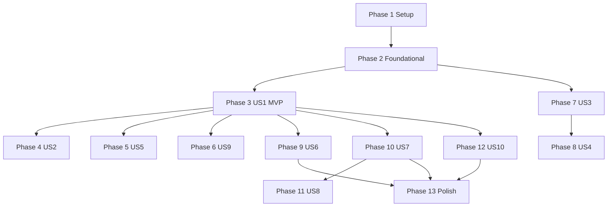

# Задачи: 027 импорт Paprika / Crouton

**Вход**: `/specs/027-paprika-crouton-import/`

**Prerequisites**: [plan.md](./plan.md), [spec.md](./spec.md), [research.md](./research.md), [data-model.md](./data-model.md), [contracts/](./contracts/)

**Тесты**: XCTest для парсеров, detector, XmlWriter и integration — включены (см. plan Phase 3). Сборка обязательна после каждой фазы ([docs/AGENT-WORKFLOW.md](../../docs/AGENT-WORKFLOW.md)).

**Organization**: задачи сгруппированы по user stories из spec.md; foundational блокирует все stories.

## Формат: `[ID] [P?] [Story] Описание`

---

## Фаза 1: Setup (Shared Infrastructure)

**Purpose**: SPM, структура каталогов, i18n skeleton, Xcode target

- [X] T001 Добавить ZIPFoundation (SPM) и линковку в `RecipeScalerCore` через `RecipeScalerNative.xcodeproj/project.pbxproj`
- [X] T002 [P] Создать каталог `RecipeScalerCore/Import/ThirdParty/` и добавить Swift-файлы в `project.pbxproj`
- [X] T003 [P] Создать `RecipeScalerNativeTests/Fixtures/ThirdPartyImport/` и sidecar `expected/` (см. [quickstart.md](./quickstart.md))
- [X] T004 [P] Добавить skeleton ключей i18n `import.tab-file`, `import.file-hint`, `import.file-pick`, `import.third-party-*` в `RecipeScalerNative/Resources/Localizable.xcstrings` (ru/en)
- [X] T005 [P] Зарегистрировать test-файлы парсеров в `RecipeScalerNative.xcodeproj/project.pbxproj`

**Контрольная точка**: проект собирается с пустыми/заглушками ThirdParty types

---

## Фаза 2: Foundational (Blocking Prerequisites)

**Purpose**: draft-модель, парсеры, XmlFragment writer, Y.Doc apply — **блокирует все user stories**

**⚠️ CRITICAL**: US1–US10 не начинать до завершения этой фазы

- [X] T006 Реализовать `ThirdPartyFormat.swift`, `ThirdPartyRecipeDraft.swift`, `ThirdPartyImportError` в `RecipeScalerCore/Import/ThirdParty/ThirdPartyRecipeDraft.swift`
- [X] T007 Реализовать `Gunzip.swift` (gzip decompress для `.paprikarecipe`) в `RecipeScalerCore/Import/ThirdParty/Gunzip.swift`
- [X] T008 Реализовать `ThirdPartyFormatDetector.swift` — detect + enumerate entries (ZIP/single) в `RecipeScalerCore/Import/ThirdParty/ThirdPartyFormatDetector.swift`
- [X] T009 Реализовать `PaprikaIngredientSplitter.swift` (best-effort split, FR-IMP-004) в `RecipeScalerCore/Import/ThirdParty/PaprikaIngredientSplitter.swift`
- [X] T010 Реализовать `PaprikaRecipeParser.swift` по [contracts/third-party-recipe-formats.md](./contracts/third-party-recipe-formats.md) §1 в `RecipeScalerCore/Import/ThirdParty/PaprikaRecipeParser.swift`
- [X] T011 Реализовать `CroutonRecipeParser.swift` по contract §2 в `RecipeScalerCore/Import/ThirdParty/CroutonRecipeParser.swift`
- [X] T012 Реализовать `DescriptionXmlFragmentWriter.swift` (paragraph, heading, orderedList/listItem via yrs FFI) в `RecipeScalerCore/Import/ThirdParty/DescriptionXmlFragmentWriter.swift`
- [X] T013 [P] Добавить synthetic fixture `RecipeScalerNativeTests/Fixtures/ThirdPartyImport/paprika-minimal.paprikarecipe` + `expected/paprika-minimal.json`
- [X] T014 [P] Добавить synthetic fixture `RecipeScalerNativeTests/Fixtures/ThirdPartyImport/paprika-three.paprikarecipes` (ZIP, 3 recipes)
- [X] T015 [P] Добавить synthetic fixtures `crouton-minimal.crumb` и `crouton-batch.zip` в `RecipeScalerNativeTests/Fixtures/ThirdPartyImport/`
- [X] T016 [P] `RecipeScalerNativeTests/PaprikaRecipeParserTests.swift` — name, ingredient count, description blocks
- [X] T017 [P] `RecipeScalerNativeTests/CroutonRecipeParserTests.swift` — serves, ingredients, `isSection` → heading block
- [X] T018 [P] `RecipeScalerNativeTests/ThirdPartyFormatDetectorTests.swift` — paprika/crouton/unsupported/mixed ZIP
- [X] T019 [P] `RecipeScalerNativeTests/DescriptionXmlFragmentWriterTests.swift` — write → `XmlFragmentToHTML` contains step text
- [X] T020 Реализовать `DocumentManager.applyImportedRecipe(_:)` в `RecipeScalerNative/Services/YjsSync/DocumentManager.swift` (create + ingredients + description + metadata)
- [X] T021 `RecipeScalerNativeTests/ThirdPartyImportIntegrationTests.swift` — applyImportedRecipe → `RecipeReader` name + ingredient count (XCTSkip: test host auto-login stalls)
- [X] T022 `rtk xcodebuild` build + `-only-testing:RecipeScalerNativeTests/PaprikaRecipeParserTests` … XmlFragment tests PASS

**Контрольная точка**: парсеры и applyImportedRecipe работают без UI

---

## Фаза 3: US1 — Импорт архива Paprika (P1) 🎯 MVP

**Goal**: `.paprikarecipes` → N v3 рецептов, summary «N из M», partial failure

**Independent Test**: quickstart — архив ≥3 рецептов, все названия в списке; один битый entry → остальные OK

### Implementation

- [X] T023 [US1] Реализовать `ThirdPartyRecipeImportService.swift` (batch loop, 500 limit, failed[]) в `RecipeScalerNative/Services/ThirdPartyRecipeImportService.swift`
- [X] T024 [US1] Добавить `ImportMode.file` и секцию file picker в `RecipeScalerNative/Views/ImportRecipeSheet.swift` (отдельно от text/photo submit, FR-027-001)
- [X] T025 [US1] Подключить `fileImporter` UTType (`paprikarecipes`, `zip`) + security-scoped URL в `ImportRecipeSheet.swift`
- [X] T026 [US1] Submit file mode → `ThirdPartyRecipeImportService.importFile` для `.paprikarecipes` в `ImportRecipeSheet.swift`
- [X] T027 [US1] Partial failure: продолжать batch, накапливать `failed[]` в `ThirdPartyRecipeImportService.swift`
- [X] T028 [US1] Summary alert/toast «import.third-party-summary» после batch в `ImportRecipeSheet.swift`
- [X] T029 [US1] Navigation: 1 recipeId → dismiss + `onImport` detail; 2+ → list (parity 010) в `ImportRecipeSheet.swift`
- [X] T030 [US1] `rtk xcodebuild` build PASS после US1 wiring

**Контрольная точка**: US1 acceptance scenarios 1–3 из spec.md

---

## Фаза 4: US2 — Один `.paprikarecipe` (P1)

**Goal**: gzip JSON без ZIP → один рецепт → detail

**Independent Test**: fixture single `.paprikarecipe` → один id, auto-navigate detail

- [X] T031 [US2] Single-file path `paprikaSingle` в `ThirdPartyFormatDetector.swift` (gzip magic / extension)
- [X] T032 [US2] Enumerator возвращает один entry для `.paprikarecipe` в `ThirdPartyFormatDetector.swift`
- [X] T033 [P] [US2] Test single `.paprikarecipe` в `ThirdPartyFormatDetectorTests.swift`
- [ ] T034 [US2] Подтвердить navigation to detail для single import (ручной quickstart § «Один рецепт»)

**Контрольная точка**: US2 independent test PASS

---

## Фаза 5: US5 — Прогресс batch (P1)

**Goal**: progress N/M, cancel без отката уже импортированных

**Independent Test**: архив >5 рецептов → progress visible; cancel mid-batch → partial count

- [X] T035 [US5] Progress callback UI «import.third-party-progress» (%1$d / %2$d) в `ImportRecipeSheet.swift`
- [X] T036 [US5] Cancel button → `Task.cancel()` между рецептами в `ThirdPartyRecipeImportService.swift`
- [X] T037 [US5] Disabled submit + progress overlay while processing в `ImportRecipeSheet.swift`
- [ ] T038 [US5] Ручная проверка cancel на fixture `paprika-three.paprikarecipes` (quickstart)

**Контрольная точка**: US5 acceptance — cancel leaves imported recipes

---

## Фаза 6: US9 — Ошибки / неподдерживаемый файл (P1)

**Goal**: `.txt`, RS v1.3 zip → localized error; no collection mutation

**Independent Test**: выбрать `.txt` → error ≤3s, список рецептов без изменений

- [X] T039 [US9] `ThirdPartyImportError.unsupportedFormat` до мутаций collection в `ThirdPartyRecipeImportService.swift`
- [X] T040 [US9] Empty archive / mixed paprika+crumb ZIP → localized errors в `ThirdPartyFormatDetector.swift` + UI
- [X] T041 [US9] i18n `import.third-party-unsupported`, `import.third-party-limit`, `import.third-party-empty` в `Localizable.xcstrings`
- [X] T042 [P] [US9] Tests unsupported + empty + limit 501 в `ThirdPartyFormatDetectorTests.swift` / service tests
- [X] T043 [US9] Убедиться: file mode не вызывает `RecipeImportAPI.importText` в `ImportRecipeSheet.swift`

**Контрольная точка**: SC-005 из spec.md

---

## Фаза 7: US3 — Архив Crouton (P1)

**Goal**: ZIP `.crumb` → v3; structured ingredients; section headers

**Independent Test**: crouton-batch.zip → servings + 3 ingredients; `isSection` → h3 not li

- [X] T044 [US3] Crouton ZIP enumeration (all `*.crumb`) в `ThirdPartyFormatDetector.swift`
- [X] T045 [US3] `isSection: true` → `DescriptionBlock.heading` + list break в `CroutonRecipeParser.swift` и `DescriptionXmlFragmentWriter.swift`
- [X] T046 [US3] Wire Crouton batch через `ThirdPartyRecipeImportService.swift`
- [X] T047 [P] [US3] Fixture с section step + assert heading в `CroutonRecipeParserTests.swift`
- [ ] T048 [US3] Ручной quickstart Crouton ZIP (§ «Проверки на detail»)

**Контрольная точка**: US3 acceptance 1–2 из spec.md

---

## Фаза 8: US4 — Один `.crumb` (P2)

**Goal**: single JSON file import

**Independent Test**: `crouton-minimal.crumb` → one recipe → detail

- [X] T049 [US4] Single `.crumb` detection в `ThirdPartyFormatDetector.swift`
- [X] T050 [P] [US4] Test single crumb path в `ThirdPartyFormatDetectorTests.swift`
- [ ] T051 [US4] End-to-end single crumb import (quickstart)

**Контрольная точка**: US4 independent test PASS

---

## Фаза 9: US6 — Фото рецепта (P2)

**Goal**: photo_data / images[0] → RecipeImageUploadAPI; offline skip

**Independent Test**: online + photo fixture → image on detail; offline → recipe without photo + summary note

- [X] T052 [US6] Decode `photo_data` base64 + `\/` unescape в `PaprikaRecipeParser.swift`
- [X] T053 [US6] Decode `images[0]` base64 в `CroutonRecipeParser.swift`
- [X] T054 [US6] Skip decode if payload >25 MB в parsers
- [X] T055 [US6] After applyImportedRecipe: `RecipeImageUploadAPI.upload` when online в `ThirdPartyRecipeImportService.swift`
- [X] T056 [US6] Offline: increment `photosSkippedOffline`, i18n note в summary в `ThirdPartyRecipeImportService.swift` + `Localizable.xcstrings`
- [X] T057 [US6] Photo upload failure: recipe kept, `photosFailed` count в `ThirdPartyImportResult`
- [X] T058 [US6] Fixture с tiny base64 JPEG (1×1) в `RecipeScalerNativeTests/Fixtures/ThirdPartyImport/`

**Контрольная точка**: US6 acceptance online + offline

---

## Фаза 10: US7 — Метаданные источника (P2)

**Goal**: source/source_url → Y.Map; times → description prefix

**Independent Test**: Paprika export with source_url → `originalRecipeLink` on detail

- [X] T059 [US7] Map `source`, `source_url` → draft + `applyImportedRecipe` в `PaprikaRecipeParser.swift` / `DocumentManager.swift`
- [X] T060 [US7] Map `prep_time`, `cook_time`, `notes` → `DescriptionBlock.paragraph` prefix в `PaprikaRecipeParser.swift`
- [X] T061 [US7] Map `duration`, `cookingDuration`, `rawDifficulty` prefix в `CroutonRecipeParser.swift`
- [X] T062 [US7] Capture `categories`/`tags` into `categoryLabels` on draft (no folder write yet) в parsers
- [X] T063 [P] [US7] Parser tests for metadata fields в `PaprikaRecipeParserTests.swift` и `CroutonRecipeParserTests.swift`

**Контрольная точка**: US7 acceptance scenarios

---

## Фаза 11: US8 — Категории → коллекции (P3)

**Goal**: tags/categories → folderIds when spec 026 available

**Independent Test**: Paprika categories → folders visible in collections mode (requires 026)

**⚠️ Blocked until spec 026 recipe-collections landed**

- [X] T064 [US8] Feature gate `#if`/runtime check folder APIs in `ThirdPartyRecipeImportService.swift` (не требуется — 026 уже слит)
- [X] T065 [US8] Resolve-or-create folder by label + `setRecipeFolderIds` in `DocumentManager.swift`
- [X] T066 [US8] Integration test with mock folders or skip until 026 (`ThirdPartyImportIntegrationTests.swift`)

**Контрольная точка**: US8 — defer if 026 not merged

---

## Фаза 12: US10 — Синхронизация (P1)

**Goal**: offline import → local list; online → web parity after sync

**Independent Test**: quickstart § Offline + online web check

- [X] T067 [US10] Verify `deliverPendingLocalUpdate` called per recipe in `DocumentManager.applyImportedRecipe`
- [ ] T068 [US10] Manual: offline batch (no photos) → recipes in list (`quickstart.md`)
- [ ] T069 [US10] Manual: reconnect → recipes on web without duplicates (`quickstart.md`)

**Контрольная точка**: SC-004 from spec.md

---

## Фаза 13: Polish & Cross-Cutting

**Purpose**: verify script, a11y, docs, full test run

- [X] T070 [P] `scripts/verify-third-party-import.sh` — build + run ThirdParty* XCTest suite
- [X] T071 [P] `AccessibilityIdentifiers` для file import mode в `RecipeScalerNative/Utils/AccessibilityIdentifiers.swift` + `ImportRecipeSheet.swift`
- [X] T072 Обновить [quickstart.md](./quickstart.md) с verify script и fixture instructions
- [X] T073 [P] Export `ThirdPartyRecipeImportService` entry for future Share Extension (025) — public facade in `RecipeScalerCore` if needed (parsers/types already public, no new facade needed for 027 scope)
- [X] T074 `rtk xcodebuild` full build + ThirdParty test suite green
- [X] T075 Отметить статус spec/plan «В работе» / audit table в `specs/027-paprika-crouton-import/spec.md` после merge

---

## Dependencies & Execution Order

### Phase Dependencies



### User Story Dependencies

| Story | Priority | Depends on | Independent test |
|-------|----------|------------|------------------|
| US1 | P1 | Foundational | Paprika archive ≥3 recipes |
| US2 | P1 | US1 service | Single `.paprikarecipe` |
| US5 | P1 | US1 | Progress + cancel on batch |
| US9 | P1 | Foundational detector | `.txt` → error |
| US3 | P1 | Foundational | Crouton ZIP |
| US4 | P2 | US3 | Single `.crumb` |
| US6 | P2 | US1/US3 parsers | Photo online/offline |
| US7 | P2 | Foundational parsers | source_url on detail |
| US8 | P3 | 026 + US7 labels | Categories → folders |
| US10 | P1 | US1 | Offline + web sync |

### Parallel Opportunities

**Phase 2** (after T006–T012 sequential):

```bash
# Fixtures in parallel:
T013, T014, T015

# Tests in parallel (after parsers):
T016, T017, T018, T019
```

**Phase 3+**: US2, US5, US9 can proceed in parallel after US1 core (T023–T026).

**Phase 9–10**: US6 and US7 parallelizable (different parser files).

---

## Parallel Example: Foundational

```bash
# After T010–T012 complete, launch together:
T013  # paprika-minimal fixture
T014  # paprika-three.zip fixture
T015  # crouton fixtures
T016  # PaprikaRecipeParserTests
T017  # CroutonRecipeParserTests
T018  # ThirdPartyFormatDetectorTests
T019  # DescriptionXmlFragmentWriterTests
```

---

## Implementation Strategy

### MVP First (US1 + US5 + US9)

1. Complete Phase 1: Setup
2. Complete Phase 2: Foundational (**critical**)
3. Complete Phase 3: US1 Paprika archive
4. Complete Phase 5: US5 progress
5. Complete Phase 6: US9 errors
6. **STOP and VALIDATE** — quickstart Paprika archive, SC-001/SC-005

### Incremental Delivery

| Increment | Phases | Value |
|-----------|--------|-------|
| MVP | 1–3, 5–6 | Paprika migration |
| +Crouton | 7–8 | Crouton users |
| +Photos/metadata | 9–10 | Parity with exports |
| +Folders | 11 | Collections (needs 026) |
| +Sync proof | 12–13 | Production confidence |

### Suggested MVP Scope

**Phases 1–3 + 5–6** (T001–T043): Paprika archive/single, progress, errors — ~43 tasks.

---

## Notes

- Все UI строки только через `Localizable.xcstrings` ([docs/I18N.md](../../docs/I18N.md))
- Не отправлять JSON экспорта на сервер (FR-027-007)
- Web import UI (Slice G) — **out of scope** для этого tasks.md
- `[P]` = разные файлы, нет зависимости от незавершённых задач в той же группе
- Commit после каждой фазы или логической группы

**Total tasks**: 75  
**MVP tasks**: ~43 (T001–T043)  
**Per story**: US1 8 | US2 4 | US5 4 | US9 5 | US3 5 | US4 3 | US6 7 | US7 5 | US8 3 | US10 3 | Setup 5 | Foundational 17 | Polish 6
