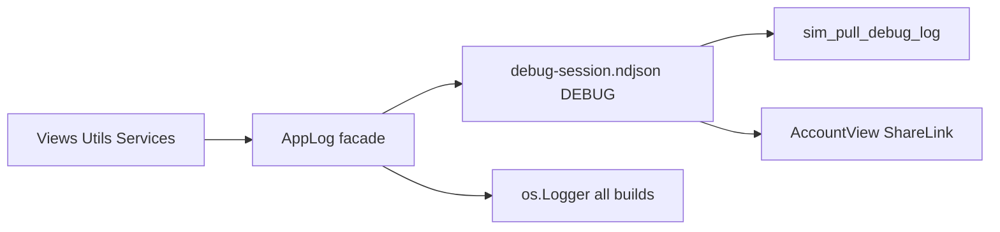

# План: единый журнал приложения (AppLog)

**Ветка**: `028-app-logging`  
**Спека**: [spec.md](spec.md)

## Архитектура

## Этапы

1. `AppLog.swift` — фасад, NDJSON-writer, ротация, OSLog bridge.
2. Рефакторинг `AgentSyncDebugLog` / `AgentDebugLogging`.
3. `AccountView` — `logExportSection` + i18n.
4. Миграция Services (`Logger` / `print` → `AppLog`).
5. `scripts/pull-app-logs.sh`, правки `sim-verify-lib.sh`.
6. Документация: `docs/AGENT-WORKFLOW.md`, `llm/how-to-debug.md`.
7. Тесты + сборка.

## Ключевые файлы

| Файл | Действие |
|------|----------|
| `RecipeScalerNative/Utils/AppLog.swift` | Создать |
| `RecipeScalerNative/Utils/AgentSyncDebugLog.swift` | Делегировать в AppLog |
| `RecipeScalerNative/Views/AccountView.swift` | logExportSection |
| `scripts/pull-app-logs.sh` | Создать |
| `RecipeScalerNativeTests/AppLogTests.swift` | Создать |
