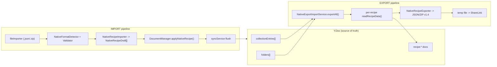

# План: Экспорт и импорт данных аккаунта (локально)

**Spec**: [spec.md](spec.md)
**Дата**: 2026-06-16

## Архитектура

## Задачи

### 1. RecipeScalerCore/Export/Native/ — типы, версия, детектор, валидатор

**Файлы**:
- `RecipeScalerCore/Export/Native/NativeFormatVersion.swift` — enum `NativeFormatVersion { v1_0, v1_1, v1_2, v1_3, v1_4 }` + `normalizeVersion(_:)`. Порт `export-validator.ts` из веба. Отсутствует `metadata.version` → `.v1_0`; `metadata.type == "recipes-simple"` → `.v1_0`.
- `RecipeScalerCore/Export/Native/NativeFormatTypes.swift` — `NativeRecipeDraft`, `NativeIngredientDraft`, `NativeFolderDraft`, `NativeExportPayload`, `NativeImportResult`, `NativeImportError`. Codable.
- `RecipeScalerCore/Export/Native/NativeFormatDetector.swift` — `detect(url:) -> NativeFormatVersion`. Читает JSON/ZIP, извлекает `metadata.version`.
- `RecipeScalerCore/Export/Native/NativeFormatValidator.swift` — `validate(data:version:) -> [String]`. Per-version structural checks (metadata required fields, recipe required fields, etc.).

### 2. NativeRecipeExporter

**Файл**: `RecipeScalerCore/Export/Native/NativeRecipeExporter.swift`

- Вход: `[RecipeData]`, `[CollectionEntry]`, `[RecipeFolder]`, `imageData: [String: (full: Data, preview: Data)?]`
- Выход: `(data: Data, hasImages: Bool, filename: String)`
- JSON path: `JSONEncoder` → `Data`
- ZIP path: `ZIPFoundation Archive(url:accessMode:.create)` + `addEntry(with:fileName:data:compressionMethod:.deflate)` → `recipes.json` + `images/...`
- Формат: всегда v1.4

### 3. NativeRecipeImporter

**Файл**: `RecipeScalerCore/Export/Native/NativeRecipeImporter.swift`

- Вход: `URL` (JSON или ZIP)
- Выход: `(drafts: [NativeRecipeDraft], folders: [NativeFolderDraft], imageEntries: [ImageEntry])`
- JSON: `JSONDecoder` → `NativeExportPayload`
- ZIP: `ZIPFoundation Archive(url:accessMode:.read)` → extract `recipes.json` + enumerate `images/*`
- Decode per version (v1.0–v1.4) с default values для отсутствующих полей

### 4. YjsSync: read + write

**Файлы**: `YjsSyncService.swift`, `DocumentManager.swift`

- `YjsSyncService.readRecipeData(recipeId:) async throws -> RecipeData?` — pass-through
- `DocumentManager.applyNativeRecipe(_ draft: NativeRecipeDraft) async throws -> String` — full Y.Map write
- `YjsSyncService.applyNativeRecipe(_ draft: NativeRecipeDraft) async throws -> String` — pass-through + refresh

### 5. NativeExportImportService

**Файл**: `RecipeScalerNative/Services/NativeExportImportService.swift`

- `@MainActor final class`, inject `YjsSyncService`
- `exportAll(progress:) async throws -> URL`
- `importFile(url:isOnline:progress:) async throws -> NativeImportResult`

### 6. DataManagementView

**Файл**: `RecipeScalerNative/Views/DataManagementView.swift`

- NavigationStack, секции экспорт и импорт
- ProgressView, ShareLink, fileImporter

### 7. AccountView.dataSection — замена заглушки

**Файл**: `RecipeScalerNative/Views/AccountView.swift`

- `dataSection`: NavigationLink → DataManagementView

### 8. ImportRecipeSheet — роутинг native формата

**Файл**: `RecipeScalerNative/Views/ImportRecipeSheet.swift`

- В fileSection: detect native format → route to NativeExportImportService

### 9. i18n

**Файл**: `RecipeScalerNative/Resources/Localizable.xcstrings`

### 10. JSON Schema (reference)

**Директория**: `RecipeScalerCore/Export/Native/schemas/`

### 11. Тесты

**Директория**: `RecipeScalerNativeTests/`

## Зависимости от Xcode project

ZIPFoundation v0.9.20 уже подключён в `RecipeScalerCore.framework`. Write path ZIP добавлен в `NativeRecipeExporter`. Файлы `RecipeScalerCore/Export/Native/*`, `NativeExportImportService.swift`, `DataManagementView.swift` и тесты добавлены в `project.pbxproj`.

## Статус реализации (2026-06-16)

- [x] Core types, detector, validator, exporter, importer
- [x] YjsSync read/write pass-through
- [x] NativeExportImportService + UI (AccountView, DataManagementView, ImportRecipeSheet)
- [x] i18n keys `account.data.*`
- [x] Unit tests (version, validator, exporter/importer round-trip)
- [x] Build verified

## Совместимость

- **Импорт**: v1.0–v1.4 (полная parity с вебом)
- **Экспорт**: всегда v1.4
- **Лимиты**: 500 рецептов, 25 MB/image (ThirdPartyImportLimits)
- **Офлайн**: экспорт OK, импорт рецептов OK, изображения skip
