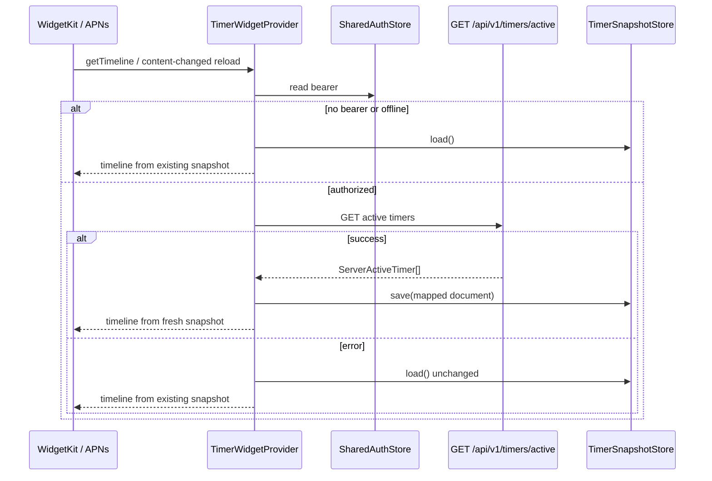

# Контракт данных: TimerWidget (v2)

**Spec**: [030-timer-widget](./spec.md)
**Дата**: 2026-08-04
**Версия документа**: v2 (добавлен network refresh + widget push tokens; snapshot shape v1 без breaking change)

## Обзор

Виджет читает данные из App Group `UserDefaults` через `TimerSnapshotStore`. Источники записи snapshot:

| Источник | Когда |
|----------|--------|
| `TimerManager` persist/mutate | foreground / drain ActionQueue (v1) |
| Live Activity Intent `perform()` | Phase A — same-device pause/resume без wake TimerManager |
| `TimerWidgetProvider` после `GET /api/v1/timers/active` | Phase B — push-triggered / timeline reload |
| Silent push handler (iOS 17) | Phase B4 — sync → save → reload |

Источник правды для cross-device — серверные активные таймеры; локальный SwiftData догоняет через sync после wake.

## Хранилище snapshot (без изменений ключа)

| Параметр | Значение |
|---|---|
| App Group | `group.ru.recipescaler.RecipeScaler` |
| UserDefaults key | `widgets.timerSnapshot` |
| Формат | JSON (Codable) |
| Читается | `HomeWidgetExtension` в `TimerWidgetProvider.getTimeline` |

## Типы snapshot (v1 shape)

### `TimerSnapshot`

```swift
struct TimerSnapshot: Codable, Hashable, Sendable {
    let id: String
    let name: String
    let recipeId: String?
    let recipeName: String?
    /// End date for running timer (`Text(timerInterval:)`). Nil when paused.
    let endDate: Date?
    let pausedRemainingSeconds: Int?
    let phase: TimerSnapshotPhase
    let totalDurationSeconds: TimeInterval
}

enum TimerSnapshotPhase: String, Codable, Hashable, Sendable {
    case running
    case paused
    case exceeded
}
```

### `TimerSnapshotDocument`

```swift
struct TimerSnapshotDocument: Codable, Hashable, Sendable {
    let timers: [TimerSnapshot]
    let generatedAt: Date

    static let empty = TimerSnapshotDocument(timers: [], generatedAt: .distantPast)
}
```

При будущих breaking-изменениях добавить `version: Int`. Пока shape сам себя версифицирует; decode fail → `.empty` **только** если данных нет; network fail **не** должен затирать валидный предыдущий документ (см. US-B3).

## Mapping SwiftData → Snapshot

`TimerSnapshot` из `RecipeTimer` (main app):

| `RecipeTimer` поле | → `TimerSnapshot` поле | Правила |
|---|---|---|
| `id` | `id` | как есть |
| `name` | `name` | как есть |
| `recipeId` | `recipeId` | как есть |
| `recipeDisplayName` | `recipeName` | как есть |
| `endTime` | `endDate` | только если running и не completed |
| `remainingTime` | `pausedRemainingSeconds` | только если paused, как `Int` |
| (computed) | `phase` | `.running` / `.paused` / `.exceeded` |
| `duration` | `totalDurationSeconds` | как есть |

### Фильтрация / сортировка

Только `!hasCompleted` и (`isRunning` ∨ `isPaused`). Топ-4 как `TimerUtils.sortTimers`.

## Mapping `ServerActiveTimer` → Snapshot (v2)

Используется Provider'ом и silent-wake sync. Тип: `RecipeScalerCore/Networking/ServerActiveTimer.swift`. HTTP: [039 contracts/timer-api.md](../039-watchos-timers/contracts/timer-api.md).

| `ServerActiveTimer` | → `TimerSnapshot` | Правила |
|---|---|---|
| `timerId` | `id` | как есть |
| `name` | `name` | как есть |
| `recipeId` | `recipeId` | как есть |
| (нет recipe name в API) | `recipeName` | `nil` или best-effort из локального кэша, если доступен в extension |
| `isPaused == true` | `phase: .paused`, `endDate: nil`, `pausedRemainingSeconds: remainingSeconds()` | remaining через `ServerActiveTimer.remainingSeconds(at:)` |
| `isPaused == false` && end > now | `phase: .running`, `endDate` из `endTime` ms | |
| `isPaused == false` && end ≤ now | `phase: .exceeded`, `endDate` из `endTime` | |
| `duration` | `totalDurationSeconds` | `TimeInterval(duration)` |

Фильтрация: все таймеры из `/active` считаются активными; топ-4 тем же sort. `generatedAt = Date()`.

### Offline / auth failure

1. Не вызывать `clear()`.
2. Не писать `.empty`, если предыдущий load успешен.
3. Timeline строить из `TimerSnapshotStore.load()` as-is.

## Network refresh path (Provider)



Auth: device bearer из `SharedAuthStore` (spec 041). Transitional `x-user-id` — только если проектный `APIClient` в extension-пути ещё поддерживает; предпочтение Bearer.

## Widget push tokens (сервер, v2)

Отдельно от `liveactivity_tokens` (058) и device alert tokens (023).

```sql
CREATE TABLE widget_push_tokens (
  id          UUID        PRIMARY KEY DEFAULT gen_random_uuid(),
  user_id     TEXT        NOT NULL,
  device_id   TEXT        NOT NULL,
  token       TEXT        NOT NULL,
  created_at  TIMESTAMPTZ DEFAULT NOW(),
  updated_at  TIMESTAMPTZ DEFAULT NOW(),
  UNIQUE(user_id, device_id)
);
CREATE INDEX idx_widget_push_tokens_user ON widget_push_tokens(user_id);
```

| Свойство | Значение |
|----------|----------|
| Scope | **device-level** (один token на устройство, не per-timer) |
| Topic | `ru.recipescaler.RecipeScaler.push-type.widgets` |
| Push type | `widgets` |
| Payload | `aps.content-changed = true` (без content-state) |
| Fan-out | timer_started / paused / resumed / updated / deleted |
| Debounce | ~1 с per (user_id) или (user_id, device_id) — последний wins |
| Exclude | source `device_id` |

Полный HTTP/APNs контракт: [contracts/widget-push.md](./contracts/widget-push.md).

## Intent path (Phase A) — запись snapshot

Intent должен смержить/обновить документ так, чтобы затронутый `timerId` получил новый `phase` / `endDate` / `pausedRemainingSeconds`, остальные таймеры в документе сохранились (если Intent видит только один timer из Activity attributes — обновить этот id, не затирать остальные известные из текущего `load()`).

Рекомендуемый алгоритм:

1. `var doc = TimerSnapshotStore.load()`
2. Обновить или вставить snapshot для `timerId`
3. Пересортировать / truncate top-4
4. `save(doc)`; `reloadTimelines`

## `WidgetTimerAccent`

Без изменений v1 — см. прежнюю логику `normal` / `soon` / `exceeded` (паритет с Live Activity accent).

## `remainingSeconds` derivation в виджете

Без изменений v1 (вычисление на лету от `phase` + `endDate` / `pausedRemainingSeconds`).

## Локализация

Ключи v1 без изменений:

| Key | ru | en |
|---|---|---|
| `widgets.timer.empty` | Таймеров нет | No active timers |
| `widgets.timer.name` | Recipe Scaler | Recipe Scaler |
| `widgets.timer.description` | Активные таймеры | Active cooking timers |

v2 UI-строк не добавляет (виджет по-прежнему read-only).

## Совместимость

- Snapshot JSON v1 — backward compatible.
- Network refresh — additive writer.
- Widget push — parallel to 058 LA push; разные таблицы и topics.
