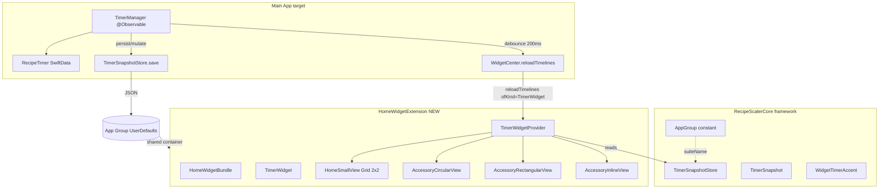

# План: Home Widget — TimerWidget

**Ветка**: `030-timer-widget`
**Дата**: 2026-06-17
**Статус**: In progress
**Спека**: [spec.md](./spec.md)
**Data model**: [data-model.md](./data-model.md)
**Layout (Figma)**: [layout.md](./layout.md) · `bash scripts/audit-ui-layout.sh specs/030-timer-widget`
**Quickstart**: [quickstart.md](./quickstart.md)
**Зависимости**: [014-timers-sync](../014-timers-sync/spec.md) (DONE), [044-timer-live-activity](../044-timer-live-activity/spec.md) (переиспользуем accent logic)

## Кратко

Net-new WidgetKit extension с одним виджетом `TimerWidget`. Все плейсменты: Home Screen `systemSmall` (169×169) + Lock Screen accessory (`accessoryCircular` / `accessoryRectangular` / `accessoryInline`) + StandBy (переиспользует accessory). Данные — из нового `TimerSnapshotStore` в App Group, который main app обновляет при каждой мутации таймера. Живой отсчёт через `Text(timerInterval:)`.

## Архитектура



## Технический контекст

- **Язык**: Swift 5.9+, SwiftUI, WidgetKit
- **Минимум iOS**: 17.0 (deploйте target проекта; accessory families уже с iOS 16, но StandBy — iOS 17+)
- **Хранилище**: App Group `UserDefaults` (group.ru.recipescaler.RecipeScaler), ключ `widgets.timerSnapshot`
- **Тестирование**: симулятор iPhone 16 Pro (для Dynamic Island / Live Activity / StandBy); без платного аккаунта
- **Проект**: native iOS monorepo, схема `RecipeScalerNative`

## Структура файлов (net-new)

```
RecipeScalerCore/
├── AppGroup.swift                          # NEW: константа app group ID
└── Snapshots/
    ├── TimerSnapshotStore.swift            # NEW: App Group read/write
    ├── TimerSnapshot.swift                 # NEW: snapshot типы
    └── WidgetTimerAccent.swift             # NEW: normal/soon/exceeded

HomeWidgetExtension/
├── HomeWidgetBundle.swift                  # @main WidgetBundle { TimerWidget() }
├── HomeWidgetExtension.entitlements        # App Group
├── Info.plist                              # NSExtension (WidgetKit)
├── TimerWidget.swift                       # StaticConfiguration + supportedFamilies
├── TimerWidgetProvider.swift               # AppIntentTimelineProvider (read-only variant: TimelineProvider)
├── TimerWidgetEntry.swift                  # TimelineEntry + [TimerSnapshot]
└── Views/
    ├── TimerHomeSmallView.swift            # systemSmall (169×169) Grid 2×2
    ├── TimerAccessoryCircularView.swift    # accessoryCircular
    ├── TimerAccessoryRectangularView.swift # accessoryRectangular
    └── TimerAccessoryInlineView.swift      # accessoryInline
```

## Изменения в существующем коде

1. **`RecipeScalerNative/Routing/DeepLinkRouter.swift`**: добавить `case openHome` + парсинг `recipe-scaler://home` в `handle(_ url:)`.
2. **`RecipeScalerNative/Views/AppShellView.swift`**: case `.openHome` → `selectedTab = .recipes` + `clear()`.
3. **`RecipeScalerNative/Services/TimerManager.swift`**: hook сохранения snapshot + reload timeline на persist/mutate (debounce 200мс).
4. **`RecipeScalerNative/App/RecipeScalerNativeApp.swift`** (или `ContentView`): `scenePhase → .background` → `WidgetCenter.shared.reloadAllTimelines()`.
5. **`RecipeScalerNative/Resources/Localizable.xcstrings`**: новые ключи `widgets.timer.*` + target membership для `HomeWidgetExtension`.

## План реализации (этапы)

### Phase 0 — Scaffolding

- [ ] Создать Xcode target `HomeWidgetExtension` (Bundle ID `ru.recipescaler.RecipeScaler.HomeWidget`), embed в main app
- [ ] `HomeWidgetExtension.entitlements` (App Group), `Info.plist`
- [ ] `RecipeScalerCore/AppGroup.swift` — `public enum AppGroup { static let id = "group.ru.recipescaler.RecipeScaler" }`
- [ ] **Deep link:** `DeepLink.openHome` case + парсинг в `DeepLinkRouter.swift` + case в `AppShellView.swift`

### Phase 1 — Snapshot инфраструктура

- [ ] `RecipeScalerCore/Snapshots/TimerSnapshot.swift` (`TimerSnapshot`, `TimerSnapshotPhase`, `TimerSnapshotDocument`)
- [ ] `RecipeScalerCore/Snapshots/WidgetTimerAccent.swift` (`WidgetTimerAccent` + `resolve`)
- [ ] `RecipeScalerCore/Snapshots/TimerSnapshotStore.swift` (`save`/`load`/`clear` + mapping `RecipeTimer → TimerSnapshot`)
- [ ] Hook в `TimerManager`: save snapshot + `WidgetCenter.reloadTimelines(ofKind: "TimerWidget")` с debounce 200мс

### Phase 2 — TimerWidget `systemSmall`

- [ ] `HomeWidgetBundle.swift` (`@main`)
- [ ] `TimerWidget.swift` (`StaticConfiguration`, `.supportedFamilies`)
- [ ] `TimerWidgetProvider.swift` (читает `TimerSnapshotStore.load()`)
- [ ] `TimerWidgetEntry.swift`
- [ ] `TimerHomeSmallView`: Grid 2×2, ring/linear progress, 0/1/2/3/4 states, live `Text(timerInterval:)`, empty state
- [ ] `.containerBackground(Color(.secondarySystemBackground), for: .widget)`
- [ ] `.widgetURL(URL(string: "recipe-scaler://home")!)`

### Phase 3 — TimerWidget accessory (Lock Screen + StandBy)

- [ ] `TimerAccessoryCircularView` (~52×52): ring + одна цифра
- [ ] `TimerAccessoryRectangularView` (~160×72): name + countdown
- [ ] `TimerAccessoryInlineView`: countdown + name
- [ ] Монохром, `.widgetAccentable()`, `.containerBackground(.clear, for: .widget)`
- [ ] Switch через `@Environment(\.widgetFamily)`

### Phase 4 — Timeline + backgrounding

- [ ] `scenePhase → .background` → `WidgetCenter.shared.reloadAllTimelines()`
- [ ] 15-минутный `.atEnd` fallback в Provider
- [ ] Debounce 200мс в TimerManager (anti-flapping)

### Phase 5 — Verify

- [ ] `scripts/verify-timer-widget.sh`
- [ ] Смок на симуляторе iPhone 16 Pro
- [ ] Localizable.xcstrings: ru + en

## Риски и смягчения

| Риск | Смягчение |
|---|---|
| App Group нестабилен на бесплатном аккаунте на железе | Разработка и QA на симуляторе; production device QA — после платного аккаунта |
| `Text(timerInterval:)` в accessory families может вести себя иначе | Проверить на симуляторе Lock Screen; fallback — статичный remainingTime |
| WidgetCenter reload слишком частый → battery | Debounce 200мс; reload только на реальных мутациях, не на каждом timer tick |
| Сборка extension ломает main app | Сначала сделать снапшот-стор (можно тестировать через unit test), потом extension target |

## Следующий шаг

После подтверждения плана — `tasks.md` через `/speckit-tasks` (если есть) или ручная декомпозиция. Начать с Phase 0 (scaffolding нового target).
