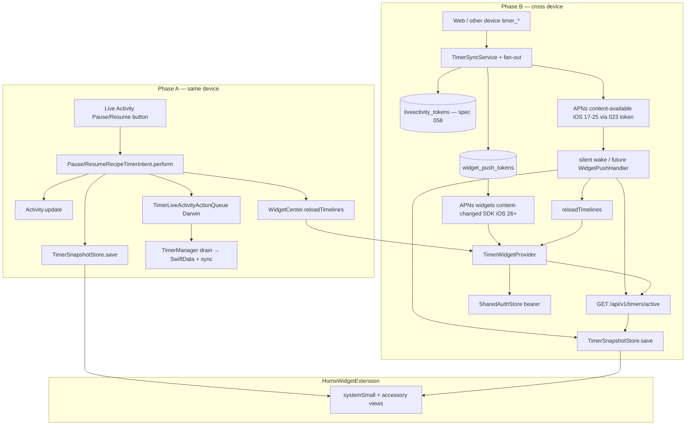

# План: Home Widget — TimerWidget (v2)

**Date**: 2026-08-04 | **Spec**: [spec.md](./spec.md)
**Статус**: v1 UI DONE · v2 код + device QA DONE (2026-08-05)
**Data model**: [data-model.md](./data-model.md)
**Contract**: [contracts/widget-push.md](./contracts/widget-push.md)
**Layout (Figma, без rewrite)**: [layout.md](./layout.md) · `bash scripts/audit-ui-layout.sh specs/030-timer-widget`
**Quickstart**: [quickstart.md](./quickstart.md)
**Tasks**: [tasks.md](./tasks.md)
**Зависимости**: 014 ✅ · 023 ✅ · 044 · 039 · [058](../058-live-activity-push/spec.md) (LA push — не дублировать)

## Кратко

**v1:** WidgetKit extension `TimerWidget` + `TimerSnapshotStore` в App Group + reload из `TimerManager` / backgrounding.

**v2:** два канала фонового обновления snapshot/timeline:

- **Phase A (same-device):** Live Activity Intent в `perform()` пишет snapshot + reload (очередь ActionQueue сохраняется для TimerManager).
- **Phase B (cross-device):** silent APNs + Provider fetch (iOS 17–25, primary) / WidgetKit push (SDK iOS 26+, future) → `GET /api/v1/timers/active` → snapshot → timeline.

## Очерёдность

1. **Phase A — Intent snapshot** — закрывает US-A1 без сервера; разблокирует same-device UX.
2. **Phase B1 — Server widget tokens + fan-out** — (после A; можно параллелить client registrar после контракта).
3. **Phase B2 — Client WidgetPushHandler + registrar** — (после контракта B1).
4. **Phase B3 — Provider network refresh** — (после B2 или в параллель с B2 после API готов).
5. **Phase B4 — iOS 17 silent fallback** — (после B3).
6. **Verify + device QA** — после A и B.

> Live Activity push `update`/`end` — владение [058](../058-live-activity-push/spec.md). Здесь только widget fan-out рядом с теми же timer events.

---

## Архитектура v2



---

## Phase A — Intent пишет snapshot (US-A1)

### Изменения

| Файл / зона | Действие |
|-------------|----------|
| `PauseRecipeTimerIntent` / resume Intent (Live Activity / App Intents) | В `perform()`: Activity.update + `TimerSnapshotStore` write + `reloadTimelines`; сохранить ActionQueue enqueue |
| Shared helper (желательно в Core или рядом с snapshot mapping) | Единый mapping текущего Activity/timer → `TimerSnapshot` / document merge |
| Unit tests | Intent path пишет store и вызывает reload (mock / spy) |

### Downstream consumers

- [ ] **SwiftUI views** — Home/Lock widget views читают `TimerSnapshot` через Provider entry; UI layout без изменений.
- [ ] **Cross-process consumers** — `HomeWidgetExtension` (timeline); Live Activity content-state; Darwin ActionQueue → main app `TimerManager`.
- [ ] **Sync boundaries** — Intent **не** шлёт sync сам; sync остаётся на drain ActionQueue → `TimerManager` → `TimerSyncService`. Не ломать этот порядок.
- [ ] **Persisted state** — App Group `widgets.timerSnapshot`; ActionQueue persistence; SwiftData `RecipeTimer` после drain.
- [ ] **Tests / verify-скрипты** — новые Intent/snapshot tests; `verify-timer-widget.sh` регрессия.

### Positive invariants

| Эффект функции / API | Инвариант | Где проверять |
|---------------------|----------|---------------|
| `PauseRecipeTimerIntent.perform()` | после perform snapshot в App Group содержит timer с `phase == .paused` | unit test / snapshot store spy |
| `PauseRecipeTimerIntent.perform()` | вызывается `WidgetCenter.reloadTimelines(ofKind: "TimerWidget")` (или test double) | unit test |
| `PauseRecipeTimerIntent.perform()` | событие всё ещё enqueued в ActionQueue | unit test |
| Drain ActionQueue после wake | SwiftData + sync отражают pause (как сегодня) | существующие TimerManager / LA tests |

### Note

Не удалять ActionQueue «потому что snapshot уже обновлён» — иначе SwiftData/sync разъедутся с UI.

---

## Phase B1 — Server: widget_push_tokens + fan-out

### Изменения

| Зона | Действие |
|------|----------|
| DB migration | таблица `widget_push_tokens` (user_id, device_id, token, timestamps; UNIQUE user+device) |
| HTTP | `POST` / `DELETE` register widget token (см. [contracts/widget-push.md](./contracts/widget-push.md)) |
| Fan-out | рядом с LA events: `timer_started/paused/resumed/updated/deleted` → APNs widgets push; debounce ~1 с; exclude source `device_id` |
| iOS 17–25 path (server) | silent на device token из spec 023 для устройств без widget token (primary, пока нет widget token) |

> Реализация server — в `recipe-scaler-web`; этот plan описывает контракт для native implementers и зеркало спеки.

### Downstream consumers

- [ ] **SwiftUI views** — нет прямых.
- [ ] **Cross-process consumers** — WidgetKit extension (reload); main app registrar.
- [ ] **Sync boundaries** — fan-out **после** (или рядом с) `timer_event` emit; не заменяет CRDT/Yjs; не трогает LA payload 058.
- [ ] **Persisted state** — `widget_push_tokens` на сервере; cleanup BadDeviceToken / Unregistered.
- [ ] **Tests** — server unit/integration на register + fan-out debounce + exclude source (web repo).

### Positive invariants

| Эффект | Инвариант | Где проверять |
|--------|-----------|---------------|
| `timer_paused` от device A | device B с widget token получает widgets push; device A — нет | server test |
| Два события < 1 с | один push с последним state (debounce) | server test |
| `POST register` | UPSERT по (user_id, device_id) | server test |

---

## Phase B2 — Client: WidgetPushHandler + registrar

### Изменения

| Файл / зона | Действие |
|-------------|----------|
| Entitlements / capability | убедиться Push + App Group; WidgetKit push registration — SDK `@available(iOS 26.0, *)` (не iOS 18) |
| `WidgetPushRegistrar` (имя уточнить) | future: device-level widget push token → POST register; unregister on logout; до wire-up — silent + Provider |
| `WidgetPushHandler` / WidgetKit push callback | SDK iOS 26+; на `content-changed` система перезагружает timeline; handler при необходимости логирует |
| `AppContainer` / bootstrap | wire registrar рядом с APNs 023 / LA 058 registrars |
| `#available(iOS 26, *)` | весь WidgetKit push API за availability; appex DT остаётся 17 |

### Downstream consumers

- [ ] **SwiftUI views** — Account / diagnostics опционально (не обязательно в v2).
- [ ] **Cross-process consumers** — `HomeWidgetExtension` timelines; не путать с LA activity tokens (058).
- [ ] **Sync boundaries** — register использует тот же auth, что 023/058 (`SharedAuthStore` / bearer).
- [ ] **Persisted state** — token на сервере; локально кэш token optional.
- [ ] **Tests** — registrar encode/UPSERT mocks; availability guards.

### Positive invariants

| Эффект | Инвариант | Где проверять |
|--------|-----------|---------------|
| Успешный widget token | `POST` register уходит с `device_id` + hex token | unit test |
| Logout / account wipe | `DELETE` unregister (best-effort) | unit test |
| iOS 17 build | нет вызовов WidgetKit push API (iOS 26+) без `#available` | compile + smoke |

---

## Phase B3 — Provider network refresh

### Изменения

| Файл / зона | Действие |
|-------------|----------|
| `TimerWidgetProvider` | при timeline: auth → `GET /api/v1/timers/active` → map `ServerActiveTimer` → `TimerSnapshotDocument` → save App Group |
| Mapping helper | shared с Core (`ServerActiveTimer` уже в RecipeScalerCore) |
| Offline / 401 / network error | оставить предыдущий snapshot; timeline из него |
| Auth | `SharedAuthStore` в App Group (device bearer, spec 041) |

### Downstream consumers

- [ ] **SwiftUI views** — все TimerWidget families.
- [ ] **Cross-process consumers** — extension network; App Group snapshot читают и main app, и extension.
- [ ] **Sync boundaries** — **read-only** GET; не POST sync из виджета.
- [ ] **Persisted state** — перезапись `widgets.timerSnapshot`.
- [ ] **Tests** — mapping ServerActiveTimer → TimerSnapshot; offline keeps previous.

### Positive invariants

| Эффект | Инвариант | Где проверять |
|--------|-----------|---------------|
| Успешный GET с 2 running timers | snapshot.timers.count == 2, phases `.running` | unit / Provider test |
| GET fails / offline | `TimerSnapshotStore.load()` равен pre-fetch document | unit test |
| Нет bearer | fetch не вызывается (или no-op), snapshot не очищается | unit test |

---

## Phase B4 — iOS 17 silent fallback

### Изменения

| Зона | Действие |
|------|----------|
| AppDelegate / push handler (023) | silent `content-available` с timer/widget hint → sync active timers → snapshot save → reloadTimelines |
| Server | для устройств без widget token (или всегда как secondary) — silent на device APNs token |
| Документация | quickstart: iOS 17–25 = silent + Provider best-effort; WidgetKit push = SDK iOS 26+ future |

### Downstream consumers

- [ ] **Cross-process** — main app wake; widget reload.
- [ ] **Sync boundaries** — переиспользовать существующий timer sync path (не invent parallel CRDT).
- [ ] **023 coexistence** — не ломать alert push; silent payload не показывает UI.

### Positive invariants

| Эффект | Инвариант | Где проверять |
|--------|-----------|---------------|
| Silent wake + successful sync | snapshot обновлён + reload вызван | integration / manual device QA |
| Alert push 023 | title/body по-прежнему доставляются | регрессия 023 |

---

## Структура файлов (ориентир для implementers)

v1 (уже есть) + v2 добавления:

```
RecipeScalerCore/
└── Snapshots/ …                    # v1
RecipeScalerNative/
├── … Pause/ResumeRecipeTimerIntent # Phase A: snapshot + reload
├── Services/WidgetPushRegistrar…   # Phase B2 (имя уточнить)
└── … silent push hook (023)        # Phase B4
HomeWidgetExtension/
└── TimerWidgetProvider.swift       # Phase B3: network refresh
recipe-scaler-web/server/           # Phase B1 (вне native repo)
```

## Риски и смягчения

| Риск | Смягчение |
|------|-----------|
| Intent обновил snapshot, но TimerManager не drain'нул → рассинхрон SwiftData | ActionQueue обязателен; reconcile при foreground |
| WidgetKit push только SDK iOS 26+ | Silent + Provider primary на iOS 17–25 (023); deployment 17 |
| Provider fetch без сети → empty flash | Never clear snapshot on error (US-B3) |
| Двойной fan-out с 058 | Разные topics/tokens; widget body только `content-changed` |
| Battery / APNs rate | Debounce ~1 с на сервере; client debounce 200 мс на TimerManager |

## Verify

- `xcodebuild build` — scheme `RecipeScalerNative` (+ HomeWidgetExtension)
- `xcodebuild test` — Intent snapshot tests, Provider mapping/offline tests, registrar tests
- `bash scripts/verify-timer-widget.sh`
- Device QA: [quickstart.md](./quickstart.md) § Phase A / Phase B
- Не трогать `layout.md` Figma-дерево без отдельного запроса
