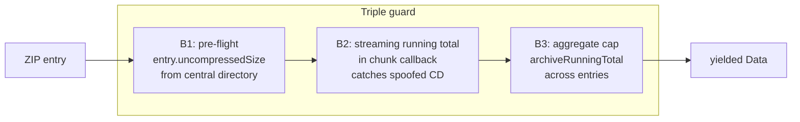

# Спецификация: защита импорта от декомпрессионных бомб

**Ветка**: `032-import-decompression-bomb`
**Дата**: 2026-06-18
**Статус**: 🟢 Реализовано (TDD)
**Зависимости**: `027-paprika-crouton-import` ✅, `020-native-export-import` ✅
**Ревью-источник**: [review-kilo-glm-5.2-recipe-scaler-native.md](../../review-kilo-glm-5.2-recipe-scaler-native.md) — находки **#3** (Critical), **#32** (Medium), **#63** (Low)

## Контекст

Импорт Paprika/Crouton и нативного Recipe Scaler-формата принимает недоверенные архивы (`.paprikarecipes`, `.zip`, `.crumb`, `.paprikarecipe`). До этой задачи все три декомпрессионных пути выполняли unbounded extraction:

| Путь | Файл | Уязвимость |
|------|------|-----------|
| gzip → JSON (Paprika) | `Gunzip.swift` | inflate loop дописывает чанки в `Data()` без проверки итогового размера |
| ZIP entries → Data (Paprika/Crouton) | `ThirdPartyFormatDetector.yieldZipEntries` | `archive.extract` без pre-flight check `entry.uncompressedSize` и без running total |
| ZIP → recipes.json + images (Native export) | `NativeRecipeImporter.parseZip` | то же — extract без лимита, плюс `JSONSerialization` без byte-size cap |

Дополнительная находка **#32**: `JSONSerialization.jsonObject` вызывался на attacker-controlled буферах без пред-parsing size cap.

Находка **#63**: `maxImageBytes` определён тремя способами — `25 * 1024 * 1024` (26 214 400) в `ThirdPartyImportLimits` и `25_000_000` в обоих `ImportPhotoValidator`.

## Угроза

Crafted gzip-stream (10 КБ сжатого → 10 МБ распакованного) или crafted ZIP с одним oversized entry могут привести к OOM / локальному DoS. `maxRecipesPerImport = 500` считает **entries**, не байты — bomber обходит его одним огромным recipe JSON.

## Решение: тройной барьер

Применён defense-in-depth с тремя слоями проверок для каждого декомпрессионного пути:

- **B1 (pre-flight)** — дёшев, читает central directory, ловит честно-oversized entries без extraction.
- **B2 (streaming)** — единственный надёжный барьер против **spoofed central directory** (когда CD заявляет 100 байт, а реально распаковывается 1 МБ).
- **B3 (aggregate)** — running total по всем entries архива.

## Лимиты (выбраны: moderate)

В [RecipeScalerCore/Import/ThirdParty/ThirdPartyImportTypes.swift](../../RecipeScalerCore/Import/ThirdParty/ThirdPartyImportTypes.swift):

| Константа | Значение | Назначение |
|-----------|----------|-----------|
| `maxImageBytes` | `25_000_000` (25 MB decimal) | per-image cap; унифицирован со всеми сайтами (#63) |
| `maxDecompressedEntryBytes` | `50_000_000` (50 MB) | один `.paprikarecipe` / `.crumb` / image |
| `maxDecompressedArchiveBytes` | `500_000_000` (500 MB) | aggregate архива |
| `maxGzipJSONBytes` | `16_000_000` (16 MB) | один Paprika JSON после gunzip |
| `maxRecipeJSONBytes` | `16_000_000` (16 MB) | JSON pre-flight перед `JSONSerialization`/`JSONDecoder` |

Реальные Paprika/Crouton JSON-манифесты — единицы-десятки КБ; 16 MB с большим запасом.

## Backward compatibility

Лимиты инжектируются как опциональные параметры со значением по умолчанию `.max` (= бесконечность) на API-уровне helpers:

- `Gunzip.decompress(..., maxOutputBytes: Int = .max)`
- `enumerateRecipeEntriesStream(..., maxEntryBytes: Int = .max, maxArchiveBytes: Int = .max)`
- `enumerateRecipeEntries(..., maxEntryBytes: Int = .max, maxArchiveBytes: Int = .max)`

Это сохраняет существующий публичный контракт. Реальные call sites (`PaprikaRecipeParser.parse`, `ThirdPartyRecipeImportService.importFile`, `NativeRecipeImporter.parse`) передают безопасные лимиты.

## Покрытие (TDD)

| ID | Тест | Status |
|----|------|--------|
| TP-1.1 | Gunzip oversized reject | ✅ |
| TP-1.2 | Gunzip under-limit pass | ✅ |
| TP-1.3 | Gunzip backward-compat `.max` | ✅ |
| TP-1.4 | Gunzip bad gzip still throws `.gzipFailed` | ✅ |
| TP-1.5 | Gunzip cap aborts < 100ms | ✅ |
| TP-1.6 | Gunzip exact boundary allowed | ✅ |
| TP-1.7 | Gunzip +1 byte over rejected | ✅ |
| TP-2.1 | ZIP pre-flight catches oversized entry | ✅ |
| TP-2.2 | ZIP aggregate cap mid-archive | ✅ |
| TP-2.4 | ZIP single-file path ignores archive guards | ✅ |
| TP-2.5 | ZIP default `.max` keeps happy path | ✅ |
| TP-2.6 | ZIP aggregate streaming fires during extraction | ✅ |
| TP-2.7 | ZIP zero-byte entry does not crash | ✅ |
| TP-3.1 | Native oversized `recipes.json` rejected | ✅ |
| TP-3.2 | Native oversized image rejected | ✅ |
| TP-3.4 | Native valid small export still parses | ✅ |
| TP-4.1 | Paprika parser rejects oversized JSON | ✅ |
| TP-4.2 | Crouton parser rejects oversized JSON | ✅ |
| TP-4.3 | `NativeRecipeImporter.parseJSON` rejects oversized | ✅ |
| TP-5.1 | Core `ImportPhotoValidator.maxImageBytes` shared | ✅ |
| TP-5.2 | `maxImageBytes == 25_000_000` (decimal MB) | ✅ |

## Новые error cases

- `ThirdPartyImportError.entrySizeLimitExceeded(fileName:)`
- `ThirdPartyImportError.archiveSizeLimitExceeded(fileName:)`
- `ThirdPartyImportError.jsonSizeLimitExceeded(fileName:)`
- `NativeImportError.entrySizeLimitExceeded(entryPath:)`
- `NativeImportError.archiveSizeLimitExceeded`
- `NativeImportError.jsonSizeLimitExceeded`

## i18n-ключи

Добавлены в [RecipeScalerNative/Resources/Localizable.xcstrings](../../RecipeScalerNative/Resources/Localizable.xcstrings) (en + ru):

- `import.third-party-entry-too-large`
- `import.third-party-archive-too-large`
- `import.third-party-json-too-large`

## Вне scope

- Spoofed filename / zip-slip — не нужен: импортер не пишет entries на диск.
- TLS-pinning, auth model — отдельные задачи.
- CRDT state size limit (#34) — отдельная задача.
- Native `ImportPhotoValidator.swift` в `Utils/` не зарегистрирован в `project.pbxproj` (pre-existing), поэтому TP-5.1 покрывает только Core-вариант. TODO: зарегистрировать файл отдельно.

## Связанные review-находки

- **#3 Critical** — закрыто.
- **#32 Medium** — закрыто.
- **#63 Low** — закрыто.
