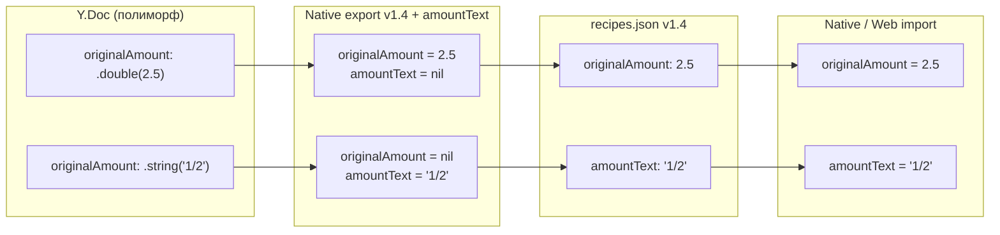

# Спецификация: сохранение нечисловых количеств ингредиентов в нативном экспорте (v1.4 + amountText)

**Ветка**: `033-native-export-amount-text`
**Дата**: 2026-06-18
**Статус**: ✅ Реализовано
**Зависимости**: `020-native-export-import` ✅, `027-paprika-crouton-import` ✅, `032-import-decompression-bomb` ✅
**Ревью-источник**: [review-kilo-glm-5.2-recipe-scaler-native.md](../../review-kilo-glm-5.2-recipe-scaler-native.md) — находка **#15** (High)

## Контекст

В Y.Doc поле `originalAmount` ингредиента хранится **полиморфно**:

- `.double(numeric)` — для обычных количеств (`2.5`, `1`, `0.75`);
- `.string(rawText)` — для нечисловых значений (`"1/2"`, `"2-3"`, `"1½"`, `"to taste"`, `"по вкусу"`).

См. [RecipeScalerNative/Services/YjsSync/DocumentManager.swift](../../RecipeScalerNative/Services/YjsSync/DocumentManager.swift) — метод `addIngredient`.

Нативный экспортёр терял нечисловые значения в трёх точках:

| # | Файл | Баг |
|---|------|-----|
| 1 | `RecipeScalerCore/Export/Native/NativeFormatTypes.swift` | Wire-тип `originalAmount: Double?` физически не мог нести строку |
| 2 | `RecipeScalerNative/Services/NativeExportImportService.swift` | На export пишется только `ing.numericValue: Double?` → для нечисловых значений `nil` |
| 3 | `RecipeScalerNative/Services/YjsSync/DocumentManager.swift` | На import при `originalAmount == nil` ставится `hasQuantity = false` → ингредиент становится header-строкой без количества |

## Угроза

Export → import roundtrip молча теряет дробные/диапазонные количества:

- Было: `1/2 стакана сахара`
- После roundtrip: `стакан, сахар` (header без количества)

Это незаметная потеря данных — пользователь ничего не узнает, пока не откроет импортированный рецепт.

## Решение: расширить формат v1.4 полем `amountText`

Wire-формат остаётся **v1.4** — bump до v1.5 не нужен:

- JSON Schema v1.4 в вебе имеет `"additionalProperties": true` на recipe-объекте — `amountText` проходит сквозь валидацию.
- Веб-валидатор v1.4 не проверяет состав полей ингредиента.
- Веб `Ingredient.originalAmount` типизирован как `number | null` — строковое значение не эмиттится.

Native делает две вещи:

1. **На export (v1.4)**: пишет optional поле `amountText: String?` рядом с `originalAmount: Double?`. Если количество numeric — пишется `originalAmount`. Если не-numeric — пишется `amountText`.
2. **На import**: читает `amountText` при `originalAmount == nil`.

### Поток данных

## Backward compatibility

| Формат файла | Что происходит |
|-------------|----------------|
| v1.0–v1.4 native export (без amountText) | Читается как раньше. `amountText == nil`. Числовые количества работают, нечисловые уже утеряны при первой экспорте (не вернуть). |
| Web v1.4 с `originalAmount: 2.5` (number) | Читается в `originalAmount: Double?` как обычно. |
| Native v1.4 с `amountText` | Полный roundtrip нечисловых количеств. Веб-импортёр принимает (pass-through ingredients). |

Старые v1.0–v1.4 валидируются и читаются без регрессий.

## Лимиты и валидация

- `amountText` после `trim()` должен быть непустым (если поле присутствует).
- Длина `amountText` ≤ 64 символов (разумный верхний предел для количества; всё, что длиннее, — подозрительно).

## Покрытие (TDD)

| ID | Тест | Что проверяет |
|----|------|---------------|
| TP-1 | `testV14RoundTripPreservesNonNumericAmountText` | Экспорт `1/2` → parse → `amountText == "1/2"`, `originalAmount == nil` |
| TP-2 | `testV14RoundTripPreservesMixedAmounts` | Numeric + text в одном рецепте, оба сохраняются |
| TP-4 | `testV14FileWithoutAmountTextStillParses` | Старый v1.4 файл — back-compat, no regression |
| TP-6 | `testV14RejectsEmptyAmountText` | `amountText: ""` или `"   "` → validation error |
| TP-7 | `testV14RejectsOverlongAmountText` | `amountText` 65+ символов → validation error |

## Затронутые файлы

| Файл | Правка |
|------|--------|
| `RecipeScalerCore/Export/Native/NativeFormatTypes.swift` | `NativeIngredient.amountText: String?` |
| `RecipeScalerCore/Export/Native/NativeFormatValidator.swift` | `amountText` валидация (безусловная) |
| `RecipeScalerCore/Export/Native/schemas/export-schema-v1.4.json` | Добавить optional `amountText` |
| `RecipeScalerCore/Export/Native/NativeRecipeExporter.swift` | `ExportIngredient.amountText`; `buildPayload` → v1.4 |
| `RecipeScalerNative/Services/NativeExportImportService.swift` | Эмиттить `amountText` при `numericValue == nil && hasQuantity` |
| `RecipeScalerNative/Services/YjsSync/DocumentManager.swift` | `applyNativeRecipe`: prefer `amountText` при `originalAmount == nil` |
| `RecipeScalerNativeTests/NativeRecipeExporterTests.swift` | TP-1, TP-2, TP-4 |
| `RecipeScalerNativeTests/NativeFormatValidatorTests.swift` | TP-6, TP-7 |

## Out of scope

- **Web changes** — веб уже принимает `amountText` через `additionalProperties: true`.
- **Paprika/Crouton importer** — `applyImportedRecipe` уже правильно пишет `.string(...)`.
- **Миграция старых v1.4 native-файлов** — они валидны, но потерянные при первой экспорте данные не вернуть.
- Находки **#61**, **#62**, **#64** — отдельные задачи. Находка **#36** (totalWeight) закрыта в MIK-115: `ExportNutrition.totalWeight` + round-trip через вложенную Y.Map `nutrition` в `applyNativeRecipe`.

## Risks

- **Roundtrip с уже существующими v1.4 native-файлами**: должны читаться без регрессии (`amountText = nil`, поведение как раньше).
- **Web import of amountText**: веб pass-through `recipe.ingredients` — поле сохраняется в Y.Doc, но UI веба пока не отображает нечисловые количества (это pre-existing limitation веба, не регрессия натива).
