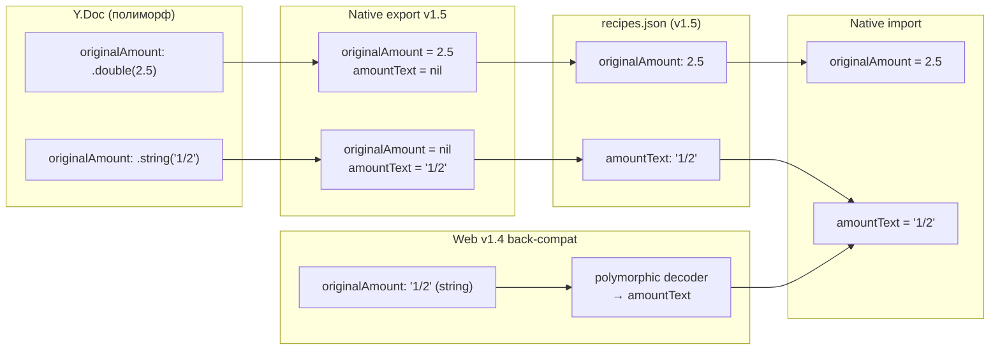

# Спецификация: сохранение нечисловых количеств ингредиентов в нативном экспорте (v1.5)

**Ветка**: `033-native-export-amount-text`
**Дата**: 2026-06-18
**Статус**: 🚧 В работе (TDD)
**Зависимости**: `020-native-export-import` ✅, `027-paprika-crouton-import` ✅, `032-import-decompression-bomb` ✅
**Ревью-источник**: [review-kilo-glm-5.2-recipe-scaler-native.md](../../review-kilo-glm-5.2-recipe-scaler-native.md) — находка **#15** (High)

## Контекст

В Y.Doc поле `originalAmount` ингредиента хранится **полиморфно**:

- `.double(numeric)` — для обычных количеств (`2.5`, `1`, `0.75`);
- `.string(rawText)` — для нечисловых значений (`"1/2"`, `"2-3"`, `"1½"`, `"to taste"`, `"по вкусу"`).

См. [RecipeScalerNative/Services/YjsSync/DocumentManager.swift](../../RecipeScalerNative/Services/YjsSync/DocumentManager.swift) — метод `addIngredient`, строки 1755–1765.

Web-экспортёр (`recipe-scaler-web/.../v1.4-exporter.ts`) dumps `recipe.ingredients` as-is и корректно сериализует обе формы (`originalAmount` может быть `number | string | null` в JSON).

Нативный экспортёр теряет нечисловые значения в трёх точках:

| # | Файл | Баг |
|---|------|-----|
| 1 | `RecipeScalerCore/Export/Native/NativeFormatTypes.swift:10` | Wire-тип `originalAmount: Double?` физически не может нести строку |
| 2 | `RecipeScalerNative/Services/NativeExportImportService.swift:83` | На export пишется только `ing.numericValue: Double?` → для нечисловых значений `nil` |
| 3 | `RecipeScalerNative/Services/YjsSync/DocumentManager.swift:1061-1072` | На import при `originalAmount == nil` ставится `hasQuantity = false` → ингредиент становится header-строкой без количества |

Дополнительно: даже если бы натив захотел прочитать web v1.4 файл с `originalAmount: "1/2"` (string), `JSONDecoder` упал бы с `type mismatch` — нет polymorphic decoder.

## Угроза

Export → import roundtrip молча теряет дробные/диапазонные количества:

- Было: `1/2 стакана сахара`
- После roundtrip: `стакан, сахар` (header без количества)

Это незаметная потеря данных — пользователь ничего не узнает, пока не откроет импортированный рецепт.

## Решение: bump wire format до v1.5, добавить `amountText`, polymorphic back-compat

Web не трогаем (он уже корректен). Native делает две вещи:

1. **На export (v1.5)**: пишет новое поле `amountText: String?` рядом с существующим `originalAmount: Double?`. Если количество numeric — пишется `originalAmount`. Если не-numeric — пишется `amountText`.
2. **На import**: читает `amountText` (v1.5) И **polymorphic-decode `originalAmount`** для back-compat с web v1.4 (где `originalAmount` может быть string).

### Поток данных

## Backward compatibility

| Формат файла | Что происходит |
|-------------|----------------|
| v1.0–v1.4 native export | Читается как раньше. `amountText == nil`. Числовые количества работают, нечисловые уже утеряны при первой экспорте (не вернуть). |
| Web v1.4 с `originalAmount: "1/2"` (string) | Polymorphic decoder перекладывает строку в `amountText`. Работает. |
| Web v1.4 с `originalAmount: 2.5` (number) | Читается в `originalAmount: Double?` как обычно. |
| Native v1.5 | Полный roundtrip нечисловых количеств. |

Старые v1.0–v1.4 валидируются и читаются без регрессий.

## Лимиты и валидация

- `amountText` после `trim()` должен быть непустым (если поле присутствует).
- Длина `amountText` ≤ 64 символов (разумный верхний предел для количества; всё, что длиннее, — подозрительно).

## Покрытие (TDD)

| ID | Тест | Что проверяет |
|----|------|---------------|
| TP-1 | `testV15RoundTripPreservesNonNumericAmountText` | Экспорт `1/2` → parse → `amountText == "1/2"`, `originalAmount == nil` |
| TP-2 | `testV15RoundTripPreservesMixedAmounts` | Numeric + text в одном рецепте, оба сохраняются |
| TP-3 | `testWebV14StringOriginalAmountParsesAsAmountText` | JSON `originalAmount: "to taste"` (string) → `amountText == "to taste"`, `originalAmount == nil` |
| TP-4 | `testV14FileWithoutAmountTextStillParses` | Старый v1.4 файл — back-compat, no regression |
| TP-5 | `testNativeFormatVersionV15` | `NativeFormatVersion.v1_5`, `typeString == "recipes-v1.5"`, `supportsAmountText == true`, ordering |
| TP-6 | `testV15ValidatorRejectsEmptyAmountText` | `amountText: ""` или `"   "` → structural error |
| TP-7 | `testV15ValidatorRejectsOverlongAmountText` | `amountText` 65+ символов → structural error |
| TP-8 | `testPolymorphicOriginalAmountAcceptsNullNumberString` | 4 случая decode: null, number, string, missing key |

## Затронутые файлы

| Файл | Правка |
|------|--------|
| `RecipeScalerCore/Export/Native/NativeFormatTypes.swift` | `NativeIngredient.amountText: String?` + custom Codable для polymorphic `originalAmount` |
| `RecipeScalerCore/Export/Native/NativeFormatVersion.swift` | `v1_5` case, `typeString`, `supportsAmountText`, `normalizeNativeFormatVersion` |
| `RecipeScalerCore/Export/Native/NativeFormatValidator.swift` | v1.5 type check + `amountText` валидация |
| `RecipeScalerCore/Export/Native/schemas/export-schema-v1.5.json` | Новый JSON-schema |
| `RecipeScalerCore/Export/Native/NativeRecipeExporter.swift` | `ExportIngredient.amountText`; `buildPayload` → v1.5 |
| `RecipeScalerNative/Services/NativeExportImportService.swift` | Эмиттить `amountText` при `numericValue == nil && hasQuantity` |
| `RecipeScalerNative/Services/YjsSync/DocumentManager.swift` | `applyNativeRecipe`: prefer `amountText` при `originalAmount == nil` |
| `RecipeScalerNativeTests/NativeRecipeExporterTests.swift` | TP-1..TP-4 |
| `RecipeScalerNativeTests/NativeFormatVersionTests.swift` | TP-5 |
| `RecipeScalerNativeTests/NativeFormatValidatorTests.swift` | TP-6, TP-7 |
| `RecipeScalerNativeTests/NativeRecipeImporterTests.swift` | TP-8 |

## Out of scope

- **Web changes** — web уже корректно dumps ingredients as-is.
- **Paprika/Crouton importer** — `applyImportedRecipe` уже правильно пишет `.string(...)`.
- **Миграция старых v1.4 native-файлов** — они валидны, но потерянные при первой экспорте данные не вернуть.
- Находки **#36** (totalWeight), **#61**, **#62**, **#64** — отдельные задачи.

## Risks

- **Polymorphic Codable**: `originalAmount` может быть `Double`, `String`, `null` или отсутствовать. Нужен аккуратный `init(from:)` + `encode(to:)`. Тест на все 4 случая обязателен (TP-8).
- **Web back-compat**: даже если web никогда не пишет `amountText`, polymorphic-decoder `originalAmount` должен корректно принять string от web-файла.
- **Roundtrip с уже существующими v1.4 native-файлами**: должны читаться без регрессии (`amountText = nil`, поведение как раньше).
