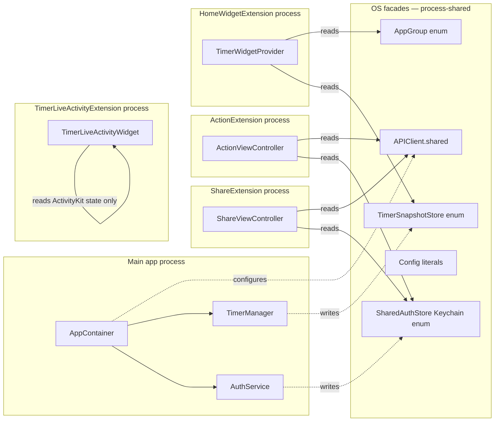

# Design: Architecture — composition root + @Observable миграция

**Date**: 2026-06-19 | **Spec**: [spec.md](./spec.md)

## Composition graph (после remediation)

```mermaid
flowchart TB
  subgraph appInit [App.init — @main]
    APP[RecipeScalerNativeApp]
    APP -->|"creates @State"| AC[AppContainer @MainActor @Observable]
  end

  subgraph container [AppContainer — single source of truth]
    DB[(YrsDatabase)]
    STORE[YDocStore]
    MAP[RemindersMapStore]
    AUTH[AuthService]
    TIM[TimerManager]
    TIMS[TimerSyncService]
    TLAC[TimerLiveActivityCoordinator]
    PUSH[PushRegistrationService]
    PUSHS[PushScheduleService]
    IMG[RecipeImageService]
    IC[ImageCacheService]
    PIC[PublicImageCacheService]
    YMH[YjsMergeHelper]
    ARC[AssistantRecipeContext]
    DLR[DeepLinkRouter]
    YSS[YjsSyncService]
    REM[RemindersSyncService]
    SP[SpotlightIndexer]
  end

  subgraph ui [SwiftUI]
    CV[ContentView]
    CV -->|@Environment AppContainer.self| AC
    AC -->|@Environment| YSS
    AC -->|@Environment| REM
    AC -->|@Environment| SP
    AC -->|@Environment| AUTH
    AC -->|@Environment| TIM
    AC -->|@Environment| DLR
    AC -->|@Environment| ARC
  end

  DB --> STORE
  DB --> MAP
  STORE --> YSS
  AUTH --> TIMS
  AUTH --> PUSH
  TIM --> TLAC
  TIM --> PUSHS
  TIM --> TIMS
  IC --> IMG
  PIC --> IMG
  YMH --> YSS
  YSS --> TIM
  YSS --> PUSH
  YSS --> TIMS
```

## Construction order (init)

1. `YrsDatabase` (с in-memory fallback)
2. `YDocStore(dbQueue:)`, `RemindersMapStore(dbQueue:)`
3. Leaves без зависимостей: `ImageCacheService`, `PublicImageCacheService`, `YjsMergeHelper`, `DeepLinkRouter`, `AssistantRecipeContext`, `TimerLiveActivityCoordinator`
4. `AuthService(apiClient: .shared)`
5. `PushRegistrationService(auth:, apiClient:)`, `PushScheduleService(apiClient:)`
6. `TimerSyncService(apiClient:)` (без timerManager на этом шаге)
7. `TimerManager(timerSync:, liveActivity:, pushSchedule:, modelContext:)` → обратно в `timerSync.timerManager = timer`
8. `RecipeImageService(imageCache:, publicImageCache:, apiClient:)`
9. `YjsSyncService(store:, timerSync:, timer:, push:, recipeImage:, yjsMergeHelper:)`
10. `RemindersSyncService(mapStore:)`
11. `SpotlightIndexer(syncService:)`

## bootstrap(userId:) — wiring (после construction)

| Шаг | Что делает | Откуда переехало |
|-----|-----------|------------------|
| 1 | `apiClient.configure(userId: userId)` | `ContentView.init:45` + `YjsSyncService.start:867` (дедуплицировать) |
| 2 | `auth.restoreAuthenticationState()` | `ContentView.task` |
| 3 | `timerSync.configure(userId:, deviceId:, timerManager:)` | `YjsSyncService.start:868-872` |
| 4 | `timerEventBridge.install(sync:, timerSync:)` (вместо циклического callback) | `YjsSyncService.start:873-875` |
| 5 | `sync.start(userId:)` (теперь без side-effects внутри) | `ContentView.task:209` |
| 6 | `reminders.attach(to: sync)` | `ContentView.task:210` |
| 7 | `spotlight.start()` | `ContentView.task:211` |
| 8 | `installImageCacheObservers()` (sync слушает `ImageCacheService` notifications) | `YjsSyncService.start:876` |
| 9 | `TimerLiveActivityMetadataProvider.recipeNameLookup = { ... sync.collectionEntries }` | `ContentView:229-233` |
| 10 | `await pushRegistration.registerIfNeeded()` (after auth) | `YjsSyncService:1401-1402` |

## TimerEventBridge

Циклический callback раньше:

```swift
// YjsSyncService.start (старый код)
TimerSyncService.shared.sendTimerEvent = { [weak self] payload in
    self?.emitTimerEvent(payload)
}
```

Новый:

```swift
@MainActor
final class TimerEventBridge {
    private weak var sync: YjsSyncService?
    private weak var timerSync: TimerSyncService?

    func install(sync: YjsSyncService, timerSync: TimerSyncService) {
        self.sync = sync
        self.timerSync = timerSync
        timerSync.sendTimerEvent = { [weak self] payload in
            self?.sync?.emitTimerEvent(payload)
        }
    }
}
```

Owned `AppContainer`. Без циклической retain-ссылки (weak с обеих сторон).

## Observable migration table

| Class | Было | Станет | `@Published` count | Consumer count |
|-------|------|--------|---------------------|----------------|
| `YjsSyncService` | `@MainActor final class : ObservableObject` | `@MainActor @Observable final class` | 15 → 0 | 19 `@EnvironmentObject` + 1 `@ObservedObject` |
| `RemindersSyncService` | `@MainActor final class : ObservableObject` | `@MainActor @Observable final class` | 2 → 0 | 1 `@EnvironmentObject` |
| `SpotlightIndexer` | `@MainActor final class : ObservableObject` | `@MainActor @Observable final class` | 0 | (через контейнер) |
| `RecipeListViewModel` | `@MainActor class : ObservableObject` (non-final) | `@MainActor @Observable final class` | 2 → 0 | (ищем consumers) |
| `DescriptionEditorBridge` | `@MainActor final class : ObservableObject` | `@MainActor @Observable final class` | 6 → 0 | 3 `@StateObject` + 2 `@ObservedObject` |
| `DescriptionEditorChromeState` | `@MainActor final class : ObservableObject` | `@MainActor @Observable final class` | 3 → 0 | 1 `@StateObject` + 1 `@ObservedObject` |
| `APIClient` | `public final class : ObservableObject` | `public final class` (без `ObservableObject`) | 0 | (vestigial) |

## Extension boundary contract (не меняем)



**Контракт:** main app пишет в `SharedAuthStore`/`TimerSnapshotStore`/конфигурит `APIClient.shared`; extensions читают. Это не меняется.

## Risk: migratable order

Чтобы между коммитами проект оставался зелёным:

1. Сначала Phase B полностью (AppContainer создан, но сервисы всё ещё `: ObservableObject` — работает `objectWillChange` через container bridge).
2. Затем C7 (`APIClient` теряет ObservableObject) — безопасно, 0 `@Published`.
3. Затем C3 (`SpotlightIndexer`) — vestigial, безопасно.
4. Затем C2 (`RemindersSyncService`), C4 (`RecipeListViewModel`), C5-C6 (DescriptionEditor*).
5. В конце C1 (`YjsSyncService`) — самый дорогой, в одном коммите с 19 view'ами migration.
