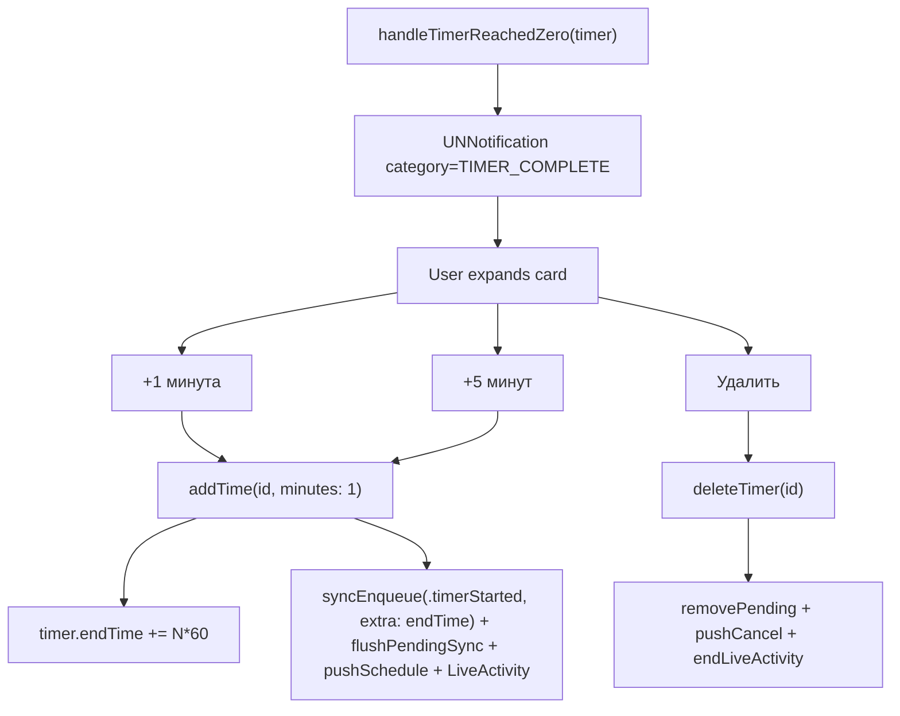

# Спецификация: action-кнопки в уведомлении таймера (+1 / +5 / Удалить)

**Ветка**: `036-timer-notification-actions`
**Дата**: 2026-06-21
**Статус**: 🟡 В работе
**Зависимости**: [014-timers-sync](../014-timers-sync/spec.md) (DONE), [026-timer-live-activity](../026-timer-live-activity/spec.md) (in progress), [023-push-notifications](../023-push-notifications/spec.md) (push-coexistence)
**Не требует платного аккаунта**: локальные `UNNotification`, без APNs/Associated Domains.

## Контекст

Локальное уведомление о завершении таймера уже существует (spec 014) с категорией `TIMER_COMPLETE`, но текущие действия `SNOOZE_ACTION` (Snooze 5 min) и `DISMISS_ACTION` (Dismiss):

- Захардкожены английскими строками, нет в `Localizable.xcstrings`.
- `snoozeTimer(id:)` **перезаписывает** остаток на 5 минут вместо добавления; не вызывает `syncEnqueue` / `pushSchedule` / `syncLiveActivity` — состояние расходится между устройствами и с Live Activity.
- `deleteTimer(id:)` отменяет pending-нотификацию по `[timer.id]`, а запрос планируется с id `"\(timer.id)-complete"` — cancel-by-identifier не срабатывает.
- В `NATIVE-FEATURES-NO-PAID-ACCOUNT.md` second-tier рекомендовано «+1 мин / отложить» — текущая реализация расходится с задумкой.

## Цель

В развёрнутом уведомлении о завершении таймера — ровно 3 локализованные кнопки:

1. **+1 минута** — добавить 60 сек к `endTime`/`remainingTime`, продолжить отсчёт.
2. **+5 минут** — добавить 300 сек, продолжить отсчёт.
3. **Удалить** — убрать таймер, нотификацию, Live Activity; отменить push.

## Решения v1

- **Заменяем** существующие 2 действия на 3 новых (не добавляем к ним). Иначе 5 кнопок в карточке, и «Snooze 5 min» дублирует «+5 минут».
- Идентификаторы действий: `ADD_ONE_MINUTE`, `ADD_FIVE_MINUTES`, `DELETE_TIMER`. Идентификатор категории `TIMER_COMPLETE` оставляем — он уже используется в payload.
- Кнопка «Удалить» помечается `.destructive`.
- Все строки (title/body/actions) — через `Localizable.xcstrings` (RU/EN), никакой хардкод.
- «+N минут» — это **добавление** к `endTime`, не перезапись. Sync через `timer_started` с явным `endTime` (серверный `handleTimerStarted` его принимает; `timer_resumed` — нет).
- После продления — `flushPendingSyncImmediately()`, чтобы сервер обновился до следующего `loadActiveTimersFromServer`.

## i18n-таблица

| Key | RU | EN |
|-----|----|----|
| `timer.notification.title` | Таймер завершён | Timer complete |
| `timer.notification.body` | %@ — время вышло | %@ has finished |
| `timer.notification.action.add-minute` | +1 минута | +1 minute |
| `timer.notification.action.add-five-minutes` | +5 минут | +5 minutes |
| `timer.notification.action.delete` | Удалить | Delete |

`%@` в `body` подставляется через `String(localized: "timer.notification.body \(timer.name)")` (xcstrings interpolation).

## Lifecycle

## Требования

### FR-036-001 — Категория и действия

`registerNotificationCategories()` регистрирует категорию `TIMER_COMPLETE` с действиями `[ADD_ONE_MINUTE, ADD_FIVE_MINUTES, DELETE_TIMER]`. Старые `SNOOZE_ACTION`/`DISMISS_ACTION` убраны.

### FR-036-002 — `addTime(id:minutes:)`

Новый публичный метод в `TimerManager`:

- Добавляет `minutes * 60` к `endTime` (или ставит от `Date()`, если `endTime == nil`).
- Добавляет к `remainingTime` (или инициализирует от `duration`, если `nil`).
- Сбрасывает `hasCompleted = false`, флаги `isRunning = true`, `isPaused = false`.
- Те же хуки, что у `resumeTimer`, плюс `syncEnqueue(.timerStarted, extra: ["endTime": millis(...)])` и `flushPendingSyncImmediately()`.

### FR-036-003 — Делегат

В `userNotificationCenter(_:didReceive:)` switch на новые action-идентификаторы. Старый `snoozeTimer(id:)` удаляется.

### FR-036-004 — Локализация уведомления

В `deliverCompletionNotification(for:)`:
- `content.title = String(localized: "timer.notification.title")`
- `content.body = String(localized: "timer.notification.body \(timer.name)")`

### FR-036-005 — Cancel-id fix

`deleteTimer(id:)` отменяет нотификацию по обоим идентификаторам: `[timer.id, "\(timer.id)-complete"]`. Заодно `removeDeliveredNotifications(withIdentifiers:)` — чтобы карточка исчезала из Notification Center, если пользователь уже её развернул.

### FR-036-006 — Verify-скрипт

`scripts/verify-timer-notifications.sh`:
- grep `ADD_ONE_MINUTE`, `ADD_FIVE_MINUTES`, `DELETE_TIMER` в `TimerManager.swift`.
- grep `addTime(id:` сигнатуры.
- grep `timer.notification.action.add-minute` и др. в `Localizable.xcstrings`.
- отсутствие `SNOOZE_ACTION`, `DISMISS_ACTION`, `snoozeTimer`.
- `xcodebuild -scheme RecipeScalerNative build`.

## Вне scope

- `UNTextInputNotificationAction` для произвольного числа минут — следующая итерация.
- Push-обновления содержимого уведомления (APNs, spec 023, после платного аккаунта).
- Полный i18n-цёрнинг `PauseTimerIntent` / `ResumeTimerIntent` / `StopTimerIntent` (там тоже захардкожены английские диалоги) — отдельная задача.
- CoreHaptics на completion таймера.
- Интерактивные виджеты (ButtonIntent) — продолжение spec 030.

## Критерии успеха

- В развёрнутом уведомлении о завершении таймера ровно 3 кнопки: «+1 минута», «+5 минут», «Удалить».
- Тап «+1 минута» → `timer.endTime` увеличен на 60 сек; Live Activity и web sync обновились; APNs перепланирован (если был).
- Тап «+5 минут» → аналогично, +300 сек.
- Тап «Удалить» → таймер удалён, уведомление убрано (включая из Notification Center), Live Activity завершена, APNs отменён.
- Все строки в карточке и кнопках локализованы через `Localizable.xcstrings` (RU по умолчанию).
- `xcodebuild -scheme RecipeScalerNative build` зелёный.
- `verify-timer-notifications.sh` проходит.

## Артефакты

- `scripts/verify-timer-notifications.sh`
- Код: `RecipeScalerNative/Services/TimerManager.swift`, `RecipeScalerNative/Resources/Localizable.xcstrings`
- Скриншоты (после QA на симуляторе): `specs/036-timer-notification-actions/screenshots/`
