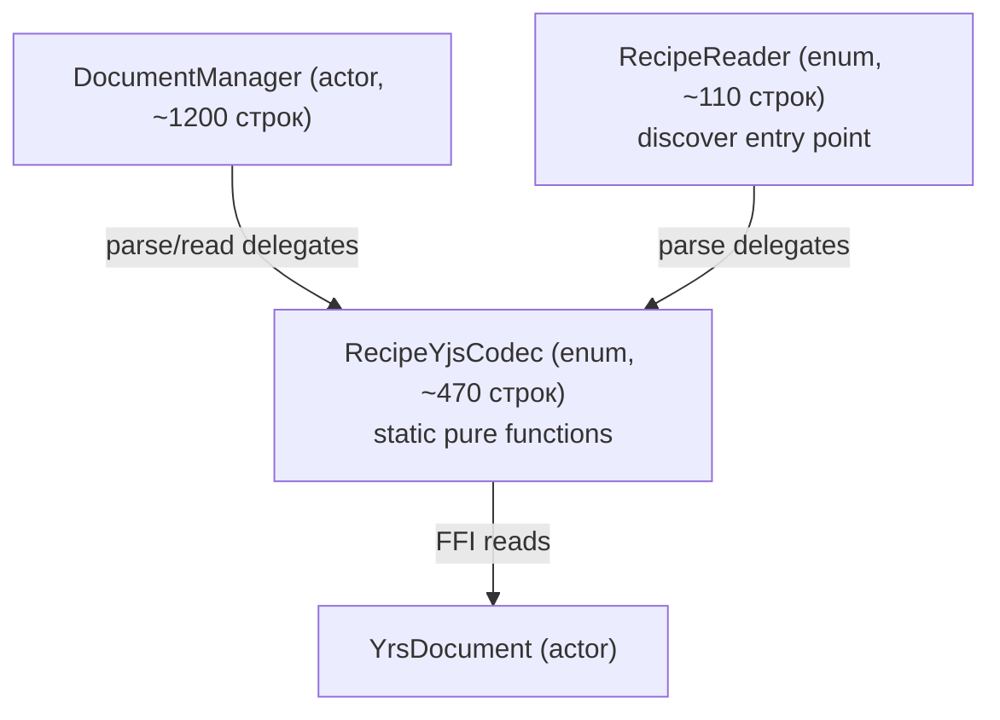

# Spec: DocumentManager readers extraction (#037)

**Date**: 2026-06-22 | **Status**: in_progress
**Linear**: MIK-177, MIK-178, MIK-180, MIK-181 (родитель MIK-93)

## Обзор

`DocumentManager.swift` (1928 строк) — god-объект, одновременно отвечающий за lifecycle документов, персистентность, парсинг рецептов/коллекций/папок, writers, импорт, observers, кэш HTML/plain-text. Линейные задачи MIK-177/178/180/181 предполагают механическое извлечение 13 приватных парсеров в три Reader-файла, но в репозитории есть sibling-дубликат `RecipeReader.swift` (264 строки) с почти идентичной логикой и двумя рассинхронами поведения.

Спека делает больше, чем линейный план: схлопывает оба источника в один `RecipeYjsCodec` и фиксирует баг `hasQuantity`.

## Проблема

1. **God-объект.** В `DocumentManager.swift` 13 приватных парсеров (1527–1928, ~400 строк) не зависят от состояния actor'а, но живут внутри него. Проверка: `rg 'self\.(parse|read|search)' DocumentManager.swift` — 4 hit'а, все это callers, вызывающие парсеры, ни один парсер не обращается к actor-state.

2. **Дубликат парсинга.** `RecipeScalerNative/Services/Yrs/Description/RecipeReader.swift` содержит независимые копии `readName`, `readDescription`, `readNutrition`, `readIngredients`, `parseIngredient`, `parseJSONIngredients`. Используется для рендеринга Discover (one-shot parse из binary state update, без активации edit-сессии). Callers:
   - `RecipeScalerNativeTests/RecipeScalerNativeTests.swift:218` — fixture-based тест
   - `RecipeScalerNative/Views/Discover/DiscoverRecipeView.swift:272` — рантайм Discover

3. **Баг `hasQuantity`.** Две реализации считают его по-разному:
   - `DocumentManager.parseIngredientMap` (L1753): `hasOriginal && !originalAmount.isEmpty`
   - `DocumentManager.parseJSONIngredients` (L1892): `!originalAmount.isEmpty || !amount.isEmpty`
   - `RecipeReader.parseIngredient` (L211): `hasOriginal && !originalAmountString.isEmpty`
   - `RecipeReader.parseJSONIngredients` (L245): `originalAmountDouble != nil`

   Web-source-of-truth semantics: «есть ли у ингредиента количество» — должно быть true когда `originalAmount` или `amount` заполнено. Фикс: унифицировать на `!originalAmount.isEmpty || !amount.isEmpty` (соответствует web parity).

4. **Расхождение `readIngredients`.** `RecipeReader` предпочитает Y.Array безусловно (L175), `DocumentManager` строго switch'ит по version. Public-снепшоты часто не содержат `version` → fallback на v1 ломает отображение. Решение: унифицировать на «предпочитать Y.Array, fallback на JSON для v1».

## Решение

### Целевая архитектура

### Новый файл `RecipeYjsCodec.swift`

`enum RecipeYjsCodec` со всеми 13 static-функциями:

| Группа | Методы |
|---|---|
| Recipe read | `parseRecipeData`, `readRecipeName`, `readDescription`, `readIngredients`, `readNutrition`, `readSearchIngredients`, `searchIngredientsFromJSON`, `parseJSONIngredients`, `parseJSONNutrition`, `parseIngredientMap` |
| Collection read | `parseCollectionEntry` |
| Folder read | `parseRecipeFolder` |

`SearchIngredientProjection` struct — `private` к файлу `RecipeYjsCodec.swift`.

### Схлопывание `RecipeReader.swift`

`RecipeReader` остаётся тонкой обёрткой:
- `parse(state:recipeId:)` — сохраняет сигнатуру, делегирует field-чтение в `RecipeYjsCodec`.
- `RecipeFields` struct и `formatAmount` helper остаются приватными (они специфичны для discover-projection: `servings`, `imageUrl`, `imageAspectRatio`, `originalRecipeLink`).
- Удаляются дубликаты `readName`/`readDescription`/`readNutrition`/`readIngredients`/`parseIngredient`/`parseJSONIngredients`.

### Фикс багов

- `hasQuantity` во всех 4 точках → `!originalAmount.isEmpty || !amount.isEmpty` (web parity).
- `readIngredients` для Discover-variant — указываем `preferArray: true` (новый параметр), для DocumentManager-variant — default `false` (строгое switch on version).

## Acceptance criteria

- [ ] `DocumentManager.swift` сократился с 1928 до ~1200 строк (−37%)
- [ ] Создан `RecipeScalerNative/Services/YjsSync/RecipeYjsCodec.swift` (~470 строк)
- [ ] `RecipeReader.swift` сократился с 264 до ~110 строк, делегирует в `RecipeYjsCodec`
- [ ] `hasQuantity` унифицирован во всех 4 точках
- [ ] `RecipeYjsCodec.swift` зарегистрирован в `project.pbxproj`
- [ ] Публичные API `DocumentManager` (`readRecipeData`, `readSearchIndex`, `readCollectionEntries`, `readFolders`) не изменились
- [ ] Публичный API `RecipeReader.parse(state:recipeId:)` не изменился
- [ ] `xcodebuild build` зелёный
- [ ] `xcodebuild test` зелёный
- [ ] Linear MIK-177/178/180/181 закрыты

## Non-goals

- НЕ выносим writers (`writeIngredient`, `writeNutrition`, `appendCollectionEntryIfNotExists`, и т.д.) — это явный non-goal MIK-93.
- НЕ выносим folders feature целиком (290 строк) — отдельная задача.
- НЕ чиним архитектурный FFI-escape (5 мутаторов с `(YrsMap, OpaquePointer)`) — это остаток MIK-93, рисковая работа.
- НЕ трогаем `YjsSyncService`, контракт сохраняется.
- НЕ вводим протоколы-абстракции для DI (это spec 035).

## Риски

| Риск | Митигация |
|---|---|
| Изменение `hasQuantity` semantics ломает UI-тесты | Если тест упадёт — Investigate, откатить на per-call-site если нужно (но это всё равно баг) |
| `readIngredients` preferArray=True меняет поведение Discover для рецептов с partial Y.Array | Поведение `RecipeReader` уже такое — мы сохраняем status quo для Discover |
| pbxproj правка ломает проект | Используем fix-until-green loop, в крайнем случае — ручная правка через Xcode |
| Удаление `RecipeReader` приватных методов ломает тест | Тест вызывает только `RecipeReader.parse(state:recipeId:)` — публичный API сохраняется |
