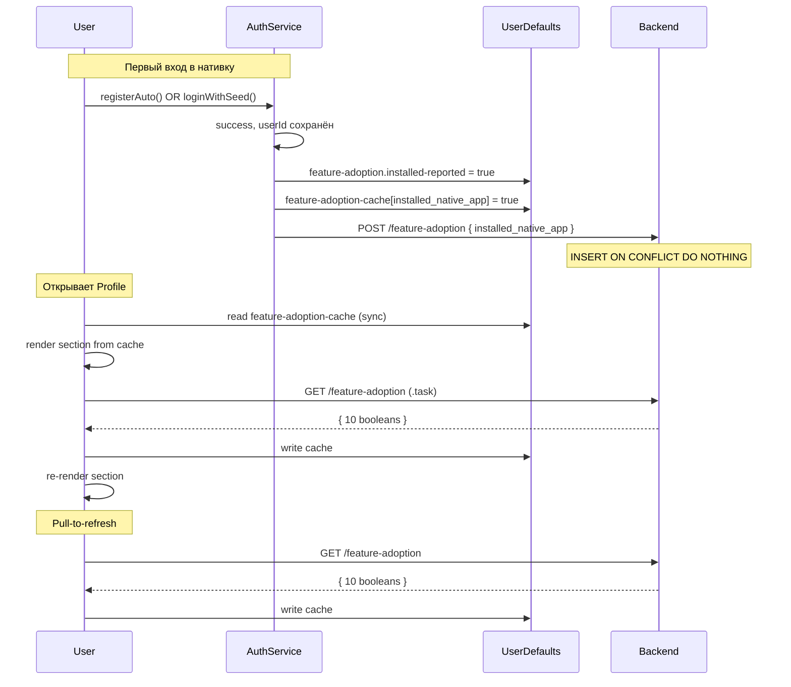
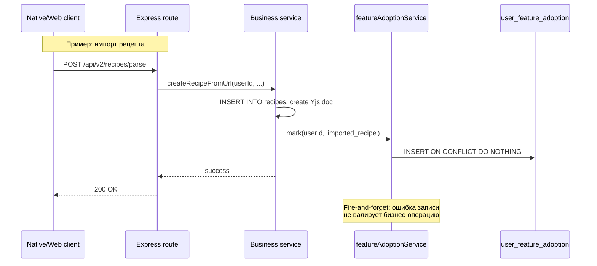
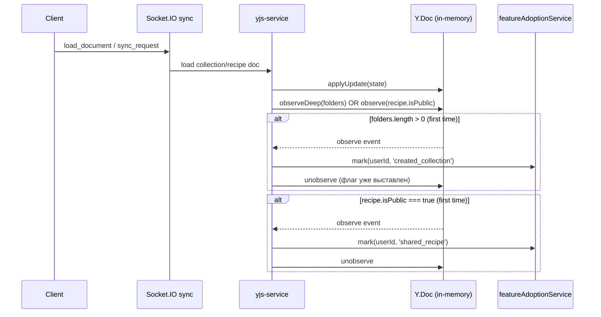

# Контракт: feature adoption API

**Связанная спека**: [spec.md](../spec.md)

## Endpoints

### `GET /api/users/me/feature-adoption`

Возвращает отчёт по 10 флагам для текущего пользователя.

**Auth**: `requireUserId` (owner-only).

**Реализация**: один `SELECT feature FROM user_feature_adoption WHERE user_id=$1`, маппинг в 10 булей. Никаких JOIN с другими таблицами, никаких live-вычислений.

**Response 200:**

```json
{
  "success": true,
  "data": {
    "installed_native_app": true,
    "installed_watch_app": false,
    "imported_recipe": true,
    "created_recipe": true,
    "created_collection": false,
    "shared_recipe": false,
    "connected_telegram": true,
    "connected_mcp_assistant": false,
    "sent_assistant_message": false,
    "used_shopping_list": false
  }
}
```

**Headers**:
- `Cache-Control: private, max-age=60`

**Гарантии**:
- Все 10 ключей всегда присутствуют в `data`.
- Значения — только `boolean`, никаких timestamp/counters.
- Сервер никогда не раскрывает `userId` в ответе.

### `POST /api/users/me/feature-adoption`

Записывает флаг adoption для текущего пользователя.

**Auth**: `requireUserId`.

**Body:**

```json
{
  "feature": "installed_native_app"
}
```

Schema (zod): `{ feature: z.enum(FEATURE_KEYS) }` — любой из 10 канонических ключей. Клиенты шлют только client-reported флаги: `installed_native_app` (iPhone) и `installed_watch_app` (watchOS); остальные проставляются серверными live events.

**Response 200:**

```json
{ "success": true, "data": { "recorded": true } }
```

**Response 400** (невалидный feature):

```json
{ "success": false, "error": "invalid_feature" }
```

**Idempotency**: повторные запросы с тем же `feature` для того же `user_id` не создают новую запись и не обновляют `first_used` (`ON CONFLICT DO NOTHING`).

**Rate limit**: стандартный `rateLimiter` bucket.

## Источник правды

Единая таблица `user_feature_adoption`. Никаких read-pass'ов на лету.

| Feature | Кто пишет в таблицу | Когда |
|---------|---------------------|-------|
| `installed_native_app` | iPhone native клиент через `POST /feature-adoption` | После успешного `registerAuto` или `loginWithSeed` |
| `installed_watch_app` | watchOS клиент через `POST /feature-adoption` (`FeatureAdoptionAPI`) | Первое открытие watch app с `userId` на часах |
| `imported_recipe` | Server event: `recipe-service.createRecipeFromUrl`/`createRecipeFromText` | После создания recipe doc при импорте |
| `created_recipe` | Server event: `recipe-service.createRecipeInDatabase` | После `INSERT INTO recipes` |
| `created_collection` | Yjs listener в `yjs-service` на collection doc | При первом `folders.length > 0` |
| `shared_recipe` | Yjs listener в `yjs-service` на recipe doc | При первом `isPublic === true` |
| `connected_telegram` | Server event: `telegram-service.connectUser` | После `INSERT INTO telegram_connections` |
| `connected_mcp_assistant` | Server event: `mcp-auth-service.issueTokens` | После `INSERT INTO oauth_access_tokens` |
| `sent_assistant_message` | Server event: `assistant-service.respond`/`respondStream` | После сохранения user-сообщения |

Все серверные writes — через helper `featureAdoptionService.mark(userId, feature)`: тонкая обёртка над `INSERT ... ON CONFLICT (user_id, feature) DO NOTHING`. Fire-and-forget, ошибка не валирует бизнес-операцию.

## Backfill

`server/scripts/backfill-feature-adoption.ts`. Запуск:

```bash
NODE_ENV=production bun server/scripts/backfill-feature-adoption.ts --env .env.prod [--apply] [--only-sql] [--limit N]
```

- Без `--apply` — dry run, только отчёт.
- `--only-sql` — только SQL-deriveable флаги (Phase 1), пропустить Yjs (Phase 2).
- `--limit N` — только первые N пользователей (для smoke).

**Phase 1 — SQL-deriveable** (один пакет INSERT'ов):

```sql
INSERT INTO user_feature_adoption (user_id, feature)
SELECT DISTINCT user_id, 'created_recipe' FROM recipes
ON CONFLICT DO NOTHING;

INSERT INTO user_feature_adoption (user_id, feature)
SELECT DISTINCT user_id, 'connected_telegram' FROM telegram_connections
ON CONFLICT DO NOTHING;

INSERT INTO user_feature_adoption (user_id, feature)
SELECT DISTINCT user_id, 'connected_mcp_assistant' FROM oauth_access_tokens
ON CONFLICT DO NOTHING;

INSERT INTO user_feature_adoption (user_id, feature)
SELECT DISTINCT user_id, 'sent_assistant_message' FROM assistant_messages
WHERE role = 'user'
ON CONFLICT DO NOTHING;
```

**Phase 2 — Yjs-derived** (по каждому пользователю):

```typescript
for (const user of allUserIds) {
  // Collection doc — check folders
  const collectionState = await supabase
    .from('recipe_collections')
    .select('yjs_state')
    .eq('user_id', user)
    .single();
  if (collectionState.data?.yjs_state) {
    const doc = new Y.Doc();
    Y.applyUpdate(doc, collectionState.data.yjs_state);
    if (doc.getArray('folders').length > 0) {
      await mark(user, 'created_collection');
    }
  }

  // Recipe docs — check originalRecipeLink (imported) и isPublic (shared)
  const recipes = await supabase
    .from('recipes')
    .select('yjs_state')
    .eq('user_id', user);
  let imported = false, shared = false;
  for (const r of recipes.data ?? []) {
    if (!r.yjs_state) continue;
    const doc = new Y.Doc();
    Y.applyUpdate(doc, r.yjs_state);
    const recipe = doc.getMap('recipe');
    if (recipe.get('originalRecipeLink')) imported = true;
    if (recipe.get('isPublic') === true) shared = true;
    if (imported && shared) break;
  }
  if (imported) await mark(user, 'imported_recipe');
  if (shared)   await mark(user, 'shared_recipe');

  // Shopping-list doc — check items array
  const shoppingState = await supabase
    .from('shopping_lists')
    .select('yjs_state')
    .eq('user_id', user)
    .maybeSingle();
  if (shoppingState.data?.yjs_state) {
    const doc = new Y.Doc();
    Y.applyUpdate(doc, shoppingState.data.yjs_state);
    const items = doc.getMap('shopping').get('items') as Y.Array<unknown> | undefined;
    if (items && items.length > 0) {
      await mark(user, 'used_shopping_list');
    }
  }
}
```

`installed_native_app` — **не backfill'ится**. Для существующих юзеров флаг станет true только когда они впервые залогинятся в нативке.

## Схема таблицы

```sql
CREATE TABLE IF NOT EXISTS user_feature_adoption (
  user_id    UUID NOT NULL REFERENCES public.users(id) ON DELETE CASCADE,
  feature    TEXT NOT NULL CHECK (feature ~ '^[a-z_]+$'),
  first_used TIMESTAMPTZ NOT NULL DEFAULT NOW(),
  PRIMARY KEY (user_id, feature)
);

CREATE INDEX IF NOT EXISTS idx_user_feature_adoption_user
  ON user_feature_adoption(user_id);
```

## Канонический список флагов

В коде — `const FEATURE_KEYS = [...] as const` (TypeScript) и `enum FeatureAdoptionItem` (Swift). Источник правды — таблица в `spec.md`. Любое расширение списка — синхронное изменение обоих enum'ов + этого документа.

```typescript
export const FEATURE_KEYS = [
  'installed_native_app',
  'installed_watch_app',
  'imported_recipe',
  'created_recipe',
  'created_collection',
  'shared_recipe',
  'connected_telegram',
  'connected_mcp_assistant',
  'sent_assistant_message',
  'used_shopping_list',
] as const;

export type FeatureKey = typeof FEATURE_KEYS[number];
export type FeatureAdoptionReport = Record<FeatureKey, boolean>;
```

## Client flow



## Server-side live event flow



## Yjs listener flow (`created_collection`, `shared_recipe`)



## Error handling

| Сценарий | Поведение клиента | Поведение сервера |
|----------|-------------------|-------------------|
| GET 401 | Не влияет на раздел (молчаливо); остаётся кэш | — |
| GET network error | Silent, остаётся кэш | — |
| GET timeout | Silent, остаётся кэш | — |
| GET мало ключей в ответе | Missing keys → treat as `false`, log warning | — |
| POST failed (`installed_native_app`) | Silent; флаг уже true локально (FR-038-N4) | — |
| Server event `mark()` failed | — | Лог warning, бизнес-операция не отменяется |
| Yjs listener exception | — | Лог warning, listener снимается (avoid death loop) |
| Backfill SQL error | — | Транзакция роллбэчится, скрипт продолжает со следующего пользователя |

## Migration path

При добавлении нового флага в будущем:

1. Добавить feature-ключ в `FEATURE_KEYS` (TS) и `FeatureAdoptionItem` (Swift).
2. Реализовать writing: либо server event в точке действия, либо Yjs listener, либо добавить в backfill.
3. Добавить i18n-ключ `account.feature-adoption.item.<name>`.
4. Миграция БД **не требуется** — таблица generic по `feature` колонке (`CHECK (feature ~ '^[a-z_]+$')`).
5. Если флаг нужно backfill'ить для существующих юзеров — повторно запустить `backfill-feature-adoption.ts --only-sql` или добавить новую логику в Phase 2.
