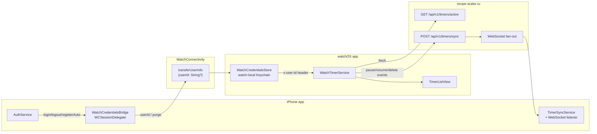

# Спецификация: watchOS Companion — Timers v1

**Линейная задача**: [MIK-184](https://linear.app/mikeozornin/issue/MIK-184/watchos-companion-app-prosmotr-tajmerov-i-pauseresume)
**Дата**: 2026-06-26
**Статус**: 🟡 В работе
**Зависимости**: [014-timers-sync](../014-timers-sync/spec.md) (DONE), [023-push-notifications](../023-push-notifications/spec.md) (DONE), [030-timer-widget](../030-timer-widget/spec.md) (DONE — переиспользуем примитивы)

## Цель

Companion-приложение `RecipeScalerNativeWatch` (watchOS 10+): автономный просмотр активных таймеров и pause/resume/delete с часов. Часы ходят в API напрямую через `x-user-id`; creds (`userId`) доставляются с iPhone один раз через WatchConnectivity и хранятся в watch-local Keychain. Без push в v1 — refresh при открытии/wake.

## User stories

1. Пользователь ставит iPhone app → watch app авто-ставится на парные часы.
2. Login на iPhone → `userId` улетает на часы через `WatchConnectivity.transferUserInfo`.
3. Открывает watch app → видит активные таймеры (живой countdown).
4. Свайп влево от левого края → pause/resume (toggle), tint blue.
5. Свайп влево от правого края → delete, tint system red.
6. Pause/resume/delete работает **без iPhone рядом** (autonomously через API).
7. Logout на iPhone → часы показывают not-authorized.
8. Тап по Settings → no-op + лёгкий haptic (зарезервированное место).

## Источники макетов

Figma `rVzFwMDS5SECfIq4HRLHya` node `132:635`:
- `132:40` — List Light (5 строк: 1-2 строки с длинным именем + 3 строки коротких)
- `132:636` — List Dark
- `132:686` — List Light (вариация акцентов)
- `132:758` / `132:918` — Empty Light
- `132:922` / `132:928` / `132:934` — Error Light

Not-authorized — в Figma не нарисован, собирается из примитивов по layout.md.

## Архитектура

### Read/write path

- **Read**: watch шлёт `GET /api/v1/timers/active` напрямую.
- **Write**: watch шлёт `POST /api/v1/timers/sync` напрямую (parity с `TimerSyncService`).
- **Cross-device fan-out**: сервер фанит событие на iPhone через существующий WebSocket (`TimerSyncService.handleWebSocketPayload`).

### Companion creds flow

1. iPhone login → `WatchCredentialsBridge.publish(userId:)` → `transferUserInfo(["userId": userId])`.
2. iPhone logout → `WatchCredentialsBridge.purge()` → `transferUserInfo(["userId": NSNull()])`.
3. Watch `didReceiveUserInfo` → `WatchCredentialsStore.userId = payload["userId"]`.
4. `transferUserInfo` queued — гарантированная доставка при следующем erreichаемом состоянии.

## Решения v1

- **Bundle ID**: `ru.recipescaler.RecipeScalerNative.watchkitapp` (следование существующей схеме).
- **watchOS min**: 10.0 (parity с iOS 17 floor проекта).
- **Push**: отсутствует в v1 — refresh при открытии/wake; push как follow-up.
- **Single target** (modern watchOS 9+ architecture, без `.watchkitapp.extension`).
- **`WKWatchOnly = NO`** — часы ставятся через iPhone app, не standalone.
- **Живой отсчёт** через `Text(timerInterval:)` — система сама обновляет, без `Timer.publish`.
- **Optimistic UI**: локально меняем статус сразу, POST на фоне, при ошибке — revert.
- **WebSocket на watch**: не подписываемся в v1. После каждого POST — `refresh()` через 500ms для консистентности.
- **Шаринг SwiftUI-примитивов**: вынос `WidgetTimerLinearRow`/`WidgetTimerPalette`/`WidgetTimerFormatting`/`WidgetFonts` из `HomeWidgetExtension` в `RecipeScalerCore/TimerViews/` — три target'а (виджет, часы, main app) используют общие.
- **Core refactor #1**: вынос `ServerActiveTimer` + смежных Codables из main app в `RecipeScalerCore/Networking/`.

## Цвета палитры

| Состояние | Цвет | Условие |
|-----------|------|---------|
| `normal` | `labels/primary` (semantic `.primary`) | remaining ≥ 10% duration |
| `soon` | `accents/orange` `#ff8d28` (light) / `#ff9230` (dark) | remaining < duration/10 |
| `exceeded` | `accents/red` (parity с `MobileTimerPanel`) | remaining < 0 |

## Свайпы (нативный SwiftUI `.swipeActions`)

| Edge | Action | Tint | Icon |
|------|--------|------|------|
| `.leading` | pause/resume toggle | `.blue` | `pause.fill` (running) / `play.fill` (paused) |
| `.trailing` | delete | `role: .destructive` (system red) | `trash` |

## Haptics

| Событие | Haptic | Повтор |
|---------|--------|--------|
| Pause (swipe) | `.click` | 1× |
| Resume (swipe) | `.click` | 1× |
| Delete (swipe) | `.success` | 1× |
| Settings tap | `.click` (light) | 1× |
| Timer expiration (foreground) | `.notification` | 3× с интервалом 0.5s |

## Вне scope v1

- Создание/добавление таймеров с часов (только pause/resume/delete).
- Complication / Smart Stack.
- Sign in with Apple / standalone login на часах.
- Push на timer_done с часов (follow-up — требует расширения `/api/push/apns-register`).
- UI статуса «часы подключены» на iPhone.
- Push на все timer events (pause/resume с другого устройства) — нужны серверные триггеры.

## Риски и митигации

| Риск | Митигация |
|------|-----------|
| `transferUserInfo` queued — watch стартует без creds | Not-authorized state + auto-refresh при `didReceiveUserInfo`. Не блокировать UI. |
| Optimistic revert гонки с WebSocket | На watch не подписываемся на WebSocket в v1; после каждого POST делаем `refresh()` через 500ms. |
| Watch deviceId коллизия с iPhone | `UserDefaults.standard` на watch — своя, `TimerSyncService.storedDeviceId()` даст новый UUID автоматически. |
| `timer_paused` payload без `remaining` ломает web parity | Включить `remaining: Int` в payload (parity с `TimerSyncService` mapping). |
| TestFlight watchOS — нужен paid Apple Developer | Документировано в [docs/PAID-APPLE-DEVELOPER-REQUIRED.md](../../docs/PAID-APPLE-DEVELOPER-REQUIRED.md); симулятор работает без этого. |
| WCSession недоступен на iPad-only build | `if WCSession.isSupported() { ... }` вокруг activate. |
| `RecipeScalerCore` тянет что-то iOS-only | Audit Core перед стартом; при необходимости `#if os(iOS)` guards. |
| Timer expiration в фоне | Без push не работает. Документированный trade-off. При открытии приложения — repeated haptic pattern + exceeded-state в UI. |
| Embed Watch App отключён в dev-сборке | main app target не имеет embed-фазы для watch app в текущей конфигурации (чтобы iOS Simulator build не пытался собрать watch под iOS). Для TestFlight/Release нужно включить: PBXCopyFilesBuildPhase "Embed Watch App" + target dependency. Задача → spec v1.1. |
| watchOS Simulator runtime не установлен | Manual QA на paired simulator deferred до установки runtime через Xcode → Settings → Platforms. Build на generic watchOS device верифицирует компиляцию. |

## Критерии успеха

- Login на iPhone → watch открывается и видит таймеры без доп. действий.
- Pause/resume через swipe → состояние консистентно между iPhone и watch в течение 1s.
- Delete через swipe → таймер исчезает с экрана watch и iPhone.
- Logout на iPhone → watch показывает not-authorized.
- Empty/error/not-authorized состояния рендерятся без крашей.
- Build green для iOS и watchOS таргетов на симуляторе.
- `audit-ui-layout.sh specs/039-watchos-timers` проходит.
