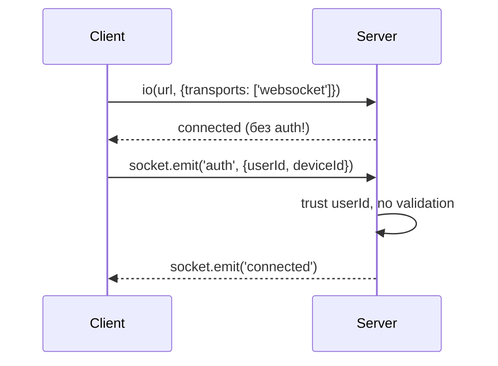
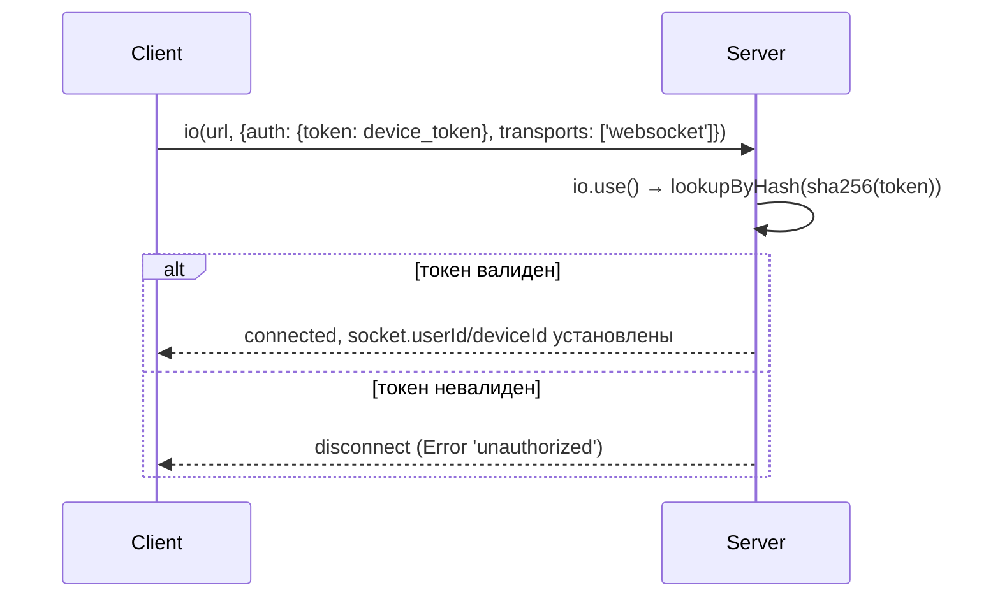
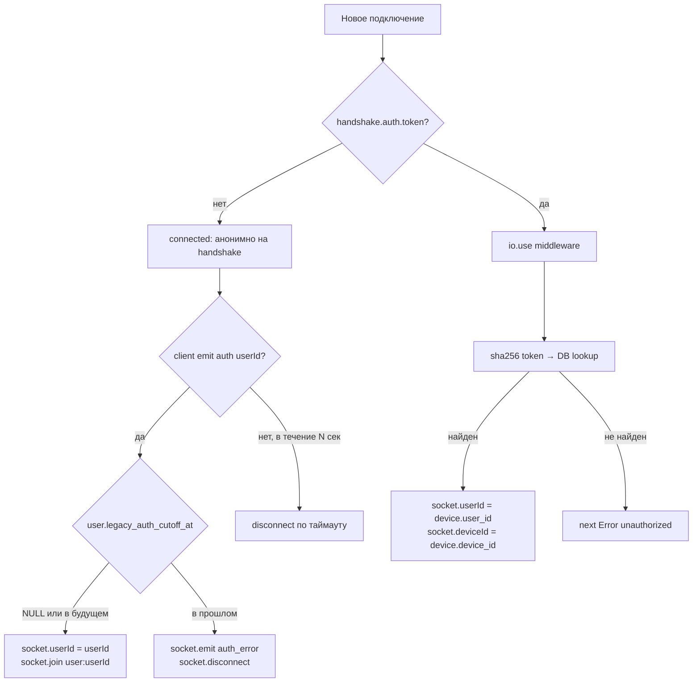

# Контракт: Socket.IO handshake auth

**Спека**: [../spec.md](../spec.md) (F7, R3)
**Связанные AC**: AC9
**Текущий код**: `server/src/index.ts:138-184` (legacy `socket.on('auth')`), `recipe-scaler/src/services/yjs-client.ts:449,489` (client-side `emit('auth')`)

## Контекст

Сегодня Socket.IO подключается **без auth на handshake**:



Это уязвимость: любой знающий публичный `userId` может подключиться и слушать timer-ticks/recipe-updates жертвы (`index.ts:138-184`).

## Целевое состояние (post-cleanup)



## Transitional period (F7)

Между PR1 и post-cutoff cleanup сосуществуют оба path:



### Поведение сервера в transitional

1. **`io.use()` handshake middleware** — валидирует `socket.handshake.auth.token` если есть.
2. **`socket.on('auth', {userId, deviceId})` handler** — остаётся, но проверяет `legacy_auth_cutoff_at`:
   - `NULL` или `> NOW()` → accept, `socket.join('user:'+userId)`.
   - `< NOW()` → `socket.emit('auth_error', {message: 'legacy auth disabled, please update'})` + `socket.disconnect(true)`.
3. **Login timeout**: если клиент подключился без `handshake.auth.token` и не прислал `emit('auth')` в течение 10 сек → disconnect.

### `?token=` query — НЕ ИСПОЛЬЗУЕТСЯ

В первой версии спеки был fallback на `?token=` query-string. **Удалён**: nginx access log (format `%r`) пишет URI полностью → утечка токена. Даже если masking настроить — defense-in-depth, не полагаемся. Клиенты всегда передают токен через `handshake.auth.token`.

## Server implementation sketch

```typescript
// server/src/index.ts (transitional)
io.use(async (socket, next) => {
  const token = socket.handshake.auth?.token;
  if (!token) {
    // Нет handshake-token — пусть legacy path или timeout займётся.
    return next();
  }
  const deviceTokenService = getContainer().deviceTokenService;
  const device = await deviceTokenService.lookupByHash(sha256Hex(token));
  if (!device) {
    return next(new Error('unauthorized'));
  }
  socket.data.userId = device.user_id;
  socket.data.deviceId = device.device_id;
  socket.data.authType = 'device_token';
  socket.join(`user:${device.user_id}`);
  // throttled UPDATE devices.last_seen (см. F4)
  await deviceTokenService.touchLastSeen(device.user_id, device.device_id);
  return next();
});

io.on('connection', (socket) => {
  // legacy path (transitional only)
  socket.on('auth', async (data) => {
    const { userId, deviceId } = data;
    if (!userId) {
      socket.emit('auth_error', { message: 'Missing userId' });
      return;
    }
    // NEW: check cutoff
    const user = await getContainer().userService.getLegacyCutoff(userId);
    if (user?.legacy_auth_cutoff_at && new Date(user.legacy_auth_cutoff_at) < new Date()) {
      socket.emit('auth_error', { message: 'Legacy auth disabled, please update the app' });
      socket.disconnect(true);
      return;
    }
    socket.data.userId = userId;
    socket.data.authType = 'legacy';
    if (deviceId) socket.data.deviceId = deviceId;
    socket.join(`user:${userId}`);
    socket.emit('connected', { message: 'Timer synchronization connected' });
  });

  // auth timeout (transitional)
  setTimeout(() => {
    if (!socket.data.userId) {
      socket.disconnect(true);
    }
  }, 10_000);
});
```

## Client implementation

### Web/PWA (`yjs-client.ts`)

```typescript
// Было:
this.socket = io(wsUrl, { transports: ['websocket'] });
// ...
this.socket.emit('auth', { userId: this.userId, deviceId });

// Стало (transitional, post-PR2):
const token = localStorage.getItem('device_token');
this.socket = io(wsUrl, {
  transports: ['websocket'],
  auth: token ? { token } : undefined,
});
// emit('auth') отправляется ТОЛЬКО если нет token (legacy fallback):
if (!token) {
  this.socket.emit('auth', { userId: this.userId, deviceId });
}
```

### iOS native (`YjsSyncService.swift`)

```swift
// Socket.IO client supports `auth` handshake (Socket.IO v4+):
let token = SharedAuthStore.token ?? ""
let opts: [String: Any] = [
    "transports": ["websocket"],
    "auth": ["token": token],
]
socket = SocketManager(socketURL: url, config: opts).defaultSocket
// legacy emit("auth", ["userId": ...]) — только если token пустой (grace period)
if token.isEmpty, let userId = SharedAuthStore.userId {
    socket.on("connect") { [weak self] _, _ in
        self?.socket.emit("auth", ["userId": userId, "deviceId": deviceId])
    }
}
```

### Apple Watch

Watch получает тот же `device_token` от iPhone через WC bridge (см. `watchconnectivity-creds-update.md`). Socket.IO на watch (если есть) — аналогично web/native.

## Errors

| Событие | Когда | Что делает клиент |
|---|---|---|
| `connect_error` с message `'unauthorized'` | `io.use()` отклонил handshake (невалидный token) | Logout flow: удалить токен, показать экран входа |
| `auth_error` с message `'Legacy auth disabled...'` | Legacy path + cutoff истёк | Logout flow: показать экран входа |
| Disconnect без `userId` через 10 сек | Не прислал ни handshake-token, ни emit('auth') | Reconnect с exponential backoff, потом logout flow |

## Post-cutoff cleanup

После истечения последнего активного `legacy_auth_cutoff_at` всех user'ов:

1. Удалить `socket.on('auth', ...)` handler.
2. Удалить auth-timeout (он был нужен только для legacy path).
3. Сделать `io.use()` обязательным: `if (!token) return next(new Error('unauthorized'))`.
4. Удалить legacy ветки в клиентах.

Это синхронизировано с удалением `x-user-id` middleware (F12) и `data.user.id` из login response (F17). Один cleanup-PR, три cleanup-actions.

## Тест-кейсы

- [ ] Handshake с валидным `auth.token` → connected, `socket.userId` установлен.
- [ ] Handshake с невалидным `auth.token` → `connect_error 'unauthorized'`.
- [ ] Handshake без token + `emit('auth', {userId})` где cutoff NULL → connected (legacy).
- [ ] Handshake без token + `emit('auth', {userId})` где cutoff в будущем → connected (grace).
- [ ] Handshake без token + `emit('auth', {userId})` где cutoff в прошлом → `auth_error` + disconnect.
- [ ] Handshake без token + ничего → disconnect через 10 сек.
- [ ] `?token=` query в URL → игнорируется сервером (не валидируется как auth).
