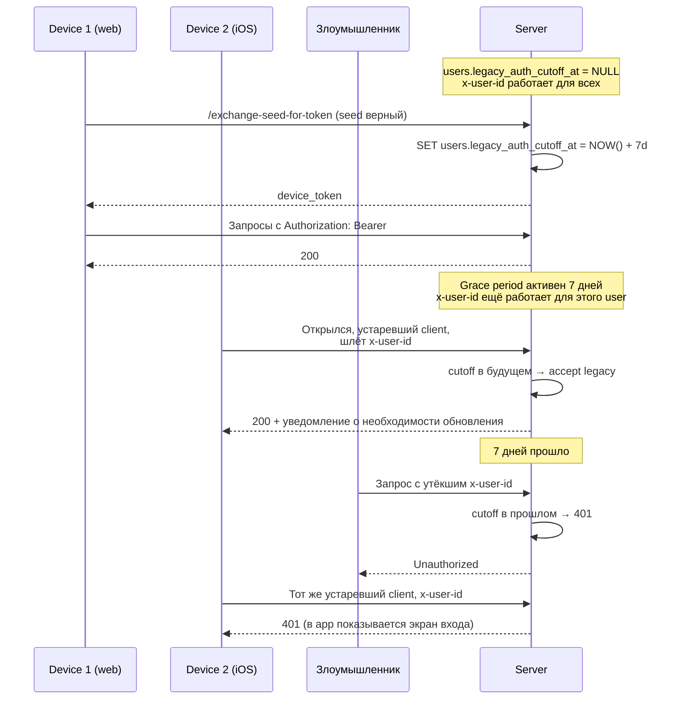
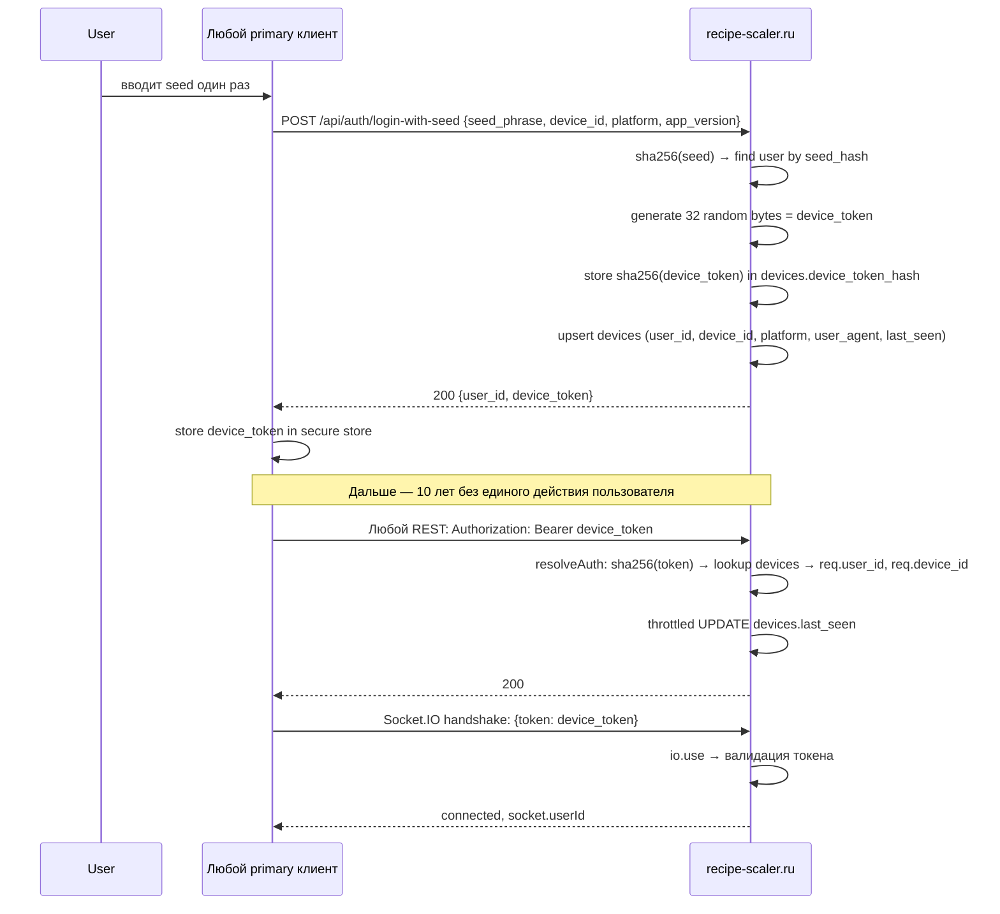
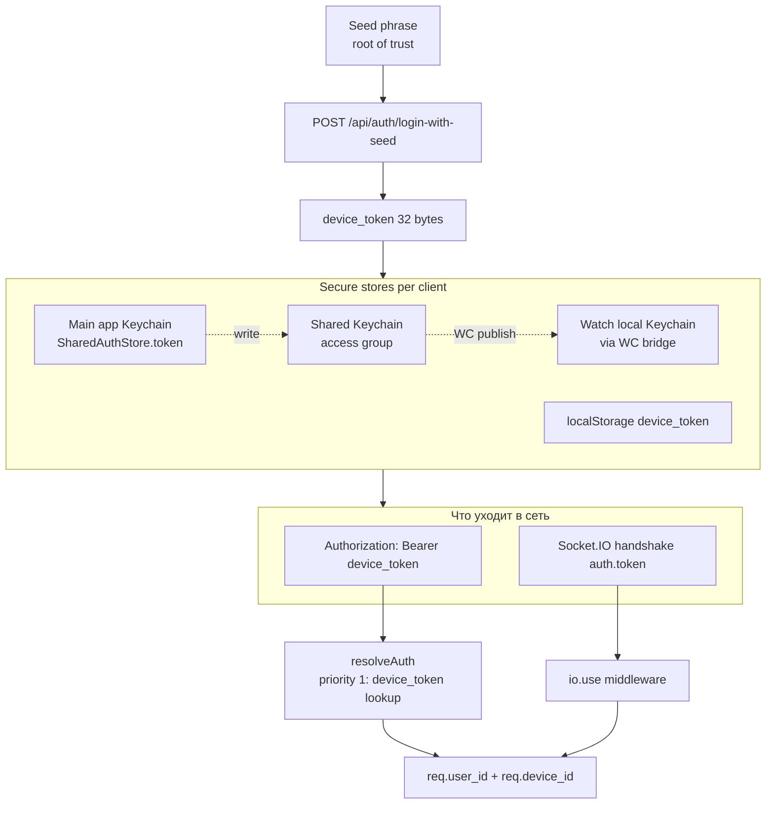
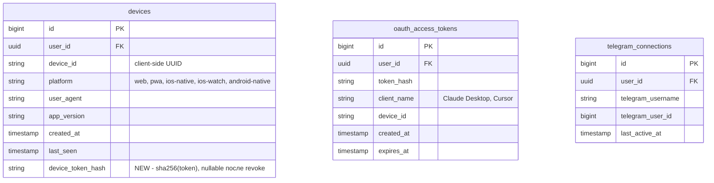

# Спецификация: Device tokens — замена plaintext `x-user-id` на bearer-токен

**Линейные задачи**: [MIK-117](https://linear.app/mikeozornin/issue/MIK-117/review-33-rasshireniya-autentificiruyutsya-tolko-plaintext-ne) (нахождение #33), частично [review finding #1](../../../review-kilo-glm-5.2-recipe-scaler-native.md) (корневая проблема: auth = публичный `userId`).
**Дата**: 2026-06-29 (initial), 2026-06-30 (post-review revision)
**Статус**: 🟢 Спека обновлена по результатам ревью, готова к началу реализации
**Зависимости**: существующая OAuth-инфраструктура MCP (`mcp-auth-service.ts`, таблицы `oauth_*`), существующая таблица `devices`, keychain-access-groups во всех iOS entitlements (remediated в spec 034/039).

## Контекст и мотивация

Сегодня **все клиенты** (web/PWA, iOS native, Share/Action extensions, Apple Watch, MCP/Chrome ext) аутентифицируются к API строкой `x-user-id: <uuid>`. UUID — публичный идентификатор. Утёк `userId` (через логи, ссылку, чужой кэш) = бессрочная возможность impersonation: чтение/запись рецептов, таймеров, профилей, shopping lists, sync-состояний. Нет server-side revocation, нет второго фактора. Находка #1 в security review помечает это как Critical и отмечает, что корневая причина порождает находки #2, #3, #8, #12, #33.

Параллельно MCP subsystem уже использует OAuth 2.1 Bearer-токены (1h access / 365d refresh, PKCE, server-side revoke). Но seed-flow login (`POST /api/auth/login-with-seed`) **не возвращает токен** — только `{ user: { id } }`. Токен из `AuthService.token` явно сбрасывается в `nil` после каждого логина. `APIClient` на iOS уже умеет слать `Authorization: Bearer`, но поле `authToken` никогда не выставляется.

### Почему не подходит существующий OAuth-flow

- TTL 1h/365d противоречит требованию «не протухает никогда (10–50 лет), без галочек».
- PKCE-флоу требует браузерного round-trip на каждый логин — ломает UX seed-login на native.
- Refresh-flow = race conditions, BG-задачи, expired-token handling в extensions — операционная сложность не оправдана для household-app.

## Цель

Ввести **long-lived device-scoped bearer token** (`expires_at = NULL`) для всех primary клиентов (web, native, extensions, watch). Токен = 32 случайных байта, в БД хранится только SHA-256 hash. Сервер валидирует токен на каждом запросе (REST + Socket.IO). Утёкший токен можно отозвать. Утёкший `userId` бесполезен без токена.

**Вне scope:**
- MCP / Chrome extension остаются на существующем OAuth 1h/365d — они bootstrap'ятся из primary сессии и могут re-auth за минуту.
- Telegram bot connect-code flow — ортогонален токенам, не меняется.
- UI «Активные сессии» — отдельная будущая спека (`04Y-active-sessions-ui/`). Текущая спека только создаёт для него данные (см. раздел «Будущий UI»).
- Migration уже залогиненных пользователей — прозрачно, без UI.

## Non-goals (намеренно)

- **Короткоживущие access-токены с refresh-flow** — отказались: удобство важнее фейковой безопасности; refresh-инфраструктура = операционная сложность.
- **WebAuthn / passkey на каждое открытие** — отказались: оффлайн-first + плохой UX.
- **Ed25519 signed requests** — отказались: не работает на web, оверкилл для threat model.
- **Email / password / 2FA** — отказались: простота входа важнее.
- **Per-extension / per-watch scoped tokens** — отказались: один токен на устройство, проще поддержка; watch — sub-device от iPhone через WC bridge, тот же токен. **Known residual risk**: кража watch отдельно от iPhone → полноценный токен до logout на iPhone; отозвать только watch — невозможно. Принято как acceptable для household-app threat model.
- **Cookie-based web storage (`__Host-` + httpOnly + SameSite=Strict)** — отказались для web/PWA: PWA install на iOS Safari + cross-origin (API `recipe-scaler.ru` против frontend `app.recipe-scaler.ru`) создают ITP-проблемы. localStorage + revoke-on-leak вместо. Residual risk: persistent XSS (см. F18, threat model).

## User stories

1. Пользователь регистрируется/логинится seed-фразой на новом устройстве → сервер выдаёт `device_token` (256-bit, без срока) → клиент хранит его в secure store → все последующие запросы (10 лет) идут с `Authorization: Bearer`.
2. Пользователь обновляет app/web до новой версии → при первом запуске миграция прозрачная: если в secure store есть seed, но нет токена → `/exchange-seed-for-token` тихо → токен сохранён → работает.
3. Пользователь логинится на iPhone → `device_token` улетает на Apple Watch через WatchConnectivity → watch ходит в API с тем же токеном.
4. Пользователь открывает Share Extension на iOS → extension читает `device_token` из Shared Keychain → шлёт `Authorization: Bearer` → recipe импортируется под его аккаунтом.
5. Пользователь делает logout на устройстве → сервер удаляет токен (`UPDATE devices SET device_token_hash = NULL`) → токен мгновенно инвалидирован.
6. Пользователь (в будущем UI) отзывает устройство с другого устройства → токен этого устройства перестаёт работать.
7. Утёк `userId` через логи/ссылки — не даёт impersonation без токена.

## Требования

### Функциональные

- **F1.** Сервер выдаёт `device_token` (32 случайных байта, base64url, ~43 символа) при каждом успешном login (`/api/auth/login-with-seed`, `/api/auth/register-auto`, `/exchange-seed-for-token`). Seed phrase = BIP-39 12 слов (128 бит); seed-matching — SHA-256 по `users.seed_hash` (см. существующий `routes/auth.ts:241-245`).
- **F2.** Сервер хранит только `sha256(device_token)` в `devices.device_token_hash` (`UNIQUE`, nullable, см. F19 про NULL-семантику). Существующий `UNIQUE(user_id, device_id)` на `devices` остаётся (см. `create-dev-tables.sql:92`) — конфликт-target для upsert. Plaintext токен возвращается **один раз** в response body логина. Hash сравнивается **только** через SQL `WHERE device_token_hash = $1` (DB-side index lookup); application-level string compare токенов или hash'ей запрещён (см. AC22).
- **F3.** `device_token_expires_at = NULL` — без срока. Migration существующих записей: NULL по умолчанию.
- **F4.** Auth middleware (`resolveAuth`, сегодня `middleware/auth.ts:84-115`) получает третий приоритет: 1) device_token Bearer → `device_token_hash` lookup → `req.user_id`, `req.device_id`; 2) OAuth Bearer (сегодня priority 1, остаётся как есть); 3) legacy `x-user-id` (сегодня priority 2, становится priority 3 с cutoff-проверкой из F12). При совпадении device_token обновляет `devices.last_seen` (throttled — не чаще раза в час на device, сравнение с текущим `last_seen`).
- **F5.** Новый endpoint `POST /api/auth/exchange-seed-for-token` — для миграции уже залогиненных клиентов: `{seed_phrase, device_id}` → `{user_id, device_token}`. Тот же seed-matching, что в `login-with-seed`; upsert в `devices` с обновлением `device_token_hash`. На endpoint распространяется существующий `authRateLimiter` (5 req / 15 min per IP, см. `middleware/rateLimiter.ts:104-126`).
- **F6.** Logout (`POST /api/auth/logout`) инвалидирует токен: `UPDATE devices SET device_token_hash = NULL WHERE user_id AND device_id`. Запись в `devices` остаётся для history; см. F19 про orphan cleanup.
- **F7.** **Socket.IO handshake auth — transitional rollout.** PR1 добавляет `io.use()` middleware, валидирующий `socket.handshake.auth.token` (Bearer-style, без `Bearer ` prefix) через `DeviceTokenService.lookupByHash()`. На handshake `socket.userId`, `socket.deviceId` проставляются. При невалидном токене → `next(new Error('unauthorized'))` → disconnect на handshake. Существующий `socket.on('auth', {userId, deviceId})` (`index.ts:138-184`) **сохраняется как legacy path** до истечения последнего активного `legacy_auth_cutoff_at` — тот же grace, что для REST (F12). На legacy path сервер проверяет cutoff: если `users.legacy_auth_cutoff_at` в прошлом → `socket.emit('auth_error')` + disconnect; если NULL или в будущем → accept. После истечения последнего активного cutoff серверный `socket.on('auth')` handler **удаляется** отдельным PR. **Query `?token=` fallback не используется** (гарантированный leak в nginx access logs, см. threat model). Клиенты всегда передают токен через `socket.handshake.auth.token`.
- **F8.** iOS extensions (Share, Action) читают токен из `SharedAuthStore.token` (Shared Keychain, тот же access group, `kSecAttrSynchronizable = kCFBooleanFalse` явно, см. F21).
- **F9.** iOS main app: `AuthService` декодирует `device_token` из login response → пишет в `SharedAuthStore.token` → `APIClient.configure(authToken:)`.
- **F10.** Apple Watch: `WatchCredentialsBridge` передаёт `device_token` (в дополнение к `userId`). `WatchCredentialsStore` хранит `device_token` в watch-local Keychain. `APIClient` на watch configure с `authToken`. Watch = sub-device от iPhone, **тот же токен**; известные residual risk см. в threat model и non-goals.
- **F11.** Web/PWA: `localStorage.device_token` вместо `localStorage.userId` для auth-заголовков. Все чтения `localStorage.getItem('userId')` для построения auth-заголовков заменяются на единый accessor `getAuthToken()` → возвращает Bearer-token если есть, иначе legacy userId. См. F16 для inventory.
- **F12.** Обратная совместимость с cutoff: `x-user-id` работает для user account до истечения per-user grace period (7 дней с момента первой успешной миграции любого device'а этого user'a). После cutoff — `x-user-id` для этого `user_id` полностью отклоняется сервером. `Authorization: Bearer` (device_token или OAuth) — единственный способ auth. Fallback остаётся только для read-only public endpoints (точный список — приложение A).
- **F13.** При первой успешной миграции user'a (через `/exchange-seed-for-token` или `/login-with-seed` или `/register-auto` с новым device) сервер устанавливает `users.legacy_auth_cutoff_at = NOW() + 7 days` (если ещё не установлено). Idempotent.
- **F14.** Web/PWA: если `users.legacy_auth_cutoff_at` установлено и grace period активен — баннер в списке рецептов: «Более защищённая схема авторизации. Откройте приложение на всех устройствах в течение N дней (до {date}).» с кнопкой «Подробнее». Баннер скрывается, когда все **активные** устройства user'a мигрировали (см. F20 про active threshold) или после истечения grace.
- **F15.** Если у возвращающегося клиента нет ни `device_token`, ни `seed_phrase` в локальном хранилище — экран входа (ввести seed). Никаких неявных exchange по публичному `user_id`.

### Login response — legacy shim (B2)

- **F16.** Формат response `/api/auth/login-with-seed`, `/api/auth/register-auto`, `/api/auth/exchange-seed-for-token` в моменте PR1 включает **оба** поля для backward-compat:
  - `data.user.id` (legacy, как сегодня — `routes/auth.ts:424,485`) — чтобы неизменившиеся клиенты продолжили работать.
  - `data.device_token` (новое) — мигрировавшие клиенты читают его и сохраняют.
  - `data.user.data_version` (для register-auto, как сегодня).
  - `data.seed_phrase` (только для register-auto, как сегодня).
  - Точный shape — см. `contracts/login-response.md`.
- **F17.** `data.user.id` (legacy shim) **удаляется** из response после истечения последнего активного `legacy_auth_cutoff_at` всех user'ов — т.е. одновременно с окончательным отключением `x-user-id` и `socket.on('auth')`. Один и тот же cutoff управляет тремя устаревшими путями: REST `x-user-id`, WS `emit('auth')`, response `data.user.id`. До этого момента — оба поля в response.

### Web storage decision (B5)

- **F18.** Web/PWA хранит `device_token` в `localStorage` (как `userId` сегодня). Альтернатива — `__Host-` prefixed cookie + `httpOnly` + `SameSite=Strict` — **отвергнута**: PWA install on iOS Safari + cross-origin API (`recipe-scaler.ru` API против `app.recipe-scaler.ru` фронтенд) создают ITP-проблемы и сложность debug'а, которая перевешивает преимущество httpOnly против XSS. Residual risk: persistent XSS позволяет пере-кражу токена после каждого re-login. Mitigation: (1) будущий UI «Активные сессии» позволяет revoke устройства; (2) logout инвалидирует токен на сервере. Threat model это отражает.
- **F18.1.** **Seed сохраняется в localStorage web/PWA после успешной миграции** (product decision, фикс `74e5232`). Seed нужен, чтобы: (а) Settings → Account → «Login on another device» показывал фразу и QR (`seed-auth.tsx:92-94,938-950`); (б) lost-token recovery: при отозванном/устаревшем `device_token` клиент молча делает повторный `/exchange-seed-for-token` (`auth-device-token-migration.ts:16`). Сервер хранит только `sha256(seed)` в `users.seed_hash` и не может вернуть seed клиенту — поэтому единственный источник seed для cross-device login и recovery — клиентский storage. Seed удаляется из localStorage **только** при явном logout (см. F6, `seed-auth.tsx` `logout()`). Это умышленный компромисс: persistent XSS на web = кража seed = полная компрометация (как и до миграции, не регрессия). Усиление защиты от XSS — отдельная задача, не блокер этой спеки.

### DB NULL-семантика и cleanup (H3, H9)

- **F19.** `devices.device_token_hash` — `TEXT UNIQUE NULLABLE`. Postgres допускает multi-NULL в UNIQUE constraint (поведение по умолчанию) — несколько отозванных устройств не конфликтуют. После logout или rotate row остаётся в `devices` для history (future Active Sessions UI), `device_token_hash = NULL`. Cleanup job (обязательный, не optional): cron daily, `DELETE FROM devices WHERE device_token_hash IS NULL AND last_seen < NOW() - INTERVAL '90 days'`. Без cleanup `allDevicesMigratedForUser()` ломается.
- **F20.** `allDevicesMigratedForUser(user_id)` для баннера (F14) и AC16 учитывает только **активные** device records: `last_seen > NOW() - INTERVAL '90 days'`. Orphan rows без токена, но и без активности > 90 дней, игнорируются. Это предотвращает «баннер никогда не скрывается» для multi-device user'а с историей logout'ов.

### Audit log (H8)

- **F21.** Auth security events логируются в таблицу `auth_audit_log`:
  ```sql
  CREATE TABLE auth_audit_log (
    id BIGSERIAL PRIMARY KEY,
    user_id UUID,
    device_id TEXT,
    event_type TEXT NOT NULL,  -- 'token_issued' | 'token_revoked' | 'cutoff_set' | 'cutoff_triggered' | 'legacy_rejected'
    ip TEXT,
    user_agent TEXT,
    ts TIMESTAMPTZ NOT NULL DEFAULT NOW()
  );
  ```
  Токен и seed **никогда** не пишутся в audit log. Retention 90 дней, cleanup тем же cron. Не отображается в UI — только для forensics при compromised-account investigation.

### Keychain attributes (iOS/watch, M1+B6 residual)

- **F22.** iOS Keychain для `SharedAuthStore.token` и `WatchCredentialsStore.token` использует явно: `kSecAttrAccessibleAfterFirstUnlockThisDeviceOnly` + `kSecAttrSynchronizable = kCFBooleanFalse`. Это исключает iCloud Keychain sync и минимизирует exposure в iTunes/encrypted backup (defense-in-depth, не полная защита против локального attacker'а с device passcode).

### Нефункциональные

- **N1.** Zero downtime deploy. Server сначала учится читать токены, потом клиенты начинают слать. Фолбэк на `x-user-id` сохраняется per-user 7 дней после первой миграции.
- **N2.** Migration прозрачный для большинства: ноль UI, ноль actions, кроме информационного баннера о необходимости открыть app на других устройствах в течение grace.
- **N3.** Keychain / localStorage — единственное место хранения plaintext токена на клиенте. Не логируется, не попадает в crash dumps, не уходит в analytics. iOS/watch Keychain атрибуты — см. F22.
- **N4.** Seed phrase остаётся корнем доверия. Утёк seed = та же проблема что сегодня (можно выпустить новые токены от имени пользователя). Это не чинится токенами — это фундаментальное ограничение seed-only auth.
- **N4.1.** **Storage policy для seed после миграции (web и native одинаковы):** seed **остаётся** в клиентском storage после успешной миграции. Это нужно для двух функций, у которых нет альтернативного источника seed:
  - **Settings → Account → «Login on another device»** показывает seed и QR (`seed-auth.tsx`, нативный Profile → Секретная фраза). Сервер хранит только `seed_hash` и не может вернуть plaintext.
  - **Lost-token recovery**: при отозванном/устаревшем `device_token` клиент повторно вызывает `/exchange-seed-for-token` (`auth-device-token-migration.ts`). Без seed в storage — экран входа вместо тихого восстановления.
  - **Web/PWA**: `localStorage.seed_phrase` удаляется только при явном `logout()` (см. F6). XSS exposure принят как residual risk (F18.1) — не регрессия относительно pre-041 состояния.
  - **iOS/watchOS native**: seed в app-local Keychain, не попадает в iCloud Keychain (`kSecAttrSynchronizable = false`), требует biometric для показа в UI. Удаляется только при `logout()`.
- **N4.2.** **Cross-feature impact audit (обязательно для будущих изменений `localStorage.seed_phrase`)** — inventory читателей:
  - `recipe-scaler/src/pages/seed-auth.tsx` — показ фразы + QR в Settings.
  - `recipe-scaler/src/services/auth-device-token-migration.ts` — lost-token recovery.
  - `recipe-scaler/src/services/auth-register-auto.ts` — guard от ghost-регистрации.
  - `recipe-scaler/src/services/v2-auth-api.ts` — persistence.
  - Любое изменение storage policy для seed требует проверки всех читателей выше и обновления этой секции.
- **N5.** Grace period = 7 дней. Configurable через env (`LEGACY_AUTH_GRACE_DAYS`, default 7). Достаточно для большинства multi-device юзеров, минимально терпимое окно уязвимости.
- **N6.** **Server-side access logging** — `Authorization: Bearer` header **не должен** попадать в текстовые access logs в проде. Express сегодня не пишет HTTP access-log (нет morgan/winston-stream в `app.ts`), точечные логи только для OAuth/MCP/well-known (`app.ts:101,117,136`). Nginx/reverse-proxy в проде (вне репо) — конфигурируется с маскированием `Authorization` (custom log-format, не default `%r`). Если masking невозможен — residual risk принимается явно (см. threat model).
- **N7.** **Audit log retention** — `auth_audit_log` (F21) хранится 90 дней, после чего партицируется/удаляется. Не превышает 90 дней для минимизации PII exposure.

## Migration scenarios

| Кейс | Что происходит | Действий юзера |
|---|---|---|
| Открыл app/web, `device_token` в secure store | Запросы с Bearer | 0 |
| Auto-update app, открыл первый раз, seed в store | `/exchange-seed-for-token` тихо | 0 |
| Browser вычистил localStorage (PWA, Safari ITP), seed потерян | Экран входа, ввести seed | ввести seed |
| Reset All Settings (iOS), seed в Keychain потерян | Экран входа, ввести seed | ввести seed |
| Logout когда-то, сейчас возврат | Re-login с seed | ввести seed |
| Другое устройство не открывали 2 месяца, grace истёк | `x-user-id` отклонён (401) → клиент показывает экран входа | ввести seed |

## Cutoff flow (детально)



## Архитектура



### Карта клиентов после миграции



### Threat model — что улучшается, что нет

| Угроза | До | После |
|---|---|---|
| Утёк `userId` через логи/ссылки | Полная бессрочная impersonation (REST + WS) | **Не работает** без токена |
| Утёк device_token из client storage | N/A | Impersonation до явного revoke. Можно отозвать с любого устройства. Один токен = одно устройство. |
| Утёк device_token в server-side access logs | N/A | **Mitigation**: N6 (nginx masking) + F21 (audit log без токена). Residual risk: зависит от конфигурации прокси в проде. |
| Утёк seed phrase | Полная компрометация | Полная компрометация (без изменений — seed остаётся корнем доверия) |
| XSS на web/PWA | Кража seed из localStorage = полная компрометация | Кража `device_token` = компрометация **этого устройства** до logout. Можно отозвать. Кража `seed_phrase` = полная компрометация аккаунта (seed сохранён в localStorage для cross-device login и recovery, см. F18.1). Persistent XSS = пере-кража после каждого re-login — residual risk принят (см. F18, F18.1). |
| **Потеря seed на единственном устройстве (logout / browser wipe)** | Аккаунт потерян без recovery | **Та же регрессия**: seed остаётся в localStorage только до logout. Logout = `localStorage.clear()` + серверный revoke `device_token_hash`. Если других активных устройств нет — восстановить аккаунт невозможно. Принято как non-goal (seed = root of trust). Будущая Active Sessions UI не помогает, потому что нет второго канала для recovery. |
| **Spoof Socket.IO** | **Trivial** — сегодня WS подключается без auth, потом клиент `emit('auth', {userId})` с любым userId. Любой знающий публичный userId слушает timer-ticks/recipe-updates жертвы в реальном времени (`index.ts:138-184`). | **Невозможно** без токена после removal legacy path (см. F7). В transitional period legacy path ещё принимает `userId`, но проверяет `legacy_auth_cutoff_at` — после cutoff anonymous-spoof закрывается для этого user'а. |
| **Brute force токена** | N/A | 2^256 — физически невозможно. |
| **Кража watch отдельно от iPhone** | N/A | Полноценный device_token до logout на iPhone. Отозвать **только watch** невозможно — токен тот же (см. non-goals). Mitigation: accept как known residual risk; мониторинг через `devices.last_seen` anomaly (future Active Sessions UI). |
| **Cutoff-DoS через утёкший seed** | N/A | Злоумышленник с утёкшим seed жертвы вызывает `/exchange-seed-for-token` от её имени → сервер устанавливает cutoff → жертва не успевает мигрировать остальные устройства. Mitigation: rate limiting на `/exchange-seed-for-token` уже есть (`authRateLimiter`, F5); lockout через `authRateLimiter` (5 req / 15 min per IP). Residual risk: targeted attack с разных IP. |
| **Replay/rotate device_token** | N/A | `UNIQUE (user_id, device_id)` + `onConflict` upsert: новый login на тот же device заменяет старую запись (`create-dev-tables.sql:92`, `index.ts:156`). Старый `device_token_hash` перетирается. |
| **Timing leak на hash compare** | N/A | DB-side index lookup, не application-level compare (F2, AC22). Timing-leak минимален (B-tree O(log n)). |

### Будущий UI «Активные сессии» — что эта спека подготавливает

UI читает UNION из трёх источников:



UI показывает сессии с типами: «Web · Safari 12», «PWA · iOS», «Native · iOS», «Расширение · Chrome 39», «MCP: Claude Desktop», «MCP: Cursor», «Telegram bot @nickname». Revoke-кнопка для каждой строки: `DELETE device_token_hash` / `POST /oauth/revoke` / `POST /api/telegram/disconnect`. **Реализация UI — отдельная спека.**

### Развилки, зафиксированные при обсуждении

- **Lifetime**: `expires_at = NULL` (не формальный +100 лет).
- **Scope**: полный доступ, без per-extension ограничений.
- **Cross-repo**: один spec, изменения и в `recipe-scaler-web`, и в `recipe-scaler-native`.
- **Socket.IO**: включаем в scope — без него sync остаётся спуфяемым.
- **Watch**: sub-device от iPhone, тот же device_token. При отзыве токена у iPhone → watch при следующей попытке переаутентифицируется через iPhone (WC bridge передаст новый токен после повторного seed-login на iPhone).
- **Migration primary**: прозрачный через `/exchange-seed-for-token` (seed → token), без UI.
- **Migration fallback**: при потере seed клиентом — экран входа, ввести seed. Никаких неавторизованных exchange по публичному `user_id`.
- **Legacy cutoff**: per-user grace period **7 дней** с момента первой успешной миграции любого device'а этого user'a (`users.legacy_auth_cutoff_at`). После cutoff — `x-user-id` полностью отклоняется для этого user account. Configurable через env (`LEGACY_AUTH_GRACE_DAYS`, default 7).
- **Уведомление**: баннер в web (список рецептов) при активном grace — напоминает открыть app на всех устройствах. Скрывается после миграции всех устройств или после cutoff.

## Acceptance criteria

- [ ] AC1. `POST /api/auth/login-with-seed` возвращает `{success, data: {user: {id, data_version?}, device_token}}`. Legacy `user.id` сохраняется для неизменившихся клиентов (F16, F17) до истечения последнего активного cutoff.
- [ ] AC2. `POST /api/auth/register-auto` возвращает `{success, data: {user: {id, data_version}, seed_phrase, device_token}}`. Legacy `user.id` сохраняется аналогично AC1.
- [ ] AC3. `POST /api/auth/exchange-seed-for-token` принимает `{seed_phrase, device_id}` → возвращает `{success, data: {user: {id}, device_token}}`. Покрыт `authRateLimiter` (5 req / 15 min per IP).
- [ ] AC4. Сервер валидирует `Authorization: Bearer` на protected endpoints через `device_token_hash` lookup. Приоритет: 1) device_token Bearer; 2) OAuth Bearer; 3) legacy `x-user-id` с cutoff-проверкой.
- [ ] AC5. `devices` таблица содержит `device_token_hash` (UNIQUE, nullable), `device_token_expires_at` (NULL), существующий `UNIQUE(user_id, device_id)` сохранён, `last_seen` обновляется (throttled — не чаще раза в час на device).
- [ ] AC6. `users` таблица содержит `legacy_auth_cutoff_at` (TIMESTAMPTZ, nullable). Устанавливается idempotent при первой успешной миграции user'a = NOW() + 7 дней (configurable через `LEGACY_AUTH_GRACE_DAYS`).
- [ ] AC7. Auth middleware: если `users.legacy_auth_cutoff_at` в прошлом — `x-user-id` для этого user отклоняется с 401. Если в будущем или NULL — принимается (grace period или не мигрировал).
- [ ] AC8. `POST /api/auth/logout` инвалидирует токен (`UPDATE devices SET device_token_hash = NULL WHERE user_id AND device_id`). Запись остаётся для history.
- [ ] AC9. Socket.IO: PR1 добавляет `io.use()` handshake middleware (валидация `socket.handshake.auth.token` через `lookupByHash`). Legacy `socket.on('auth', {userId, deviceId})` сохраняется **только** на transitional period с cutoff-проверкой: `legacy_auth_cutoff_at` в прошлом → `auth_error` + disconnect. После истечения последнего активного cutoff legacy handler удаляется отдельным cleanup-PR. `?token=` query fallback не используется нигде.
- [ ] AC10. iOS native: `SharedAuthStore.token` (Keychain access group, `kSecAttrAccessibleAfterFirstUnlockThisDeviceOnly`, `kSecAttrSynchronizable = kCFBooleanFalse`), `APIClient.configure(authToken:)` вызывается при login.
- [ ] AC11. iOS extensions: Share/Action читают `SharedAuthStore.token`, шлют Bearer.
- [ ] AC12. Apple Watch: `WatchCredentialsBridge` передаёт `device_token` в payload WC; `RecipeScalerNativeWatch` персистит `device_token` в watch-local Keychain (те же атрибуты безопасности, см. F22) и вызывает `APIClient.shared.configure(authToken:)` при запуске; HTTP-запросы с watch содержат `Authorization: Bearer`.
- [ ] AC13. Web/PWA: после миграции (токен в secure store) — все API-вызовы включают `Authorization: Bearer`. До миграции — `x-user-id` (legacy, grace period). Все чтения `localStorage.getItem('userId')` для построения auth-заголовков идут через единый `getAuthToken()` accessor.
- [ ] AC14. Migration: при первом запуске новой версии на уже залогиненном устройстве с seed в хранилище — прозрачно обменивает seed на токен.
- [ ] AC15. Lost-seed fallback: при отсутствии seed и device_token клиент показывает экран входа (неавторизованный exchange по user_id запрещён).
- [ ] AC16. Web/PWA: баннер в списке рецептов при активном grace period для user'a — «Более защищённая схема авторизации. Откройте приложение на всех устройствах в течение N дней (до {date})» с кнопкой «Подробнее». Скрывается после миграции всех **активных** устройств (F20) или после истечения grace.
- [ ] AC17. ~~Удалён~~ — закрытие Linear MIK-117 перенесено в `tasks.md` фаза 6 (PM action, не AC).
- [ ] AC18. iOS in-app баннер (Settings → Account) или эквивалент: тот же текст, что web-баннер, для multi-device iOS-only households. Required (не optional — R7 поднят до required).
- [ ] AC19. Audit log: таблица `auth_audit_log` пишет события `token_issued`, `token_revoked`, `cutoff_set`, `cutoff_triggered`, `legacy_rejected` с `{user_id, device_id, ip, user_agent, ts}`. Токен и seed не пишутся. Retention 90 дней.
- [ ] AC20. `allDevicesMigratedForUser(user_id)` возвращает true только когда все device records с `last_seen > NOW() - INTERVAL '90 days'` имеют `device_token_hash IS NOT NULL`. Orphan rows без активности > 90 дней игнорируются.
- [ ] AC21. Cleanup job: cron daily, `DELETE FROM devices WHERE device_token_hash IS NULL AND last_seen < NOW() - INTERVAL '90 days'`. Идемпотентный, мониторится (метрика `auth.cleanup.deleted_per_run`).
- [ ] AC22. Hash compare: `device_token_hash` сравнивается **только** через SQL `WHERE device_token_hash = $1` на уровне DB-запроса. Application code не выполняет `===`, `.equals()`, `crypto.timingSafeEqual()` и т.п. на hash'ах или токенах. Запрещено: fetch row по `user_id` + JS-compare.
- [ ] AC23. `legacy_auth_cutoff_at` идемпотентен: повторные login/exchange на тот же `(user_id, device_id)` не двигают cutoff, если уже установлен. Cutoff устанавливается только один раз per user (на первую миграцию).
- [ ] AC24. После успешной миграции (silent exchange или login) на web/PWA — Settings → Account → «Login on another device» показывает seed-фразу и QR, читаемые из `localStorage.seed_phrase`. Проверка: после миграции открыть Settings, секция открыта — QR генерируется без пустого состояния `account.no-seed`.
- [ ] AC25. Lost-token recovery: после отзыва `device_token` (server-side revoke или logout на другом устройстве этого же user'а) web-клиент с сохранённым `seed_phrase` повторно вызывает `/exchange-seed-for-token` и восстанавливает доступ без показа экрана входа. Без `seed_phrase` в storage — экран входа (F15).

## Приложение A. Public read-only endpoints

Список endpoints, для которых `x-user-id` (или отсутствие auth) остаётся приемлемым после cutoff:

- `GET /api/v1/recipes/:id/image` — public recipe images (без auth)
- `GET /api/users/:username/public-profile` — public profile
- `GET /api/discover/*` — discovery feed
- `GET /api/recipes/:id` где `recipe.is_public = true` — public recipe view
- `/.well-known/*`, `/oauth/*` — OAuth metadata

Полный список формируется реализатором из текущих `optionalUserId`-protected routes и фиксируется в `recipe-scaler-web/llm/API.md` после реализации. AC: «Количество public-read-only endpoints после реализации = N (зафиксировать до изменений)».

## Риски

- **R1.** Race condition при rolling deploy: новый клиент шлёт Bearer, старый сервер его не понимает. **Mitigation**: сервер сначала учится читать токены (deploy 1), потом клиенты начинают слать (deploy 2). Фолбэк на `x-user-id` сохраняется в grace period.
- **R2.** Утёк device_token из Keychain / localStorage = компрометация устройства до явного revoke. Persistent XSS на web = пере-кража после каждого re-login, а также кража `seed_phrase` = полная компрометация аккаунта. **Mitigation**: один токен = одно устройство, UI revoke (отдельная спека), logout инвалидирует токен, seed сохраняется в localStorage/Keychain для cross-device login и recovery (F18.1, N4.1).
- **R3.** Socket.IO breaking change для уже подключённых клиентов. **Mitigation**: transitional — `io.use()` добавлен в PR1, `socket.on('auth')` остаётся как legacy до cutoff; тот же 7-дневный grace, что для REST. См. F7 и cutoff flow diagram.
- **R4.** Watch без paired iPhone после logout — не сможет переаутентифицироваться. **Mitigation**: watch показывает not-authorized (как сегодня); пользователь открывает iPhone, логинится, токен автоматически прилетает через WC.
- **R5.** Migration на уже залогиненных устройствах: если seed утерян клиентом (например, юзер очистил localStorage без logout) — `/exchange-seed-for-token` не сработает, придётся полный re-login. **Mitigation**: это уже сегодня так, не регрессия. Баннер напоминает открыть app на всех устройствах в течение grace.
- **R6.** Grace period истёк, а юзер не открыл app на каком-то устройстве → это устройство получит 401 на следующем запросе. **Mitigation**: 7 дней — reasonable default для household-app с 2-3 устройствами, configurable; клиент при 401 показывает экран входа (это не data loss, sync восстановится после re-login). Баннер в web и iOS предупреждает заранее.
- **R7.** Multi-device user без web-доступа (только iOS, несколько устройств) — не увидит web-баннер. **Mitigation**: iOS in-app баннер (Settings → Account) — required в этой спеке (AC18), не optional. Дополнительно — future push-notification «Откройте Recipe Scaler на всех устройствах» (out of scope, будущая спека).
- **R8.** Cutoff-DoS: злоумышленник с утёкшим seed жертвы вызывает `/exchange-seed-for-token` от её имени → устанавливает cutoff → DoS остальных устройств жертвы. **Mitigation**: rate-limit `authRateLimiter` (5 req / 15 min per IP) замедляет targeted-атаку, но не останавливает multi-IP. Residual risk принят — компенсируется future Active Sessions UI с anomaly detection на `devices.last_seen`.

## Ссылки

- [Review finding #1](../../../review-kilo-glm-5.2-recipe-scaler-native.md) (Critical, auth = userId alone)
- [Review finding #33 — Linear MIK-117](https://linear.app/mikeozornin/issue/MIK-117/review-33-rasshireniya-autentificiruyutsya-tolko-plaintext-ne)
- [Spec 034 (DI / Composition Root)](../034-architecture-dedup-truth/spec.md) — `SharedAuthStore` определён
- [Spec 039 (watchOS Timers)](../039-watchos-timers/spec.md) — `WatchCredentialsBridge`, watch-local Keychain
- Существующий OAuth-стек на сервере: `server/src/services/mcp-auth-service.ts`, `server/migrations/2026_01_10_mcp_oauth_*.sql`
