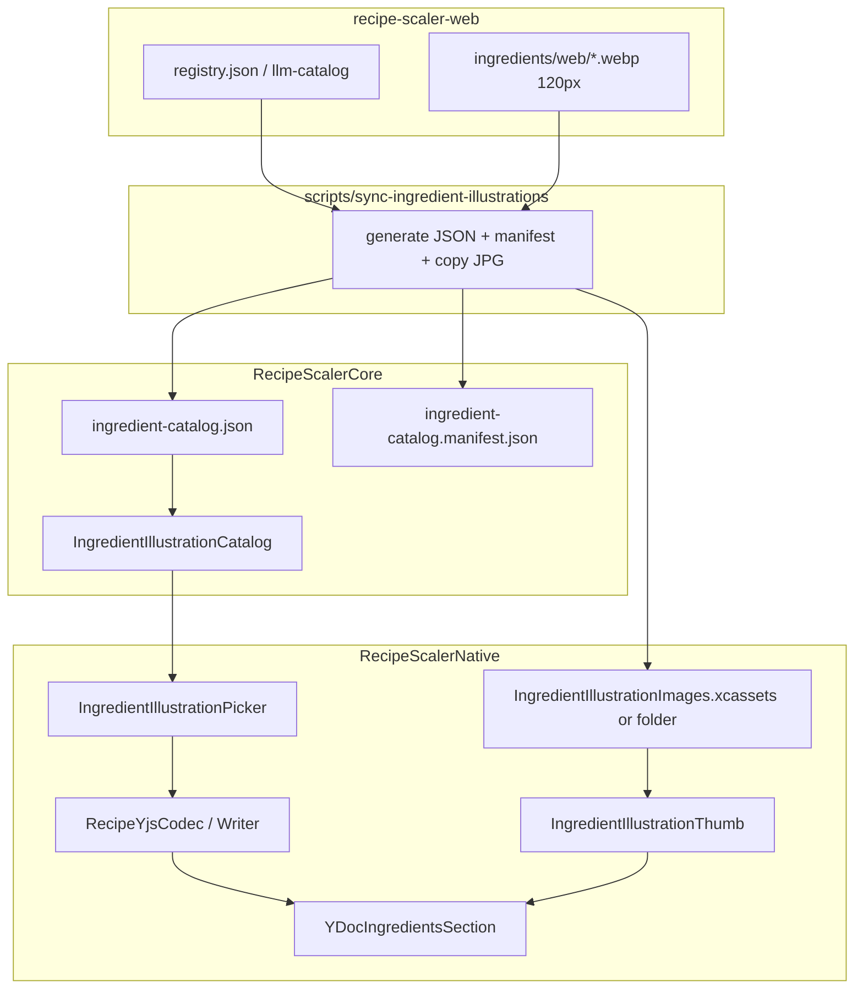

# План: иллюстрации ингредиентов на iOS

**Spec**: [spec.md](./spec.md)  
**Эталон (веб)**: `recipe-scaler-web` — `IngredientIllustrationThumb`, `IngredientIllustrationPicker`, `search-ingredient-catalog.ts`, `ingredient-illustration-picker-bindings.ts`

## Обзор

Один репозиторий (`recipe-scaler-native`). Данные `illustrationId` уже приходят из Yjs (веб/сервер). iOS добавляет: **sync bundled assets**, **Core-каталог + поиск**, **Yjs read/write**, **SwiftUI thumb + picker**, интеграция в сетку ингредиентов v3.

## Оценка размера бандла

- ~339 JPEG 120×120: ориентир **15–35 MB** uncompressed в IPA (зависит от JPEG quality на вебе).
- Каталог JSON: **< 500 KB**.
- **Gate:** после первого sync — зафиксировать фактический размер в `tasks.md`; если > 45 MB только thumbs — обсудить asset catalog compression / on-demand subset (вне текущей спеки).

## Пути и артефакты

| Путь | Назначение |
|------|------------|
| `scripts/sync-ingredient-illustrations.sh` | Entry: читает web repo, пишет outputs, exit 1 при рассинхроне |
| `RecipeScalerCore/Resources/ingredient-catalog.json` | Runtime каталог (ready entries) |
| `RecipeScalerCore/Resources/ingredient-catalog.manifest.json` | `catalogVersion`, `readyEntryCount`, … |
| `RecipeScalerCore/IngredientIllustrations/` | Catalog, search, NFKD helpers |
| `RecipeScalerNative/Resources/IngredientIllustrations/` | `{id}.webp` или `.xcassets` группа |
| `RecipeScalerNative/Views/IngredientIllustrations/` | Thumb, Picker, Bowl |
| `RecipeScalerNative/Services/IngredientIllustrationImageStore.swift` | Resolve `UIImage`/`Image` по slug из app bundle |
| `specs/043-ingredient-illustrations/layout.md` | iPhone-only; **human review** до финальной вёрстки |
| `specs/043-ingredient-illustrations/contracts/*` | Wire + grid |

**Web paths (inputs sync):**

- `../recipe-scaler-web/recipe-scaler/src/data/ingredient-illustrations/registry.json`
- `../recipe-scaler-web/recipe-scaler/public/assets/illustrations/ingredients/web/{id}.webp`
- Fallback metadata: `../recipe-scaler-web/shared/data/ingredient-catalog/llm-catalog.json`

## Sync script (поведение)

1. Фильтр `registry.entries` где `status == "ready"`.
2. Генерация `ingredient-catalog.json`: массив `{ id, labelRu, labelEn, aliasesRu, aliasesEn, category }`.
3. Canonical JSON (sorted keys, stable array order by `id`) → SHA-256 → первые 16 hex → `catalogVersion`.
4. Копирование каждого `{id}.webp` в app resources; отсутствующий thumb → **exit 1**.
5. Запись manifest; `readyEntryCount` = len(ready).
6. Опциональный флаг `--check` для CI: не копировать, только сверить counts/hash.

### Pre-sorted picker catalogs (parity with web `3e6cce9`)

Сборка также эмиттит два пресортированных артефакта рядом с canonical:

| Файл | Назначение |
|------|------------|
| `RecipeScalerCore/Resources/ingredient-catalog.json` | Canonical, отсортирован по `id`. Основа `entries`, `entriesById`, `haystackById`, alias-индекса. Хэшируется в `catalogVersion`. |
| `RecipeScalerCore/Resources/ingredient-catalog.ru.json` | Та же schema, записи отсортированы по `labelRu` (`localeCompare('ru', { sensitivity: 'base' })`) + `id` tiebreak. |
| `RecipeScalerCore/Resources/ingredient-catalog.en.json` | Та же schema, записи отсортированы по `labelEn` + `id` tiebreak. |

Runtime (`IngredientIllustrationCatalog`) грузит все три файла один раз в `init`, кэширует пресортированные массивы и их `[PickerEntry]`-проекции. Метод `search(query:locale:)` становится **filter-only**: для пустого запроса возвращает кэшированный view, для непустого — фильтрует `haystackById` с сохранением pre-sort порядка. Вызовов `.localizedCompare` / `.sorted` в горячем пути больше нет — сортировка уехала в build-time.

`--check` режим верифицирует дрифт всех трёх файлов: canonical hash + совпадение locale-сортировки с ре-деривом из canonical. Cross-check тесты в `IngredientIllustrationCatalogTests` ловят ICU-collator drift между Node `localeCompare` и Foundation `.localizedCompare`.

## Yjs / редактирование

Паритет с веб `applyIngredientIllustrationPickerSelection` / `Clear`:

- **Select:** `illustrationId = slug`, удалить/обнулить `illustrationPickerCleared`.
- **Clear:** удалить `illustrationId`, `illustrationPickerCleared = true`.

Реализация на iOS: либо расширить `DocumentManager` методом `updateIngredientIllustrationBinding(recipeId, ingredientId, illustrationId: String?)`, либо partial map update в writer (не перезаписывать всю строку из stale `IngredientData`).

**Важно:** `writeIngredient` при полном save ингредиента должен сохранять `illustrationId` / флаг (через поля в `IngredientData` + `withIllustration(...)` helpers).

## UI / layout pipeline

1. Черновик `layout.md` + `layout-audit.json` (thumb 40 pt, picker sheet ~85% height, search, grid 4 col).
2. Ревью человеком.
3. `IngredientIllustrationLayoutMetrics.swift` (40 pt slot, corner radius, grid).
4. `#Preview` worst-case (длинное имя, dark mode).
5. `bash scripts/audit-ui-layout.sh specs/043-ingredient-illustrations`.
6. Симулятор: screenshot (vision models) или accessibility identifiers.

## DI

- `IngredientIllustrationCatalog.shared` или inject через `AppContainer` как `let catalog = IngredientIllustrationCatalog(bundle: .module)` для тестов.
- Image store — app-only singleton, без Core.

## Фазы реализации

### Фаза 0 — Spec Kit

- [x] `spec.md`
- [x] `plan.md`
- [x] `tasks.md`
- [x] `contracts/yjs-ingredient-illustration.md`
- [x] `contracts/ingredient-grid-thumb.md`
- [~] `layout.md` + `layout-audit.json` — waived (UI принят без Figma-артефактов)
- [x] Ревью продукта пользователем (2026-07-03)

### Фаза 1 — Данные и инфраструктура (P1) — done

- [x] Sync script + JSON/manifest/JPEG
- [x] `IngredientIllustrationCatalog` + unit tests (search, NFKD)
- [x] `IngredientData` + codec/writer + tests
- [x] `IngredientIllustrationImageStore` + Bowl

### Фаза 2 — Отображение в рецепте (P1) — done

- [x] `IngredientIllustrationThumb` (+ отмена верхнего row chrome у thumb)
- [x] Сетка в `YDocIngredientsSection` (view + edit)
- [x] `RecipeRowLayoutMetrics.illustrationSlotWidth`
- [x] i18n + a11y ids
- [x] `scripts/test-fast.sh`

### Фаза 3 — Picker (P1) — done

- [x] `IngredientIllustrationPickerSheet`
- [x] Edit → `DocumentManager` illustration binding
- [x] `IngredientIllustrationLazyResolve` на detail

### Фаза 4 — Документация и приёмка (P1) — done

- [x] `docs/ARCHITECTURE.md`
- [x] `LocalizationConsistencyTests`
- [~] layout audit — waived

### Фаза 5 — P2 — done

- [x] Discover read-only thumbs (shared `YDocIngredientsSection`)
- [x] Shopping list item thumb + copy `illustrationId` on add-from-recipe + label fallback

## Верификация

| Действие | Команда |
|----------|---------|
| Build | `xcodebuild -scheme RecipeScalerNative -destination 'platform=iOS Simulator,id=EFC65E55-4F28-4C21-B489-D9733D2BE6B5' build` (см. [docs/AGENT-WORKFLOW.md](../../docs/AGENT-WORKFLOW.md)) |
| Unit tests | `bash scripts/test-fast.sh` или targeted `RecipeScalerNativeTests` |
| Layout | `bash scripts/audit-ui-layout.sh specs/043-ingredient-illustrations` |
| Sync check | `bash scripts/sync-ingredient-illustrations.sh --check` |

## Риски

| Риск | Митигация |
|------|-----------|
| IPA раздувается | Замер после sync; JPEG уже web-optimized |
| pbxproj: сотни JPG | Folder reference в Xcode или xcassets с script; один раз настроить в tasks |
| Полный `updateIngredient` затирает illustration | Dedicated partial update + tests |
| Сетка ломается при 40 pt vs marker | Явный `illustrationSlotWidth` в metrics |

## Ссылки на веб-код

| Задача | Файл |
|--------|------|
| Thumb UI | `recipe-scaler/src/components/ui/ingredient-illustration-thumb.tsx` |
| Picker | `recipe-scaler/src/components/recipe/ingredient-illustration-picker.tsx` |
| Search | `recipe-scaler/src/utils/search-ingredient-catalog.ts` |
| Yjs bindings | `recipe-scaler/src/utils/ingredient-illustration-picker-bindings.ts` |
| Rows | `draggable-ingredient-row.tsx`, `view-only-ingredient-row.tsx` |