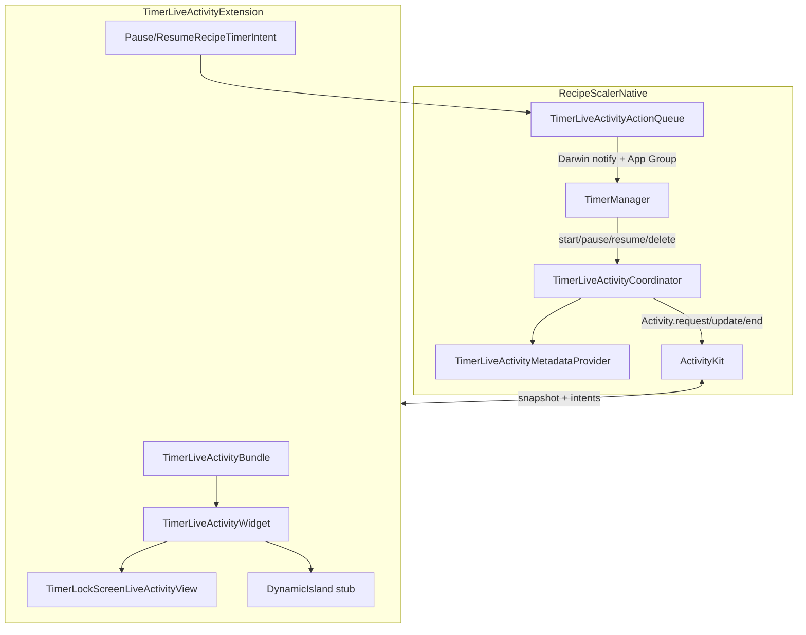
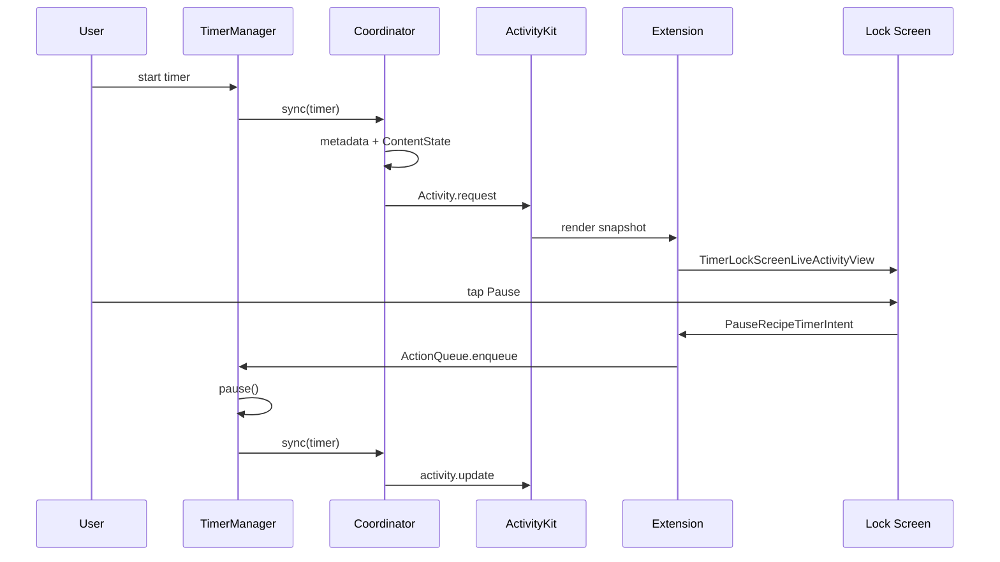

# План: Live Activity для кулинарных таймеров

**Ветка**: `044-timer-live-activity`  
**Дата**: 2026-06-12  
**Статус**: In progress  
**Спека**: [spec.md](./spec.md)  
**Quickstart**: [quickstart.md](./quickstart.md)  
**Зависимости**: [014-timers-sync](../014-timers-sync/spec.md) (DONE)

## Цель

Показывать каждый активный кулинарный таймер на **Lock Screen** через ActivityKit: живой countdown, название шага, контекст рецепта, pause/resume с карточки. **Dynamic Island** — минимальный stub (иконка + цифры), без кастомного expanded UI.

## Архитектура



Один `ActivityConfiguration` — **два независимых UI**:

| Closure | Где | Что рисует |
|---------|-----|------------|
| Первый `{ context in … }` | Lock Screen | Полная карточка (`TimerLockScreenLiveActivityView`) |
| `dynamicIsland: { … }` | Dynamic Island | Иконка `timer` + `compactTimerText` |

## План реализации (этапы)

### 1. Модель и shared-код

- [x] `RecipeTimerActivityAttributes` — static attributes (`timerId`, `timerName`, `recipeId`) + `ContentState` (`phase`, `endDate`, `startedAt`, `totalDuration`, `recipeName`, `recipeThumbnailData`, `syncedAt`)
- [x] `TimerActivityPhase`: `running` / `paused` / `exceeded`
- [x] `TimerLiveActivityFormatting` — формат времени (app + extension)
- [x] `TimerLiveActivityAccent` — normal / soon / exceeded по оставшемуся времени
- [x] `TimerLiveActivityPalette` — явные цвета для Lock Screen (extension в dark traits: `Color.primary` → белый на светлой карточке)
- [x] `RecipeTimer.recipeDisplayName` — fallback названия рецепта до sync коллекции

### 2. Widget Extension target

- [x] Target `TimerLiveActivityExtension` в `RecipeScalerNative.xcodeproj` (Embed App Extensions)
- [x] `TimerLiveActivityBundle` — `@main` WidgetBundle
- [x] `TimerLiveActivityWidget` — `ActivityConfiguration` (Lock Screen + Dynamic Island)
- [x] `TimerLockScreenLiveActivityView` — кастомный Lock Screen UI
- [x] App Group entitlement: `group.ru.recipescaler.RecipeScaler`
- [x] Shared Swift-файлы в **обоих** targets (attributes, palette, accent, formatting, intents, action queue)

### 3. Lock Screen UI (основной экран)

- [x] Progress bar edge-to-edge, 8 pt (`Rectangle` + `scaleEffect`, без раздувающего `GeometryReader` / `ProgressView`)
- [x] Контент с padding 14 pt
- [x] Цифры: `Text(timerInterval:countsDown:)` для running; статический текст для paused; `-MM:SS` для exceeded
- [x] Название шага: до 2 строк, без фиксированного min-width у цифр
- [x] Нижний ряд: thumbnail 32×32 + название рецепта (из `ContentState`)
- [x] Accent: normal (чёрный) / soon (orange) / exceeded (red)
- [x] Tap по карточке: `widgetURL` → `recipe-scaler://recipe/{recipeId}`
- [x] Кнопки pause/resume: `LiveActivityIntent` (`PauseRecipeTimerIntent` / `ResumeRecipeTimerIntent`)

### 4. Dynamic Island (stub, не трогать при правках Lock Screen)

- [x] `compactLeading`: `Image(systemName: "timer")`
- [x] `compactTrailing`: countdown через `Text(timerInterval:)`
- [x] Expanded regions: имя шага + цифры (минимально)
- [x] `minimal`: иконка timer

### 5. Координатор и lifecycle (main app)

- [x] `TimerLiveActivityCoordinator` — `Activity.request` / `update` / `end`, reconcile с `TimerManager.timers`
- [x] Одна activity на каждый running/paused таймер
- [x] `restoreFromSystem()` — cold start, привязка к `Activity.activities`
- [x] Exceeded → `phase = .exceeded`, dismiss через ~30 мин
- [x] `staleDate` для перехода в soon / exceeded без push
- [x] `syncedAt` в `ContentState` — форсирует re-render Lock Screen после смены UI extension
- [x] `TimerLiveActivityMetadataProvider` — имя рецепта + JPEG thumbnail из disk cache (< 4 KB payload)

### 6. Интерактивность pause/resume

- [x] `TimerLiveActivityActionQueue` — App Group `UserDefaults` + Darwin notification
- [x] Extension: intent `perform()` → `enqueue`
- [x] Main app: `installHandler` в `TimerManager` → pause/resume по `timerId`
- [x] `openAppWhenRun = false` на intents

### 7. Интеграция в приложение

- [x] Хуки в `TimerManager` (start, pause, resume, delete, tick exceeded)
- [x] `refreshLiveActivities()` из `ContentView` при появлении / sync коллекции
- [x] `NSSupportsLiveActivities` в `RecipeScalerNative/Info.plist`

### 8. Оставшееся / polish

- [ ] Стабильная работа pause/resume на устройстве (App Group + paid program)
- [x] Анимированный progress bar на running (`ProgressView(timerInterval:)` / `TimerLiveActivityLinearProgressStyle`)
- [ ] Регистрация App Intent metadata в extension (лог `Failed to fetch metadata for PauseRecipeTimerIntent` на симуляторе)
- [ ] Toggle Live Activities в Account (вне scope v1)
- [ ] Push-обновления activity (spec 023, вне scope v1)

## Где что лежит

### Спеки и документация

| Файл | Назначение |
|------|------------|
| `specs/044-timer-live-activity/spec.md` | Требования, состояния UI, lifecycle, критерии успеха |
| `specs/044-timer-live-activity/plan.md` | Этот файл — план и карта кода |
| `specs/044-timer-live-activity/quickstart.md` | Сборка, проверка на симуляторе/устройстве, troubleshooting |
| `docs/DECISIONS.md` | ADR: одна activity на таймер, semantic colors, App Group queue |

### Widget Extension (`TimerLiveActivityExtension/`)

| Файл | Назначение |
|------|------------|
| `TimerLiveActivityBundle.swift` | `@main` entry point extension |
| `TimerLiveActivityWidget.swift` | `ActivityConfiguration`: Lock Screen closure + `dynamicIsland` |
| `TimerLockScreenLiveActivityView.swift` | **Lock Screen UI** — progress, цифры, имя, рецепт, кнопки |
| `Info.plist` | `com.apple.widgetkit-extension` |
| `TimerLiveActivityExtension.entitlements` | App Group |

### Shared Live Activity (`RecipeScalerNative/LiveActivity/`)

Компилируется в **app** и **extension**.

| Файл | Назначение |
|------|------------|
| `RecipeTimerActivityAttributes.swift` | `ActivityAttributes` + `ContentState` |
| `TimerLiveActivityAccent.swift` | Резолв accent: normal / soon / exceeded |
| `TimerLiveActivityPalette.swift` | Цвета Lock Screen (явный чёрный вместо semantic primary) |
| `TimerLiveActivityFormatting.swift` | `formatTime(seconds:)` |
| `TimerLiveActivityIntents.swift` | `PauseRecipeTimerIntent`, `ResumeRecipeTimerIntent` |
| `TimerLiveActivityActionQueue.swift` | App Group bridge extension → app |

### Сервисы (main app)

| Файл | Назначение |
|------|------------|
| `Services/TimerLiveActivityCoordinator.swift` | start/update/end/reconcile, `makeContentState`, staleDate |
| `Services/TimerLiveActivityMetadataProvider.swift` | recipeName + thumbnailData для ContentState |
| `Services/TimerManager.swift` | Хуки таймеров, `refreshLiveActivities()`, handler action queue |

### Модели и интеграция

| Файл | Назначение |
|------|------------|
| `Models/RecipeTimer.swift` | `recipeDisplayName` для metadata fallback |
| `ContentView.swift` | `TimerManager.shared.refreshLiveActivities()` |
| `RecipeScalerNative/Info.plist` | `NSSupportsLiveActivities` |
| `RecipeScalerNative.xcodeproj/project.pbxproj` | Target extension, embed, shared sources |

## Поток данных



## Известные проблемы и решения

| Симптом | Причина | Решение в коде |
|---------|---------|----------------|
| Белая пустая карточка на Lock Screen | Extension в dark traits → белый текст на светлой карточке; `GeometryReader`/`ProgressView` раздували layout | `TimerLiveActivityPalette` с явным чёрным; progress через `Rectangle` + `scaleEffect` |
| Остров работает, Lock Screen пустой | Это **разные** closure в одном `ActivityConfiguration` | Править `TimerLockScreenLiveActivityView`, не `dynamicIsland` |
| Старый UI после пересборки extension | ActivityKit кэширует snapshot при том же ContentState | Поле `syncedAt` + `refreshLiveActivities()` при foreground |
| Нет названия рецепта | Коллекция ещё не synced | `recipeDisplayName` на таймере + metadata provider |
| Pause не доходит до app | App Group / entitlements на устройстве | См. quickstart.md, paid program для TestFlight |

## Сборка и проверка

```bash
xcodebuild -scheme RecipeScalerNative \
  -destination 'platform=iOS Simulator,id=<UDID>' \
  build
```

Подробные шаги — [quickstart.md](./quickstart.md).

## Вне scope v1

- Push-обновления activity (spec 023)
- Toggle в Account
- Кастомный Dynamic Island expanded
- CarPlay / watchOS
