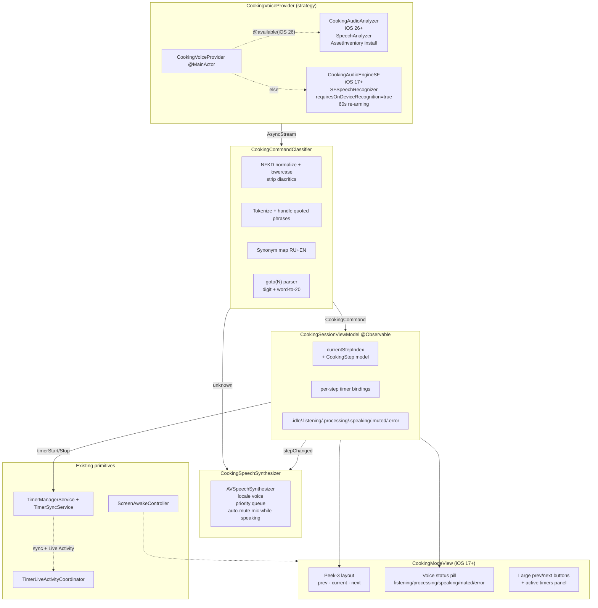

# Спецификация: Режим готовки с голосовым управлением v1

**Дата**: 2026-08-02
**Статус**: 🟡 Дорабатывается
**Зависимости**:
- [`RecipeScalerNative/Utils/ScreenAwakeController.swift`](../../RecipeScalerNative/Utils/ScreenAwakeController.swift) — keep-awake (готовое)
- [`RecipeScalerNative/Services/TimerSyncService.swift`](../../RecipeScalerNative/Services/TimerSyncService.swift) — sync таймеров
- [`RecipeScalerNative/Utils/RecipeDescriptionParser.swift`](../../RecipeScalerNative/Utils/RecipeDescriptionParser.swift) — модель шагов (`orderedStep`)
- [`RecipeScalerNative/Services/AssistantVoiceRecorder.swift`](../../RecipeScalerNative/Services/AssistantVoiceRecorder.swift) — паттерны permission/metering (не используется напрямую)

## Контекст и мотивация

Существующие «режимы готовки» в приложениях (включая нативные) превращают рецепт в линейный мастер-визард: один шаг на экране, для перехода — тап по кнопке, соседи не видны. Это плохо для кухни: руки заняты/грязные, экран далеко, между шагами есть зависимости (нужно видеть и предыдущий, и следующий).

Recipe Scaler показывает шаги одним плоским скроллом (см. [`RecipeDescriptionView.swift`](../../RecipeScalerNative/Views/RecipeDescriptionView.swift)) — это решает часть проблемы, но не даёт hands-free навигации. С появлением on-device speech на iOS (SpeechAnalyzer в iOS 26, SFSpeechRecognizer в iOS 17+) стало реальным слушать голос **без сервера и оплаты**, оставаясь приватным.

Спека описывает иммерсивный режим готовки с локальным голосовым пайплайном: всегда слушающий микрофон, навигация голосом, голосовые подтверждения. Progressive enhancement по версиям iOS.

## Цель v1

1. Новый экран `CookingModeView` с peek-3 layout: текущий шаг в фокусе, края предыдущего и следующего видимы одновременно.
2. Always-listening голосовой пайплайн (on-device, без сетевых запросов):
   - iOS 17+: `SFSpeechRecognizer` с `requiresOnDeviceRecognition = true` + 60-сек re-arming.
   - iOS 26+: `SpeechAnalyzer` + `SpeechTranscriber` (без лимита, лучше distant-mic).
3. Локальный keyword-классификатор команд (RU+EN синонимы). Без on-device LLM (русский не поддержан Foundation Models).
4. Голосовая навигация: next / prev / repeat / goto(N).
5. Голосовое управление таймерами: start / pause / resume / stop.
6. TTS: голосовые подтверждения («Шаг 3», «Таймер запущен») и опционально полное чтение шага при переходе.
7. Keep-awake, иммерсивные оверлеи, accessibility.
8. Onboarding permission sheet при первом входе.

## Non-goals v1

- **Voice-chat multi-turn с ответами LLM** («а сколько муки в граммах?») — v2.
- **Siri App Intents для hands-free когда app свёрнут** (iOS 27 Siri AI + App Intents 2.0) — v2.
- **Масштабирование рецепта голосом**.
- **Wake word** («Скалер») — используем «always listening» вместо него.
- **Web parity** — на web остаётся read-only просмотр.
- **Cross-recipe продолжение** («перейди к следующему рецепту») — out of scope.
- **Авто-пауза на входящий звонок / Siri** — обрабатываем системно через `AVAudioSession.interruptionNotification`.
- **Перевод голоса в текст на нескольких языках одновременно** — одна локаль за раз (текущая приложения).

## Стратегия платформ: progressive enhancement

Deployment target app **остаётся iOS 17** (не поднимаем). Фича работает на всех поддерживаемых iOS, улучшается на более новых.

| Слой | iOS 17+ (любой A9+) | iOS 26+ (Apple Intelligence device) | iOS 27+ (Siri AI) |
|------|---------------------|-------------------------------------|-------------------|
| STT | `SFSpeechRecognizer`, on-device, 60-сек re-arming | `SpeechAnalyzer` + `SpeechTranscriber`, без лимита | (наследует iOS 26) |
| NLU | Keyword matcher (RU+EN синонимы) | Keyword matcher (тот же) | (тот же; Siri-side — v2) |
| TTS | `AVSpeechSynthesizer` | (наследует) | (наследует) |
| Hands-free вне app | нет | нет | возможно через Siri App Intents (v2) |

**Почему keyword matcher, а не LLM:** `FoundationModels` на iOS 26/27 официально поддерживает только EN/DE/FR/JP/ZH/KO/ES/IT/PT/VI — русского нет. Keyword matcher с синонимами одинаково работает на всех версиях и проще тестируется. LLM оставляем на v2 voice-chat.

**Почему re-arming для SFSpeechRecognizer:** лимит 60 сек на сессию не позволяет слушать непрерывно в течение 30+ мин готовки. За ~5 сек до таймаута закрываем текущую сессию и открываем новую — без видимого прерывания для пользователя.

## User stories

### US1. Вход в режим готовки

Пользователь открывает рецепт → видит секцию шагов → тапает «Готовить» (локализованная кнопка). Если разрешения не даны — onboarding sheet → системные промпты последовательно (микрофон → речь). После грантов открывается `CookingModeView` с текущим шагом 1 в фокусе, экран не гаснет.

### US2. Навигация голосом

В режиме готовки пользователь говорит «дальше» / «вперёд» / «next» → шаг переключается, приложение голосом подтверждает «Шаг 2» и (опционально) зачитывает текст шага. Аналогично: «назад» / «back» — переход назад. «повтори» / «repeat» — зачитывает текущий шаг. «покажи шаг 5» / «step 3» — прямой переход по номеру. Параллельно можно свайпом или кнопками управлять (важно: голос — дополнение, не замена кнопкам).

### US3. Управление таймером голосом

В шаге с встроенным таймером пользователь говорит «запусти таймер» → таймер запускается, голосом подтверждается «Таймер запущен». «пауза» / «pause» — пауза. «продолжи» / «resume» — продолжить. «стоп» / «stop» — остановить.

### US4. Не расслышали

Пользователь говорит непонятное / шум / неизвестную команду → приложение голосом говорит «Не расслышал» и остаётся на текущем шаге. Никаких модалок, тихий feedback.

### US5. Прерывание (входящий звонок / Siri)

Во время режима готовки приходит входящий звонок или активируется Siri → микрофон корректно деактивируется, аудио-сессия освобождается. После прерывания — автоматически возобновляется listening (если пользователь вернулся в app и не ушёл из режима готовки).

### US6. Выход из режима

Пользователь свайпом вниз / кнопкой «назад» → подтверждение «Выйти из режима готовки?» (если активен таймер — предупреждение, что таймер продолжит работать в Live Activity). Микрофон выключается, экран снова может гаснуть, возврат на `YDocRecipeDetailView`.

### US7. Отключение микрофона

Пользователь не хочет, чтобы его слушали → тапает на voice status pill → микрофон mute (тоггл). Можно готовить молча, кнопками. Состояние сохраняется в `UserDefaults(cooking.voice-mic-muted)` и предлагается как опция на следующем входе.

### US8. Ошибка распознавания / недоступность

`SFSpeechRecognizer.isAvailable == false` (пользователь отключил распознавание речи в настройках) или on-device не поддерживается для текущей локали → voice status pill показывает «Голос недоступен», остальной UI (навигация кнопками) работает. Не блокирует фичу.

### US9. Установка языковой модели (iOS 26+)

На iOS 26+ при первом входе в режим готовки, если модель SpeechAnalyzer для текущей локали не установлена, приложение скачивает её через `AssetInventory.assetInstallationRequest(supporting:)`. UI показывает progress overlay «Устанавливается языковая модель…» с кнопкой отмены.

### US10. Battery / privacy hint

В onboarding permission sheet явным текстом: «Аудиозаписи не покидают устройство. Распознавание идёт на Neural Engine. Это разряжает батарею быстрее обычного».

## Требования

### Функциональные

#### F1. CookingModeView

- **F1.1.** Экран доступен с iOS 17+ (без feature gating по ОС).
- **F1.2.** Peek-3 layout: `ScrollViewReader` + `scrollTargetBehavior(.viewAligned)`. Текущий шаг в центре, предыдущий peek сверху (виден край), следующий peek снизу.
- **F1.3.** Каждая карточка шага: number badge + текст (Martian Grotesk, увеличенный размер — см. layout.md) + inline timer references (если есть) + ingredient refs.
- **F1.4.** Большие кнопки prev/next внизу (≥49pt touch target, accessibility label).
- **F1.5.** Voice status pill сверху (4 состояния: `listening` / `processing` / `speaking` / `mic-muted` / `error`).
- **F1.6.** Active timers panel: список активных таймеров с привязкой к шагу, countdown через `Text(timerInterval:)`, кнопки паузы.
- **F1.7.** `ScreenAwakeController.setActive(true)` на `.onAppear`, `setActive(false)` на `.onDisappear`.
- **F1.8.** `.persistentSystemOverlays(.hidden)` для иммерсивности.
- **F1.9.** `.onDisappear` обязательно: stop microphone, release `AVAudioSession`, deactivate screen-awake.

#### F2. Точка входа

- **F2.1.** Кнопка «Готовить» (локализованная) на `YDocRecipeDetailView`, рядом с `StepsSection`.
- **F2.2.** Если у рецепта 0 шагов (нет `.orderedStep`) — кнопка hidden.
- **F2.3.** navigation push (не sheet) — для нормальной ротации и иммерсивности.

#### F3. Голосовой пайплайн

- **F3.1.** Protocol `CookingVoiceListening { func transcripts() -> AsyncStream<CookingTranscript> }` с `.partial(String)` и `.final(String)` cases.
- **F3.2.** `CookingVoiceProvider` выбирает реализацию:
  - `if #available(iOS 26.0, *)` → `CookingAudioAnalyzer` (SpeechAnalyzer).
  - else → `CookingAudioEngineSF` (SFSpeechRecognizer).
- **F3.3.** Локаль распознавания = `AppLanguagePreference.current.locale` (RU или EN).

#### F4. CookingAudioEngineSF (iOS 17+)

- **F4.1.** `SFSpeechRecognizer(locale:)`. Проверка `isAvailable` и `supportsOnDeviceRecognition`.
- **F4.2.** `SFSpeechAudioBufferRecognitionRequest` с `shouldReportPartialResults = true`, `requiresOnDeviceRecognition = true`, `shouldReportPartialResults = true`.
- **F4.3.** `AVAudioEngine` tap на `inputNode`, feed буферов в request. Формат через `request.append(_:AVAudioPCMBuffer)`.
- **F4.4.** 60-сек re-arming: внутренний `Task` отслеживает elapsed; за ~5 сек до таймаута SFSpeechRecognizer'а (или по `.taskHint` callback с `.error`/`.unavailable`) корректно завершает текущую сессию и стартует новую. Без видимого прерывания для пользователя.
- **F4.5.** `AVAudioSession` категория `.playAndRecord`, mode `.spokenAudio` (или `.default`), options `[.defaultToSpeaker, .allowBluetoothHFP, .mixWithOthers]` — чтобы TTS работал параллельно с listening (но мы mute mic на время TTS, см. F7.5).
- **F4.6.** Обработка interruption (`AVAudioSession.interruptionNotification`): пауза listening, освобождение ресурсов, возобновление при `shouldResume`.
- **F4.7.** Обработка route change (`AVAudioSession.routeChangeNotification`): при смене Bluetooth → speaker корректно пересоздать `AVAudioEngine` tap.

#### F5. CookingAudioAnalyzer (iOS 26+)

- **F5.1.** `SpeechAnalyzer` с `SpeechTranscriber` модулем, `reportingOptions = [.volatileResults]`.
- **F5.2.** `AssetInventory.assetInstallationRequest(supporting:)` при первом входе — UI overlay «Устанавливается языковая модель…».
- **F5.3.** `AVAudioConverter` из `inputNode.outputFormat` → `SpeechAnalyzer.bestAvailableAudioFormat(compatibleWith:)`.
- **F5.4.** Real-time audio tap на отдельном акторе (не MainActor) — Swift 6 strict concurrency. `Speech` framework требует real-time thread для tap closure.
- **F5.5.** Одна сессия на весь режим готовки, без re-arming'а (SpeechAnalyzer не имеет 60-сек лимита).
- **F5.6.** `SpeechTranscriber.supportedLocales` check; если RU не поддержан — fallback на `CookingAudioEngineSF` (на device'ах где on-device RU ещё не в наборе моделей).

#### F6. CookingCommandClassifier

Per workspace rules ([search-behavior.mdc](../../.cursor/rules/search-behavior.mdc)):

- **F6.1.** Case-insensitive matching.
- **F6.2.** Trim leading/trailing whitespace, **не** trim internal.
- **F6.3.** Tokenize по пробелам, поддержка quoted phrases (`"шаг 5"` — один токен).
- **F6.4.** NFKD-нормализация с заменой диакритик: `café` → `cafe`, `Château` → `Chateau`. Нормализуем и query, и словарь — без деструктивной замены в отображаемом тексте.
- **F6.5.** Token AND-logic: каждый токен должен совпасть хотя бы с одной синоним-группой команды.
- **F6.6.** Словарь синонимов RU+EN (хранится в Swift коде, не в Localizable.xcstrings — это не UI-текст):

```swift
enum CookingCommand: Equatable {
    case next
    case prev
    case repeatStep
    case goto(Int)
    case timerStart
    case timerPause
    case timerResume
    case timerStop
    case unknown
}
```

  Словарь (preview, финал в `CookingCommandClassifier.swift`):
  - `next`: RU `дальше, вперёд, следующий, следующая, поехали`; EN `next, forward, go, continue`.
  - `prev`: RU `назад, предыдущий, вернись`; EN `back, previous, go back`.
  - `repeat`: RU `повтори, ещё раз`; EN `repeat, again`.
  - `goto(N)`: паттерн `шаг N` / `step N`. Парсим N как digit или word (один-двадцать).
  - `timerStart`: RU `запусти таймер, старт таймер, поставить таймер`; EN `start timer`.
  - `timerPause`: RU `пауза, поставь на паузу, приостанови`; EN `pause, hold on`.
  - `timerResume`: RU `продолжи, продолжить, возобнови`; EN `resume, continue timer`.
  - `timerStop`: RU `стоп, останови, отмени`; EN `stop, cancel, kill`.

- **F6.7.** Парсер `goto(N)` извлекает числительное (digit `0-9` или word до 20 на RU/EN) из фразы, не из стартового слова.

#### F7. CookingSpeechSynthesizer

- **F7.1.** `AVSpeechSynthesizer` с voice по `AppLanguagePreference.current.locale`.
- **F7.2.** Приоритетная очередь: `stepReading (high) > confirmation (medium) > error (low)`. Текущий utterance не прерывается (кроме `.cancel`-метода).
- **F7.3.** При переходе на новый шаг (`goNext`, `goto`, `goPrev`) — зачитывает полный текст шага.
- **F7.4.** Подтверждения — короткие строки из `Localizable.xcstrings`:
  - `cooking.confirm.step-n` (с плейсхолдером N)
  - `cooking.confirm.timer-started`
  - `cooking.confirm.timer-paused`
  - `cooking.confirm.timer-resumed`
  - `cooking.confirm.timer-stopped`
  - `cooking.confirm.not-understood`
- **F7.5.** Auto-mute микрофона во время синтеза: на `willSpeakRange` → `CookingVoiceProvider.suspend()`; на `didFinish` → `resume()`. Предотвращает feedback loop (TTS → микрофон → распознавание → команда).

#### F8. Расширение модели таймера

- **F8.1.** `RecipeTimer.stepId: String?` — связывает таймер с шагом.
- **F8.2.** `TimerSyncService` payload: добавляем `stepId` в `timerDict` только если не nil.
- **F8.3.** Backward-compat: старые серверные записи десериализуются с `stepId == nil`.
- **F8.4.** При запуске таймера из `CookingModeView` — передаём `stepId` текущего шага.
- **F8.5.** `TimerLiveActivityCoordinator` — без изменений (не использует `stepId`).

#### F9. Onboarding permissions

- **F9.1.** При первом тапе на «Готовить», если `AVAudioApplication.requestRecordPermission` ещё не был дан или `SFSpeechRecognizer.requestPermissions` ещё не был дан — показываем `.sheet` `CookingPermissionsSheet`.
- **F9.2.** Sheet содержит 3 пункта: микрофон, распознавание речи, keep-awake. Каждый с иконкой, заголовком, описанием из `Localizable.xcstrings`.
- **F9.3.** Кнопка «Продолжить» триггерит системные промпты последовательно.
- **F9.4.** Если пользователь отказал в одном — sheet с объяснением «Голосовые команды требуют микрофон и распознавание речи. Можно продолжить без голоса (только кнопки).» + кнопка «Готовить без голоса» / «Открыть настройки».
- **F9.5.** privacy hint: явный текст про on-device, батарею.

#### F10. Прерывания и lifecycle

- **F10.1.** `AVAudioSession.interruptionNotification` observer в `CookingVoiceProvider` — при `.began` ставим `voiceState = .paused` и освобождаем ресурсы; при `.ended shouldResume` — пересоздаём сессию.
- **F10.2.** App lifecycle: при `scenePhase == .background` — stop listening, release session. При `scenePhase == .active` — resume (если пользователь не выключал тоггл).
- **F10.3.** При выходе из `CookingModeView` — обязательно `CookingVoiceProvider.stop()`, `CookingSpeechSynthesizer.stopSpeaking(.immediate)`, `ScreenAwakeController.deactivate()`.

### Нефункциональные

- **N1.** i18n: все UI-строки через [`RecipeScalerNative/Resources/Localizable.xcstrings`](../../RecipeScalerNative/Resources/Localizable.xcstrings), префикс `cooking.*`. **No fallbacks** (per CLAUDE.md). RU + EN.
- **N2.** Логи — только англ. (`AppLog`), без аудио/PII. Евенты: `cooking.started`, `cooking.exited`, `cooking.command_classified`, `cooking.command_unknown`, `cooking.tts_speak`, `cooking.permission_denied`, `cooking.speech_unavailable`.
- **N3.** Шрифты: Martian Grotesk для UI, Martian Mono для таймеров (per CLAUDE.md). Без системного SF.
- **N4.** Accessibility: VoiceOver labels для всех контролов, dynamic type поддержка (но макс. размер ограничен для иммерсивности).
- **N5.** Battery: мониторинг через `ProcessInfo.processInfo.isLowPowerModeEnabled`; если включён — рекомендуем выключить голос (или делаем это автоматически, configurable).
- **N6.** Privacy manifest: `PrivacyInfo.xcprivacy` — добавить ключи для麦克风 и speech usage.
- **N7.** Concurrency: Swift 6 strict. `CookingVoiceProvider` — `@MainActor`. Audio tap closures — `nonisolated`, не захватывают MainActor-isolated объекты.

## Архитектура



### CookingSessionViewModel (@Observable)

- Вход: `Recipe` (или `recipeId`).
- Готовит массив `CookingStep { id: UUID, number: Int, plainText: String, attributedRuns: [RecipeDescriptionInlineRun], attachedTimerIds: [String], ingredientRefs: [String] }` из `RecipeDescriptionBlock.orderedStep` (фильтруем `.paragraph`/`.heading`/`.bullet` — показываем только шаги).
- Состояние:
  - `currentStepIndex: Int` (0-based, валидируется bounds).
  - `voiceState: CookingVoiceState`.
  - `lastTranscript: String?` (для debug / accessibility).
  - `lastCommand: CookingCommand?` (для debug).
  - `isMicMuted: Bool` (persisted в `UserDefaults(cooking.voice-mic-muted)`).
- Действия:
  - `goNext()`, `goPrev()`, `repeatCurrent()`, `goto(Int)`.
  - `startTimerForCurrentStep()`, `pauseTimer(id:)`, `resumeTimer(id:)`, `stopTimer(id:)`.
  - `handleCommand(_ command: CookingCommand)`.
- На смену `currentStepIndex` — триггер `speak(step:)` через TTS.

## Downstream consumers (изменяемое состояние)

### При добавлении `RecipeTimer.stepId`

- **SwiftUI views** — `CookingModeView`, `MobileTimerPanel` (опционально — показывать step badge рядом с таймером).
- **Cross-process consumers** — `TimerLiveActivityCoordinator` (Live Activity не показывает step, но атрибуты можно расширить в v2), `HomeWidgetExtension` (без изменений), `WatchCredentialsBridge` / watchOS app (без изменений — watch не использует stepId в v1).
- **Sync boundaries** — `TimerSyncService` payload с новым полем. Server должен игнорировать неизвестные поля (json). Web client parity — `recipe-scaler-web` должен уметь принимать и не падать. **Проверить server-side schema** (probably permissive json, but document).
- **Persisted state** — таймеры персистятся через `TimerSnapshotStore` (App Group), формат уже json-permissive — поле добавится прозрачно.
- **Tests** — обновить `TimerSyncServiceTests`, `TimerManagerServiceTests`, добавить invariant на round-trip.

### При добавлении CookingModeView

- **SwiftUI views** — `YDocRecipeDetailView` получает кнопку «Готовить» (новый navigation link).
- **Cross-process consumers** — без изменений.
- **Sync boundaries** — без изменений (read-only интерфейс, не пишет в Y.Doc).
- **Persisted state** — `UserDefaults(cooking.voice-mic-muted)` (новый ключ), onboarding-shown flag (`UserDefaults(cooking.onboarding-shown)`).
- **Tests** — новый `CookingSessionViewModelTests`, `CookingCommandClassifierTests`, E2E spec в `specs/056-cooking-voice-mode/` (verify-ui-smoke + новый verify-скрипт).

## Positive invariants (для тестов)

Per `docs/TESTING.md` — формулируем через ожидаемое действие, не через отсутствие нежелательного.

| Эффект функции / API | Инвариант | Где проверять |
|---------------------|----------|---------------|
| `goNext()` на последнем шаге | `currentStepIndex` не меняется, voice state → `.idle`, без краша | `CookingSessionViewModelTests.test_goNext_atLastStep_noOp` |
| `goNext()` в середине | `currentStepIndex` увеличился на 1, `speak(step:)` вызван с новым шагом | `CookingSessionViewModelTests.test_goNext_advances_and_triggers_tts` |
| `goto(N)` вне диапазона (N < 1 или N > count) | no-op, `lastCommand` = `.goto(N)` записан для debug, voice confirms «нет такого шага» | `CookingSessionViewModelTests.test_goto_outOfRange_noOp` |
| `handleCommand(.timerStart)` без активного таймера в шаге | no-op, voice confirms «нет таймера для этого шага» | `CookingSessionViewModelTests.test_timerStart_noTimerInStep_noOp` |
| `RecipeTimer` с stepId, round-trip через `TimerSyncService` payload | `stepId` сохраняется и восстанавливается без потерь | `TimerSyncServiceTests.test_stepId_roundTrip` |
| `RecipeTimer` payload без stepId (старый формат) | десериализуется без ошибки, `stepId == nil` | `TimerSyncServiceTests.test_legacyPayload_stepId_nil` |
| `CookingCommandClassifier.classify("дальше")` | returns `.next` | `CookingCommandClassifierTests.test_ru_dalshe` |
| `CookingCommandClassifier.classify("step 5")` | returns `.goto(5)` | `CookingCommandClassifierTests.test_en_step_5` |
| `CookingCommandClassifier.classify("что-то непонятное")` | returns `.unknown` | `CookingCommandClassifierTests.test_unknown_phrase` |
| `CookingCommandClassifier.classify("café")` (диакритика) | normalizes to `cafe`, не ломает matching | `CookingCommandClassifierTests.test_diacritics_normalized` |
| На вход в CookingModeView | `ScreenAwakeController.isActive == true`, `CookingVoiceProvider` запущен | `CookingModeViewLifecycleTests.test_onAppear_startsAwakeAndVoice` |
| На выход из CookingModeView | `ScreenAwakeController.isActive == false`, `CookingVoiceProvider` остановлен, `AVAudioSession` деактивирована | `CookingModeViewLifecycleTests.test_onDisappear_stopsAll` |
| TTS speaking → микрофон suspend | во время `AVSpeechSynthesizerDelegate.willSpeakRange` microphone provider suspend active | `CookingSpeechSynthesizerTests.test_speaking_suspends_mic` |

## Acceptance criteria

- [ ] AC1. `xcodebuild build` green для основного target (iOS 17+ deployment).
- [ ] AC2. `xcodebuild test` green для новых тест-классов: `CookingSessionViewModelTests`, `CookingCommandClassifierTests`, `CookingSpeechSynthesizerTests`, `TimerSyncServiceTests` (с новыми stepId case'ами).
- [ ] AC3. Локализации `cooking.*` присутствуют в `Localizable.xcstrings` (RU + EN), без fallback'ов.
- [ ] AC4. `bash scripts/audit-ui-layout.sh specs/056-cooking-voice-mode` проходит.
- [ ] AC5. `bash scripts/verify-ui-smoke.sh` проходит после изменений навигации.
- [ ] AC6. На iOS 17 симуляторе: кнопка «Готовить» видна, экран открывается, навигация кнопками работает, голос (если разрешён) реагирует.
- [ ] AC7. На iOS 26 симуляторе: то же + speech pipeline использует `SpeechAnalyzer` (проверяем по логам `AppLog.info(.feature, "cooking.voice_provider", data: ["engine": "speechAnalyzer"|"sfSpeechRecognizer"])`).
- [ ] AC8. Manual QA: на физическом iPhone — весь флоу US1-US10 без крашей, корректное освобождение ресурсов, корректное восстановление после incoming call.
- [ ] AC9. PrivacyInfo.xcprivacy обновлён с использованием микрофона и речи.
- [ ] AC10. `docs/PROJECT.md` обновлён разделом про cooking mode.

## Риски и митигации

| Риск | Митигация |
|------|-----------|
| **R1. 60-сек re-arming артефакты**: при re-arm может теряться последнее слово или фраза | Re-arm на паузе между фразами (детекция тишины через VAD), а не по таймеру. Логировать события для отладки. |
| **R2. Battery drain** от always-on микрофона + re-arming | VAD gate (минимальный уровень для триггера); авто-pause в idle после N секунд тишины (configurable, по умолчанию 60s). При `isLowPowerModeEnabled` — предлагаем выключить голос. |
| **R3. Feedback loop (TTS → микрофон → команда)** | Auto-mute микрофона во время TTS (F7.5). Дополнительно — `AVAudioSession` echo cancellation. |
| **R4. Concurrency / audio tap thread** | Swift 6 strict. `CookingVoiceProvider` — `@MainActor`. Audio tap closures — `nonisolated`, без захвата MainActor. В fix-until-green loop ловить data race через Thread Sanitizer. |
| **R5. Speech framework unavailable**: пользователь отключил распознавание речи в Settings, или устройство без on-device модели | UI не блокирует — voice status pill показывает «Голос недоступен», навигация кнопками остаётся. Лог `cooking.speech_unavailable`. |
| **R6. RU не в `SpeechTranscriber.supportedLocales`** (edge case на некоторых device'ах) | Fallback на `CookingAudioEngineSF` (SFSpeechRecognizer RU поддержан на всех iOS 17+). Лог `cooking.voice_provider` с reason. |
| **R7. Interruption во время готовки** (звонок, Siri) | `AVAudioSession.interruptionNotification` — корректный teardown + auto-resume. Если пользователь ушёл из app — не resume автоматически при возврате (требуется явное подтверждение? v1: auto-resume, если `isMicMuted == false`). |
| **R8. RecipeTimer.stepId ломает server schema** | Server должен быть permissive JSON (см. shared contract). До релиза проверить end-to-end через dev API. |
| **R9. Multiple timers на одном шаге** | UI: показываем все, голос «запусти таймер» запускает первый неактивный. |
| **R10. Краш при `goto(N)` если рецепт пустой (0 шагов)** | Кнопка «Готовить» скрыта при 0 шагов (F2.2). Защита в VM: bounds check. |
| **R11. Bluetooth HFP устройство отключилось во время готовки** | `AVAudioSession.routeChangeNotification` → пересоздаём `AVAudioEngine` tap. Voice status pill: «Переподключение аудио…» |
| **R12. EU / China region gating** для speech | On-device распознавание не зависит от Apple Intelligence region gating. SpeechAnalyzer'у нужен только установленный AssetInventory asset — должен работать в любых регионах. |

## Ссылки

- Workspace rule: [AGENTS.md](../../AGENTS.md) — Spec Kit на русском, секции downstream consumers + positive invariants обязательны.
- [docs/TESTING.md](../../docs/TESTING.md) — про positive invariants (postmortem MIK-187).
- [docs/UI-LAYOUT-FROM-FIGMA.md](../../docs/UI-LAYOUT-FROM-FIGMA.md) — workflow для layout.md + audit.
- [docs/UI.md](../../docs/UI.md) — типографика, HIG, web parity.
- [.cursor/rules/search-behavior.mdc](../../.cursor/rules/search-behavior.mdc) — правила для `CookingCommandClassifier`.
- Existing: [spec 030-timer-widget](../030-timer-widget/spec.md), [spec 039-watchos-timers](../039-watchos-timers/spec.md) — паттерны для `RecipeTimer` extensions.
- Apple docs:
  - [SpeechAnalyzer WWDC25](https://developer.apple.com/videos/play/wwdc2025/277/)
  - [AssetInventory](https://developer.apple.com/documentation/speech/assetinventory)
  - [requiresOnDeviceRecognition](https://developer.apple.com/documentation/speech/sfspeechrecognitionrequest/requiresondevicerecognition)
