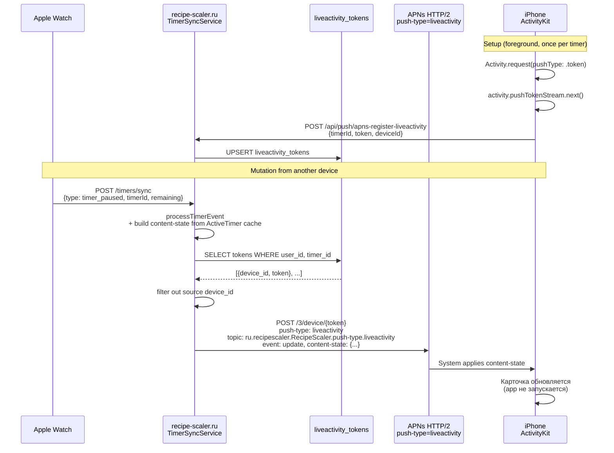

# Спецификация: Live Activity Push Updates

**Ветка**: `058-live-activity-push`
**Дата**: 2026-08-03
**Статус**: 🟢 **v1** (`event=update` / `event=end`) — ✅ native + server + **device QA** 2026-08-05 (Watch/web → LA на фоне). 🟡 **v2** (`event=start`, iOS 18+) — специфицировано ниже, реализация отдельно.
**Зависимости**:
- [023-push-notifications](../023-push-notifications/spec.md) ✅ DONE (APNs ключ + entitlements)
- [044-timer-live-activity](../044-timer-live-activity/spec.md) 🟡 (локальный ActivityKit готов; push v1 — эта спека)
- [039-watchos-timers](../039-watchos-timers/spec.md) 🟡 (часы — основной триггер фоновых событий)
- [030-timer-widget](../030-timer-widget/spec.md) — Home/Lock Screen виджет; **silent push виджета → 030 v2** (не эта спека)

## Контекст

В spec 044 v1 Live Activity создаются только из main app и обновляются локально через
`Activity.update()`. Если пользователь поставит таймер на паузу с Apple Watch или с веба, а iPhone
app в этот момент не активен (фон или закрыт) — карточка на Lock Screen останется в устаревшем
состоянии. Обновление применится только при следующем открытии app, через `reconcile`.

Та же проблема для `timer_deleted` с часов: карточка остаётся висеть, пока user не откроет iPhone.

APNs push updates для Live Activities (WWDC23, "Updating Live Activities with push notifications")
решает это: сервер, обрабатывая `timer_*` события от source-девайса, параллельно шлёт APNs push на
зарегистрированные activity push tokens target-девайсов. iOS сама применяет `content-state` к
карточке, **не** пробуждая app.

## Цель

Обновлять и закрывать Live Activity на Lock Screen iPhone через APNs, когда timer mutation
приходит с другого устройства (Apple Watch, веб, второй iPhone) — без необходимости держать iPhone
app открытым.

## Пользовательские сценарии

### US1 — Pause с Apple Watch обновляет карточку на iPhone (P1)

**Когда** пользователь ставит таймер на паузу с Apple Watch, а iPhone app в фоне или закрыт,
**тогда** в течение ~3 секунд карточка Live Activity на iPhone переключается в состояние `paused`
(правильный accent, прогресс останавливается, появляется кнопка play).

### US2 — Resume с Apple Watch (P1)

**Когда** пользователь возобновляет таймер с Apple Watch, **тогда** карточка на iPhone переключается
в `running` с обновлённым `endDate` и живым countdown.

### US3 — Delete с Apple Watch убирает карточку (P1)

**Когда** пользователь удаляет таймер с часов, **тогда** карточка Live Activity на iPhone
немедленно исчезает (dismiss-all).

### US4 — Pause/resume/delete с веба (P2)

То же, что US1–US3, но source — браузер. На iPhone карточка обновляется через push, даже если
iPhone app закрыт.

### US5 — Pause с iPhone обновляет карточку (P0 self-event)

**Когда** пользователь ставит таймер на паузу с **самого iPhone** (кнопка в карточке или в app),
**тогда** локальный `Activity.update()` срабатывает немедленно; server push **не** обязателен, но
допустим (если `Activity.update` уже применил состояние, повторный push ничего не сломает — iOS
игнорирует stale `timestamp`).

### US6 — Completion таймера (P2)

**Когда** серверное `timer_completed` событие проходит через cleanup или `scheduleTimerNotifications`
**тогда** на iPhone приходит push `event=update` с `phase=exceeded`, карточка краснеет. На iOS 18+
можно `event=end` с `dismissal-date` (в прошлом — снять сразу).

## Решения v1

### R1 — Push v1: только `update` и `end` (не `start`)

В **v1** создание Live Activity всегда из app через `Activity.request`. Push — только
`update` и `end`. `event=start` (создать LA remote) — **v2**, см. секцию ниже; на iOS 17
недоступен (fallback: foreground `reconcile`).

### R2 — Topic: `<bundleID>.push-type.liveactivity`

Формат: `ru.recipescaler.RecipeScaler.push-type.liveactivity`. **Без** activity-type-name в topic
(подтверждено WWDC23 session 10185 + Apple Docs "Sending notification requests to APNs"). Это
распространённая ошибка из blog-постов.

### R3 — Push token хранится на сервере per (userId, deviceId, timerId)

В отличие от device-level APNs token (один на устройство), Live Activity push token выдаётся на
**каждую** activity. Нужно по одному push token на timer. Структура:

```sql
CREATE TABLE liveactivity_tokens (
  id          UUID        PRIMARY KEY DEFAULT gen_random_uuid(),
  user_id     TEXT        NOT NULL,
  device_id   TEXT        NOT NULL,
  timer_id    TEXT        NOT NULL,
  token       TEXT        NOT NULL,
  created_at  TIMESTAMPTZ DEFAULT NOW(),
  updated_at  TIMESTAMPTZ DEFAULT NOW(),
  UNIQUE(user_id, device_id, timer_id)
);
CREATE INDEX idx_liveactivity_tokens_user_timer ON liveactivity_tokens(user_id, timer_id);
```

### R4 — iOS регистрирует token сразу после `Activity.request`

После успешного `Activity.request(attributes:, content:, pushType: .token)`iOS запустит foreground
runtime и выдаст token через `activity.pushTokenStream`. Подписываемся на stream, при первом
полученном token шлём `POST /api/push/apns-register-liveactivity`. Последующие tokens (если система
ротирует) перезаписывают предыдущий (UNIQUE constraint в БД).

### R5 — Token cleanup на `end`

Когда iOS app вызывает `Activity.end(...)` (при удалении таймера или account-wipe), параллельно
слать `DELETE /api/push/apns-register-liveactivity` для очистки записи на сервере. Это best-effort;
если app убит, токен протухнет на сервере через cleanupOldTokens по возрасту (TTL 30 дней).

### R6 — Сервер строит `content-state` сам + подтягивает recipe name

iOS не отправляет полное состояние при мутациях на сервер (только timerId + тип события). Сервер
строит `content-state` для push payload из in-memory cache `TimerSyncService.activeTimers`, который
уже содержит `name`, `duration`, `endTime`, `isPaused`, `pausedDuration`, `startedAt`, `recipeId`.

Recipe name / thumbnail в cache **нет**. **Решение v1**: сервер при отправке push подтягивает
`recipeName` из Y.Doc по `recipeId` (best-effort, с коротким in-memory cache 60s). Thumbnail в push
не передаём (`recipeThumbnailName: null`) — iOS оставляет прежний из локального `sync(timer:)`.
Если Y.Doc недоступен или `recipeId` пуст — `recipeName: null`, countdown-поля всё равно уходят.

### R7 — Пропускаем push для source device

Когда device A шлёт `timer_paused` на сервер, сервер фанит push **на все зарегистрированные
устройства этого user** с активным token для этого timerId, **кроме** device A. На device A
локальный `Activity.update` уже применился в `TimerManager` мутации.

### R8 — Throttling

Минимальный интервал между push для одного timerId: **1 секунда**. Если за это время пришло
несколько событий (например, watch быстро pause→resume), отправляем только последний state.
Реализуется in-memory debounce map на сервере.

### R9 — Один APNs request на device

APNs не поддерживает multicast. На каждое устройство — отдельный HTTP/2 запрос. Используем
`Promise.allSettled` (как в существующем `ApnsService.sendToUser`).

### R10 — Sandbox vs Production

Debug-сборки (`aps-environment=development`) регистрируют activity push token на
`api.sandbox.push.apple.com`. На сервере переиспользуем существующий флаг `APNS_PRODUCTION` —
тот же host используется и для обычных push, и для activity push.

## Вне scope v1

- `event=start` через push — **не «навсегда вне проекта»**: см. **v2** ниже; в v1 start всегда из app.
- Recipe name / thumbnail в content-state push payload сверх R6 (thumbnail всегда `null` в v1).
- Push для Dynamic Island expanded layout (системный, не наш control).
- **Silent / background push для Home Screen виджета** — не 058 и не «отдельная 059»:
  запланировано в **[030-timer-widget v2](../030-timer-widget/spec.md)** (WidgetKit refresh).
- Cleanup stale tokens старше 30 дней (background job, опционально).

## v2 — `event=start` (создать Live Activity remote)

**Статус v2**: спецификация; реализация после стабилизации v1 на устройствах.
**Предусловие платформы**: **iOS 18+** (Apple: remote start Live Activity via APNs). На **iOS 17**
сервер **не** шлёт `event=start`; карточка появляется только когда iPhone app в foreground
сделает `reconcile` / локальный `Activity.request` (как сегодня).

### Зачем

Таймер стартует с **web / Apple Watch**, а iPhone app **не запущен** → на iOS 17 карточки нет
до открытия app. На iOS 18+ APNs `event=start` создаёт Live Activity на Lock Screen / Dynamic
Island без запуска app.

### Когда сервер шлёт `start`

На fan-out после `timer_started` (и при необходимости аналог «первый visible state»):

| Условие | APNs `event` |
|---------|----------------|
| Есть зарегистрированный **activity** push token для `(user, device, timer)` | `update` (v1, как сейчас) |
| Нет activity token для этого timer на target device, устройство **поддерживает start** (iOS 18+ / известный capability flag — уточнить при реализации) | `event=start` + `attributes` + `content-state` |
| Target на iOS 17 / start недоступен | **не** слать start; полагаться на foreground reconcile |

Токены `liveactivity_tokens` в v1 появляются **после** локального `Activity.request`. Для
remote start нужен отдельный канал (например device-level Live Activity push-to-start token /
`Activity.pushToStartTokenUpdates` — зафиксировать в tasks при реализации v2). Без push-to-start
токена `event=start` доставить нельзя.

### Payload (набросок)

Помимо полей v1 (`timestamp`, `content-state`, …), в `aps` для `event: "start"`:

- `event`: `"start"`
- `attributes-type`: имя типа атрибутов ActivityKit — `RecipeTimerActivityAttributes`
- `attributes`: статическая часть `RecipeTimerActivityAttributes` (например `timerId`,
  `timerName` / display name — parity с тем, что передаётся в локальный `Activity.request`)
- `content-state`: тот же Codable, что для `update` (phase, endDate, …)

Topic / headers — те же, что в v1 (`apns-push-type: liveactivity`, topic
`<bundleID>.push-type.liveactivity`).

Детали JSON и mapping → [contracts/liveactivity-push.md](contracts/liveactivity-push.md)
(секция v2).

### iOS 17 fallback

Пользователь открывает iPhone app → существующий `reconcile` / `sync(timer:)` создаёт LA
локально и регистрирует activity token → дальше работают v1 `update`/`end`.

## Архитектура



## Endpoint контракты

### POST `/api/push/apns-register-liveactivity`

**Request body**:
```json
{
  "timer_id": "timer_<uuid>",
  "token": "<activity push token, hex>",
  "device_id": "<existing device_id from TimerSyncService>"
}
```

**Response**: `{ success: true }` или `{ success: false, error: "<message>" }` со статусом 400/500.

Auth: тот же `requireUserId` middleware, что и `/api/push/apns-register`.

### DELETE `/api/push/apns-register-liveactivity`

**Query**: `?timer_id=<timerId>&device_id=<deviceId>`

**Response**: `{ success: true }`. Idempotent — если записи нет, всё равно 200.

### APNs request (для справки)

Headers:
- `apns-push-type: liveactivity`
- `apns-topic: ru.recipescaler.RecipeScaler.push-type.liveactivity`
- `apns-priority: 5 or 10`
- `authorization: bearer <JWT>`
- `content-type: application/json`

Payload (`event: update`):
```json
{
  "aps": {
    "timestamp": 1730000000,
    "event": "update",
    "content-state": {
      "phase": "paused",
      "endDate": null,
      "pausedRemainingSeconds": 600,
      "startedAt": "2026-08-03T19:10:00Z",
      "totalDuration": 1200.0,
      "recipeName": null,
      "recipeThumbnailName": null,
      "syncedAt": "2026-08-03T19:20:00Z"
    },
    "stale-date": 1730000060
  }
}
```

Payload (`event: end`):
```json
{
  "aps": {
    "timestamp": 1730000000,
    "event": "end",
    "content-state": { ... final state ... },
    "dismissal-date": 1730000000
  }
}
```

Ключи в `content-state` должны точно совпадать с `RecipeTimerActivityAttributes.ContentState`
кодирования Codable. Подробный контракт → [contracts/liveactivity-push.md](contracts/liveactivity-push.md).

## iOS Changes

### `RecipeTimerActivityAttributes.ContentState`

Без изменений — уже Codable с подходящими типами. JSON encoder использует `iso8601` для дат (нужно
подтвердить parity с сервером; если сервер шлёт ISO 8601 string, iOS Swift `Date` декодирует через
`.iso8601` strategy). Проверить current `ContentState` encoding при использовании в JSON payload.

### `TimerLiveActivityCoordinator`

1. В `Activity.request` сменить `pushType: nil` → `pushType: .token`.
2. После успешного `request` — подписаться на `activity.pushTokenStream` через новый
   `Task` (храним ссылку для отмены).
3. На каждый выданный token:
   - `POST /api/push/apns-register-liveactivity` с `{timer_id, token, device_id}`.
   - `device_id` берём из `TimerSyncService.storedDeviceId()`.
4. На `end(timerId:)` / `endAll()` — `DELETE` соответствующих токенов на сервере.
5. Сохраняем last-registered token в `UserDefaults` per timerId (для idempotency — не слать
   повторную регистрацию того же token при reconnect).

### `AppContainer`

Добавить `liveActivityPushRegistrar` зависимость (thin service для HTTP запросов), инжектится в
`TimerLiveActivityCoordinator` через constructor.

## Серверные Changes

### Migration

Новая таблица `liveactivity_tokens` (см. R3). SQL в Supabase через Dashboard; migration file —
`server/src/db/migrations/XXX_liveactivity_tokens.sql` (если у вас есть миграции).

### `ApnsService` extensions

```typescript
// New method
async sendLiveActivityUpdate(
  deviceToken: string,
  contentState: RecipeTimerContentState,
  options: { staleDate?: Date; event?: 'update' | 'end'; dismissDate?: Date }
): Promise<void>

// Topic:
const topic = `${this.bundleId}.push-type.liveactivity`;
// Headers:
'apns-push-type': 'liveactivity',
'apns-topic': topic,
```

Один новый приватный метод `sendLiveActivity(...)` для построения payload + signing.

### Новый сервис `LiveActivityTokenStore` (или методы в `ApnsService`)

```typescript
saveActivityToken(userId, deviceId, timerId, token): Promise<void>
removeActivityToken(userId, deviceId, timerId): Promise<void>
getActivityTokens(userId, timerId, excludeDeviceId?: string): Promise<{deviceId, token}[]>
```

SQL через существующий `query`/`execute`.

### Новый endpoint в `routes/push.ts`

- `POST /apns-register-liveactivity` — body schema `{ timer_id, token, device_id }`
- `DELETE /apns-register-liveactivity` — query params `timer_id`, `device_id`

### Hook в `TimerSyncService`

В `syncTimerEvents`, после `this.realtime.emitToUser(userId, 'timer_event', wsEvent)` (строка ~152),
добавить:

```typescript
// Best-effort live activity push update for cross-device mirror
this.scheduleLiveActivityUpdate(userId, timerId, excludeDeviceId).catch((err) => {
  logger.warn(`[TimerSync] Live Activity push failed for ${timerId}:`, err);
});
```

Где `scheduleLiveActivityUpdate`:
1. Берёт `ActiveTimer` из cache.
2. Если нет — return (нет данных для content-state).
3. Debounce 1s (R8) — заменяет queued call если уже pending.
4. Строит `content-state` из `ActiveTimer`.
5. Для `timer_deleted` — `event: end` + `dismissDate: now`.
6. Запрашивает tokens через `getActivityTokens(userId, timerId, excludeDeviceId)`.
7. Параллельно (Promise.allSettled) шлёт push на каждый token.

## Критерии успеха

- **SC-001**: Запускаю таймер на iPhone, карточка на Lock Screen. Pause с Apple Watch → карточка на
  iPhone обновляется до `paused` за ≤ 3 секунды (app на iPhone закрыт).
- **SC-002**: Resume с часов → карточка снова `running` с актуальным countdown ≤ 3 секунды.
- **SC-003**: Delete с часов → карточка исчезает с Lock Screen ≤ 3 секунды.
- **SC-004**: То же, что SC-001, но с веба (открыть timer panel в браузере, поставить паузу).
- **SC-005**: Stale token cleanup не ломает обычные сценарии (если токен невалиден, сервер
  логирует warning и удаляет запись из БД, не роняя request).
- **SC-006**: Локальные мутации (pause с самого iPhone) **не** приводят к push — source device
  excluded из рассылки.

## Риски и митигации

| Риск | Митигация |
|------|-----------|
| Push token ротируется системой | Подписка на `pushTokenStream` → перерегистрация на сервере (R4) |
| Activity убита системой (memory pressure) | `restoreFromSystem()` уже есть; при следующем старте таймера token снова регистрируется |
| User переключил устройство/переустановил app | Stale tokens в БД протухают по возрасту; APNs возвращает `Unregistered` → удаляем (как в существующем `ApnsService.send`) |
| `timestamp` коллизия (одинаковый в двух пушах) | Сервер всегда ставит `Date.now()` в `timestamp`; iOS требует unique-per-activity |
| App kill mid-registration | Token не зарегистрирован → push не дойдёт. На следующем старте app подписывается заново. Worst case: 1 окно без push обновлений. |
| ActivityKit выдаёт token не сразу после `Activity.request` | Это нормально — может занять секунды. UI уже работает локально; push только для других devices |
| Topic суффикс не угадан | Подтверждено WWDC23 + Apple Docs (см. R2). При первой регистрации проверим логи APNs response |
| Сервер в `sandbox` режиме шлёт на production host | Используем `APNS_PRODUCTION` env, тот же что для обычных push. Debug-сборки iPhone зарегистрированы на sandbox host. |

## Связанные спеки

- [023-push-notifications](../023-push-notifications/spec.md) — базовая APNs инфраструктура
- [044-timer-live-activity](../044-timer-live-activity/spec.md) — локальный ActivityKit
- [039-watchos-timers](../039-watchos-timers/spec.md) — watch как источник мутаций
- [030-timer-widget](../030-timer-widget/spec.md) — виджет; **v2** — silent push / remote refresh виджета

## Артефакты (планируются)

- `plan.md` — порядок реализации
- `contracts/liveactivity-push.md` — детальный payload контракт, parity с `ContentState`
- `tasks.md` — декомпозиция
- `quickstart.md` — manual QA на iPhone + Watch pairing
