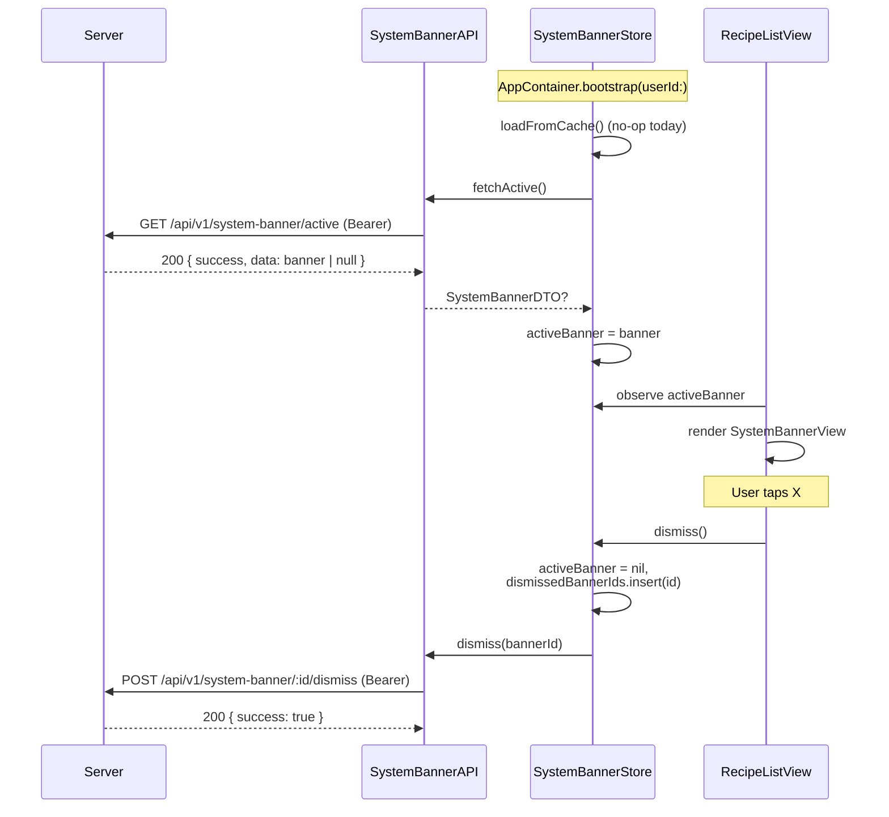

# Спецификация: системный баннер над списком рецептов (native)

**Ветка**: `061-system-banner`
**Дата**: 2026-08-05
**Статус**: 🟡 На стадии plan
**Зависимости**: `013-account-settings` (`AccountAPI`, `AuthService`), backend auth/`requireUserId`, `SystemBannerService` (web spec 061), `APIClient` / `requestJSON`, `AppContainer` (DI-композиция), `AppEnvironment`, `LegacyAuthBannerView` (визуальный эталон), `FeatureAdoptionStore` (DI-эталон `@Observable` store)
**Эталоны**: новая `SystemBannerView` над `RecipeListView`, `SystemBannerStore` в `AppContainer`, серверный endpoint `/api/v1/system-banner/*`, per-user dismissal на сервере

## Контекст

Админ публикует единовременный системный баннер (технические работы, переезд сервера, изменение регламента) через Bun CLI на сервере. Все клиенты — web и native — показывают его над списком рецептов как самый приоритетный. Пользователь может его закрыть; закрытие сохраняется на сервере per-user и привязано к `banner_id`. При публикации следующего баннера пользователь снова его видит. Максимум один активный баннер одновременно — enforced частичным уникальным индексом на стороне БД.

### Scope: native + общий backend

UI появляется в обоих клиентах над списком рецептов. Backend един, описан в web spec 061 (`recipe-scaler-web/specs/061-system-banner/spec.md`).

## Цель

Dismissible системный баннер над списком рецептов, синхронизированный между устройствами через серверную таблицу dismissals. Без polling — refresh только на bootstrap.

## Пользовательские сценарии

### US1 — Просмотр баннера (P1)

**Когда** пользователь открывает Recipes tab и есть активный баннер, который он ещё не закрывал, **тогда** над списком (выше всех остальных алертов) появляется `SystemBannerView` с заголовком и телом на языке интерфейса. Текст рендерится через `Text(verbatim:)`, не через локализационный ключ.

### US2 — Закрытие (P1)

**Когда** пользователь тапает кнопку-крестик, **тогда** баннер сразу исчезает с экрана, `SystemBannerStore.dismiss()` вызывает `POST /api/v1/system-banner/:id/dismiss`, dismissal сохраняется на сервере idempotent (`ON CONFLICT DO NOTHING`). При следующем холодном старте этот же баннер уже не возвращается.

### US3 — Появление нового баннера (P1)

**Когда** админ публикует новый баннер (`publish` в CLI), **тогда** пользователь со скрытым предыдущим снова видит новый — предыдущий активный удаляется на сервере (CASCADE dismissals), dismissal привязан к `banner_id`. Холодный старт подхватывает новый автоматически.

### US4 — Смена языка в runtime (P2)

**Когда** пользователь переключает язык в Profile (`AppLanguagePreference`), **тогда** баннер мгновенно перерисовывается на новом языке без рефетча с сервера — выбирается `titleRu`/`bodyRu` или `titleEn`/`bodyEn` из уже загружённого DTO.

### US5 — Офлайн / ошибка сети (P2)

**Когда** `refresh()` на старте не смог достучаться до сервера, **тогда** баннер не показывается (silent), никакой ошибки в UI. На следующем старте всё повторится.

### US6 — Логаут / смена пользователя (P1)

**Когда** пользователь разлогинивается, **тогда** `SystemBannerStore.clearForLogout()` сбрасывает `activeBanner = nil` и чистит in-memory `dismissedBannerIds`, чтобы при следующем логине другого пользователя не мелькал чужой баннер. Серверное dismissal при этом не трогается.

### US7 — Аноним (P1)

**Когда** пользователь не аутентифицирован, **тогда** баннер не показывается (endpoint под `requireUserId`, анонимы его не получают).

### US8 — Удаление баннера админом (P1)

**Когда** админ удаляет активный баннер (`delete` в CLI), **тогда** на следующем холодном старте он исчезает у всех (включая тех, кто не скрывал); dismissal-записи удаляются через `ON DELETE CASCADE`.

## Архитектура

- DTO: `SystemBannerDTO` (`id`, `titleEn`, `titleRu`, `bodyEn`, `bodyRu`, `createdAt`). Snake_case-декодинг через `requestJSON` (`.iso8601` даты).
- Networking: `enum SystemBannerAPI` с двумя статическими методами (`fetchActive`, `dismiss`). Использует `APIClient.shared.requestJSON`. Не использует `unwrapResponse` для fetch, потому что серверная конвенция `{ "success": true, "data": null }` трактуется `unwrapResponse` как ошибка.
- Store: `SystemBannerStore` — `@MainActor @Observable`, один на сессию, живёт в `AppContainer.systemBanner`. Единственное observable-поле — `activeBanner: SystemBannerDTO?`. Опционально in-memory `dismissedBannerIds` страхует от повторного показа в той же сессии, если POST ещё не завершился.
- View: `SystemBannerView` — presentational SwiftUI, инжектится в `RecipeListView` сразу после `DatabaseInitFailedBanner`.
- Persistence: только серверная. Никакого `UserDefaults` для dismissal (это должно синхронизироваться между устройствами; локальный кэш только мешал бы).
- Refresh стратегия: один раз в `AppContainer.bootstrap(userId:)` сразу после `loadFromCache()`. Без polling, без `scenePhase`-рефетча.

## Контракты (ссылки)

- REST: см. web spec 061, раздел «Wire-контракт» — `GET /api/v1/system-banner/active`, `POST /api/v1/system-banner/:id/dismiss`.
- Серверная схема: `system_banners`, `system_banner_dismissals` — см. web spec 061.

## Acceptance criteria

- AC1. После `publish` баннер виден на Recipes tab над `DatabaseInitFailedBanner` (если тот тоже показан) и над всем списком.
- AC2. Тап по крестику скрывает баннер мгновенно; dismiss-запрос уходит; повторный холодный старт баннер не возвращает.
- AC3. Смена языка в Profile обновляет текст баннера в той же сессии без рефетча (`AppLanguagePreference` observed).
- AC4. `clearForLogout()` корректно вызывается из `AppContainer.stopForLogout()` и из обоих вызовов `AuthService.wipeLocalSession(reason:)` / delete-account.
- AC5. `AccessibilityIdentifiers.systemBanner` и `systemBannerDismiss` добавлены; `common.close` уже существует в `Localizable.xcstrings` и используется как accessibility label.
- AC6. `LocalizationConsistencyTests` проходит без изменений — новых статических ключей не добавлено (серверный текст не нуждается в локализации на клиенте).

## Риски

- Серверный контент может содержать специальные символы / очень длинный текст — UI должен корректно работать с `.fixedSize(horizontal: false, vertical: true)` (как `DatabaseInitFailedBanner`).
- Не использовать `Text(message)` — SwiftUI трактовал бы строку как `LocalizedStringKey`. Только `Text(verbatim:)`.
- Если в будущем понадобится warm-start кэш — добавить его в `loadFromCache()` (сейчас no-op).
- `unwrapResponse` тракует `data: null` как ошибку. Поэтому `SystemBannerAPI.fetchActive()` декодирует `APIResponse<SystemBannerDTO>` и читает `response.data` напрямую, минуя `unwrapResponse`.

## Out of scope

- Web-реализация — см. web spec 061.
- CLI управления баннерами — см. web spec 061.
- Серверная миграция и сервис — см. web spec 061.
- Realtime / push-обновление баннера без перезапуска — намеренно отложено.
- История баннеров на клиенте (deactivated-баннеры не показываются).
- Локальный кэш баннера (UserDefaults) — намеренно отложено: серверная сторона — единственный источник правды, локальный кэш создавал бы риск рассинхрона между устройствами.
