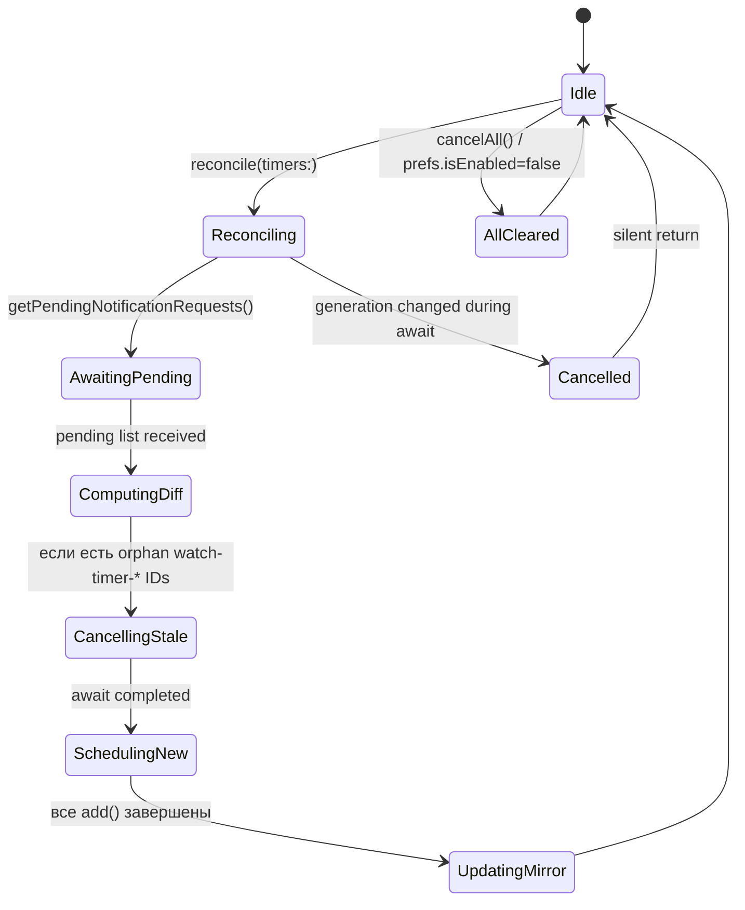

# Data Model: watchOS expiry notification + Settings

**Спека**: [spec.md](./spec.md) | **План**: [plan.md](./plan.md) | **Research**: [research.md](./research.md)

## Сущности

### 1. `WatchExpiryNotificationsPrefs`

Пользовательская настройка «включены ли уведомления+haptic при окончании таймера».

| Поле | Тип | Storage | Default | Semantics |
|------|-----|---------|---------|-----------|
| `isEnabled` | `Bool` | `UserDefaults.standard` (watch-local) | `true` | `true` → scheduler планирует + foreground haptic играет; `false` → все pending отменяются, новые не планируются, foreground haptic suppress |

**API**:

- `static var isEnabled: Bool { get }` — read-through от `UserDefaults`.
- `static func setEnabled(_ value: Bool)` — синхронно пишет в `UserDefaults.standard`.
- `static let didChangeNotification: Notification.Name` — постится при `setEnabled`, чтобы `TimerListViewModel` мог реактивно обновиться без Combine-подписки (минимум зависимостей).
- `static func registerDefaults()` — вызывает `UserDefaults.standard.register(defaults: ["watchExpiryNotificationsEnabled": true])`. Вызывается из `RecipeScalerNativeWatchApp.init()`.

### 2. `WatchExpiryNotificationScheduler`

`actor`. Единственный владелец identifier-пространства `watch-timer-<timerId>-complete` в `UNUserNotificationCenter`.

**Stored state**:

- `private var scheduledIdentifiers: Set<String>` — In-memory mirror того, что мы запланировали. На случай cold start с orphan pending-запросами — первым `reconcile` вызываем `cancelAll` → ре-планируем.
- `private var reconcileGeneration: UInt64 = 0` — single-flight guard.

**Public API**:

```swift
actor WatchExpiryNotificationScheduler {

    // Разовое: запросить разрешение. Безопасно вызывать многократно.
    func requestAuthorizationIfNeeded() async

    // Главная точка: привести pending set в соответствие с текущим списком таймеров.
    // Вызывается из TimerListViewModel.refresh() после service.state обновления.
    // Алгоритм:
    //   1) Если WatchExpiryNotificationsPrefs.isEnabled == false → cancelAll + return.
    //   2) generation++; let myGen = generation
    //   3) Fetch pending requests via UNUserNotificationCenter.getPendingNotificationRequests
    //   4) Build desired = set of identifiers from current timers (active, non-paused, endDate > now + grace)
    //   5) Remove all "watch-timer-*" pending that are NOT in desired
    //   6) For each desired identifier not in pending OR pending with wrong date → remove + add
    //   7) Re-check generation == myGen before each external side effect
    //   8) Update scheduledIdentifiers
    func reconcile(timers: [WatchTimer], now: Date) async

    // Point-cancel: pause/delete одного таймера.
    func cancel(timerId: String) async

    // Полная очистка: logout, prefs toggle OFF.
    func cancelAll() async

    // Reconcile permission state for UI.
    func authorizationStatus() async -> UNAuthorizationStatus
}
```

**Identifier helpers (static)**:

```swift
extension WatchExpiryNotificationScheduler {
    static let identifierPrefix = "watch-timer-"
    static let identifierSuffix = "-complete"

    static func identifier(for timerId: String) -> String {
        "\(identifierPrefix)\(timerId)\(identifierSuffix)"
    }

    static func timerId(from identifier: String) -> String? {
        guard identifier.hasPrefix(identifierPrefix),
              identifier.hasSuffix(identifierSuffix) else { return nil }
        let start = identifier.index(identifier.startIndex, offsetBy: identifierPrefix.count)
        let end = identifier.index(identifier.endIndex, offsetBy: -identifierSuffix.count)
        guard start < end else { return nil }
        return String(identifier[start..<end])
    }
}
```

### 3. `UNNotificationRequest` content schema

| Поле | Значение |
|------|----------|
| `identifier` | `"watch-timer-<timerId>-complete"` |
| `content.title` | `Bundle.main.localizedString(forKey: "watch.timer.notification.title")` (String, не LocalizedStringKey — для UN API) |
| `content.body` | `Bundle.main.localizedString(forKey: "watch.timer.notification.body")` |
| `content.sound` | `nil` (явно; звук исключён пользователем) |
| `content.userInfo` | `["timerId": timerId, "timerName": timer.name]` |
| `trigger` | `UNCalendarNotificationTrigger(dateMatching: DateComponents от endDate, repeats: false)` |

## Состояния reconcile (state diagram)



## Invariants

- **I1**: В любой момент времени для конкретного `timerId` существует **максимум один** pending request с identifier `watch-timer-<timerId>-complete`.
- **I2**: Если `WatchExpiryNotificationsPrefs.isEnabled == false`, то `UNUserNotificationCenter.getPendingNotificationRequests` не содержит ни одного identifier с префиксом `watch-timer-`.
- **I3**: `reconcile` атомарен по `generation` — если во время await стартует новый `reconcile`, старый тихо прерывается.
- **I4**: `cancel(timerId:)` идемпотентен — повторный вызов для уже отменённого timerId не падает.
- **I5**: `grace` interval (5 секунд) применяется только при **новом** планировании. Уже запланированный request не отменяется при приближении endDate (если только не пришёл pause/delete).

## Edge cases mapping → test names

| Сценарий | Тест |
|----------|------|
| Активный таймер с endDate через 60с | `test_reconcile_schedules_for_active_timer` |
| Паузнутый таймер (isPaused=true) | `test_reconcile_skips_paused_timer` |
| Таймер с endDate в прошлом (>5s ago) | `test_reconcile_skips_expired_timer` |
| Таймер с endDate через 2с (внутри grace) | `test_reconcile_skips_within_grace` |
| Pause после планирования | `test_pause_cancels_pending` |
| Delete после планирования | `test_delete_cancels_pending` |
| `cancelAll` после 3 запланированных | `test_cancelAll_removes_every_watch_timer_request` |
| Prefs toggle OFF после планирования | `test_disabled_cancels_all_and_skips_scheduling` |
| Два `reconcile` подряд | `test_double_reconcile_single_pending_per_timer` |
| Orphan request (был запланирован, потом timerId исчез из списка) | `test_reconcile_removes_orphan_pending` |
| `timerId(from:)` для malformed identifier | `test_timerId_from_invalid_identifier_returns_nil` |
