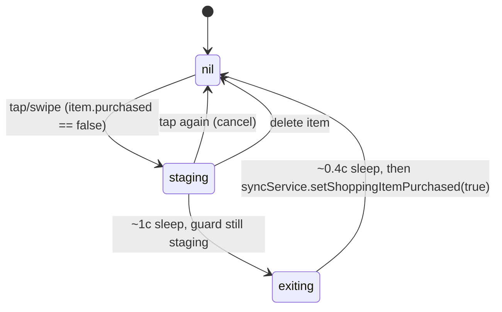

# Data Model: свайп от левого края для отметки покупки

**Spec**: [spec.md](./spec.md)
**Plan**: [plan.md](./plan.md)

## Сущности

Фича **не вводит новых сущностей**, **не меняет схему**, **не добавляет state machines**. Используются существующие из спеки 024.

### `ShoppingListItem` (без изменений)

`ShoppingListItem` определён в проекте (через `ShoppingListSnapshot`), содержит:
- `id: String` — stable identifier.
- `label: String` — отображаемый текст.
- `purchased: Bool` — целевой атрибут мутации.
- `recipeId: String?`, `ingredientId: String?` — для ингредиентных пунктов; оба nil для ручных.
- `recipeName: String` — для subtitle.

### `ToBuyPurchasePhase` (без изменений)

Уже объявлен в `ShoppingListView.swift:8`:
```swift
enum ToBuyPurchasePhase: Equatable {
    case staging
    case exiting
}
```

### `purchasePhases: [String: ToBuyPurchasePhase]` (без изменений)

Существующий `@State` в `ShoppingListView` (línea 29). Используется как single-flight guard и для staging-анимации.

## Атрибуты под мутацией

| Сущность | Атрибут | Тип | Источник | Точка записи | Это фича вводит? |
|----------|---------|-----|----------|--------------|------------------|
| `ShoppingListItem` | `purchased` | Bool | `Y.Map('shopping')` из 024 | `syncService.setShoppingItemPurchased(id:purchased:)` | Нет — вызывается из нового UI-жеста в уже существующий метод |

## Validation rules

Без изменений — `setShoppingItemPurchased` из 024 уже валидирует `id`.

## State transitions

Без изменений — `purchasePhases` state machine уже реализован в `handlePurchaseToggle`:



Новый leading-swipe приводит к **тому же** вызову `handlePurchaseToggle`, что и tap-to-check — диаграмма переходов не меняется.

## Relationships

Без изменений. `ShoppingListView` owns `purchasePhases` и `shoppingModel`; `YjsSyncService` owns Y.Doc; SQLite owns offline-queue.

## Out-of-scope для data-model

- Схема Y.Doc, миграции, новые collection keys.
- Persistence-слой shopping list (наследуется из 024).
- Cross-target data flow (App Intents/widgets) — не затрагивается.
