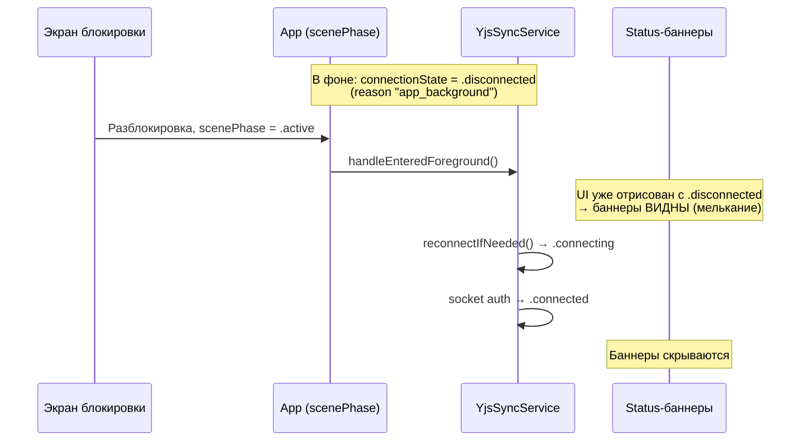

# Спецификация: Debounce оффлайн-баннеров (native)

**Ветка**: `066-offline-banner-debounce`
**Дата**: 2026-08-13 (дополнено 2026-08-27)
**Статус**: Implemented; amendment 2026-08-27 — `AssistantSheet` UI-ветка переведена на gate
**Зависимости**: `YjsSyncService.connectionState`, `AccountView`, `TelegramConnectionView`, `ShoppingListShareSheet`, `AppShellView`, `AppContainer` (composition root), `ContentView` (`scenePhase`).

## Контекст и мотивация

При разблокировке телефона пользователь видит мелькание оффлайн-баннеров. Корень проблемы — в том, как SwiftUI-вьюхи синхронно читают `syncService.connectionState`, который скачет между состояниями при foreground/background переходах:

Все четыре status-баннера сейчас синхронно читают `connectionState` и становятся видимыми для `.disconnected`/`.error`. Между моментом появления UI и приходом `.connected` (обычно <1с при foreground-reconnect) баннеры успевают всплыть и скрыться.

## Цель

1. Один shared-гейт (`OfflineBannerGate`, `@Observable`) с задержанным показом 3 секунды и мгновенным скрытием.
2. Гейт обновляется из единственного места (`AppShellView.onChange(of: connectionState)`) и инжектится через `@Environment` всем потребителям.
3. Пять status-баннеров переходят на чтение `gate.isVisible` вместо прямой проверки `connectionState` (amendment 2026-08-27 добавил пятым UI-ветку `AssistantSheet`, FR-009a).
4. Feature-gating (заблокированные кнопки, гейты изображений, action-пути `AssistantSheet`) остаётся мгновенным — там debounce привёл бы к бесполезным действиям в офлайне.

## Non-goals

- Менять механику `handleEnteredBackground()` / `handleEnteredForeground()` в `YjsSyncService` — она корректна (нельзя держать сокет в фоне), чиним только UI-реакцию.
- Применять debounce к feature-gating местам (`allowsImageNetworkRefresh`, `RecipeDetailImageSection`, `ImportRecipeSheet`, `DataManagementView`, `YDocRecipeDetailView`, `DiscoverRecipeView`, `disabled`-кнопки в `ShoppingListShareSheet`) и к **action-путям** `AssistantSheet` (bootstrap, send, autosend) — там debounce привёл бы к бесполезным действиям в офлайне.
- Менять web-контракт, Y.Doc schema, сервер.
- Добавлять новые UI-строки — используются существующие ключи (`account.offline.alert`, `account.public-profile.offline`, `assistant.offline.description`).
- Создавать глобальный overlay-баннер поверх app-shell — остаются inline-секции в текущих местах.

---

## Границы (Scope)

### Status-баннеры → переходят на debounced gate (5 мест)

| Место | Локация | Текст |
|-------|---------|-------|
| `AccountView` основная секция | [RecipeScalerNative/Views/AccountView.swift:117](../../RecipeScalerNative/Views/AccountView.swift) | `account.offline.alert` + иконка `wifi.slash` |
| `AccountView` public-profile заглушка | [RecipeScalerNative/Views/AccountView.swift:367](../../RecipeScalerNative/Views/AccountView.swift) | `account.public-profile.offline` (вместо тоглов) |
| `TelegramConnectionView` inline | [RecipeScalerNative/Views/TelegramConnectionView.swift:29](../../RecipeScalerNative/Views/TelegramConnectionView.swift) | `account.public-profile.offline` |
| `ShoppingListShareSheet` | [RecipeScalerNative/Views/ShoppingListView.swift:582](../../RecipeScalerNative/Views/ShoppingListView.swift) | `account.offline.alert` |
| `AssistantSheet` UI-ветка body | [RecipeScalerNative/Views/AssistantSheet.swift](../../RecipeScalerNative/Views/AssistantSheet.swift) (`showsOnlineContent`) | `assistant.offline.description` (полноэкранная заглушка) |

### Feature gating → НЕ трогается (мгновенная реакция)

- `AssistantSheet` **action-пути** — `initialize()`, `send()`, `scheduleExternalSendIfNeeded()`, `deliverUndeliveredPromptIfReady()`, `.onChange(of: isOnline)` читают мгновенный `connectionState.isConnected`. Debounce только у UI-ветки: ранний send паркуется через `undeliveredPrompt` и доставляется после reconnect, поэтому debounce UI больше не приводит к send-ошибке (исходный риск снят parking-механикой).
- `allowsImageNetworkRefresh` (`RecipeListView`, `CollectionFolderView`) — гейт подгрузки изображений.
- `RecipeDetailImageSection` — контекстная подсказка кнопки загрузки фото.
- `ImportRecipeSheet`, `DataManagementView`, `YDocRecipeDetailView`, `DiscoverRecipeView` — `disabled`/гейты действий.
- `disabled`-кнопки в `ShoppingListShareSheet` (toggle, copy-link) — `isOnline` остаётся мгновенным параметром, только статус-секция (строка 582) переходит на gate.

---

## Пользовательские сценарии и тестирование *(обязательно)*

### User Story 1 — Разблокировка не мелькает (P1)

Пользователь закрывает приложение (фон, экран блокировки), затем разблокирует телефон и возвращается в приложение. Никакой оффлайн-баннер не мелькает в Profile, Telegram-секции или Shopping Share Sheet — даже на долю секунды.

**Почему приоритет**: это исходная жалоба пользователя; без этого история не имеет ценности.

**Независимое тестирование**: смоделировать foreground/background цикл на девайсе или симуляторе (home button → return) — баннеры не должны появляться между возвращением UI и установкой `.connected`.

**Acceptance Scenarios**:

1. **Given** приложение сворачивалось в фон с `.disconnected`, **When** пользователь разблокирует телефон и `scenePhase = .active`, **Then** в течение всего цикла `.disconnected → .connecting → .connected` ни один из пяти status-баннеров не появляется.
2. **Given** холодный старт онлайн, **When** приложение открывается, **Then** status-баннеры не показываются никогда.

---

### User Story 2 — Реальная потеря сети показывает баннеры (P1)

Пользователь уходит в реальный офлайн (включает Airplane Mode, заходит в лифт без сети) дольше чем на 3 секунды. Все пять status-баннеров появляются синхронно — в Profile видна секция `wifi.slash` + `account.offline.alert`, в Telegram-секции и Shopping Share Sheet — `account.public-profile.offline`, в Assistant — полноэкранная заглушка `assistant.offline.description`.

**Почему приоритет**: debounce не должен маскировать реальный длительный офлайн — пользователь должен знать, что изменения не синхронизируются.

**Независимое тестирование**: включить Airplane Mode на >3с → баннеры появляются во всех пяти местах.

**Acceptance Scenarios**:

1. **Given** приложение онлайн, **When** сеть пропадает и остаётся отсутствовать >3с, **Then** `OfflineBannerGate.isVisible` становится `true` и все пять status-баннеров появляются одновременно.
2. **Given** сеть пропала <3с и вернулась, **When** reconnect завершился успешно до истечения порога, **Then** `OfflineBannerGate.isVisible` остаётся `false`, баннеры не показываются.
3. **Given** холодный старт уже в офлайне, **When** приложение открывается, **Then** через 3с баннеры появляются (стартовая инициализация gate в `.onAppear`/`.task`).

---

### User Story 3 — Возврат сети мгновенно скрывает баннеры (P2)

После показа оффлайн-баннера пользователь возвращается в сеть. Баннеры исчезают мгновенно (без задержки в 3с) — обратная связь о восстановлении должна быть быстрой.

**Почему приоритет**: P2 — улучшает UX, но не блокирует основную ценность (убрать мелькание).

**Независимое тестирование**: показать баннер (>3с офлайн), вернуть сеть → баннеры скрываются сразу.

**Acceptance Scenarios**:

1. **Given** `OfflineBannerGate.isVisible = true`, **When** `connectionState` становится `.connected`, **Then** `isVisible` мгновенно становится `false`, баннеры скрываются без задержки. Переходы в `.connecting` / `.reconnecting` **не** скрывают баннер (авиарежим осциллирует этими состояниями без `.connected` — FR-007).
2. **Given** сеть вернулась и снова пропала в течение <3с, **When** пользователь смотрит UI, **Then** баннер не появляется (re-arm требует снова 3с непрерывного офлайна).

---

### Edge Cases

- **Холодный старт офлайн**: gate стартует с `isVisible = false`; в `.onAppear` `AppShellView` вызывает `update(isNotConnected: !syncService.connectionState.isConnected)` при `scenePhase == .active`, что армит armTask — через 3с баннеры появятся.
- **Быстрый toggle offline/online быстрее порога**: armTask отменяется и перезапускается на каждый переход `isNotConnected: false → true`; баннер не показывается, если последовательность длится меньше порога.
- **Logout / смена сессии во время arm**: gate не привязан к userId — это чисто UI-состояние. На новом аккаунте гейт продолжает работать корректно, т.к. `connectionState` пользователя общий.
- **Backgrounding во время arm (US1)**: `scenePhase == .background` вызывает `update(isNotConnected: false)` (cancel + hide). `onChange(connectionState)` игнорируется, пока фаза не `.active`. На разблокировке гейт заново армится со свежим окном 3с, чтобы foreground-reconnect успел скрыть баннер до показа. Время в фоне **не** считается.
- **Dealloc gate**: armTask cancellable; при деаллокации `OfflineBannerGate` (практически не случается — singleton в composition root) task отменяется через `Task.isCancelled` check.
- **Reduce Motion**: gate не вводит новых анимаций — переходы баннеров используют существующие transitions в views.

---

## Требования *(обязательно)*

### Конституционная проверка

- **I. CRDT-First** — N/A: UI-фича, не трогает Y.Doc. Offline queue продолжает работать мгновенно при `.disconnected` — gate не блокирует запись в очередь.
- **II. Web Parity** — N/A: чисто iOS-only UI-изменение; web имеет собственный оффлайн-индикатор, контракт sync не меняется.
- **III. Offline-First** — PASS: приложение остаётся полностью usable в офлайне; gate влияет только на показ статуса, не на функциональность. Offline write queue работает мгновенно.
- **IV. Native UI** — PASS: SwiftUI `@Observable` + `@Environment`, без WebView.
- **V. Phased delivery** — PASS: самостоятельная UI-единица, не блокирует и не зависит от других фаз.

### Функциональные требования

- **FR-001**: Должен быть добавлен публичный read-only computed `YjsSyncService.networkReachable: Bool` (computed поверх приватного `isNetworkReachable`, NWPathMonitor-источник). **Не используется gate'ом после итерации 3** (см. FR-007 rationale), но сохранён как публичный API для будущих потребителей. Не удалять без аудита.
- **FR-002**: Должен быть создан класс `OfflineBannerGate` (`@MainActor @Observable`) с единственным публичным состоянием `var isVisible: Bool` (по умолчанию `false`).
- **FR-003**: `OfflineBannerGate` ДОЛЖЕН принимать порог показа через `init(thresholdSeconds: Double = 3)`.
- **FR-004**: Метод `update(isNotConnected: Bool)` ДОЛЖЕН: при `true` и изменении с `false` → запускать cancellable `Task` со `sleep(thresholdNs)`; по завершении без cancellation устанавливать `isVisible = true`. При `false` → отменять task и мгновенно ставить `isVisible = false`. Имя параметра отражает `!connectionState.isConnected`, а не старый hard-offline (`.disconnected`/`.error` only).
- **FR-005**: `OfflineBannerGate` ДОЛЖЕН игнорировать повторные вызовы `update(isNotConnected: true)` без промежуточного `false` (защита от дублирующих arm на `.connecting`/`.reconnecting`).
- **FR-006**: Экземпляр `OfflineBannerGate` ДОЛЖЕН создаваться в `AppContainer` (composition root, рядом с `SystemBannerStore`) и инжектиться через `.environment(...)` в `AppShellView`.
- **FR-007**: `AppShellView` — единственный writer. Обновляет gate так:
  - `.onChange(of: syncService.connectionState)` → `update(isNotConnected: !newState.isConnected)` **только при `scenePhase == .active`**;
  - `.onChange(of: scenePhase)`: `.background` → `update(isNotConnected: false)` (сброс, время в фоне не считается); `.active` → `update(isNotConnected: !connectionState.isConnected)` (свежее окно 3с);
  - стартовая инициализация в `.onAppear` через тот же `scenePhase` drain.
  **Сигнал — `!connectionState.isConnected`, а НЕ `!networkReachable`.** Device-evidence (debug-session 5.ndjson: 144s авиарежима, NWPathMonitor не сообщил `.unsatisfied`) подтвердил, что NWPathMonitor на некоторых сборках ненадёжен. Порог 3с поглощает **foreground**-reconnect-flash; реальная потеря связи осциллирует `connecting ↔ reconnecting` без `.connected` дольше 3с → баннер показывается. `.connecting`/`.reconnecting` не дизармят gate.
- **FR-008**: Пять status-баннеров ДОЛЖНЫ читать `@Environment(OfflineBannerGate.self).isVisible`:
  - `AccountView.swift:117` (основная секция `wifi.slash`)
  - `AccountView.swift:367` (заглушка public-profile)
  - `TelegramConnectionView.swift:29` (inline)
  - `ShoppingListView.swift:582` (`ShoppingListShareSheet`)
  - `AssistantSheet` UI-ветка body (`showsOnlineContent = !offlineGate.isVisible`) — amendment 2026-08-27, см. FR-009a
- **FR-009**: Feature-gating места (`allowsImageNetworkRefresh`, `RecipeDetailImageSection`, `disabled`-кнопки) ДОЛЖНЫ остаться на мгновенном чтении `connectionState.isConnected`/`connectionState == .connected` — gate и эти места теперь читают **один и тот же сигнал**, но gate добавляет debounce, а feature-gate реагирует мгновенно.
- **FR-009a** (amendment 2026-08-27): `AssistantSheet` разделён на два сигнала. UI-ветка body (`showsOnlineContent`) читает gate — заглушка не мелькает в окне foreground-reconnect (device-evidence `debug-session 4.ndjson`: disconnected → connected ~500мс после возврата; `connected → disconnected("app_background")` в момент сворачивания). Action-пути (`initialize()`, `send()`, `scheduleExternalSendIfNeeded()`, `deliverUndeliveredPromptIfReady()`, `.onChange(of: isOnline)`) читают мгновенный `isOnline` — ранний send паркуется через `undeliveredPrompt`, поэтому debounce UI не теряет сообщения (исходный риск FR-009 «debounce → send-ошибка» снят parking-механикой send-пути).
- **FR-010**: `showsHardOfflineBanner` computed в `AccountView` ДОЛЖЕН быть удалён (логика переезжает в gate).
- **FR-011**: Покрытие unit-тестами `OfflineBannerGate` (≥6 кейсов, см. invariants) с инжектированным коротким порогом.
- **FR-012**: Новые UI-строки НЕ добавляются — используются существующие ключи (`account.offline.alert`, `account.public-profile.offline`, `assistant.offline.description`). `lint-i18n.sh` остаётся зелёным.

### Ключевые сущности

- **OfflineBannerGate** (`@MainActor @Observable`, `RecipeScalerNative/Services/OfflineBannerGate.swift`):
  - `isVisible: Bool` — публичное UI-состояние.
  - `update(isNotConnected: Bool)` — единственный публичный метод.
  - Внутреннее: `thresholdNs: UInt64`, `armTask: Task<Void, Never>?`, `lastSeenNotConnected: Bool`.
- **YjsSyncService.networkReachable: Bool** (read-only computed) — публичная проекция приватного `isNetworkReachable` (NWPathMonitor). **Gate его не читает** (FR-001 / FR-007); оставлен для будущих потребителей. Не удалять без аудита.

---

## Downstream consumers

- **SwiftUI views**: `AppShellView` (инжект gate, единственный writer: `connectionState` + `scenePhase`). `AccountView` (2 места), `TelegramConnectionView`, `ShoppingListShareSheet`, `AssistantSheet` (UI-ветка body, amendment 2026-08-27) читают `isVisible`. `AssistantSheet` action-пути, `ImportRecipeSheet`, `DataManagementView`, `RecipeListView`, `CollectionFolderView`, `RecipeDetailImageSection`, `YDocRecipeDetailView`, `DiscoverRecipeView` — НЕ читают gate (мгновенный feature-gating).
- **Cross-process**: N/A — только основной app target. Widgets, Share Extension, Live Activity, App Intents, watchOS gate не используют.
- **Sync boundaries**: gate — read-only потребитель `connectionState.isConnected`; не пишет в Y.Doc/CRDT, не эмитит sync-события. Контракт Socket.IO / web не меняется. `networkReachable` gate не использует.
- **Persisted state**: N/A — gate чисто in-memory, `isVisible` не персистится (корректно для производного состояния).
- **Tests / verify scripts**: `RecipeScalerNativeTests/OfflineBannerGateTests.swift` (новый); `lint-i18n.sh` (без изменений); UITests с `selectors` не затрагиваются (нет новых a11y идентификаторов).

## Positive invariants

| Observable effect | Положительный инвариант | Test/verifier ID |
|-------------------|-------------------------|------------------|
| Создание gate | `isVisible == false` сразу после init | `OfflineBannerGateTests.testInitiallyHidden` |
| `update(true)` → сон < порога → `update(false)` | `isVisible` остаётся `false` | `testShortDipDoesNotShow` |
| `update(true)` → сон > порога | `isVisible` становится `true` | `testLongOfflineShows` |
| После показа → `update(false)` | `isVisible` мгновенно `false` | `testReconnectHidesInstantly` |
| `update(true)` → `update(false)` → `update(true)` → сон > порога | `isVisible` снова `true` (re-arm работает) | `testReArmAfterReconnect` |
| Серия быстрых `update(true)/update(false)/update(true)` < порога | `isVisible` остаётся `false` | `testRapidTransitionsDoNotShow` |
| Background reset → foreground `true` → reconnect < порога | `isVisible` остаётся `false` (US1) | `testUnlockAfterBackgroundResetDoesNotShow` |
| Background reset → foreground `true` > порога | `isVisible` снова `true` | `testForegroundOfflineAfterBackgroundResetShowsAfterThreshold` |
| `scenePhase = .active` при холодном старте | gate инициализируется текущим состоянием через `.onAppear` | ручная / UITest |

Негативная формулировка «не должно сломаться» сама по себе недостаточна.

## Async lifecycle / Teardown

Единственная async-операция — `armTask` внутри `OfflineBannerGate`. Это cancellable `Task` со `sleep`.

| Entry path | In-memory | Tasks/streams | Persisted | Cross-process | Positive postcondition |
|------------|-----------|---------------|-----------|---------------|------------------------|
| logout / account switch | `isVisible` сохраняет текущее значение до следующего `update` (gate не привязан к userId) | armTask продолжает работать (если активен) | N/A | N/A | при новом аккаунте gate корректно реалит на новый `connectionState` через существующий `onChange` |
| stale session / cold start | `isVisible = false` на init, армится в `.onAppear` | запускается новый armTask | N/A | N/A | реальный офлайн покажет баннер через 3с |
| reconnect / partial failure | `isVisible` сбрасывается мгновенно при `isNotConnected = false` (только `.connected` или background reset) | armTask отменяется | N/A | N/A | баннер скрыт, re-arm требует снова 3с |
| scenePhase `.background` | `isVisible = false`, lastSeenNotConnected = false | armTask отменяется | N/A | N/A | время в фоне не истекает порог; на `.active` свежий arm |
| dealloc gate | n/a (composition root singleton) | armTask отменяется через captured `[weak self]` + `Task.isCancelled` | N/A | N/A | нет утечки, нет zombie-записи в UI |

| Операция | Captured identity | Re-check после await | Cancellation owner | Stale completion test |
|----------|-------------------|---------------------|-------------------|-----------------------|
| `armTask` sleep → `isVisible = true` | `[weak self]` (gate instance) | `guard let self, !Task.isCancelled` после `sleep` | `update(false)` и повторный `update(true)` отменяют предыдущий через `armTask?.cancel()` | если gate уже не тот экземпляр или task отменён — ранняя `return`, запись в `isVisible` не происходит |

Single-flight guard: только один активный armTask одновременно (предыдущий отменяется перед запуском нового).

---

## Критерии успеха *(обязательно)*

- **SC-001**: При разблокировке телефона ни один из пяти status-баннеров не мелькает в окне `.disconnected → .connecting → .connected`.
- **SC-002**: Реальная потеря сети дольше 3с показывает все пять status-баннеров синхронно.
- **SC-003**: Возврат сети после показа мгновенно скрывает все пять баннеров (без 3с задержки).
- **SC-004**: Action-пути `AssistantSheet` (bootstrap, send, autosend), `disabled`-кнопки и гейты изображений реагируют мгновенно как и раньше; UI-ветка body `AssistantSheet` — через gate (FR-009a). Поведение action-путей не изменилось.
- **SC-005**: `lint-i18n.sh` зелёный; новых UI-строк не добавлено; build и unit-тесты проходят.

## Допущения

- Порог 3с достаточен: foreground-reconnect после разблокировки завершается за <1с (свежий connect), что хорошо ниже порога; реальная потеря связи осциллирует `connecting ↔ reconnecting` 10-30с без `.connected`, что хорошо выше порога (см. debug-session 4/5.ndjson time-in-state анализ). Время в `.background` в порог **не входит** (`update(isNotConnected: false)` на уходе в фон).
- **Источник сигнала gate — `!connectionState.isConnected`, а НЕ `!networkReachable`** (NWPathMonitor): decision log — debug-session 5.ndjson показал 144с чистого авиарежима, в которые NWPathMonitor **ни разу** не сообщил `.unsatisfied`, при этом socket не подключался и AssistantSheet (читающий `connectionState.isConnected`) корректно показывал оффлайн. На некоторых устройствах/iOS-сборках NWPathMonitor ненадёжен в авиарежиме. `connectionState` — единственный надёжный сигнал. Ранние итерации пробовали `isHardOffline` (too narrow, пропускал `.connecting`/`.reconnecting`) и `networkReachable` (unreliable на device) — обе провалились на реальном device-тесте. Параметр API — `isNotConnected`, скрытие только на `.connected`.
- Gate и feature-gating места (AssistantSheet action-пути, disabled-кнопки, allowsImageNetworkRefresh) читают **один и тот же сигнал** (`!connectionState.isConnected`), но gate добавляет debounce 3с, а feature-gate реагирует мгновенно. Это означает, что в первые 3с реального офлайна action-пути считают «офлайн», а status-баннер ещё нет — это сознательное UX-решение: action-путь должен мгновенно предотвратить бесполезное действие, а status-баннер не должен мелькать при разблокировке.
- Amendment 2026-08-27: до правки UI-ветка `AssistantSheet` тоже была мгновенной — это порождало мелькание полноэкранной заглушки при возврате из фона (та же жалоба, ради которой создана спека, но в пятом месте). Device-evidence: `connected → disconnected("app_background")` при сворачивании; на возврате `connecting → connected` за ~500мс, всё это время лист рисовал заглушку. Риск «debounce → send-ошибка», из-за которого ассистент исключали, снят parking-механикой `undeliveredPrompt` в `send()`: сообщение не теряется, а доставляется после reconnect. Tradeoff: первые 3с реального офлайна композер виден, но send паркуется — то же UX-решение, что у остальных баннеров.
- Холодный старт в офлайне должен показать баннер — `AppShellView` армит gate в `.onAppear`, иначе при уже-офлайн старте `onChange` не сработает.
- Gate — singleton в composition root (как `SystemBannerStore`), не пересоздаётся при смене аккаунта — это корректно, т.к. `connectionState` общий для всего app lifecycle.
- 4 места status-баннеров исчерпывали все «мелькающие» UI-элементы на момент спеки; `AssistantSheet` был осознанно исключён (action-screen) — amendment 2026-08-27 перевёл его UI-ветку на gate после подтверждения parking-механики `undeliveredPrompt` (см. FR-009a).
- Логирование gate удалено после подтверждения работы на устройстве (debug-логи `offline_banner_*` и `connection_state_for_gate` были временными диагностическими точками). Если в будущем потребуется снова диагностировать поведение gate — добавить можно через `AppLog.info(.app, …)` в `OfflineBannerGate.update()`.
- Figma нет — `layout.md` не пишем; изменения только в логике видимости существующих секций.
