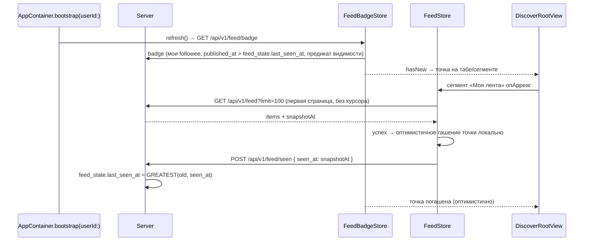

# Спецификация: Подписки на авторов и лента новых рецептов (native)

**Ветка**: `072-follow-feed`
**Дата**: 2026-08-25 (синхронизирована с web-каноном 2026-08-29 — гашение точки «прочитано = загружено», `isNew`/`snapshotAt`, дропдаун подписки, дайджем-URL `/discover`)
**Статус**: Draft
**Canonical API spec**: [`../recipe-scaler-web/specs/072-follow-feed/spec.md`](../../../recipe-scaler-web/specs/072-follow-feed/spec.md) — схема (`user_follows`, `recipes.published_at`), wire-контракт (follow-маршруты, `GET /api/v1/feed`, `GET /api/v1/feed/badge`), предикат видимости, антиабьюз. Здесь — native UI, клиент, сторы и i18n.
**Зависимости**: `011-discover-public` (`DiscoverRootView`, `DiscoverPublicProfileView`, `DiscoverAPI`, карточка публичного рецепта), `017-discover-enablement` (вкладка активна), `007-app-shell-navigation` (таб Discover, reset tab), `023-push-notifications` (APNs-подписки), `059-universal-links` (роутинг пуша → публичный рецепт), `013-account-settings` / auth (`requireUserId`, login-flow для гостя), `AppContainer` (DI, паттерн `SystemBannerStore` из `061-system-banner`)
**Эталоны**: `SystemBannerStore` + `bootstrap(userId:)` refresh (061), `requestJSON` snake_case-декодинг

## Контекст и мотивация

Серверная фича 072 (подписки + pull-based лента + opt-in пуши) проектируется одновременно с web-клиентом. Native уже умеет публичные профили (`DiscoverPublicProfileView`) и Discover-вкладку — подписка встраивается туда без новых навигационных сущностей. Требование — **синхронный релиз**: сервер + web + native стартуют на одном контракте, без периода «фича есть на вебе, в приложении нет».

## Цель

1. Кнопка «Подписаться» / дропдаун «Подписка» (push opt-in) на чужом публичном профиле.
2. Сегмент «Подборки | Моя лента» в Discover; лента новых публичных рецептов авторов.
3. Красная точка на табе Discover и сегменте при новом контенте; гасится успешной загрузкой первой страницы ленты.
4. APNs-push о новом рецепте у opt-in-автора; тап ведёт на публичный экран рецепта.

## Non-goals

- Реакции/комментарии, публичные списки подписок (нет и на сервере).
- Алгоритмическая лента, ранжирование.
- Offline-кэш ленты на диск (только in-memory + silent refresh — **осознанное отступление** от FR-DISC-001 из 011, где офлайн показывает последний кэш с сообщением; для ленты вместо сообщения — тихий отказ обновления, см. US6).
- Виджет/Watch/Live Activity/App Intents для подписок.
- Web-часть (канон в web spec 072).

---

## Границы (Scope)

**Входит:**

- `FollowAPI`: follow/unfollow/PATCH bell/status; `FeedAPI`: feed (keyset), badge, seen. `APIClient.requestJSON`, snake_case, `.iso8601`.
- `FollowStore` — статус связи для текущего просматриваемого профиля (`following`, `pushOptIn`).
- `FeedStore` — страница ленты + курсорная догрузка + pull-to-refresh; `FeedBadgeStore` — `hasNew` для точки.
- Сегмент-контрол в `DiscoverRootView` («Подборки | Моя лента») — ephemeral UI-состояние без персистенции (паритет с вебом: вход в Discover всегда открывает «Подборки»).
- Маркер просмотра — **на сервере** (`feed_state.last_seen_at`, per-user). Семантика «прочитано = загружено» (web spec 072 § Гашение точки): `GET /api/v1/feed` возвращает `snapshotAt` (серверное время запроса); после **успешной** загрузки первой страницы клиент эхом шлёт `POST /api/v1/feed/seen { seen_at: snapshotAt }`; сервер применяет `GREATEST(old, seen_at)` — параллельные устройства не откатывают маркер. Сбой загрузки — маркер не двигается, точка вернётся при следующем badge-запросе. Сервер создаёт запись при первом `POST /follow` — публикации после первой подписки зажигают точку, до — нет. Синхронизация между устройствами из коробки; локального маркера в `UserDefaults` нет.
- Красная точка: overlay на иконке таба Discover в `AppShellView` + на сегменте «Моя лента».
- Кнопка Follow / дропдаун «Подписка» в `DiscoverPublicProfileView` (не на своём профиле); гостю — существующий login-flow. Меню: «Отписаться» / «Подписка» / «Подписка и уведомления» (паритет с вебом). Включение `push_opt_in` без permission-гейта веба — нативные пуши через APNs (осознанное платформенное отличие, разрешено web spec 072 § UX).
- Счётчик подписчиков (чип в шапке профиля, плюрализация en/ru).
- Push-роутинг (решение 2026-08-30, после полевой отладки): тап по одиночному пушу → сегмент «Моя лента» с карточкой рецепта поверх (`DiscoverRoute.recipe` push поверх ленты, назад → лента; payload-URL `/public/@/…` маппится в `.openFeedRecipe`); дайджем-пуш → сегмент «Моя лента» (`/discover/feed`). Universal Links сохраняют стек профиль → рецепт (059). Legacy `recipeId` — только при отсутствии/неразбираемости `url` (фикс перезаписи ссылки: `push_recipe_id_fallback_routed` затирал `push_payload_url_routed` через 3 мс).
- i18n `discover.follow.*` / `discover.feed.*` в `Localizable.xcstrings` (en+ru, перечень по web spec 072 § UX), a11y identifiers, page objects.

**Не входит:** см. Non-goals.

## Архитектура

- **DTO**: `FeedEntryDTO` (`recipeId`, `username`, `displayName`, `avatarRef`, `imageRef`, `name`, `publishedAt`, `isNew`), `FeedPageDTO` (`items`, `nextCursor`, `snapshotAt`), `FeedBadgeDTO` (`hasNew`), `FollowStatusDTO` (`following`, `pushOptIn`), `followersCount` в существующем public-profile DTO (`GET /api/users/public/:username`, web spec 072 § Wire-контракт). `isNew` = `publishedAt > last_seen_at` на момент запроса (нет записи `feed_state` → `false`); `snapshotAt` — эхо для `POST /feed/seen`.
- **Networking**: `enum FollowAPI` / `enum FeedAPI`, статические методы на `APIClient` — паттерн `SystemBannerAPI` (061). Destructive-подтверждений нет: unfollow не деструктивен (ничего не удаляет у автора).
- **Сторы**: `@MainActor @Observable`, живут в `AppContainer` (`followStore`, `feedStore`, `feedBadgeStore`). `feedBadgeStore.refresh()` — один раз в `bootstrap(userId:)` после `SystemBannerStore` (без polling); повторный вызов — на `onAppear` Discover.
- **Views**: сегмент = `Picker(.segmented)` в шапке `DiscoverRootView`; карточки ленты — переиспользовать карточку Discover-рецепта + строка автора (аватар, имя, время `publishedAt`); карточка с `isNew == true` несёт красный чип «Новое»/«New» поверх превью. Время — `Date.FormatStyle` (дата + время; год — полный, если не текущий; паритет текста с Koobiq `absoluteLongDateTime` на вебе: ru «16 июля, 05:04» / «16 июля 2026, 05:04»).
- **Пагинация**: страницы по 100 (`limit` default 20, max 100 — сервер клампит), авто-догрузка при подгрузке последней видимой карточки (нативный эквивалент веб-триггера 75% прокрутки); сбой догрузки — inline «Повторить», авто-повтор выключен до явного ретрая. Pull-to-refresh — нативная норма.
- **Гашение точки** («прочитано = загружено»): успешная загрузка **первой** страницы `FeedStore.loadFirstPage()` → оптимистичное локальное гашение в `feedBadgeStore` + `POST /api/v1/feed/seen { seen_at: snapshotAt }` (эхо серверного времени запроса; сервер пишет `GREATEST(old, seen_at)`). `onAppear` сегмента сам по себе маркер не двигает; неуспешная загрузка — маркер на сервере не меняется, точка вернётся при следующем `badge`-запросе. Сервер — источник правды.
- **Logout**: `clearForLogout()` у трёх сторов (сброс ленты, статуса, точки) — паттерн `SystemBannerStore.clearForLogout()` (061). Серверный маркер не трогается.
- **Async lifecycle**: задачи refresh — `Task`, отменяемые при disappear стора-владельца; без глобальных таймеров. Правила [docs/agents/ASYNC-LIFECYCLE.md](../../docs/agents/ASYNC-LIFECYCLE.md).

## Синхронность с web (parity checklist)

| Контракт | Web | Native | Общий канон |
|---|---|---|---|
| Follow/unfollow/bell/status | ✅ | ✅ этот спека | web spec 072 § Wire-контракт |
| `GET /api/v1/feed` (keyset, `isNew`, `snapshotAt`) | ✅ | ✅ | тот же |
| `GET /api/v1/feed/badge` | ✅ | ✅ | тот же |
| Красная точка (таб + сегмент, гашение загрузкой) | ✅ | ✅ | web spec 072 § Индикатор |
| Маркер просмотра | сервер `feed_state.last_seen_at` | тот же | эхо `seen_at: snapshotAt` после успешной страницы-1; `GREATEST(old, seen_at)`; сбой загрузки маркер не двигает |
| Push текст/roутинг | VAPID | APNs | web spec 072 § Push; дайджем-URL `/discover/feed` |
| Подсветка новых карточек (чип «Новое», US14) | ✅ | ✅ | web spec 072 § Подсветка новых |
| Пустые состояния (нет подписок / нет нового), счётчик подписчиков | ✅ | ✅ | те же лок-ключи (значения en/ru синхронны) |

Релизный порядок: сервер (миграция 070 + эндпоинты) → web + native параллельно на одном API; расхождений контракта между клиентами нет — всё в `specs/shared/rest-api.md` в том же change, что и серверный код.

## Пользовательские сценарии

### US1 — Подписка (P0)

**Когда** залогиненный пользователь на чужом публичном профиле тапает «Подписаться», **тогда** `FollowAPI.follow` → кнопка переходит в дропдаун «Подписка» (уведомления выключены, иконка `bell.slash`), счётчик автора +1.

### US2 — Колокольчик (P0)

**Когда** в меню дропдауна включены «Подписка и уведомления» и автор публикует рецепт, **тогда** приходит APNs-push (пайплайн 023); тап открывает **внутрь ленты** — сегмент «Моя лента» с карточкой рецепта поверх (назад → лента; решение 2026-08-30). Массовая публикация (≥2 рецептов одной мутацией) — один дайджем-пуш, тап ведёт в **сегмент «Моя лента»** (`/discover/feed`). Выключены/нет подписки — пуша нет.

### US3 — Лента (P0)

**Когда** открыт сегмент «Моя лента», **тогда** лента новых публичных рецептов (карточка: фото, название, затем автор и время `publishedAt`); тап → публичный рецепт; pull-to-refresh; догрузка курсором без дублей; авто-догрузка страницы при подгрузке последней видимой карточки; сбой догрузки — inline «Повторить» без авто-ретрая. Пустое состояние разделяет «нет подписок» (CTA на курируемые профили) и «подписки есть, нового нет» (нейтральный текст).

### US4 — Точка нового (P1)

**Когда** `hasNew = true`, **тогда** красная точка на табе Discover и сегменте; гашение — успешной загрузкой первой страницы «Моей ленты» (эхо `seen_at: snapshotAt`, серверный маркер — гашение видно и с других устройств; сбой загрузки маркер не двигает, точка вернётся при следующем `badge`). Нет записи `feed_state` (создаётся сервером при первом `POST /follow`) или нет подписок — точки нет. Повторный tap таба Discover с вложенного экрана → корень (FR-NAV-002), точка не гасится.

### US14 — Подсветка новых карточек (P1)

**Когда** первая страница ленты успешно загружена, **тогда** элементы с `isNew: true` несут красный чип «Новое»/«New» поверх превью; загруженное считается прочитанным (граница — `snapshotAt` первой страницы); рецепты, опубликованные во время визита (после снапшота), не загружены и остаются «новыми» до следующего открытия ленты.

### US5 — Исчезновение контента (P0)

**Когда** автор скрыл рецепт/профиль или удалил аккаунт, **тогда** при следующем refresh элементы исчезают, ошибки в UI нет (silent).

### US6 — Офлайн (P1)

**Когда** сеть недоступна, **тогда** лента/точка тихо не обновляются (последний in-memory экран остаётся), дропдаун подписки показывает локализованную ошибку, состояние не меняется.

### US9 — Серверные ошибки follow (P1)

**Когда** сервер отвечает ошибкой follow (`404 follow.user-not-found`, `409 follow.self-not-allowed`, `409 follow.too-many-follows`, `429 follow.rate-limited`, `404 follow.not-following` на PATCH колокольчика), **тогда** UI показывает человекочитаемое сообщение по dot-ключу (паттерн `ServerErrorCode` из 031, ключи добавляются в enum + `Localizable.xcstrings` en/ru тем же change), состояние кнопки не меняется.

### US7 — Гость (P1)

**Когда** гость тапает «Подписаться», **тогда** существующий login-flow; после входа — возврат на профиль, статус связи подтянут.

### US8 — Логаут (P0)

**Когда** пользователь разлогинивается, **тогда** сторы сброшены (`clearForLogout()`): лента, точка, follow-статус; чужие данные не мелькают при следующем входе.

## Верификация

- Build: `docs/AGENT-WORKFLOW.md` (fix-until-green).
- i18n: ключи en+ru в `Localizable.xcstrings` — по канону web spec 072 § UX: `discover.follow.subscribe` / `.subscribed` / `.unsubscribe` / `.subscribe-only` / `.subscribe-notifications` / `.menu-label` / `.followers` (плюрализация); `discover.feed.segment-collections` / `.segment-following` / `.empty-no-follows` / `.empty-no-new` / `.new-badge` / `.new-badge-a11y` / `.load-error` (повтор — `common.retry`). `discover.follow.bell-tooltip` не добавляется (удалён из канона). `scripts/lint-i18n.sh` зелёный; Martian-типографика `.appBody()`.
- A11y identifiers (kebab-case, по правилам E2E, канон — web data-testid): `follow-button`, `follow-menu`, `follow-menu-unsubscribe`, `follow-menu-subscribe-only`, `follow-menu-subscribe-notifications`, `discover-feed-segment`, `discover-feed-list`, `discover-feed-card`, `discover-feed-card-new-badge`, `discover-feed-auto-load`.
- E2E (XCTest, page object `FeedPage`): US1–US4, US14 против REST-фикстур (docs/E2E.md).
- UI-верификация: simulator screenshot (vision models) или accessibility server.

## Артефакты

- `contracts/follow-feed-api.md` — thin pointer на web spec 072 § Wire-контракт (без дубления канона).
