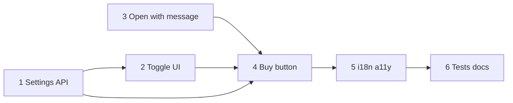

# План: Вкусвилл — native клиент (прототип через ассистента)

**Дата**: 2026-08-27  
**Спека**: [spec.md](./spec.md)  
**Канон сервера/web**: [`recipe-scaler-web/specs/072-vkusvill-integration`](../../../recipe-scaler-web/specs/072-vkusvill-integration/spec.md) — **готово** (`77cf1875` + follow-ups)  
**Ветка**: `072-vkusvill-integration` (или master по AGENTS, если фича мелкий паритет — зафиксировать при старте)

> Только native. Серверные тулы, guard, `vkusvillCart`, MCP — не трогаем, пока нет регрессии.

## Границы

- **В scope**: `UserSettingsDTO` + API toggle; секция профиля; кнопка shopping toolbar; open-assistant-with-message (new thread + autosend); i18n; a11y; docs/UI; тесты.
- **Вне scope**: MCP/VkusvillService, preview UI, Watch, web, изменение server prompt/guard (кроме багфикса вне этого плана).
- **STOP**: нельзя безопасно отложить send до bootstrap без ломки `021` → согласовать API; нет `vkusvill_enabled` на целевом API → сначала сервер.

## Конституционная проверка

| Gate | Статус | Evidence |
|------|--------|----------|
| CRDT-first | N/A | Settings REST; shopping list не меняем |
| Web parity | PASS | Те же gating, промт, new thread, без preview |
| Offline-first | PASS | Buy disabled offline; список как был |
| Native UI | PASS | SwiftUI List/Toggle/toolbar, без WebView |
| Phased delivery | PASS | Клиент после готового сервера |
| i18n | PASS | `vkusvill.*` en+ru |
| Documentation | PASS | spec + plan + UI.md |

## Очерёдность

1. **Settings DTO + API** — `vkusvillEnabled` / `updateVkusvillEnabled` (паттерн nutrition).
2. **AccountSettingsViewModel + секция тогла** — ru-only, rollback.
3. **Open-with-message в AppShell / AssistantSheet** — new thread + deferred send + requestId (блокер для кнопки).
4. **Кнопка в ShoppingListView** — visibility + disabled offline → вызывает контракт из шага 3.
5. **i18n + AccessibilityIdentifiers**.
6. **Тесты + docs/UI.md** + статус спеки In Progress → Done.

## Изменения (ожидаемые файлы)

| Файл | Действие |
|------|----------|
| `RecipeScalerNative/Services/AccountAPI.swift` | Изменить |
| `RecipeScalerNative/ViewModels/AccountSettingsViewModel.swift` | Изменить |
| `RecipeScalerNative/Views/AccountView.swift` | Изменить |
| `RecipeScalerNative/Views/VkusvillConnectionView.swift` | Создать (опц.) |
| `RecipeScalerNative/Views/ShoppingListView.swift` | Изменить |
| `RecipeScalerNative/Views/AppShellView.swift` | Изменить |
| `RecipeScalerNative/Views/AssistantSheet.swift` | Изменить |
| `RecipeScalerNative/AccessibilityIdentifiers.swift` | Изменить |
| `RecipeScalerNative/Resources/Localizable.xcstrings` | Изменить |
| `docs/UI.md` | Изменить |
| UITest / unit по возможности | Создать/изменить |

## Positive invariants

- Buy button visible ⇒ `vkusvillEnabled && ru &&` (кнопка существует в hierarchy).
- Buy tap ⇒ session thread id cleared before createThread for that flow.
- Autosend message == trimmed `String(localized: "vkusvill.assistant-prompt")`.
- No `Vkusvill` / `mcp.vkusvill` imports in native targets.
- en locale ⇒ no Vkusvill section, no buy button.

## Async lifecycle

- Settings: async PUT; ignore stale responses if user toggled again (seq / task cancel).
- Open-with-message: single pending request; newer requestId supersedes older pending send.
- Stream: existing `AssistantSheet` cancellation on dismiss/new chat.

## Teardown / resource inventory

- No new long-lived network clients.
- Clear pending open-request on logout if stored globally.
- Session thread UserDefaults: cleared on buy flow (existing key).

## Verification

- [ ] Unit/VM: toggle persistence mapping
- [ ] Unit: open-with-message requestId / new thread
- [ ] UITest or manual: ru + toggle → buy → prompt sent
- [ ] Manual: link opens browser; offline disables buy; en hides UI
- [ ] `docs/UI.md` updated
- [ ] No new server endpoints required

## Риски

| Риск | Mitigation |
|------|------------|
| Гонка sheet present vs send | Deferred send after `ensureThread` (web lesson) |
| Ломание FAB / recipe context | Отдельный entry path; не менять default `showAssistant` semantics |
| Тогл без серверного поля на старом стенде | Проверить `/api/settings` на целевом env перед QA |
