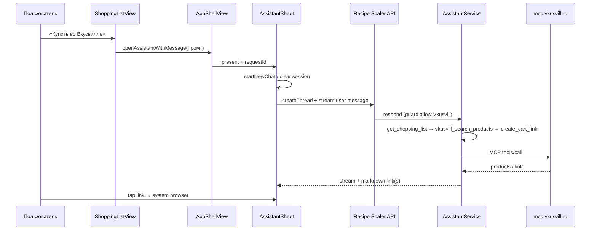

# Спецификация: Интеграция Вкусвилл — нативное приложение (прототип через ассистента)

**Ветка**: `072-vkusvill-integration`  
**Дата**: 2026-08-27  
**Статус**: In Progress  
**Канонический сервер + web**: [`recipe-scaler-web/specs/072-vkusvill-integration`](../../../recipe-scaler-web/specs/072-vkusvill-integration/spec.md) — **сделано** (коммит `77cf1875 feat(vkusvill): add shopping-list cart via assistant` и последующие правки UI/guard).  
**Зависимости**: `013-account-settings` (AccountView / settings), `024-shopping-list-completion` (`ShoppingListView`), `015-assistant` / `021-assistant-full` (`AssistantSheet`, треды), `041-auth-device-tokens` (`APIClient` / `AccountAPI`), `031-error-i18n`  
**Эталоны**: `TelegramConnectionView` + секция Telegram в `AccountView`; toolbar share в `ShoppingListView`; `AppShellView.showAssistant` + `AssistantSheet.startNewChat` / `ensureThread` / send

---

## Границы (Scope)

**Входит (только native UI + client settings):**

- Тогл Вкусвилл в профиле (ru-локаль): заголовок слева, `Toggle` справа; чтение/запись `vkusvill_enabled` через `/api/settings`.
- Кнопка «Купить во Вкусвилле» в toolbar списка покупок (тогл on + ru + online).
- Открытие нативного ассистента с **новым тредом** и **автоотправкой** того же промта, что в вебе (`vkusvill.assistant-prompt`).
- i18n-ключи `vkusvill.*` (en — нейтральные; UI скрыт вне ru).
- Accessibility identifiers в стиле натива (`snake_case`).
- Документация: эта спека, `plan.md`, `docs/UI.md`.

**Не входит (уже на сервере / в web, не дублировать в native):**

- `VkusvillService`, MCP `mcp.vkusvill.ru`, `McpVkusvillToolsProvider`, allowlist тулов, кэш, rate limit, kill-switch `VKUSVILL_DISABLED`.
- Сессия корзины `vkusvillCart` в metadata, инжект `<vkusvill_cart_state>`, system prompt / domain guard.
- Отдельный UI предпросмотра товаров, цены, карточки, native MCP-клиент, `VkusvillAPI.swift`, `/api/vkusvill/*`.
- Публичный MCP-транспорт Recipe Scaler, Watch / widgets / Share Extension.
- Изменение server domain guard или tool-loop — только если всплывёт регрессия; фикс на сервере.

**STOP conditions:**

- Если без ломания `021` нельзя надёжно «открыть sheet → new thread → send после bootstrap» — STOP и согласовать минимальный API (параметр `AssistantSheet` / coordinator), не костылить двойной send.
- Если `/api/settings` на проде ещё без `vkusvill_enabled` — STOP, сначала выкатить web/server (уже в репо).

---

## Контекст

Web-прототип: кнопка на списке → ассистент → `get_shopping_list` → `vkusvill_search_products` (`queries[]`) → `vkusvill_create_cart_link` → markdown-ссылки на `vkusvill.ru`. Наш сервер — единственный клиент MCP Вкусвилла. Тулы видны модели только при `vkusvill_enabled`.

Натив **не** ходит в Вкусвилл. Паритет UI-точки входа с вебом:

| Решение в вебе (зафиксировано) | Следствие для native |
|---|---|
| Секция «Вкусвилл», опция «Подключение ко Вкусвиллу» + switch справа | Та же раскладка в `List`/`Section` |
| `openAssistantWithMessage` → **всегда новый тред**, автоsend после bootstrap | Сброс session thread + `createThread` + send; не продолжать прошлый чат |
| Промт i18n `vkusvill.assistant-prompt` | Тот же смысл/ключ в `Localizable.xcstrings` |
| Ссылка в ответе ассистента | Тап → системный браузер (`UIApplication.open`), без in-app SFSafari как обязательного UX |
| Состояние корзины на сервере | Натив ничего не кэширует; правки — обычный чат в том же треде после автоsend |
| Domain guard знает про Vkusvill | Клиент не участвует |

---

## Цель

На iOS: включить Вкусвилл в профиле → на списке покупок одной кнопкой получить в чате ассистента ссылку(и) на корзину Вкусвилла. Паритет сценария с web-прототипом; серверная логика без изменений.

---

## Clarifications (из web + продукт)

### Session 2026-08-27

- Q: Как назвать опцию тогла? → **A:** «Подключение ко Вкусвиллу»; заголовок секции остаётся «Вкусвилл».
- Q: Продолжать последний тред ассистента? → **A:** Нет. Всегда новый тред на каждый тап «Купить во Вкусвилле».
- Q: Кладём промт только в composer? → **A:** Нет. Автоотправка user-сообщения после готовности чата (паритет web).
- Q: Иконка кнопки? → **A:** Системная `cart` + подпись `vkusvill.buy-button` (`AppToolbarStyle.labeledIcon`), как share.
- Q: Предпросмотр товаров в native? → **A:** Нет в прототипе.
- Q: Где жить API «open with message»? → **A:** На усмотрение реализации (`NotificationCenter`, environment CTA, или поле на coordinator в `AppShellView`), контракт ниже FR-VV-003.

---

## Пользовательские сценарии и тестирование

### US1 — Подключение Вкусвилл (P1)

**Когда** приложение на ru-локали и пользователь открывает Профиль (секция рядом с Telegram / Подключения), **тогда** видит опцию «Подключение ко Вкусвиллу» с тоглом справа. Включение пишет `vkusvill_enabled: true` через `PUT /api/settings`; состояние синкается с web и другими устройствами.

**Acceptance:**

1. **Given** locale = ru, **When** открыт профиль, **Then** видна опция «Подключение ко Вкусвиллу» с `Toggle`.
2. **Given** locale = en, **When** открыт профиль, **Then** строки Вкусвилл нет.
3. **Given** тогл off → on (online), **Then** `PUT /api/settings` с `vkusvill_enabled: true`, UI отражает on; при ошибке — откат + локализованная ошибка.
4. **Given** тогл on на web, **When** native refresh settings, **Then** тогл on без повторного включения.

### US2 — Кнопка на списке покупок (P1)

**Когда** тогл on, locale ru, устройство online, **тогда** в toolbar `ShoppingListView` видна кнопка «Купить во Вкусвилле» рядом с share.

**Acceptance:**

1. **Given** тогл on + ru + online, **Then** кнопка видна, `accessibilityIdentifier` = `vkusvill_buy_button`.
2. **Given** тогл off **или** не-ru, **Then** кнопки нет.
3. **Given** offline, **Then** кнопка disabled (или скрыта — выбрать disabled + a11y «offline», паритет web).
4. **Given** тап по кнопке online, **Then** открывается ассистент по US3.

### US3 — Новый тред + автоотправка промта (P1)

**Когда** пользователь тапает «Купить во Вкусвилле», **тогда** открывается `AssistantSheet` на **пустом новом треде**, текст `vkusvill.assistant-prompt` уходит как user message **без** второго тапа Send. Промт не остаётся только в composer.

**Acceptance:**

1. **Given** был открыт/сохранён старый thread id в session, **When** тап buy, **Then** session очищен, создан новый thread, в истории первое user-сообщение = промт.
2. **Given** повторный тап buy с тем же текстом, **Then** снова новый тред и новый send (не no-op).
3. **Given** sheet ещё не готов (bootstrap), **When** пришёл запрос, **Then** send откладывается до готовности; промт не теряется.
4. **Given** пустой/whitespace промт (защита), **Then** send не выполняется (как web trim).

### US4 — Сборка корзины и ссылка (P1)

**Когда** сервер отвечает в чате (стрим + tool-status), **тогда** native показывает существующий UI ассистента; markdown-ссылки на `vkusvill.ru` открываются во внешнем браузере. Несколько ссылок при >20 позициях — как пришло с сервера.

**Acceptance:**

1. **Given** успешный ответ со ссылкой, **When** тап по ссылке, **Then** `UIApplication.shared.open` (или эквивалент) на URL.
2. **Given** ошибка Вкусвилл/сервера, **Then** в чате локализованный текст от ассистента; native не парсит JSON тулов.
3. **Given** длинный список, **Then** UI не ломается на нескольких ссылках / tool-status (существующий рендер).

### US5 — Диалоговые правки (P2)

**Когда** в том же треде пользователь пишет «замени молоко…», **тогда** обычный чат; состояние корзины на сервере. Native не хранит `vkusvillCart`.

### US6 — Оффлайн и тогл off (P1)

**Когда** offline или тогл off, **тогда** кнопка недоступна/скрыта; остальной shopping list работает как раньше. Ассистент по FAB без изменений (без автопромта Вкусвилл).

---

## Edge Cases

- Ассистент уже открыт sheet’ом → buy всё равно сбрасывает на новый тред и шлёт промт.
- Гонка: buy → dismiss sheet до send → промт не должен уйти в «чужой» следующий open без явного нового запроса (одноразовый pending request id, как web `requestId`).
- Тогл выключили на другом устройстве mid-chat → сервер перестанет отдавать тулы; native только отражает тогл при следующем refresh.
- Пустой список покупок → сервер/модель отвечают текстом; кнопка всё равно доступна (паритет web).
- Kill-switch `VKUSVILL_DISABLED` на сервере → тулов нет; кнопка на клиенте всё ещё по тоглу (как в web plan: kill-switch чисто серверный).

---

## Требования

### FR-VV-001 — Тогл в профиле

- Секция рядом с Telegram: header `vkusvill.settings-title` («Вкусвилл» / «Vkusvill»), в content — одна строка с `Toggle` справа, label `vkusvill.settings-toggle-title` («Подключение ко Вкусвиллу» / «Connect to Vkusvill»).
- `UserSettingsDTO.vkusvillEnabled` (+ CodingKeys `vkusvill_enabled` при необходимости).
- `AccountAPI.updateVkusvillEnabled(_:)` → `PUT /api/settings` body `{ "vkusvill_enabled": Bool }` по образцу `updateNutritionEnabled`.
- Показ только если `AppLanguagePreference.current == .ru` (или эквивалент «starts with ru»).
- Optimistic UI + rollback при ошибке.

### FR-VV-002 — Кнопка списка покупок

- `ShoppingListView` toolbar: `AppToolbarStyle.labeledIcon(systemImage: "cart", title: "vkusvill.buy-button")` рядом с share.
- Видимость: `vkusvillEnabled && isRu && …`; disabled offline.
- `accessibilityIdentifier(AccessibilityIdentifiers.vkusvillBuyButton)` = `"vkusvill_buy_button"`.
- `accessibilityLabel` = локализованный `vkusvill.buy-button` (и offline hint при disabled).

### FR-VV-003 — Open assistant with message

Контракт (паритет web `openAssistantWithMessage`):

1. Принять непустой `message: String` (+ уникальный request id).
2. Выставить `showAssistant = true`.
3. Сбросить текущую session thread (`startNewChat` / clear `sessionThreadIdKey`).
4. Дождаться возможности отправки (thread создан через `ensureThread`, нет блокирующего loadError).
5. Отправить `message` как user turn (существующий send/stream path).
6. Повтор с тем же текстом — новый request id → снова шаги 3–5.

Не ломать FAB / recipe-context open / feature-adoption `openAssistant`.

### FR-VV-004 — Нет native Vkusvill backend

Запрещены: прямой MCP, отдельные REST match/cart, локальный матчинг, sheet предпросмотра. Только settings + UI entry + существующий assistant client.

### FR-VV-005 — Локализация

Ключи в `Localizable.xcstrings` (минимум):

| Key | ru | en (скрыто) |
|-----|----|-------------|
| `vkusvill.settings-title` | Вкусвилл | Vkusvill |
| `vkusvill.settings-toggle-title` | Подключение ко Вкусвиллу | Connect to Vkusvill |
| `vkusvill.buy-button` | Купить во Вкусвилле | Buy at Vkusvill |
| `vkusvill.assistant-prompt` | Собери корзину во Вкусвилле из моего списка покупок | Build a Vkusvill cart from my shopping list |

Tool-status строки приходят с сервера / уже в web i18n ответа ассистента — **не** дублировать на клиенте, если native показывает server/tool status из стрима как сейчас.

### FR-VV-006 — Документация

Обновить `docs/UI.md` (секция профиля + toolbar списка). Статус этой спеки → In Progress при старте кода.

---

## Решения

| Параметр | Значение | Обоснование |
|---|---|---|
| Кто говорит с MCP | Только server (web 072) | IP, кэш, лимиты, один клиент |
| Scope native | Тогл + кнопка + open-with-message | Сервер уже умеет корзину |
| Новый тред | Всегда | Паритет web; чистый cart-диалог |
| Открытие ссылки | Системный браузер | Прототип; ссылка в markdown |
| Gating UI | `vkusvill_enabled` + ru | Паритет web; сервер прячет тулы |
| Предпросмотр | Out of scope | Решение прототипа |

---

## Компоненты (ожидаемые)

| Файл | Изменение |
|------|-----------|
| `Services/AccountAPI.swift` | `vkusvillEnabled` в DTO; `updateVkusvillEnabled` |
| `ViewModels/AccountSettingsViewModel.swift` | load/toggle + online |
| `Views/AccountView.swift` (+ опц. `VkusvillConnectionView.swift`) | секция тогла |
| `Views/ShoppingListView.swift` | toolbar button |
| `Views/AppShellView.swift` / `AssistantSheet.swift` | open-with-message + new thread + deferred send |
| `AccessibilityIdentifiers.swift` | `vkusvillBuyButton`, `vkusvillToggle` |
| `Resources/Localizable.xcstrings` | `vkusvill.*` |
| UITests (по возможности) | ru + тогл on → кнопка → sheet + промт |

---

## Data Flow

---

## Модель ошибок

| Ситуация | Поведение native |
|----------|------------------|
| Settings PUT failed | Rollback тогла, status/alert |
| Offline | Buy disabled; тогл можно показать, запись — только online (или очередь нет — как nutrition) |
| Assistant createThread/send failed | Существующий `loadError` / user-facing API error |
| Vkusvill MCP down | Текст в чате от сервера |
| Guard off_topic | Не должно на промт Вкусвилл (server fix); если всплывёт — баг сервера, не native |

---

## Тестирование

- Unit / VM: read/write `vkusvillEnabled`; visibility helpers (ru + enabled).
- Unit: open-with-message — new thread, deferred send, requestId uniqueness (если логика вынесена из View).
- UITest (ru): тогл → список → buy → sheet; первое сообщение = промт (сеть мокнута / stub assistant).
- Manual QA: реальный прогон до ссылки; offline; en locale; повторный buy = новый тред.

---

## Документация

- Эта спека + [plan.md](./plan.md).
- Web-спека 072 — канон сервера; при изменении контракта settings/assistant — обновить обе.
- `docs/UI.md` — тогл и кнопка.

---

## Открытые вопросы

1. ~~Иконка / подпись тогла~~ — закрыто (clarifications).
2. Нужен ли отдельный `VkusvillConnectionView.swift` vs inline в `AccountView`? — на усмотрение реализации; эталон Telegram вынесен в свой view.
3. Компактный native preview после метрик прототипа? — **не в этой спеке**.
4. SFSafariViewController вместо Safari? — опционально позже; дефолт system open.
